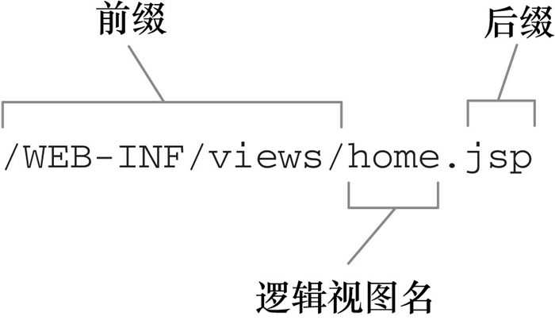
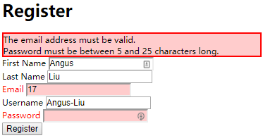
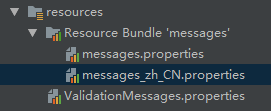
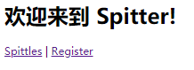

### 6.1 理解视图解析

将控制器中请求处理的逻辑和视图中的渲染实现解耦是Spring MVC的一个重要特性。通过Spring视图解析器，控制器只需要通过逻辑视图名来了解视图，从而使Spring确定使用哪一个视图实现来渲染模型。

Spring MVC定义了一个名为ViewResolver的接口，它大致如下所示：

```java
public interface ViewResolver {
    View resolveViewName(String viewName, Locale locale) throws Exception;
}
```

当给resolveViewName()方法传入一个视图名和Locale对象时，它会返回一个View实例。View是另外一个接口，其任务是接受model以及Servlet的request和response对象，并将输出结果渲染到response中。

```java
public interface View {
    ...
	String getContentType();
	void render(Map<String, ?> model, 
                HttpServletRequest request, 
                HttpServletResponse response) throws Exception;
}
```

一般来讲，并不需要关心这些接口。Spring提供了多个内置的实现，其自带了13个视图解析器，能够将逻辑视图名转换为物理实现：

| 视图解析器                     | 描述                                                         |
| ------------------------------ | ------------------------------------------------------------ |
| BeanNameViewResolver           | 将视图解析为Spring应用上下文中的bean，其中bean的ID与视图的名字相同 |
| ContentNegotiatingViewResolver | 通过考虑客户端需要的内容类型来解析视图，委托给另外一个能够产生对应内容类型的视图解析器 |
| FreeMarkerViewResolver         | 将视图解析为FreeMarker模板                                   |
| InternalResourceViewResolver   | 将视图解析为Web应用的内部资源（一般为JSP）                   |
| JasperReportsViewResolver      | 将视图解析为JasperReports定义                                |
| ResourceBundleViewResolver     | 将视图解析为资源bundle（一般为属性文件）                     |
| TilesViewResolver              | 将视图解析为Apache Tile定义，其中tile ID与视图名称相同。注意有两个不同的TilesViewResolver实现，分别对应于Tiles 2.0和Tiles 3.0 |
| UrlBasedViewResolver           | 直接根据视图的名称解析视图，视图的名称会匹配一个物理视图的定义 |
| VelocityLayoutViewResolver     | 将视图解析为Velocity布局，从不同的Velocity模板中组合页面     |
| VelocityViewResolver           | 将视图解析为Velocity模板                                     |
| XmlViewResolver                | 将视图解析为特定XML文件中的bean定义。类似于BeanName-ViewResolver |
| XsltViewResolver               | 将视图解析为XSLT转换后的结果                                 |

### 6.2 创建JSP视图

Spring提供了两种支持JSP视图的方式：

+ InternalResourceViewResolver会将视图名解析为JSP文件。另外，如果在JSP页面中使用了JSP标准标签库（JavaServer Pages Standard Tag Library，JSTL）的话，InternalResourceViewResolver能够将视图名解析为JstlView形式的JSP文件，从而将JSTL本地化和资源bundle变量暴露给JSTL的格式化（formatting）和信息（message）标签。
+ Spring提供了两个JSP标签库，一个用于表单到模型的绑定，另一个提供了通用的工具类特性。

#### 6.2.1 配置适用于JSP的视图解析器

有一些视图解析器，如ResourceBundleViewResolver会直接将逻辑视图名映射为特定的View接口实现，而InternalResourceViewResolver所采取的方式并不那么直接。它遵循一种约定，会在视图名上添加前缀和后缀，进而确定一个Web应用中视图资源的物理路径。



当使用@Bean注解时，可以按照如下的方式配置InternalResourceViewResolver，使其在解析视图时，遵循上述的约定：

```java
@Bean
public ViewResolver viewResolver() {
    InternalResourceViewResolver resolver = new InternalResourceViewResolver();
    resolver.setPrefix("/WEB-INF/views/"); // 放在WEB-INF文件夹中的好处是可以避免对其的直接访问
    resolver.setSuffix(".jsp");
    return resolver;
}
```

作为替代方案，如果更喜欢使用基于XML的Spring配置，那么可以按照如下的方式配置InternalResourceViewResolver：

```xml
<bean id="viewResolver" 
      class="org.springframework.web.servlet.view.InternalResourceViewResolver"
      p:prefix="/WEB-INF/views/" 
      p:suffix=".jsp"/>
```

**解析JSTL视图**

如果这些JSP使用JSTL标签来处理格式化和信息的话，那么需要InternalResourceViewResolver将视图解析为JstlView。

JSTL的格式化标签需要一个Locale对象，以便于恰当地格式化地域相关的值，如日期和货币。信息标签可以借助Spring的信息资源和Locale，从而选择适当的信息渲染到HTML之中。通过解析JstlView，JSTL能够获得Locale对象以及Spring中配置的信息资源。

如果想让InternalResourceViewResolver将视图解析为JstlView，而不是InternalResourceView的话，只需设置它的viewClass属性即可：

```java
@Bean
public ViewResolver viewResolver() {
    InternalResourceViewResolver resolver = new InternalResourceViewResolver();
    resolver.setPrefix("/WEB-INF/views/");
    resolver.setSuffix(".jsp");
    resolver.setViewClass(JstlView.class);
    return resolver;
}
```

也可以在XML中完成：

```xml
<bean id="viewResolver"
      class="org.springframework.web.servlet.view.InternalResourceViewResolver"
      p:prefix="/WEB-INF/views/"
      p:suffix=".jsp"
      p:viewClass="org.springframework.web.servlet.view.JstlView"/>
```

#### 6.2.2 使用Spring的JSP库

Spring提供了两个JSP标签库，用来帮助定义Spring MVC Web的视图。其中一个标签库会用来渲染HTML表单标签，这些标签可以绑定model中的某个属性，另外一个标签库包含了一些工具类标签。

**将表单绑定到模型上**

Spring的表单绑定JSP标签库包含了14个标签，它们中的大多数都用来渲染HTML中的表单标签。但是，它们与原生HTML标签的区别在于它们会绑定模型中的一个对象，能够根据模型中对象的属性填充值。标签库中还包含了一个为用户展现错误的标签，它会将错误信息渲染到最终的HTML之中。

为了使用表单绑定库，需要在JSP页面中对其进行声明：

```jsp
<%@ taglib uri="http://www.springframework.org/tags/form" prefix="sf" %>
```

借助Spring表单绑定标签库中所包含的标签，能够将模型对象绑定到渲染后的HTML表单中：

| JSP标签            | 描述                                                         |
| ------------------ | ------------------------------------------------------------ |
| \<sf:checkbox>     | 渲染成一个HTML \<input>标签，其中type属性设置为checkbox      |
| \<sf:checkboxes>   | 渲染成多个HTML \<input>标签，其中type属性设置为checkbox      |
| \<sf:errors>       | 在一个HTML \<span>中渲染输入域的错误                         |
| \<sf:form>         | 渲染成一个HTML \<form>标签，并为其内部标签暴露绑定路径，用于数据绑定 |
| \<sf:hidden>       | 渲染成一个HTML \<input>标签，其中type属性设置为hidden        |
| \<sf:input>        | 染成一个HTML \<input>标签，其中type属性设置为text            |
| \<sf:label>        | 渲染成一个HTML \<label>标签                                  |
| \<sf:option>       | 渲染成一个HTML \<option>标签，其selected属性根据所绑定的值进行设置 |
| \<sf:options>      | 按照绑定的集合、数组或Map，渲染成一个HTML \<option>标签的列表 |
| \<sf:password>     | 渲染成一个HTML \<input>标签，其中type属性设置为password      |
| \<sf:radiobutton>  | 渲染成一个HTML \<input>标签，其中type属性设置为radio         |
| \<sf:radiobuttons> | 渲染成多个HTML \<input>标签，其中type属性设置为radio         |
| \<sf:select>       | 渲染为一个HTML \<select>标签                                 |
| \<sf:textarea>     | 渲染为一个HTML \<textarea>标签                               |

在注册中使用这些标签之后，所得程序如下：

```jsp
<%-- <sf:form>会渲染一个HTML <form>标签，
     也会通过commandName属性构建针对某个模型对象的上下文信息，
     在其他的表单绑定标签中，会引用这个模型对象的属性--%>
<sf:form method="POST" commandName="spitter">
    <%-- <input>标签的value属性值将会设置为对象中path属性所对应的值 --%>
    <%-- 如果在模型中Spitter对象的firstName属性值为Jack，
         那么<sf:input path="firstName"/>所渲染的<input>标签中，会存在value="Jack" --%>
    First Name: <sf:input path="firstName" /><br/>
    Last Name: <sf:input path="lastName" /><br/>
    <%-- <sf:input>标签允许指定type属性 --%>
    Email: <sf:input path="email" type="email"/><br/>
    Username: <sf:input  path="username" /><br/>
    Password: <sf:password path="password" /><br/>
    <input type="submit" value="Register" />
</sf:form>
```

因为将commandName属性设置为spitter，所以模型中必须要有一个key为spitter的对象，否者表单不能正常渲染：

```java
// 修改SpitterController，以确保模型中存在以spitter为key的Spitter对象
@RequestMapping(value = "/register", method = RequestMethod.GET)
public String showRegistrationForm(Model model) {
    model.addAttribute(new Spitter());
    return "registerForm";
}
```

**展现错误**

如果存在校验错误的话，请求中会包含错误的详细信息，这些信息是与模型数据放到一起的。所需要做的就是到模型中将这些数据抽取出来，并展现给用户。\<sf:errors>能够让这项任务变得很简单：

```jsp
<sf:form method="POST" commandName="spitter">
    First Name: <sf:input path="firstName"/>
    <%-- path属性指明了要显示那个属性的错误 --%>
    <%-- 没有错误，<sf:errors>不会渲染任何内容；
         校验出错，会在一个<span>标签中显示错误信息 --%>
    <%-- 可以设置cssClass属性，使其错误更突出 --%>
    <sf:errors path="firstName" cssClass="errors"/> <br/>
    ...
</sf:form>
```

另外一种处理校验错误方式就是将所有的错误信息在同一个地方进行显示。为了做到这一点，可以移除每个输入域上的\<sf:errors>元素，并将其放到表单的顶部，如下所示：

```jsp
<sf:form method="POST" commandName="spitter">
    <%-- 这里path被设置为"*"，是一个通配符选择器，会告诉<sf:errors>展现所有属性的错误 --%>
    <%-- 同时将element属性设置成了div，错误就会渲染在一个<div>标签中 --%>
    <sf:errors element="div" path="*" cssClass="errors"/>
    ...
</sf:form>
```

可以将每个label都替换为<sf: label>，并设置它的cssErrorClass属性，以突出错误的元素：

```jsp
<sf:form method="POST" commandName="spitter">
    <sf:errors element="div" path="*" cssClass="errors"/>
    <%-- <sf:label>使用path指定属于模型对象的哪个属性 --%>
    <%-- 若所绑定的属性有错误，其会渲染为cssErrorClass属性指定的样式类型（在css文件中指定） --%>
    <sf:label path="firstName" cssErrorClass="error">First Name</sf:label>
    <%-- <sf:input>的cssErrorClass属性同上 --%>
    <sf:input path="firstName" cssErrorClass="error"/><br/>
    ...
</sf:form>
```

还可以在Spitter类中的校验注解上设置message属性，使其引用对用户更为友好的信息，而这些信息可以定义在属性文件中：

```java
@NotNull
// 都将其@Size注解的message设置为一个字符串，这个字符串是用大括号括起来的
// 如果没有大括号的话，message中的值将会作为展现给用户的错误信息
// 使用了大括号之后，表示使用的就是属性文件中的某一个属性，该属性包含了实际的信息
@Size(min = 5, max = 16, message = "{username.size}")
private String username;

@NotNull
@Size(min = 5, max = 25, message = "{password.size}")
private String password;

@NotNull
@Size(min = 2, max = 30, message = "{firstName.size}")
private String firstName;

@NotNull
@Size(min = 2, max = 30, message = "{lastName.size}")
private String lastName;

@NotNull
@Email(message = "{email.valid}")
private String email;
```

接下来需要做的就是创建一个名为ValidationMessages.properties的文件，并将其放在根类路径之下：

```properties
# ValidationMessages.properties文件中每条信息的key值对应于注解中message属性占位符的值
# 同时，{min}和{max}会引用@Size注解上所设置的min和max属性
firstName.size=First name must be between {min} and {max} characters long.
lastName.size=Last name must be between {min} and {max} characters long.
username.size=Username must be between {min} and {max} characters long.
password.size=Password must be between {min} and {max} characters long.
email.valid=The email address must be valid.
```



如果用户的浏览器设置成了西班牙语，那么就应该用西班牙语展现错误信息，那就需要创建一个名为ValidationMessages_es.properties的文件（这样就可以很方便地创建地域相关的属性文件）。

**Spring的通用标签库**

除了表单绑定标签库之外，Spring还提供了更为通用的JSP标签库。要使用Spring通用的标签库，必须要在页面上对其进行声明：

```jsp
<%@ taglib uri="http://www.springframework.org/tags" prefix="s"%>
```

Spring的JSP标签库中提供了多个便利的标签，还包括一些遗留的数据绑定标签：

| JSP标签            | 描述                                                         |
| ------------------ | ------------------------------------------------------------ |
| \<s:bind>          | 将绑定属性的状态导出到一个名为status的页面作用域属性中，与\<s:path>组合使用获取绑定属性的值 |
| \<s:escapeBody>    | 将标签体中的内容进行HTML和/或JavaScript转义                  |
| \<s:hasBindErrors> | 根据指定模型对象（在请求属性中）是否有绑定错误，有条件地渲染内容 |
| \<s:htmlEscape>    | 为当前页面设置默认的HTML转义值                               |
| \<s:message>       | 根据给定的编码获取信息，然后要么进行渲染（默认行为），要么将其设置为页面作用域、请求作用域、会话作用域或应用作用域的变量（通过使用var和scope属性实现） |
| \<s:nestedPath>    | 设置嵌入式的path，用于\<s:bind>之中                          |
| \<s:theme>         | 根据给定的编码获取主题信息，然后要么进行渲染（默认行为），要么将其设置为页面作用域、请求作用域、会话作用域或应用作用域的变量（通过使用var和scope属性实现） |
| \<s:transform>     | 使用命令对象的属性编辑器转换命令对象中不包含的属性           |
| \<s:url>           | 创建相对于上下文的URL，支持URI模板变量以及HTML/XML/JavaScript转义。可以渲染URL（默认行为），也可以将其设置为页面作用域、请求作用域、会话作用域或应用作用域的变量（通过使用var和scope属性实现） |
| \<s:eval>          | 计算符合Spring表达式语言（Spring Expression Language，SpEL）语法的某个表达式的值，然后要么进行渲染（默认行为），要么将其设置为页面作用域、请求作用域、会话作用域或应用作用域的变量（通过使用var和scope属性实现） |

**展现国际化信息**

Web是全球性的网络，所构建的应用很可能会有全球化用户。因此，最好能够使用用户的语言与其进行交流，而不是只使用某一种语言。

对于渲染文本来说，是很好的方案，文本能够位于一个或多个属性文件中。借助\<s:message>，可以将硬编码的欢迎信息替换为如下的形式：

```jsp
<%-- 这里，<s:message>会根据key为spiitter.welcome的信息源渲染文本 --%>
<%-- 如果希望<s:message>能够正常完成任务的话，就需要配置一个这样的信息源 --%>
<h1><s:message code="spitter.welcome" /></h1>
```

Spring有多个信息源的类，它们都实现了MessageSource接口。在这些类中，更为常见和有用的是ResourceBundleMessageSource：

```java
@Bean
public MessageSource messageSource(){
    ResourceBundleMessageSource messageSource = new ResourceBundleMessageSource();
    // setBasename()方法是核心，这里将basename设置为messages之后，
    // ResourceBundleMessageSource就会试图在根路径的属性文件中解析信息，
    // 这些属性文件的名称是根据这个基础名称衍生得到的
    messageSource.setBasename("messages");
    return messageSource;
}
```



另外的可选方案是使用ReloadableResourceBundleMessageSource，它的工作方式与ResourceBundleMessageSource非常类似，但是它能够重新加载信息属性，而不必重新编译或重启应用：

```java
@Bean
public MessageSource messageSource(){
    ReloadableResourceBundleMessageSource messageSource = new ReloadableResourceBundleMessageSource();
    // 这里关键区别在于basename属性设置为在应用的外部查找，
    // 可以设置为在类路径下（以"classpath:"作为前缀）、
    // 文件系统中（以"file:"作为前缀）或Web应用的根路径下（没有前缀）查找属性
    messageSource.setBasename("classpath:messages");
    // 设置properties文件的默认编码，防止中文乱码
    // 相应的也需要在需要显示的JSP页面中添加如下信息
    // <%@ page contentType="text/html; charset=UTF-8" pageEncoding="UTF-8" %>
    messageSource.setDefaultEncoding("UTF-8");
    // 设置刷新时间
    messageSource.setCacheSeconds(10);
    return messageSource;
}
```



**创建URL**

\<s:url>是一个很小的标签。它主要的任务就是创建URL，然后将其赋值给一个变量或者渲染到响应中。它是JSTL中\<c:url>标签的替代者，但是它具备几项特殊的技巧。

按照其最简单的形式，\<s:url>会接受一个相对于Servlet上下文的URL，并在渲染的时候，预先添加上Servlet上下文路径。例如，考虑如下\<s:url>的基本用法：

```jsp
<a href="<s:url value="/spittles" />">Spittles</a>
<%-- 如果应用的Servlet上下文名为spittr，那么在响应中将会渲染如下的HTML --%>
<%-- 这样，在创建URL的时候，就不必再担心Servlet上下文路径是什么了 --%>
<a href="spittr/spittles" />Spittles</a>
```

还可以使用\<s:url>创建URL，并将其赋值给一个变量供模板在稍后使用：

```jsp
<%-- 默认情况下，URL是在页面作用域下创建的，但是通过设置scope属性，
     可以让<s:url>在应用作用域内、会话作用域内或请求作用域内创建URL --%>
<s:url value="/spitter/register" var="registerUrl" scope="request" />
<a href="${registerUrl}">Register</a>
```

如果希望在URL上添加参数的话，那么可以使用\<s:param>标签：

```jsp
<s:url value="/spitter/register" var="registerUrl">
    <s:param name="max" value="60"/>
    <s:param name="count" value="20"/>
</s:url>
```


