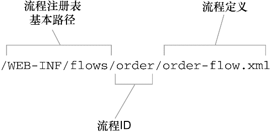
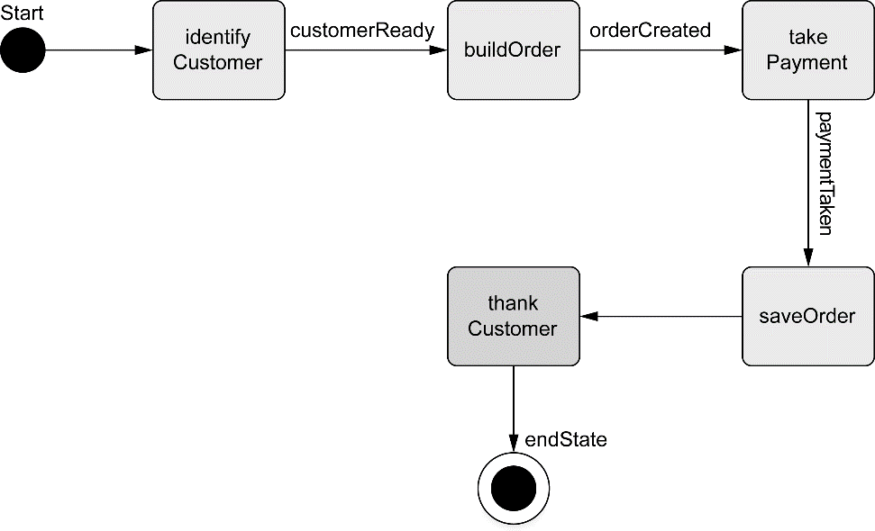
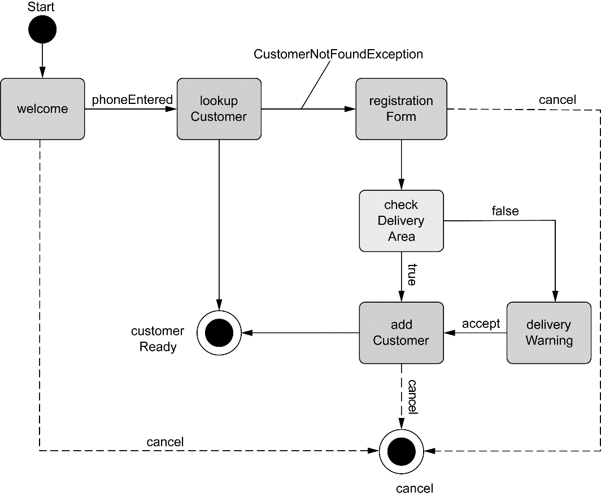
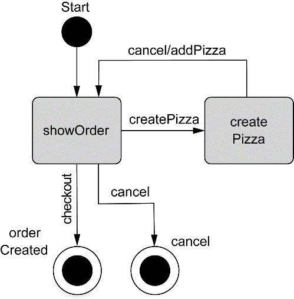
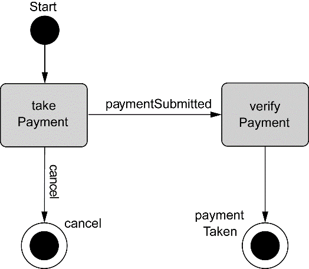

### 8.1 在Spring中配置Web Flow

Spring Web Flow是构建于Spring MVC基础之上的。这意味着所有的流程请求都需要首先经过Spring MVC的DispatcherServlet。所以需要在Spring应用上下文中配置一些bean来处理流程请求并执行流程（目前只能通过XML配置）。

#### 8.1.1 装配流程执行器

流程执行器（flow executor）驱动流程的执行。当用户进入一个流程时，流程执行器会为用户创建并启动一个流程执行实例。当流程暂停的时候（如为用户展示视图时），流程执行器会在用户执行操作后恢复流程。

```xml
<!-- <flow:flowExecutor>元素会创建一个流程执行器 -->
<flow:flow-executor id="flowExecutor"/>
```

尽管流程执行器负责创建和执行流程，但它并不负责加载流程定义。这个责任落在了流程注册表（flow registry）身上。

#### 8.1.2 配置流程注册表

流程注册表（flow registry）的工作是加载流程定义并让流程执行器能够使用它们。

```xml
<!-- 使用<flow:flow-registry>配置流程注册表 -->
<!-- 通过base-path指定，流程注册表会在"/WEB-INF/flows"目录下查找流程定义 -->
<flow:flow-registry id="flowRegistry" base-path="/WEB-INF/flows">
    <!-- 依据<flow:flow-location-pattern>元素的值，
         任何文件名以"-flow.xml"结尾的XML文件都将视为流程定义 -->
    <flow:flow-location-pattern value="*-flow.xml" />
</flow:flow-registry>
```

所有的流程都是通过其ID来进行引用的。这里使用了\<flow:flow-location-pattern>元素，流程的ID就是相对于base-path的路径或者双星号所代表的路径。

流程定义文件相对于基本路径的路径将被用作流程的ID：



另一种方式，可以去除base-path属性，而显式声明流程定义文件的位置：

```xml
<!-- 这样配置，流程的ID是从流程定义文件的文件名中获得的，在这里就是springpizza -->
<flow:flow-registry id="flowRegistry">
    <flow:flow-location path="/WEB-INF/flows/springpizza.xml" />
</flow:flow-registry>

<!-- 当然，流程ID可以显式指定 -->
<flow:flow-registry id="flowRegistry">
    <flow:flow-location id="pizza" path="/WEB-INF/flows/springpizza.xml" />
</flow:flow-registry>
```

#### 8.1.3 处理流程请求

对于流程而言，需要一个FlowHandlerMapping来帮助DispatcherServlet将流程请求发送给Spring Web Flow。

```xml
<!-- 这个处理适配器是DispatcherServlet和Spring Web Flow之间的桥梁，
     它会处理流程请求并管理基于这些请求的流程 -->
<bean class="org.springframework.webflow.mvc.servlet.FlowHandlerMapping">
    <!-- 装配了流程执行器的引用，流程执行器是为所处理的请求执行流程的 -->
    <property name="flowRegistry" ref="flowRegistry" />
</bean>
```

### 8.2 流程的组件

在Spring Web Flow中，流程是由三个主要元素定义的：状态、转移和流程数据。

+ 状态（State）是流程中事件发生的地点。流程中的状态是业务逻辑执行、做出决策或将页面展现给用户的地方。
+ 如果流程状态就像公路旅行中停下来的地点，那转移（transition）就是连接这些点的公路。在流程中，通过转移的方式从一个状态到另一个状态。
+ 流程处理中，它要收集一些流程数据：流程的当前状况。

#### 8.2.1 状态

Spring Web Flow定义了五种不同类型的状态，通过选择Spring Web Flow的状态几乎可以把任意的安排功能构造成会话式的Web应用。

Spring Web Flow可供选择的状态：

| 状态类型          | 用途                                                         |
| ----------------- | ------------------------------------------------------------ |
| 行为（Action）    | 行为状态是流程逻辑发生的地方                                 |
| 决策（Decision）  | 决策状态将流程分成两个方向，它会基于流程数据的评估结果确定流程方向 |
| 结束（End）       | 结束状态是流程的最后一站。一旦进入End状态，流程就会终止      |
| 子流程（Subflow） | 子流程状态会在当前正在运行的流程上下文中启动一个新的流程     |
| 视图（View）      | 视图状态会暂停流程并邀请用户参与流程                         |

**视图状态**

视图状态用于为用户展现信息并使用户在流程中发挥作用。实际的视图实现可以是Spring支持的任意视图类型，但通常是用JSP来实现的。

在流程定义的XML文件中，\<view-state>用于定义视图状态：

```xml
<!-- id属性有两个含义:
     它在流程内标示这个状态，
     它也指定了流程到达这个状态时要展现的逻辑视图名为welcome -->
<view-state id="welcome" />

<!-- 也可以通过view属性显式指定另一个视图名 -->
<view-state id="welcome" view="greeting"/>

<!-- 如果流程为用户展现了一个表单，可能希望指明表单所绑定的对象，
     为了做到这一点，可以设置model属性 -->
<!-- 这里指定takePayment视图中的表单将绑定流程作用域内的paymentDetails对象 -->
<view-state id="takePayment" model="flowScope.paymentDetails" />
```

**行为状态**

视图状态会涉及到流程应用程序的用户，而行为状态则是应用程序自身在执行任务。行为状态一般会触发Spring所管理bean的一些方法并根据方法调用的执行结果转移到另一个状态。

在流程定义XML中，行为状态使用\<action-state>元素来声明：

```xml
<action-state id="saveOrder">
    <!-- <action-state>元素一般都会有一个<evaluate>作为子元素，其给出了行为状态要做的事情 -->
    <!-- expression属性指定了进入这个状态时要评估的表达式 -->
    <!-- 这里给出的expression是SpEL表达式，
         它表明将会找到ID为pizzaFlowActions的bean并调用其saveOrder()方法 -->
    <evaluate expression="pizzaFlowActions.saveOrder(order)" />
    <transition to="thankYou" />
</action-state>
```

**Spring Web Flow与表达式语言**

Spring Web Flow在选择的表达式语言方面，可以采用对象图导航语言（Object-Graph Navigation Language ，OGNL）、统一表达式语言（Unified Expression Language ，Unified EL）和SpEL，但SpEL是默认和推荐使用的表达式语言。

**决策状态**

决策状态能够在流程执行时产生两个分支。决策状态将评估一个Boolean类型的表达式，然后在两个状态转移中选择一个。在XML流程定义中，决策状态通过\<decision-state>元素进行定义：

```xml
<decision-state id="checkDeliveryArea">
    <!-- <if>元素是决策状态的核心 -->
    <if test="pizzaFlowActions.checkDeliveryArea(order.customer.zipCode)" 
        then="addCustomer" 
        else="deliveryWarning"/>
</decision-state>
```

**子流程状态**

将流程分成独立的部分是个不错的主意，\<subflow-state>允许在一个正在执行的流程中调用另一个流程。这类似于在一个方法中调用另一个方法:

```xml
<subflow-state id="order" subflow="pizza/order">
    <!-- <input>元素用于传递订单对象作为子流程的输入 -->
    <input name="order" value="order"/>
    <!-- 如果子流程结束的<end-state>状态ID为orderCreated，那么流程将会转移到名为payment的状态 -->
    <transition on="orderCreated" to="payment" />
</subflow-state>
```

**结束状态**

所有的流程都要结束，这就是当流程转移到结束状态时所做的。\<end-state>元素指定了流程的结束：

```xml
<end-state id="customerReady" />
```

当到达\<end-state>状态，流程会结束。接下来会发生什么取决于几个因素：

+ 如果结束的流程是一个子流程，那调用它的流程将会从\<subflow-state>处继续执行。\<end-state>的ID将会用作事件触发从\<subflow-state>开始的转移。（子流程的结束状态ID确定了激活的事件）
+ 如果\<end-state>设置了view属性，指定的视图将会被渲染。视图可以是相对于流程路径的视图模板，如果添加“externalRedirect:”前缀的话，将会重定向到流程外部的页面，如果添加“flowRedirect:”将重定向到另一个流程中。
+ 如果结束的流程不是子流程，也没有指定view属性，那这个流程只是会结束而已。浏览器最后将会加载流程的基本URL地址，当前已没有活动的流程，所以会开始一个新的流程实例。

#### 8.2.2 转移 

转移连接了流程中的状态，流程中除结束状态之外的每个状态，至少都需要一个转移，这样就能够知道一旦这个状态完成时流程要去向哪里。状态可以有多个转移，分别对应于当前状态结束时可以执行的不同的路径。

转移使用\<transition>元素来进行定义，它会作为各种状态元素（\<action-state>、\<view-state>、\<subflow-state>）的子元素。最简单的形式就是\<transition>元素在流程中指定下一个状态：

```xml
<!-- 属性to用于指定流程的下一个状态，如果<transition>只使用了to属性，
     那这个转移就会是当前状态的默认转移选项，如果没有其他可用转移的话，就会使用它 -->
<transition to="customerReady" />
```

更常见的转移定义是基于事件的触发来进行的：

+ 在视图状态，事件通常会是用户采取的动作；
+ 在行为状态，事件是评估表达式得到的结果；
+ 在子流程状态，事件取决于子流程结束状态的ID。

在任意的事件中，可以使用on属性来指定触发转移的事件：

```xml
<!-- 如果触发了phoneEntered事件，流程将会进入lookupCustomer状态 -->
<transition on="phoneEntered" to="lookupCustomer"/>

<!-- 在抛出异常时，流程也可以进入另一个状态 -->
<!-- 属性on-exception类似于on属性，只不过它指定发生特定异常时转移 -->
<transition on-exception="com.springinaction.pizza.service.CustomerNotFoundException"
            to="registrationForm" />
```

**全局转移**

可以将\<transition>元素作为\<global-transitions>的子元素，把它们定义为全局转移：

```xml
<!-- 定义完这个全局转移后，流程中的所有状态都会默认拥有这个cancel转移 -->
<global-transitions>
    <transition on="cancel" to="endState" />
</global-transitions>
```

#### 8.2.3 流程数据

**声明变量**

流程数据保存在变量中，而变量可以在流程的各个地方进行引用。它能够以多种方式创建。在流程中创建变量的最简单形式是使用\<var>元素：

```xml
<!-- 创建了一个新的Order实例，其名为order，
     这个变量可以在流程的任意状态进行访问 -->
<var name="order" class="com.springinaction.pizza.domain.Order"/>
```

作为行为状态的一部分或者作为视图状态的入口，你有可能会使用\<evaluate>元素来创建变量：

```xml
<!-- <evaluate>元素计算了一个表达式（SpEL表达式）并将结果放到了名为toppingsList的变量中，
     这个变量是视图作用域 -->
<evaluate result="viewScope.toppingsList" 
          expression="@com.springinaction.pizza.domain.Topping@asList()" />
```

类似地，\<set>元素也可以设置变量的值：

```xml
<!-- <set>元素与<evaluate>元素很类似，都是将变量设置为表达式计算的结果 -->
<set name="flowScope.pizza" 
     value="new com.springinaction.pizza.domain.Pizza()" />
```

**定义流程数据的作用域**

流程中携带的数据会拥有不同的生命作用域和可见性，这取决于保存数据的变量本身的作用域。Spring Web Flow定义了五种不同作用域：

| 范围         | 生命作用域和可见性                                           |
| ------------ | ------------------------------------------------------------ |
| Conversation | 最高层级的流程开始时创建，在最高层级的流程结束时销毁。被最高层级的流程和其所有的子流程所共享 |
| Flow         | 当流程开始时创建，在流程结束时销毁。只有在创建它的流程中是可见的 |
| Request      | 当一个请求进入流程时创建，在流程返回时销毁                   |
| Flash        | 当流程开始时创建，在流程结束时销毁。在视图状态渲染后，它也会被清除 |
| View         | 当进入视图状态时创建，当这个状态退出时销毁。只在视图状态内是可见的 |

当使用\<var>元素声明变量时，变量始终是流程作用域的，也就是在定义变量的流程内有效。当使用\<set>或\<evaluate>的时候，作用域通过name或result属性的前缀指定。

### 8.3 组合起来：披萨流程

#### 8.3.1 定义基本流程

一个新的披萨连锁店Spizza决定允许用户在线订购以减轻店面电话的压力。当顾客访问Spizza站点时，他们需要进行用户识别，选择一个或更多披萨添加到订单中，提供支付信息然后提交订单并等待热乎又新鲜的披萨送过来。该流程阐述如下：



订购披萨的整个流程很简单且是线性的，在Spring Web Flow中，表示这个流程很容易：

```xml
<?xml version="1.0" encoding="UTF-8"?>
<flow xmlns="http://www.springframework.org/schema/webflow"
      xmlns:xsi="http://www.w3.org/2001/XMLSchema-instance"
      xsi:schemaLocation="http://www.springframework.org/schema/webflow 
                          http://www.springframework.org/schema/webflow/spring-webflow-2.4.xsd">

    <!-- 每次流程开始时，都会创建一个Order实例，
         Order类会带有关于订单的所有信息，包含顾客信息、订购的披萨列表以及支付详情-->
    <!-- 流程变量order将在前三个状态中进行填充并在第四个状态中进行保存 -->
    <var name="order" class="com.angus.pizza.domain.Order"/>

    <!-- 调用顾客子流程 -->
    <subflow-state id="identifyCustomer" subflow="pizza/customer">
        <!-- 使用了<output>元素来填充order的customer属性，将其设置为顾客子流程收到的输出 -->
        <output name="customer" value="order.customer"/>
        <transition on="customerReady" to="buildOrder"/>
    </subflow-state>

    <!-- 调用订单子流程 -->
    <subflow-state id="buildOrder" subflow="pizza/order">
        <!-- 使用<input>将order流程变量作为输入，这样子流程就能在其内部填充order对象 -->
        <input name="order" value="order"/>
        <transition on="orderCreated" to="takePayment"/>
    </subflow-state>

    <!-- 调用支付子流程 -->
    <subflow-state id="takePayment" subflow="pizza/payment">
        <input name="order" value="order"/>
        <transition on="paymentTaken" to="saveOrder"/>
    </subflow-state>

    <!-- 保存订单 -->
    <action-state id="saveOrder">
        <!-- 使用<evaluate>来调用ID为pizzaFlowActions的bean的saveOrder()方法，
             并将待保存的订单对象传递进来 -->
        <evaluate expression="pizzaFlowActions.saveOrder(order)" />
        <transition to="thankCustomer" />
    </action-state>

    <!-- 感谢顾客 -->
    <!-- thankCustomer状态是一个简单的视图状态，后台使用了"/WEB-INF/flows/pizza/thankCustomer.jsp -->
    <view-state id="thankCustomer" >
        <transition to="endState"/>
    </view-state>

    <end-state id="endState" />

    <!-- 全局取消转移 -->
    <global-transitions>
        <transition on="cancel"  to="endState"/>
    </global-transitions>

</flow>
```

流程定义的主要组成部分是流程的状态。默认情况下，流程定义文件中的第一个状态也会是流程访问中的第一个状态。在本例中，也就是identifyCustomer状态（一个子流程）。可以通过\<flow>元素的start-state属性将任意状态指定为开始状态：

```xml
<?xml version="1.0" encoding="UTF-8"?>
<flow xmlns="http://www.springframework.org/schema/webflow"
      xmlns:xsi="http://www.w3.org/2001/XMLSchema-instance"
      xsi:schemaLocation="http://www.springframework.org/schema/webflow
                          http://www.springframework.org/schema/webflow/spring-webflow-2.4.xsd"
      start-state="identifyCustomer">
    ...
</flow>
```

thankCustomer状态是一个简单的视图状态，后台使用了""/WEB-INF/flows/pizza/thankCustomer.jsp"这个JSP文件：

```jsp
<%@ page contentType="text/html;charset=UTF-8" language="java" %>
<html>
    <head>
        <title>Spizza</title>
    </head>
    <body>
        <h2>Thank you for your order!</h2>
        <!-- 感谢顾客的订购并为其提供一个完成流程的链接 -->
        <!-- Spring Web Flow为视图的用户提供了一个flowExecutionUrl变量，它包含了流程的URL
			结束链接将一个“_eventId”参数关联到URL上，以便回到Web流程时触发finished事件，
			这个事件将会让流程到达结束状态 -->
        <a href='${flowExecutionUrl}&_eventId=finished'>Finish</a>
    </body>
</html>
```

#### 8.3.2 收集顾客信息

这个流程比整体的披萨流程更有意思。这个流程不是线性的而是在好几个地方根据不同的条件有了分支：



识别顾客的流程定义：

```xml
<?xml version="1.0" encoding="UTF-8"?>
<flow xmlns="http://www.springframework.org/schema/webflow"
      xmlns:xsi="http://www.w3.org/2001/XMLSchema-instance"
      xsi:schemaLocation="http://www.springframework.org/schema/webflow http://www.springframework.org/schema/webflow/spring-webflow-2.4.xsd">

    <var name="customer" class="com.angus.pizza.domain.Customer"/>
	
    <!-- 欢迎顾客 -->
    <view-state id="welcome">
        <transition on="phoneEntered" to="lookupCustomer"/>
    </view-state>

    <!-- 查找顾客 -->
    <action-state id="lookupCustomer">
        <evaluate result="customer" expression="pizzaFlowActions.lookupCustomer(requestParameters.phoneNumber)"/>
        <transition to="registrationForm" on-exception="com.angus.pizza.service.CustomerNotFoundException"/>
        <transition to="customerReady"/>
    </action-state>

    <!-- 注册新顾客-->
    <view-state id="registrationForm" model="customer">
        <on-entry>
            <evaluate expression="customer.phoneNumber = requestParameters.phoneNumber"/>
        </on-entry>
        <transition on="submit" to="checkDeliveryArea"/>
    </view-state>

    <!-- 检查配送区域 -->
    <decision-state id="checkDeliveryArea">
        <if test="pizzaFlowActions.checkDeliveryArea(customer.zipCode)"
            then="addCustomer"
            else="deliveryWarning"/>
    </decision-state>

    <!-- 显示配送警告 -->
    <view-state id="deliveryWarning">
        <transition on="accept" to="addCustomer"/>
    </view-state>

    <!-- 添加顾客 -->
    <action-state id="addCustomer">
        <evaluate expression="pizzaFlowActions.addCustomer(customer)"/>
        <transition to="customerReady"/>
    </action-state>

    <end-state id="cancel"/>
    <end-state id="customerReady">
        <output name="customer"/>
    </end-state>

    <global-transitions>
        <transition on="cancel" to="cancel"/>
    </global-transitions>
</flow>
```

**询问电话号码**

welcome状态是一个很简单的视图状态，它欢迎访问Spizza站点的顾客并要求他们输入电话号码。定义在“/WEB-INF/flows/ pizza/customer/welcome.jsp”中：

```jsp
<%@ taglib prefix="c" uri="http://java.sun.com/jsp/jstl/core" %>
<%@ taglib prefix="form" uri="http://www.springframework.org/tags/form" %>
<html>
<head><title>Spring Pizza</title></head>
<body>
<h2>Welcome to Spring Pizza!!!</h2>

<form:form>
    <!-- 流程执行的key -->
    <!-- 隐藏的“_flowExecutionKey”输入域。当进入视图状态时，流程暂停并等待用户采取一些行为，
         赋予视图的流程执行key（flow execution key）就是一种返回流程的“回程票”（claim ticket），
         当用户提交表单时，流程执行key会在“_flowExecutionKey”输入域中返回并在流程暂停的位置进行恢复 -->
    <input type="hidden" name="_flowExecutionKey"
           value="${flowExecutionKey}"/>
    <input type="text" name="phoneNumber"/><br/>
    <!-- 触发phoneEntered事件 -->
    <!-- 还要注意的是提交按钮的名字，
         按钮名字的"_eventId_"部分是提供给Spring Web Flow的一个线索，
         它表明了接下来要触发事件。当点击这个按钮提交表单时，
         会触发phoneEntered事件进而转移到lookupCustomer -->
    <input type="submit" name="_eventId_phoneEntered" value="Lookup Customer"/>
</form:form>
</body>
</html>
```

**查找顾客**

当欢迎表单提交后，顾客的电话号码将包含在请求参数中并准备用于查询顾客。lookupCustomer状态的\<evaluate>元素是查找发生的地方。它将电话号码从请求参数中抽取出来并传递到pizzaFlowActions bean的lookupCustomer()方法中。

lookupCustomer()要么返回Customer对象，要么抛出CustomerNotFoundException异常。

在前一种情况下，Customer对象将会设置到customer变量中（通过result属性）并且默认的转移将把流程带到customerReady状态。但是如果不能找到顾客的话，将抛出CustomerNotFoundException并且流程被转移到registrationForm状态。

**注册新顾客**

registrationForm状态是要求用户填写配送地址的，它将被渲染成JSP：

```jsp
<%@ taglib prefix="c" uri="http://java.sun.com/jsp/jstl/core" %>
<%@ taglib prefix="form" uri="http://www.springframework.org/tags/form" %>
<html>

<head><title>Spring Pizza</title></head>

<body>
<h2>Customer Registration</h2>

<!-- 将表单绑定到Customer对象上 -->
<form:form commandName="customer">
    <input type="hidden" name="_flowExecutionKey" value="${flowExecutionKey}"/>
    <b>Phone number: </b><form:input path="phoneNumber"/><br/>
    <b>Name: </b><form:input path="name"/><br/>
    <b>Address: </b><form:input path="address"/><br/>
    <b>City: </b><form:input path="city"/><br/>
    <b>State: </b><form:input path="state"/><br/>
    <b>Zip Code: </b><form:input path="zipCode"/><br/>
    <input type="submit" name="_eventId_submit" value="Submit"/>
    <input type="submit" name="_eventId_cancel" value="Cancel"/>
</form:form>
</body>
</html>
```

**检查配送区域**

决策状态checkDeliveryArea有一个\<if>元素，它将顾客的邮政编码传递到pizzaFlowActions bean的checkDeliveryArea()方法中。这个方法将会返回一个Boolean值：如果顾客在配送区域内则为true，否则为false。

如果顾客在配送区域内的话，那流程转移到addCustomer状态。否则，顾客被带入到deliveryWarning视图状态。deliveryWarning背后的视图就是"/WEB-INF/flows/pizza/customer/deliveryWarning.jsp"：

```jsp
<%@ taglib prefix="c" uri="http://java.sun.com/jsp/jstl/core" %>
<html>
    <head><title>Spring Pizza</title></head>

    <body>
        <h2>Delivery Unavailable</h2>

        <p>The address is outside of our delivery area. The order
            may still be taken for carry-out.</p>

        <!-- 通过使用flowExecurtionUrl变量，这些链接分别触发流程中的accept或cancel事件 -->
        <a href="${flowExecutionUrl}&_eventId=accept">Accept</a> |
        <a href="${flowExecutionUrl}&_eventId=cancel">Cancel</a>
    </body>
</html>
```

**存储顾客数据**

当流程抵达addCustomer状态时，用户已经输入了他们的地址。为了将来使用，这个地址需要以某种方式存储起来（可能会存储在数据库中）。addCustomer状态有一个\<evaluate>元素，它会调用pizzaFlowActions bean的addCustomer()方法，并将customer流程参数传递进去。

一旦这个过程完成，会执行默认的转移，流程将会转移到ID为customerReady的结束状态。

**结束流程**

这个流程中，有两个结束状态。当子流程完成时，它会触发一个与结束状态ID相同的流程事件。

当customer流程走完所有正常的路径后，它最终会到达ID为customerReady的结束状态。当调用它的披萨流程恢复时，它会接收到一个customerReady事件，这个事件将使得流程转移到buildOrder状态。

customerReady结束状态包含了一个\<output>元素。在流程中这个元素等同于Java中的return语句。它从子流程中传递一些数据到调用流程。

另一方面，如果在任意地方触发了cancel事件，将会通过ID为cancel的结束状态退出流程，这也会在披萨流程中触发cancel事件并导致转移（通过全局转移）到披萨流程的结束状态。

#### 8.3.3 构建订单

在识别完顾客之后，主流程的下一件事情就是确定他们想要什么类型的披萨。订单子流程就是用于提示用户创建披萨并将其放入订单中的：



订单子流程的视图状态，用于展示订单和添加披萨：

```xml
<?xml version="1.0" encoding="UTF-8"?>
<flow xmlns="http://www.springframework.org/schema/webflow"
      xmlns:xsi="http://www.w3.org/2001/XMLSchema-instance"
      xsi:schemaLocation="http://www.springframework.org/schema/webflow 
                          http://www.springframework.org/schema/webflow/spring-webflow-2.4.xsd">

    <!-- 接收order作为输入 -->
    <input name="order" required="true"/>

    <!-- 展现order的视图状态 -->
    <view-state id="showOrder">
        <transition on="createPizza" to="createPizza"/>
        <transition on="checkout" to="orderCreated"/>
        <transition on="cancel" to="cancel"/>
    </view-state>

    <!-- 创建pizza的视图状态 -->
    <view-state id="createPizza" model="flowScope.pizza">
        <!-- <on-entry>元素添加了一个新的Pizza对象到流程作用域内，
        当表单提交时，表单的内容会填充到该对象中 -->
        <on-entry>
            <set name="flowScope.pizza" value="new com.angus.pizza.domain.Pizza()"/>
            <evaluate result="viewScope.toppingList" expression="T(com.angus.pizza.domain.Topping).asList()"/>
        </on-entry>
        <transition on="addPizza" to="showOrder">
            <evaluate expression="order.addPizza(flowScope.pizza)"/>
        </transition>
        <transition on="cancel" to="showOrder"/>
    </view-state>

    <!-- 取消的结束状态 -->
    <end-state id="cancel"/>
    <!-- 创建订单的结束状态 -->
    <end-state id="orderCreated"/>
</flow>
```

通过将流程作用域的对象绑定到HTML表单，实现添加披萨到订单中：

```jsp
<%@ taglib prefix="form" uri="http://www.springframework.org/tags/form" %>
<div>
    <h2>Create Pizza</h2>
    <form:form commandName="pizza">
        <input type="hidden" name="_flowExecutionKey" value="${flowExecutionKey}"/>

        <b>Size: </b><br/>
        <form:radiobutton path="size" label="Small (12-inch)" value="SMALL"/><br/>
        <form:radiobutton path="size" label="Medium (14-inch)" value="MEDIUM"/><br/>
        <form:radiobutton path="size" label="Large (16-inch)" value="LARGE"/><br/>
        <form:radiobutton path="size" label="Ginormous (20-inch)" value="GINORMOUS"/><br/>
        <br/>

        <b>Toppings: </b><br/>
        <form:checkboxes path="toppings" items="${toppingsList}" delimiter="<br/>"/><br/><br/>

        <!-- 通过Continue按钮提交订单时，size和toppings会绑定到Pizza对象中并且触发addPizza转移 -->
        <input type="submit" class="button" name="_eventId_addPizza" value="Continue"/>
        <input type="submit" class="button" name="_eventId_cancel" value="Cancel"/>
    </form:form>
</div>

```

#### 8.3.4 支付

最后的子流程提示用户输入他们的支付信息。这个简单的流程如图所示：



使用XML定义的支付流程如下所示：

```xml
<?xml version="1.0" encoding="UTF-8"?>
<flow xmlns="http://www.springframework.org/schema/webflow"
      xmlns:xsi="http://www.w3.org/2001/XMLSchema-instance"
      xsi:schemaLocation="http://www.springframework.org/schema/webflow http://www.springframework.org/schema/webflow/spring-webflow-2.4.xsd">

    <input name="order" required="true"/>

    <view-state id="takePayment" model="flowScope.paymentDetails">
        <on-entry>
            <!-- <on-entry>元素将构建一个支付表单并使用SpEL表达式在流程作用域内
             创建一个PaymentDetails实例，这是支撑表单的对象 -->
            <set name="flowScope.paymentDetails" value="new com.angus.pizza.domain.PaymentDetails()"/>
            <!-- 也会创建视图作用域的paymentTypeList变量，
                 这个变量是一个列表包含了PaymentType枚举的值，
                 在这里，SpEL的T()操作用于获得PaymentType类，这样就可以调用静态的asList()方法 -->
            <evaluate result="viewScope.paymentTypeList" expression="T(com.angus.pizza.domain.PaymentType).asList()"/>
        </on-entry>
        <transition on="paymentSubmitted" to="verifyPayment"/>
        <transition on="cancel" to="cancel"/>
    </view-state>

    <action-state id="verifyPayment">
        <evaluate result="order.payment" expression="pizzaFlowActions.verifyPayment(flowScope.paymentDetails)"/>
        <transition to="paymentTaken"/>
    </action-state>

    <!-- <end-state>的id将决定主流程中接下来的转移 -->
    <end-state id="cancel"/>
    <end-state id="paymentTaken"/>
</flow>
```

### 8.4 保护Web流程

Spring Web Flow中的状态、转移甚至整个流程都可以借助\<secured>元素实现安全性，该元素会作为这些元素的子元素。例如，为了保护对一个视图状态的访问，可以这样使用\<secured>：

```xml
<!-- 按照这里的配置，只有授予ROLE_ADMIN访问权限（借助attributes属性）的用户才能访问这个视图状态 -->
<view-state id="restricted">
    <!-- attributes属性使用逗号分隔的权限列表来表明用户要访问指定状态、转移或流程所需要的权限 -->
    <!-- match属性可以设置为any或all
         如果设置为any，那么用户必须至少具有一个attributes属性所列的权限
         如果设置为all，那么用户必须具有所有的权限 -->
    <secured attributes="ROLE_ADMIN" match="all"/>
</view-state>
```

### 8.5 小结

Spring Web Flow，它是能够构建基于流程的会话式应用程序的Web框架。流程由多个状态和转移组成，它们定义了会话如何从一个状态到另一个状态。状态本身分为好多种：行为状态执行业务逻辑，视图状态涉及到流程中的用户，决策状态动态地引导流程执行，结束状态表明流程的结束，除此之外，还有子流程状态，它们自身是通过流程来定义的。


