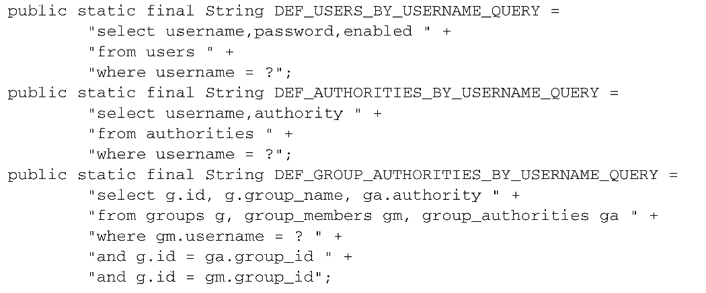

### 9.1 Spring Security简介

Spring Security是为基于Spring的应用程序提供声明式安全保护的安全性框架。Spring Security提供了完整的安全性解决方案，它能够在Web请求级别和方法调用级别处理身份认证和授权。因为基于Spring框架，所以Spring Security充分利用了依赖注入（dependency injection，DI）和面向切面的技术。

#### 9.1.1 理解Spring Security的模块

不管使用Spring Security保护哪种类型的应用程序，第一件需要做的事就是将Spring Security模块添加到应用程序的类路径下。Spring Security 3.2分为11个模块：

| 模块                    | 描述                                                         |
| ----------------------- | ------------------------------------------------------------ |
| ACL                     | 支持通过访问控制列表（access control list，ACL）为域对象提供安全性 |
| 切面（Aspects）         | 一个很小的模块，当使用Spring Security注解时，会使用基于AspectJ的切面，而不是使用标准的Spring AOP |
| CAS客户端（CAS Client） | 提供与Jasig的中心认证服务（Central Authentication Service，CAS）进行集成的功能 |
| 配置（Configuration）   | 包含通过XML和Java配置Spring Security的功能支持               |
| 核心（Core）            | 提供Spring Security基本库                                    |
| 加密（Cryptography）    | 提供了加密和密码编码的功能                                   |
| LDAP                    | 支持基于LDAP进行认证                                         |
| OpenID                  | 支持使用OpenID进行集中式认证                                 |
| Remoting                | 提供了对Spring Remoting的支持                                |
| 标签库（Tag Library）   | Spring Security的JSP标签库                                   |
| Web                     | 提供了Spring Security基于Filter的Web安全性支持               |

应用程序的类路径下至少要包含Core和Configuration这两个模块。Spring Security经常被用于保护Web应用，这显然也是Spittr应用的场景，所以还需要添加Web模块。同时还会用到Spring Security的JSP标签库，所以需要将这个模块也添加进来。

#### 9.1.2 过滤Web请求

Spring Security借助一系列Servlet Filter来提供各种安全性功能，但是不需要在web.xml或WebApplicationInitializer中配置多个Filter，只需配置一个特殊的Filter就可以了。

DelegatingFilterProxy是一个特殊的Servlet Filter，它本身所做的工作并不多。只是将工作委托给一个javax.servlet.Filter实现类，这个实现类作为一个\<bean>注册在Spring应用的上下文中。


如果在web.xml中配置Servlet和Filter的话，可以使用\<filter>元素：

```xml
<filter>
    <!-- 最重要的是<filter-name>设置成了springSecurityFilterChain，
         这是因为马上就会将Spring Security配置在Web安全性之中，
         这里会有一个名为springSecurityFilterChain的Filter bean，
         DelegatingFilterProxy会将过滤逻辑委托给它 -->
    <filter-name>springSecurityFilterChain</filter-name>
    <filter-class>org.springframework.web.filter.DelegatingFilterProxy</filter-class>
</filter>

<filter-mapping>
    <filter-name>springSecurityFilterChain</filter-name>
    <url-pattern>/*</url-pattern>
</filter-mapping>
```

若希望借助WebApplicationInitializer以Java的方式来配置DelegatingFilterProxy的话，那么所需要做的就是创建一个扩展的新类：

```java
package spittr.config;
import org.springframework.security.web.context.AbstractSecurityWebApplicationInitializer;

// AbstractSecurityWebApplicationInitializer实现了WebApplicationInitializer，
// 因此Spring会发现它，并用它在Web容器中注册DelegatingFilterProxy
public class SecurityWebInitializer extends AbstractSecurityWebApplicationInitializer {

}
```

不管通过web.xml还是通过AbstractSecurityWebApplicationInitializer的子类来配置DelegatingFilterProxy，它都会拦截发往应用中的请求，并将请求委托给ID为springSecurityFilterChain bean。

springSecurityFilterChain本身是另一个特殊的Filter，它也被称为FilterChainProxy。它可以链接任意一个或多个其他的Filter。Spring Security依赖一系列Servlet Filter来提供不同的安全特性。当启用Web安全性的时候，会自动创建这些Filter。

#### 9.1.3 编写简单的安全性配置

启用Web安全性功能的最简单配置：

```java
package spittr.config;

import org.springframework.context.annotation.Configuration;
import org.springframework.security.config.annotation.web.configuration.EnableWebSecurity;
import org.springframework.security.config.annotation.web.configuration.WebSecurityConfigurerAdapter;

@Configuration
// @EnableWebSecurity注解将会启用Web安全功能
@EnableWebSecurity
// Spring Security必须配置在一个实现了WebSecurityConfigurer的bean中，或者（简单起见）扩展WebSecurityConfigurerAdapter
public class SecurityConfig extends WebSecurityConfigurerAdapter {
}
```

@EnableWebSecurity可以启用任意Web应用的安全性功能，不过，如果应用碰巧是使用Spring MVC开发的，那么就应该考虑使用@EnableWebMvcSecurity替代它：

```java
@Configuration
// 除了其他的内容以外，@EnableWebMvcSecurity注解还配置了一个Spring MVC参数解析解析器（argument resolver），
// 这样的话处理器方法就能够通过带有@AuthenticationPrincipal注解的参数获得认证用户的principal（或username），
// 它同时还配置了一个bean，在使用Spring表单绑定标签库来定义表单时，
// 这个bean会自动添加一个隐藏的跨站请求伪造（cross-site request forgery，CSRF）token输入域。
@EnableWebMvcSecurity
public class SecurityConfig extends WebSecurityConfigurerAdapter {
}
```

尽管不是严格要求的，但可能希望指定Web安全的细节，这要通过重载WebSecurityConfigurerAdapter中的一个或多个方法来实现。

通过重载WebSecurityConfigurerAdapter的三个configure()方法来配置Web安全性，这个过程中会使用传递进来的参数设置行为：

| 方法                                    | 描述                                    |
| --------------------------------------- | --------------------------------------- |
| configure(WebSecurity)                  | 通过重载，配置Spring Security的Filter链 |
| configure(HttpSecurity)                 | 通过重载，配置如何通过拦截器保护请求    |
| configure(AuthenticationManagerBuilder) | 通过重载，配置user-detail服务           |

默认的configure(HttpSecurity)如下所示：

```java
// 这个简单的默认配置指定了该如何保护HTTP请求，以及客户端认证用户的方案
protected void configure(HttpSecurity http) throws Exception {
    logger.debug("Using default configure(HttpSecurity). If subclassed this will potentially override subclass configure(HttpSecurity).");
    // 通过调用authorizeRequests()和anyRequest().authenticated()
    // 就会要求所有进入应用的HTTP请求都要进行认证
    http
        .authorizeRequests()
        .anyRequest().authenticated()
        .and()
        .formLogin().and()
        .httpBasic();
}
```

为了让Spring Security满足应用的需求，还需要再添加一点配置：

+ 配置用户存储；
+ 指定哪些请求需要认证，哪些请求不需要认证，以及所需要的权限；
+ 提供一个自定义的登录页面，替代原来简单的默认登录页。

### 9.2 选择查询用户详细信息的服务

#### 9.2.1 使用基于内存的用户存储

因为应用中自定义的SecurityConfig安全配置类扩展了WebSecurityConfigurerAdapter，因此配置用户存储的最简单方式就是重载configure()方法，并以AuthenticationManagerBuilder作为传入参数。AuthenticationManagerBuilder有多个方法可以用来配置Spring Security对认证的支持。通过inMemoryAuthentication()方法，可以启用、配置并任意填充基于内存的用户存储。

如下，SecurityConfig重载了configure()方法，并使用两个用户来配置内存用户存储：

```java
package spittr.config;
import org.springframework.context.annotation.Configuration;
import org.springframework.security.config.annotation.authentication.builders.AuthenticationManagerBuilder;
import org.springframework.security.config.annotation.web.configuration.WebSecurityConfigurerAdapter;
import org.springframework.security.config.annotation.web.servlet.configuration.EnableWebMvcSecurity;

@Configuration
@EnableWebMvcSecurity
public class SecurityConfig extends WebSecurityConfigurerAdapter {
    @Override
    protected void configure(AuthenticationManagerBuilder auth) throws Exception {
        auth
            .inMemoryAuthentication() // 启用内存用户存储
            // 调用withUser()方法为内存用户存储添加新的用户，参数是username，
            // withUser()方法返回的是UserDetailsManagerConfigurer.UserDetailsBuilder，
            // 这个对象提供了多个进一步配置用户的方法，
            // 包括设置用户密码的password()方法以及为给定用户授予一个或多个角色权限的roles()方法
            // 
            // 这里添加了两个用户，"user"和"admin"，密码均为"password"，
            // "user"用户具有USER角色，而"admin"用户具有ADMIN和USER两个角色
            .withUser("user").password("password")
            // roles()方法是authorities()方法的简写形式
            // roles()方法所给定的值都会添加一个"ROLE_"前缀，并将其作为权限授予给用户
            .roles("USER") // 等价于.authorities(ROLE_USER)
            // and()方法能够将多个用户的配置连接起来
            .and()
            .withUser("admin").password("password").roles("USER", "ADMIN");
    }
}

```

配置用户详细信息的方法：

| 方法                                          | 描述                       |
| --------------------------------------------- | -------------------------- |
| accountExpired(boolean)                       | 定义账号是否已经过期       |
| accountLocked(boolean)                        | 定义账号是否已经锁定       |
| and()                                         | 用来连接配置               |
| authorities(GrantedAuthority...)              | 授予某个用户一项或多项权限 |
| authorities(List<? extends GrantedAuthority>) | 授予某个用户一项或多项权限 |
| authorities(String...)                        | 授予某个用户一项或多项权限 |
| credentialsExpired(boolean)                   | 定义凭证是否已经过期       |
| disabled(boolean)                             | 定义账号是否已被禁用       |
| password(String)                              | 定义用户的密码             |
| roles(String...)                              | 授予某个用户一项或多项角色 |

#### 9.2.2 基于数据库表进行认证

用户数据通常会存储在关系型数据库中，并通过JDBC进行访问。为了配置Spring Security使用以JDBC为支撑的用户存储，可以使用jdbcAuthentication()方法，所需的最少配置如下：

```java
// 必须要配置一个Datasource，这样才能访问关系型数据库
// dataSource通过自动装配得到
@Autowired
DataSource dataSource;

@Override
protected void configure(AuthenticationManagerBuilder auth) throws Exception {
    auth
        .jdbcAuthentication()
        .dataSource(dataSource);
}
```

**重写默认的用户查询功能**

尽管默认的最少配置能够让一切运转起来，但是它对我们的数据库模式有一些要求。它预期存在某些存储用户数据的表。下面的代码片段来源于Spring Security内部，展现了当查找用户信息时所执行的SQL查询语句：



在第一个查询中，获取了用户的用户名、密码以及是否启用的信息，这些信息会用来进行用户认证。接下来的查询查找了用户所授予的权限，用来进行鉴权，最后一个查询中，查找了用户作为群组的成员所授予的权限。

可能应用的数据库与上面所述并不一致，那么可能希望在查询上有更多的控制权。如果是这样的话，可以按照如下的方式配置自己的查询：

```java
@Override
protected void configure(AuthenticationManagerBuilder auth) throws Exception {
    auth
        .jdbcAuthentication()
        .dataSource(dataSource)
        // 重写了认证和基本权限的查询语句
        // 将默认的SQL查询替换为自定义的设计时，很重要的一点就是要遵循查询的基本协议
        // 所有查询都将用户名作为唯一的参数，
        // 认证查询会选取用户名、密码以及启用状态信息，
        // 权限查询会选取零行或多行包含该用户名及其权限信息的数据，
        // 群组权限查询会选取零行或多行数据，每行数据中都会包含群组ID、群组名称以及权限
        .usersByUsernameQuery(
            "select username, password, true " +
                "from Spitter where username=?")
        .authoritiesByUsernameQuery(
            "select username, 'ROLE_USER' " +
                "from Spitter where username=?")
        .passwordEncoder(new StandardPasswordEncoder("53cr3t"));

}
```

**使用转码后的密码**

如果数据库中的密码进行了转码的话，那么认证就会失败，因为它与用户提交的明文密码并不匹配。为了解决这个问题，需要借助passwordEncoder()方法指定一个密码转码器（encoder）：

```java
@Override
protected void configure(AuthenticationManagerBuilder auth) throws Exception {
    auth
        .jdbcAuthentication()
        .dataSource(dataSource)
        .usersByUsernameQuery(
            "select username, password, true " +
                "from Spitter where username=?")
        .authoritiesByUsernameQuery(
            "select username, 'ROLE_USER' " +
                "from Spitter where username=?")
        // passwordEncoder()方法可以接受Spring Security中PasswordEncoder接口的任意实现
        // Spring Security的加密模块包括了三个这样的实现：
        // BCryptPasswordEncoder、NoOpPasswordEncoder和StandardPasswordEncoder
        // 如果内置的实现无法满足需求时，可以提供自定义的实现
        // 用户在登录时输入的密码会按照相同的算法进行转码，
        // 然后再与数据库中已经转码过的密码进行对比，这个对比是在PasswordEncoder的matches()方法
        .passwordEncoder(new StandardPasswordEncoder("53cr3t"));
}
```

#### 9.2.3 基于LDAP进行认证


