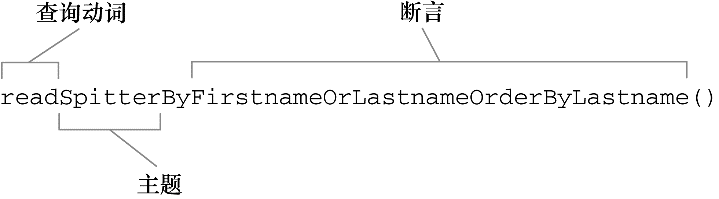

在数据持久化的世界中，JDBC就像自行车。对于份内的工作，它能很好地完成并且在一些特定的场景下表现出色。但随着应用程序变得越来越复杂，对持久化的需求也变得更复杂。如果能将对象的属性映射到数据库的列上，并且自动生成语句和查询，这样就能从无休止的问号字符串中解脱出来。此外，可能还需要一些更复杂的特性：

- 延迟加载（Lazy loading）：随着对象关系变得越来越复杂，有时候并不希望立即获取完整的对象间关系。假设在查询一组PurchaseOrder对象，而每个对象中都包含一个LineItem对象集合。如果只关心PurchaseOrder的属性，那查询出LineItem的数据就毫无意义。延迟加载允许只在需要的时候获取数据。
- 预先抓取（Eager fetching）：这与延迟加载是相对的。借助于预先抓取，可以使用一个查询获取完整的关联对象。如果需要PurchaseOrder及其关联的LineItem对象，预先抓取的功能可以在一个操作中将它们全部从数据库中取出来，节省了多次查询的成本。
- 级联（Cascading）：有时，更改数据库中的表会同时修改其他表。例如，当删除Order对象时，希望同时在数据库中删除关联的LineItem。

一些可用的框架提供了这样的服务，这些服务的通用名称是对象/关系映射（object-relational mapping，ORM）。

Spring对多个持久化框架都提供了支持，包括Hibernate、iBATIS、Java数据对象（Java Data Objects，JDO）以及Java持久化API（Java Persistence API，JPA）。与Spring对JDBC的支持那样，Spring对ORM框架的支持提供了与这些框架的集成点以及一些附加的服务：

- 支持集成Spring声明式事务；
- 透明的异常处理；
- 线程安全的、轻量级的模板类；
- DAO支持类；
- 资源管理。

### 11.1 在Spring中集成Hibernate

Hibernate提供了基本的对象关系映射，以及ORM工具所应具有的所有复杂功能，比如缓存、延迟加载、预先抓取以及分布式缓存。

书籍参：[《Java Persistence with Hibernate》](https://book.douban.com/subject/24830009/)，官网：<http://www.hibernate.org>。

#### 11.1.1 声明Hibernate的Session工厂

使用Hibernate所需的主要接口是org.hibernate.Session。Session接口提供了基本的数据访问功能，如保存、更新、删除以及从数据库加载对象的功能。通过Hibernate的Session接口，应用程序的Repository能够满足所有的持久化需求。

获取Hibernate Session对象的标准方式是借助于Hibernate SessionFactory接口的实现类。除了一些其他的任务，SessionFactory主要负责Hibernate Session的打开、关闭以及管理。

在Spring中，提供了三个Hibernate Session工厂bean来获取Hibernate SessionFactory：

+ org.springframework.orm.hibernate3.LocalSessionFactoryBean
+ org.springframework.orm.hibernate3.annotation.AnnotationSessionFactoryBean
+ org.springframework.orm.hibernate4.LocalSessionFactoryBean

这些Session工厂bean都是Spring FactoryBean接口的实现，它们会产生一个HibernateSessionFactory，它能够装配进任何SessionFactory类型的属性中。

如果使用Hibernate 3.2或更高版本（Hibernate 4.0之下）并且使用XML定义映射的话，那么需要定义Spring的org.springframework.orm.hibernate3包中的LocalSessionFactoryBean：

```java
@Bean
public LocalSessionFactoryBean sessionFactory(DataSource dataSource) {
    LocalSessionFactoryBean sfb = new LocalSessionFactoryBean();
    // 属性dataSource装配了一个DataSource bean的引用
    sfb.setDataSource(dataSource);
    // 属性mappingResources列出了一个或多个的Hibernate映射文件，在这些文件中定义了应用程序的持久化策略
    sfb.setMappingResources(new String[] { "Spitter.hbm.xml" });
    // hibernateProperties属性配置了Hibernate如何进行操作的细节
    Properties props = new Properties();
    // 这里，配置Hibernate使用H2数据库并且要按照H2Dialect来构建SQL
    props.setProperty("dialect", "org.hibernate.dialect.H2Dialect");
    sfb.setHibernateProperties(props);
    return sfb;
}
```

更倾向于使用注解的方式来定义持久化，并且还没有使用Hibernate 4的话，那么需要使用AnnotationSessionFactoryBean来代替LocalSessionFactoryBean：

```java
@Bean
public AnnotationSessionFactoryBean sessionFactory(DataSource ds) {
    AnnotationSessionFactoryBean sfb = new AnnotationSessionFactoryBean();
    sfb.setDataSource(ds);
    sfb.setPackagesToScan(new String[] { "com.habuma.spittr.domain" });
    Properties props = new Properties();
    props.setProperty("dialect", "org.hibernate.dialect.H2Dialect");
    sfb.setHibernateProperties(props);
    return sfb;
}
```

如果使用Hibernate 4的话，那么就应该使用org.springframework.orm.hibernate4中的LocalSessionFactoryBean。它有很多相同的属性，能够支持基于XML的映射和基于注解的映射。如下的代码展现了如何对它进行配置，使其支持基于注解的映射：

```java
@Bean
public LocalSessionFactoryBean sessionFactory(DataSource dataSource) {
    LocalSessionFactoryBean sfb = new LocalSessionFactoryBean();
    sfb.setDataSource(dataSource);
    // 这里不再列出Hibernate配置文件，
    // 而是使用packagesToScan属性告诉Spring扫描一个或多个包以查找域类，
    // 这些类通过注解的方式表明要使用Hibernate进行持久化，
    // 这些类可以使用的注解包括JPA的@Entity或@MappedSuperclass以及Hibernate的@Entity
    sfb.setPackagesToScan(new String[] { "com.habuma.spittr.domain" });
    Properties props = new Properties();
    props.setProperty("dialect", "org.hibernate.dialect.H2Dialect");
    sfb.setHibernateProperties(props);
    return sfb;
}
```

还可以使用annotatedClasses属性来将应用程序中所有的持久化类以全限定名的方式明确列出：

```java
// annotatedClasses属性对于准确指定少量的域类是不错的选择
sfb.setAnnotatedClasses(
    new Class<?>[] { Spitter.class, Spittle.class }
);
```

#### 11.1.2 构建不依赖于Spring的Hibernate代码

为了尽量避免Repository实现会直接与Spring耦合，最佳实践是不再使用Spring提供的HibernateTemplate，而是使用上下文Session（Contextual session）直接将Hibernate SessionFactory装配到Repository中，并使用它来获取Session：

```java
// @Repository是Spring的另一种构造性注解，它能够像其他注解一样被Spring的组件扫描所扫描到，
// 这样就不必明确声明HibernateSpitterRepository bean
@Repository
public class HibernateSpittleRepository implements SpittleRepository {

    private SessionFactory sessionFactory;

    // 注入SessionFactory
    @Inject
    public HibernateSpittleRepository(SessionFactory sessionFactory) {
        this.sessionFactory = sessionFactory;
    }

    // 使用当前session
    private Session currentSession() {
        return sessionFactory.getCurrentSession();
    }

    public long count() {
        return findAll().size(); 
    }

    public List<Spittle> findRecent() {
        return findRecent(10);
    }

    public List<Spittle> findRecent(int count) {
        return (List<Spittle>) spittleCriteria()
            .setMaxResults(count)
            .list();
    }

    public Spittle findOne(long id) {
        return (Spittle) currentSession().get(Spittle.class, id);
    }

    public Spittle save(Spittle spittle) {
        Serializable id = currentSession().save(spittle);
        return new Spittle(
            (Long) id, 
            spittle.getSpitter(), 
            spittle.getMessage(), 
            spittle.getPostedTime());
    }

    public List<Spittle> findBySpitterId(long spitterId) {
        return spittleCriteria()
            .add(Restrictions.eq("spitter.id", spitterId))
            .list();
    }

    public void delete(long id) {
        currentSession().delete(findOne(id));
    }

    public List<Spittle> findAll() {
        return (List<Spittle>) spittleCriteria().list(); 
    }

    private Criteria spittleCriteria() {
        return currentSession() 
            .createCriteria(Spittle.class)
            .addOrder(Order.desc("postedTime"));
    }

}
```

@Repository还有另外一个用处。为了给不使用模板的Hibernate Repository添加异常转换功能，只需在Spring应用上下文中添加一个PersistenceExceptionTranslationPostProcessor bean：

```java
// PersistenceExceptionTranslationPostProcessor是一个bean 后置处理器（bean post-processor，Spring实例化Bean实例之后进行的增强处理），
// 它会在所有拥有@Repository注解的类上添加一个通知器（advisor），
// 这样就会捕获任何平台相关的异常并以Spring非检查型数据访问异常的形式重新抛出
@Bean
public BeanPostProcessor persistenceTranslation() {
    return new PersistenceExceptionTranslationPostProcessor();
}
```

### 11.2 Spring与Java持久化API

Java持久化API（Java Persistence API，JPA）基于POJO（Plain Ordinary Java Object，简单的Java对象 ）的持久化机制，从Hibernate和Java数据对象（Java Data Object，JDO）上借鉴了很多理念并加入了Java 5注解的特性。

在Spring中使用JPA的第一步是要在Spring应用上下文中将实体管理器工厂（entity manager factory）按照bean的形式来进行配置。

#### 11.2.1 配置实体管理器工厂

简单来讲，基于JPA的应用程序需要使用EntityManagerFactory的实现类来获取EntityManager实例。JPA定义了两种类型的实体管理器：

+ 应用程序管理类型（Application-managed）：当应用程序向实体管理器工厂直接请求实体管理器时，工厂会创建一个实体管理器。在这种模式下，程序要负责打开或关闭实体管理器并在事务中对其进行控制。这种方式的实体管理器适合于不运行在Java EE容器中的独立应用程序。
+ 容器管理类型（Container-managed）：实体管理器由Java EE创建和管理。应用程序根本不与实体管理器工厂打交道。相反，实体管理器直接通过注入或JNDI来获取。容器负责配置实体管理器工厂。这种类型的实体管理器最适用于Java EE容器，在这种情况下会希望在persistence.xml指定的JPA配置之外保持一些自己对JPA的控制。

应用程序管理类型的EntityManager是由EntityManagerFactory创建的，而后者是通过PersistenceProvider的createEntityManagerFactory()方法得到的。与此相对，容器管理类型的EntityManagerFactory是通过PersistenceProvider的createContainerEntityManagerFactory()方法获得的。

这两种实体管理器工厂分别由对应的Spring工厂Bean创建：

+ LocalEntityManagerFactoryBean生成应用程序管理类型的EntityManagerFactory；
+ LocalContainerEntityManagerFactoryBean生成容器管理类型的EntityManagerFactory。

**配置应用程序管理类型的JPA**

对于应用程序管理类型的实体管理器工厂来说，它绝大部分配置信息来源于一个名为persistence.xml的配置文件。这个文件必须位于类路径下的META-INF目录下。

persistence.xml列出了一个或多个的持久化类以及一些其他的配置如数据源和基于XML的配置文件。如下是一个典型的persistence.xml文件，它是用于Spittr应用程序的：

```xml
<persistence xmlns="http://java.sun.com/xml/ns/persistence" version="1.0">
    <persistence-unit name="spitterPU">
        <class>com.habuma.spittr.domain.Spitter</class>
        <class>com.habuma.spittr.domain.Spittle</class>
        <properties>
            <property name="toplink.jdbc.driver" value="org.hsqldb.jdbcDriver" />
            <property name="toplink.jdbc.url" value="jdbc:hsqldb:hsql://localhost/spitter/spitter" />
            <property name="toplink.jdbc.user" value="root" />
            <property name="toplink.jdbc.password" value="123456" />
        </properties>
    </persistence-unit>
</persistence>
```

因为在persistence.xml文件中包含了大量的配置信息，所以在Spring中需要配置的就很少了。可以通过以下的@Bean注解方法在Spring中声明LocalEntityManagerFactoryBean：

```java
@Bean
public LocalEntityManagerFactoryBean entityManagerFactoryBean() {
    LocalEntityManagerFactoryBean emfb = new LocalEntityManagerFactoryBean();
    // 赋给persistenceUnitName属性的值就是persistence.xml中持久化单元的名称
    emfb.setPersistenceUnitName("spitterPU");
    return emfb;
}
```

**使用容器管理类型的JPA**

容器管理的JPA采取了一个不同的方式。当运行在容器中时，可以使用容器（在这里是Spring）提供的信息来生成EntityManagerFactory。

可以将数据源信息配置在Spring应用上下文中，而不是在persistence.xml中了。例如，如下的@Bean注解方法声明了在Spring中如何使用LocalContainerEntityManagerFactoryBean来配置容器管理类型的JPA：

```java
@Bean
public LocalContainerEntityManagerFactoryBean entityManagerFactory(
    DataSource dataSource, JpaVendorAdapter jpaVendorAdapter) {
    LocalContainerEntityManagerFactoryBean emfb =
        new LocalContainerEntityManagerFactoryBean();
    // 使用了Spring配置的数据源来设置dataSource属性
    // 尽管数据源还可以在persistence.xml中进行配置，
    // 但是这个属性指定的数据源具有更高的优先级
    emfb.setDataSource(dataSource);
    // jpaVendorAdapter属性用于指明所使用的是哪一个厂商的JPA实现；
    // Spring提供了多个JPA厂商适配器：
    //  ● EclipseLinkJpaVendorAdapter
    //  ● HibernateJpaVendorAdapter
    //  ● OpenJpaVendorAdapter
    //  ● TopLinkJpaVendorAdapter（Spring 3.1中已废弃）
    emfb.setJpaVendorAdapter(jpaVendorAdapter);
    return emfb;
}
```

本例中，使用Hibernate作为JPA实现，所以将其配置为HibernateJpaVendorAdapter：

```java
@Bean
public JpaVendorAdapter jpaVendorAdapter() {
    HibernateJpaVendorAdapter adapter = new HibernateJpaVendorAdapter();
    // 有多个属性需要设置到厂商适配器上，但是最重要的是database属性
    adapter.setDatabase("HSQL");
    adapter.setShowSql(true);
    adapter.setGenerateDdl(false);
    adapter.setDatabasePlatform("org.hibernate.dialect.HSQLDialect");
    return adapter;
}
```

Hibernate的JPA适配器支持多种数据库，可以通过其database属性配置使用哪个数据库：

| 数据库平台           | 属性database的值 |
| -------------------- | ---------------- |
| IBM DB2              | DB2              |
| Apache Derby         | DERBY            |
| H2                   | H2               |
| Hypersonic           | HSQL             |
| Informix             | INFORMIX         |
| MySQL                | MYSQL            |
| Oracle               | ORACLE           |
| PostgresQL           | POSTGRESQL       |
| Microsoft SQL Server | SQLSERVER        |
| Sybase               | SYBASE           |

persistence.xml文件的主要作用就在于识别持久化单元中的实体类。但是从Spring 3.1开始，能够在LocalContainerEntityManagerFactoryBean中直接设置packagesToScan属性：

```java
@Bean
public LocalContainerEntityManagerFactoryBean entityManagerFactory(
    DataSource dataSource, JpaVendorAdapter jpaVendorAdapter) {
    LocalContainerEntityManagerFactoryBean emfb =
        new LocalContainerEntityManagerFactoryBean();
    emfb.setDataSource(dataSource);
    emfb.setJpaVendorAdapter(jpaVendorAdapter);
    // 在这个配置中，LocalContainerEntityManagerFactoryBean
    // 会扫描com.angus.spittr.domain包，查找带有@Entity注解的类
    emfb.setPackagesToScan("com.angus.spittr.domain");
    return emfb;
}
```

**从JNDI获取实体管理器工厂**

如果将Spring应用程序部署在应用服务器中，EntityManagerFactory可能已经创建好了并且位于JNDI中等待查询使用。在这种情况下，可以使用Spring jee命名空间下的\<jee:jndi-lookup>元素来获取对EntityManagerFactory的引用：

```xml
<jee:jndi-lookup id="emf" jndi-name="persistence/spitterPU" />
```

也可以使用如下的Java配置来获取EntityManagerFactory：

```java
@Bean
public JndiObjectFactoryBean entityManagerFactory() {
    JndiObjectFactoryBean jndiObjectFB = new JndiObjectFactoryBean();
    jndiObjectFB.setJndiName("jdbc/SpittrDS");
    // JndiObjectFactoryBean是FactoryBean接口的实现，能够创建EntityManagerFactory
    return jndiObjectFB;
}
```

#### 11.2.2 编写基于JPA的Repository

Spring对JPA集成也提供了JpaTemplate模板以及对应的支持类JpaDaoSupport。但是，为了实现更纯粹的JPA方式，基于模板的JPA已经被弃用了。

鉴于纯粹的JPA方式远胜于基于模板的JPA，故而在如下程序清单中的JpaSpitterRepository展现了如何开发不使用Spring JpaTemplate的JPA Repository：

```java
package com.angus.spittr.persistence;
import java.util.List;
import javax.persistence.EntityManagerFactory;
import javax.persistence.PersistenceUnit;
import org.springframework.dao.DataAccessException;
import org.springframework.stereotype.Repository;
import org.springframework.transaction.annotation.Transactional;
import com.habuma.spittr.domain.Spitter;
import com.habuma.spittr.domain.Spittle;
@Repository
@Transactional
public class JpaSpitterRepository implements SpitterRepository {
    // 注入EntityManagerFactory
    // 使用@PersistenceUnit注解，Spring会将EntityManagerFactory注入到Repository之中
    @PersistenceUnit
    private EntityManagerFactory emf; 
    
    public void addSpitter(Spitter spitter) {
        emf.createEntityManager().persist(spitter); // 创建并使用EntityManager
    }
    
    public Spitter getSpitterById(long id) {
        return emf.createEntityManager().find(Spitter.class, id);
    }
    
    public void saveSpitter(Spitter spitter) {
        emf.createEntityManager().merge(spitter);
    }
    
    ...
}
```

如果能够预先准备好EntityManager会更方便一点，但是EntityManager并不是线程安全的，一般来讲并不适合注入到像Repository这样共享的单例bean中。但是，这并不意味着没有办法要求注入EntityManager。如下的程序清单展现了如何借助@PersistentContext注解为JpaSpitterRepository设置EntityManager：

```java
package com.angus.spittr.persistence;
import java.util.List;
import javax.persistence.EntityManager;
import javax.persistence.PersistenceContext;
import org.springframework.dao.DataAccessException;
import org.springframework.stereotype.Repository;
import org.springframework.transaction.annotation.Transactional;
import com.habuma.spittr.domain.Spitter;
import com.habuma.spittr.domain.Spittle;
// 由于没有使用模板类来处理异常，所以我们需要为Repository添加@Repository注解，
// 这样PersistenceExceptionTranslationPostProcessor就会知道要将这个bean产生的异常转换成Spring的统一数据访问异常
@Repository
// @Transactional表明这个Repository中的持久化方法是在事务上下文中执行的
@Transactional
public class JpaSpitterRepository implements SpitterRepository {
    // 注入EntityManager
    // @PersistenceContext并不会真正注入EntityManager，
    // 它没有将真正的EntityManager设置给Repository，而是给了它一个EntityManager的代理。
    // 真正的EntityManager是与当前事务相关联的那一个，如果不存在这样的EntityManager的话，
    // 就会创建一个新的。这样的话，就能始终以线程安全的方式使用实体管理器
    @PersistenceContext
    private EntityManager em;
    
    // 使用EntityManager
    public void addSpitter(Spitter spitter) {
        em.persist(spitter);
    }
    
    public Spitter getSpitterById(long id) {
        return em.find(Spitter.class, id);
    }
    
    public void saveSpitter(Spitter spitter) {
        em.merge(spitter);
    }
    
    ...
}
```

@PersistenceUnit和@PersistenceContext并不是Spring的注解，它们是由JPA规范提供的。为了让Spring理解这些注解，并注入EntityManager Factory或EntityManager，必须要配置Spring的Persistence-AnnotationBeanPostProcessor。如果已经使用了\<context:annotation-config>或\<context:component-scan>，那就不必担心，因为这些配置元素会自动注册PersistenceAnnotationBeanPostProcessor bean。否则的话，需要显式地注册这个bean：

```java
@Bean
public PersistenceAnnotationBeanPostProcessor paPostProcessor() {
    return new PersistenceAnnotationBeanPostProcessor();
}
```

### 11.3 借助Spring Data实现自动化的JPA Repository

Spring Data JPA能够进一步终结样板式代码（即不同的Repository中相同的增删查改代码等），不再需要一遍遍地编写相同的Repository实现，只编写Repository接口就可以了。

借助Spring Data，以接口定义的方式创建Repository：

```java
public interface SpitterRepository extends JpaRepository<Spitter, Long> {
}
```

这里，SpitterRepository扩展了Spring Data JPA的JpaRepository。通过这种方式，JpaRepository进行了参数化，所以它就能知道这是一个用来持久化Spitter对象的Repository，并且Spitter的ID类型为Long。另外，它还会继承18个执行持久化操作的通用方法，如保存Spitter、删除Spitter以及根据ID查询Spitter。

不需要编写SpitterRepository的任何实现类，而是让Spring Data来做这件事请，所需要做的就是对它提出要求。为了要求Spring Data创建SpitterRepository的实现，需要在Spring配置中添加一个元素。如下的程序清单展现了在XML配置中启用Spring Data JPA所需要添加的内容：

```xml
<?xml version="1.0" encoding="UTF-8"?>
<beans xmlns="http://www.springframework.org/schema/beans"
       xmlns:xsi="http://www.w3.org/2001/XMLSchema-instance"
       xmlns:jpa="http://www.springframework.org/schema/data/jpa"
       xsi:schemaLocation="http://www.springframework.org/schema/data/jpa
                           http://www.springframework.org/schema/data/jpa/spring-jpa-1.0.xsd">
    <!-- <jpa:repositories>元素需要指定一个要进行扫描的base-package，
         它会扫描它的基础包来查找扩展自Spring Data JPA Repository接口的所有接口，
         如果发现了扩展自Repository的接口，它会自动生成（在应用启动的时候）这个接口的实现。 -->
    <jpa:repositories base-package="com.habuma.spittr.db" />
    ...
</beans>
```

若是使用Java配置的话，则需要在Java配置类上添加@EnableJpaRepositories注解：

```java
// 使用了@EnableJpaRepositories注解，并且会扫描com.habuma.spittr.db包
@Configuration
@EnableJpaRepositories(basePackages="com.habuma.spittr.db")
public class JpaConfiguration {
    ...
}
```

SpitterRepository接口扩展自JpaRepository，而JpaRepository又扩展自Repository标记接口（间接）。因此，SpitterRepository就传递性地扩展了Repository接口，也就是Repository扫描时所要查找的接口。当Spring Data找到它后，就会创建SpitterRepository的实现类（应用启动时生成，即Spring的应用上下文创建的时候），其中包含了继承自JpaRepository、PagingAndSortingRepository和CrudRepository的18个方法。

当然，若是需求超过了它所提供的这18个方法的话，Spring Data JPA也提供了几种方式来为Repository添加自定义的方法。

#### 11.3.1 定义查询方法

自定义方法，比如SpitterRepository需要完成的一项功能是根据给定的username查找Spitter对象：

```java
public interface SpitterRepository extends JpaRepository<Spitter, Long> {
    Spitter findByUsername(String username);
}
```

这里并不需要实现findByUsername()。方法签名已经告诉Spring Data JPA足够的信息来创建这个方法的实现了。当创建Repository实现的时候，Spring Data会检查Repository接口的所有方法，解析方法的名称，并基于被持久化的对象来试图推测方法的目的。本质上，Spring Data定义了一组小型的领域特定语言（domain-specific language ，DSL），在这里，持久化的细节都是通过Repository方法的签名来描述的。

Repository方法是由一个动词、一个可选的主题（Subject）、关键词By以及一个断言所组成。在findByUsername()这个样例中，动词是find，断言是Username，主题被省略，暗含的主题是Spitter。



主题以Distinct开头的话，在生成查询的时候会确保所返回结果集中不包含重复记录。

Spring Data允许在方法名中使用四种动词：get、read、find和count。其中，动词get、read和find是同义的，这三个动词对应的Repository方法都会查询数据并返回对象。而动词count则会返回匹配对象的数量，而不是对象本身。

在断言中，会有一个或多个限制结果的条件，通过And或者Or进行分割。每个条件必须引用一个属性（对比的属性值就是方法的参数），并且还可以指定一种比较操作。如果省略比较操作符的话，那么这暗指是一种相等比较操作。比较操作包括如下：

+ IsAfter、After、IsGreaterThan、GreaterThan
+ IsGreaterThanEqual、GreaterThanEqual
+ IsBefore、Before、IsLessThan、LessThan
+ IsLessThanEqual、LessThanEqual
+ IsBetween、Between
+ IsNull、Null
+ IsNotNull、NotNull
+ IsIn、In
+ IsNotIn、NotIn
+ IsStartingWith、StartingWith、StartsWith
+ IsEndingWith、EndingWith、EndsWith
+ IsContaining、Containing、Contains
+ IsLike、Like
+ IsNotLike、NotLike
+ IsTrue、True
+ IsFalse、False
+ Is、Equals
+ IsNot、Not

要处理String类型的属性时，条件中可能还会包含IgnoringCase或IgnoresCase（两者是一样的）：

```java
// 参数的名称是无关紧要的，但是它们的顺序必须要与方法名称中的操作符相匹配
List<Spitter> readByFirstnameIgnoringCaseOrLastnameIgnoresCase(String first, String last);

// 还可以在所有条件的后面添加AllIgnoringCase或AllIgnoresCase，忽略所有条件的大小写
List<Spitter> readByFirstnameOrLastnameAllIgnoresCase(String first, String last);
```

最后，可以在方法名称的结尾处添加OrderBy，实现结果集排序：

```java
// 按照lastname属性升序排列结果集
List<Spitter> readByFirstnameOrLastnameOrderByLastnameAsc(String first, String last);

// 如果要根据多个属性排序的话，只需将其依序添加到OrderBy中即可
// 先根据lastname升序排列，然后根据firstname属性降序排列
List<Spitter> readByFirstnameOrLastnameOrderByLastnameAscFirstnameDesc(
    String first, String last);
```

如下给出了几个符合使用Spring Data方法命名约定的方法签名：

+ List\<Pet> findPetsByBreedIn(List\<String> breed)
+ int countProductsByDiscontinuedTrue() 
+ List\<Order> findByShippingDateBetween(Date start, Date end)

#### 11.3.2 声明自定义查询

如果所需的数据无法通过方法名称进行恰当地描述（例如不合符规则或是方法名太长），那么可以使用@Query注解，为Spring Data提供要执行的查询。

```java
// 依然不需要编写findAllGmailSpitters()方法的实现，只需提供查询即可，Spring Data JPA知道如何实现这个方法
@Query("select s from Spitter s where s.email like '%gmail.com'")
List<Spitter> findAllGmailSpitters();
```

#### 11.3.3 混合自定义的功能

当Spring Data JPA为Repository接口生成实现的时候，它还会查找名字与接口相同，并且添加了Impl后缀的一个类。如果这个类存在的话，Spring Data JPA将会把它的方法与Spring Data JPA所生成的方法合并在一起。对于SpitterRepository接口而言，要查找的类名为SpitterRepositoryImpl。

假设需要在SpitterRepository中添加一个方法，发表Spittle数量在10,000及以上的Spitter将会更新为Elite状态。使用Spring Data JPA的方法命名约定或使用@Query均没有办法声明这样的方法。最为可行的方案是使用如下的eliteSweep()方法：

```java
package spittr.db;
import javax.persistence.EntityManager;
import javax.persistence.PersistenceContext;

// Impl后缀只是默认的做法，如果使用其他后缀，只需在配置@EnableJpaRepositories的时候，
// 设置repositoryImplementationPostfix属性即可
// @EnableJpaRepositories( basePackages="com.habuma.spittr.db",
//                         repositoryImplementationPostfix="Helper")
public class SpitterRepositoryImpl implements SpitterSweeper {

    @PersistenceContext
    private EntityManager em;

    public int eliteSweep() {
        String update = 
            "UPDATE Spitter spitter " +
            "SET spitter.status = 'Elite' " +
            "WHERE spitter.status = 'Newbie' " +
            "AND spitter.id IN (" +
            "SELECT s FROM Spitter s WHERE (" +
            "  SELECT COUNT(spittles) FROM s.spittles spittles) > 10000" +
            ")";
        return em.createQuery(update).executeUpdate();
    }

}
```

SpitterRepositoryImpl并没有实现SpitterRepository接口（将它与Spring Data的Repository关联起来的是它的名字），而是实现了SpitterSweeper接口：

```java
public interface SpitterSweeper {
    int eliteSweep();
}
```

还需要确保eliteSweep()方法会被声明在SpitterRepository接口中。要实现这一点，避免代码重复的简单方式就是修改SpitterRepository，让它扩展SpitterSweeper：

```java
public interface SpitterRepository 
    extends JpaRepository<Spitter, Long>, SpitterSweeper {
    ...
}
```

### 11.4 小结

Hibernate和JPA这样的ORM方案能够以声明式的模型实现数据持久化。尽管Spring没有为ORM提供直接的支持，但是它能够与多种流行的ORM方案集成，包括Hibernate与Java持久化API。

在本章中，介绍了如何在Spring应用中使用Hibernate的上下文Session，这样自定义的Repository就能包含很少甚至不包含Spring相关的代码。与之类似，还介绍了如何将EntityManagerFactory或EntityManager注入到Repository实现中，从而实现不依赖于Spring的JPA Repository。

初步了解了Spring Data，在这个过程中，只需声明JPA Repository接口即可，让Spring Data JPA在运行时自动生成这些接口的实现。当需要的Repository方法超出了Spring Data JPA所提供的功能时，可以借助@Query注解以及编写自定义的Repository方法来实现。


