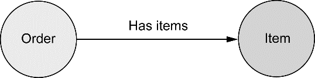
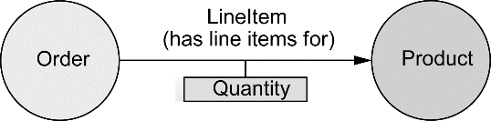

Spring Data还提供了对多种NoSQL数据库的支持，包括MongoDB、Neo4j和Redis。它不仅支持自动化的Repository，还支持基于模板的数据访问和映射注解。

### 12.1 使用MongoDB持久化文档数据

有一些数据的最佳表现形式是文档（document）。也就是说，不要把这些数据分散到多个表、节点或实体中，将这些信息收集到一个非规范化（也就是文档）的结构中会更有意义。尽管两个或两个以上的文档有可能会彼此产生关联，但是通常来讲，文档是独立的实体。能够按照这种方式优化并处理文档的数据库，称之为文档数据库。

**文档数据库不适用于什么场景**

文档数据库不是通用的数据库，它们所擅长解决的是一个很小的问题集。有些数据具有明显的关联关系，文档型数据库并没有针对存储这样的数据进行优化。例如，社交网络表现了应用中不同的用户之间是如何建立关联的，这种情况就不适合放到文档型数据库中。

MongoDB是最为流行的开源文档数据库之一。Spring Data MongoDB提供了三种方式在Spring应用中使用MongoDB：

+ 通过注解实现对象-文档映射；
+ 使用MongoTemplate实现基于模板的数据库访问；
+ 自动化的运行时Repository生成功能。

#### 12.1.1 启用MongoDB

为了有效地使用Spring Data MongoDB，需要在Spring配置中添加几个必要的bean：

+ 首先，需要配置MongoClient，以便于访问MongoDB数据库。
+ 同时，还需要有一个MongoTemplate bean，实现基于模板的数据库访问。
+ 此外，不是必须，但是强烈推荐启用Spring Data MongoDB的自动化Repository生成功能。

Spring Data MongoDB的必要配置：

```java
package orders.config;
import org.springframework.context.annotation.Bean;
import org.springframework.context.annotation.Configuration;
import org.springframework.data.mongodb.core.MongoFactoryBean;
import org.springframework.data.mongodb.core.MongoOperations;
import org.springframework.data.mongodb.core.MongoTemplate;
import org.springframework.data.mongodb.repository.config.EnableMongoRepositories;
import com.mongodb.Mongo;
@Configuration
// 启用MongoDB的Repository功能
// 上一章中，通过@EnableJpaRepositories注解，
// 启用了Spring Data的自动化JPA Repository生成功能；
// 与之类似，@EnableMongoRepositories为MongoDB实现了相同的功能
@EnableMongoRepositories(basePackages="orders.db")
public class MongoConfig {
    
    // MongoClient bean
    @Bean
    public MongoFactoryBean mongo() {
        // 使用MongoFactoryBean声明了一个Mongo实例
        // 这个bean将Spring Data MongoDB与数据库本身连接了起来，
        // 与使用关系型数据时DataSource所做的事情并没有什么区别
        // 
        // 也可以使用MongoClient直接创建Mongo实例，
        // 但必须要处理MongoClient构造器所抛出的UnknownHostException异常，
        // 所以，借助MongoFactoryBean更简单一点
        MongoFactoryBean mongo = new MongoFactoryBean();
        mongo.setHost("localhost");
        return mongo;
    }
    
    // MongoTemplate bean
    @Bean
    public MongoOperations mongoTemplate(Mongo mongo) {
        // 构造时，使用了其他@Bean方法所创建的Mongo实例的引用以及数据库的名称
        // 可以直接使用MongoTemplate来查询数据库，
        // 但即便不直接使用MongoTemplate，也会需要这个bean，
        // 因为Repository的自动化生成功能在底层使用了它
        return new MongoTemplate(mongo, "OrdersDB");
    }
}
```

除了直接声明这些bean，还可以让配置类扩展AbstractMongoConfiguration并重载getDatabaseName()和mongo()方法，这样功能遇上同，但更简洁：

```java
package orders.config;
import org.springframework.context.annotation.Configuration;
import org.springframework.data.mongodb.config.AbstractMongoConfiguration;
import org.springframework.data.mongodb.repository.config.EnableMongoRepositories;
import com.mongodb.Mongo;
import com.mongodb.MongoClient;

@Configuration
@EnableMongoRepositories(basePackages = "orders.db")
public class MongoConfig extends AbstractMongoConfiguration {

    @Override
    protected String getDatabaseName() {
        return "OrdersDB"; // 指定数据库名称
    }

    @Override
    public Mongo mongo() throws Exception {
        return new MongoClient(); // 创建Mongo客户端
    }

    // 配置中没有直接声明MongoTemplate bean，它会被隐式地创建
}

// 如果MongoDB服务器运行在其他的机器上，那么可以在创建MongoClient的时候进行指定
public Mongo mongo() throws Exception {
    return new MongoClient("mongodbserver");
}

// 在创建MongoClient的时候，还可以指定端口（默认是27017）
public Mongo mongo() throws Exception {
    return new MongoClient("mongodbserver", 37017);
}

```

如果MongoDB服务器运行在生产配置上，可能启用了认证功能。在这种情况下，为了访问数据库，还需要提供应用的凭证：

```java
@Autowired
private Environment env;
@Override
public Mongo mongo() throws Exception {
    // 创建MongoDB认证
    // 为了访问需要认证的MongoDB服务器，
    // MongoClient在实例化的时候必须要有一个MongoCredential的列表；
    // 为了将凭证信息的细节放在配置类外边，
    // 它们是通过注入的Environment对象解析得到的
    MongoCredential credential = 
        MongoCredential.createMongoCRCredential( 
            env.getProperty("mongo.username"),
            "OrdersDB",
            env.getProperty("mongo.password").toCharArray());
    // 创建MongoClient
    return new MongoClient(
        new ServerAddress("localhost", 37017),
        Arrays.asList(credential));
}
```

Spring Data MongoDB还支持通过XML来进行配置：

```xml
<?xml version="1.0" encoding="UTF-8"?>
<!-- 声明mongo命名空间 -->
<beans xmlns="http://www.springframework.org/schema/beans"
       xmlns:xsi="http://www.w3.org/2001/XMLSchema-instance"
       xmlns:mongo="http://www.springframework.org/schema/data/mongo"
       xsi:schemaLocation="http://www.springframework.org/schema/data/mongo
                           http://www.springframework.org/schema/data/mongo/spring-mongo.xsd
                           http://www.springframework.org/schema/beans
                           http://www.springframework.org/schema/beans/spring-beans.xsd">
    <!-- 启用Repository生成功能 -->
    <mongo:repositories base-package="orders.db" />
    <!-- 声明Mongo Client -->
    <mongo:mongo />
    <!-- 创建MongoTemplate bean -->
    <bean id="mongoTemplate"
          class="org.springframework.data.mongodb.core.MongoTemplate">
        <constructor-arg ref="mongo" />
        <constructor-arg value="OrdersDB" />
    </bean>
</beans>
```

#### 12.1.2 为模型添加注解，实现MongoDB持久化

Spring Data MongoDB提供了一些将Java类型映射为MongoDB文档的注解：

| 注解      | 描述                                                         |
| --------- | ------------------------------------------------------------ |
| @Document | 标示映射到MongoDB文档上的领域对象                            |
| @Id       | 标示某个域为ID域                                             |
| @DbRef    | 标示某个域要引用其他的文档，这个文档有可能位于另外一个数据库中 |
| @Field    | 为文档域指定自定义的元数据                                   |
| @Version  | 标示某个属性用作版本域                                       |

@Document和@Id注解类似于JPA的@Entity和@Id注解，对于要以文档形式保存到MongoDB数据库的每个Java类型都会使用这两个注解。

如下的程序清单展现了如何为Order类添加注解，并将其持久化到MongoDB中：

```java
package orders;
import java.util.Collection;
import java.util.LinkedHashSet;
import org.springframework.data.annotation.Id;
import org.springframework.data.mongodb.core.mapping.Document;
import org.springframework.data.mongodb.core.mapping.Field;

// 添加了@Document注解，表明这是一个文档，
// 这样就能够借助MongoTemplate或自动生成的Repository进行持久化
@Document
public class Order {

    // 使用了@Id注解，指定作为文档的ID
    @Id
    private String id;
    // 使用了@Field注解，当文档持久化的时候customer属性将会映射为名为client的域
    @Field("client")
    private String customer;
    // 其他的属性并没有添加注解，持久化时，文档域中的名字将会与对应的Java属性相同；
    // 除非将属性设置为瞬时态（transient）的，否则Java对象中所有的属性都会持久化为文档中的域
    private String type;
    private Collection<Item> items = new LinkedHashSet<Item>();

    public String getCustomer() {
        return customer;
    }

    public void setCustomer(String customer) {
        this.customer = customer;
    }

    public String getType() {
        return type;
    }

    public void setType(String type) {
        this.type = type;
    }

    public Collection<Item> getItems() {
        return items;
    }

    public void setItems(Collection<Item> items) {
        this.items = items;
    }

    public String getId() {
        return id;
    }
}
```

#### 12.1.3 使用MongoTemplate访问MongoDB

配置了MongoTemplate bean之后，需要做的就是将其注入到使用它的地方：

```java
// MongoOperations是MongoTemplate所实现的接口，
// 不使用具体实现是一个好的做法，尤其是在注入的时候
@Autowired
MongoOperations mongo;
```

MongoOperations暴露了多个使用MongoDB文档数据库的方法，一下是几个常用的操作：

```java
// 计算文档集合中有多少条文档
long orderCount = mongo.getCollection("order").count();

// 保存一个新的Order
Order order = new Order();
...
// save()方法的第一个参数是新创建的Order，第二个参数是要保存的文档存储的名称
mongo.save(order, "order");

// 调用findById()方法来根据ID查找Order
String orderId = ...;
Order order = mongo.findById(orderId, Order.class);

// 对于更高级的查询，需要构造Query对象并将其传递给find()方法；
// 例如，要查找所有client域等于"Angus Liu"的订单
List<Order> chucksOrders = mongo.find(
    Query.query(Criteria.where("client").is("Chuck Wagon")), 
    Order.class);
// 查询Angus所有通过Web创建的订单
List<Order> chucksWebOrders = mongo.find(Query.query(
    Criteria.where("customer").is("Chuck Wagon").and("type").is("WEB")), 
                                         Order.class);

// 使用remove()方法移除某一个文档的话
mongo.remove(order);
```

#### 12.1.4 编写MongoDB Repository

已经通过@EnableMongoRepositories注解启用了Spring Data MongoDB的Repository功能，接下来需要做的就是创建一个扩展自MongoRepository的接口，Repository实现要基于这个接口来生成。Spring Data JPA能够自动创建接口的实现，其中包括了多个内置的方法以及我们所添加的遵循命名约定的方法。

如下程序清单中的OrderRepository扩展了MongoRepository，为Order文档提供了基本的CRUD操作：

```java
package orders.db;
import orders.Order;
import org.springframework.data.mongodb.repository.MongoRepository;
// MongoRepository接口有两个参数，
// 第一个是带有@Document注解的对象类型，也就是该Repository要处理的类型
// 第二个参数是带有@Id注解的属性类型
public interface OrderRepository extends MongoRepository<Order, String> {
}
```

通过扩展MongoRepository，Repository接口能够继承多个CRUD操作，它们会由Spring Data MongoDB自动实现：

| 方法                               | 描述                                             |
| ---------------------------------- | ------------------------------------------------ |
| long count();                      | 返回指定Repository类型的文档数量                 |
| void delete(Iterable<? extends T); | 删除与指定对象关联的所有文档                     |
| void delete(T);                    | 删除与指定对象关联的文档                         |
| void delete(ID);                   | 根据ID删除某一个文档                             |
| void deleteAll();                  | 删除指定Repository类型的所有文档                 |
| boolean exists(Object);            | 如果存在与指定对象相关联的文档，则返回true       |
| boolean exists(ID);                | 如果存在指定ID的文档，则返回true                 |
| List\<T> findAll();                | 返回指定Repository类型的所有文档                 |
| List\<T> findAll(Iterable\<ID>);   | 返回指定文档ID对应的所有文档                     |
| List\<T> findAll(Pageable);        | 为指定的Repository类型，返回分页且排序的文档列表 |
| List\<T> findAll(Sort);            | 为指定的Repository类型，返回排序后的所有文档列表 |
| T findOne(ID);                     | 为指定的ID返回单个文档                           |
| Save( terable\<s>) ;               | 保存指定Iterable中的所有文档                     |
| save ( S );                        | 为给定的对象保存一条文档                         |

OrderRepository扩展了MongoRepository<Order, String>，那么T就映射为Order，ID映射为String，而S映射为所有扩展Order的类型。

**添加自定义的查询方法**

Spring Data JPA支持方法命名约定，它能够帮助Spring Data为遵循约定的方法自动生成实现。相同的约定也适用于Spring Data MongoDB：

```java
public interface OrderRepository extends MongoRepository<Order, String> {
    // 获取customer属性等于传入值的Order列表
    List<Order> findByCustomer(String c);
    // 获取customer属性like传入值的Order列表
    List<Order> findByCustomerLike(String c);
    // 返回customer和type属性等于传入值的Order对象
    List<Order> findByCustomerAndType(String c, String t);
    // 返回customer和type属性like传入值的Order对象
    List<Order> findByCustomerLikeAndType(String c, String t);
}

// find这个查询动词并不是固定的，还可以使用get或read作为查询动词
List<Order> getByCustomer(String c);
List<Order> readByCustomer(String c);

// 还有一个特殊的动词count用来为匹配的对象计数
int countByCustomer(String c);

// 在查询动词与By之前，有很大的灵活性，可以标示要查找什么内容
List<Order> findOrdersByCustomer(String c);

// Orders这个词没并没有什么特殊之处，它不会影响要获取的内容也可以将方法按照如下的方式命名
List<Order> findSomeStuffWeNeedByCustomer(String c);

// 如果只想要一个Order对象的话，可以只需简单地返回Order
// 这里，所返回的就是原本List中的第一个Order对象
Order findASingleOrderByCustomer(String c);
```

**指定查询**

@Query注解可以为Repository方法指定自定义的查询。@Query能够像在JPA中那样用在MongoDB上。唯一的区别在于针对MongoDB时，@Query会接受一个JSON查询，而不是JPA查询：

```java
// 假设想要查询给定类型的订单，并且要求customer的名称为"Chuck Wagon"
// @Query中给定的JSON将会与所有的Order文档进行匹配，并返回匹配的文档
// 需要注意的是，type属性映射成了“?0”，这表明type属性应该与查询方法的第零个参数相等
@Query("{'customer': 'Chuck Wagon', 'type' : ?0}")
List<Order> findChucksOrders(String t);
```

**混合自定义功能**

自定义的方法混合到自动生成的Repository，涉及到创建一个中间接口来声明自定义的方法，为这些自定义方法创建实现类并修改自动化的Repository接口，使其扩展中间接口。

定义中间接口：

```java
package orders.db;
import java.util.List;
import orders.Order;
public interface OrderOperations {
    List<Order> findOrdersByType(String t);
}
```

接下来，编写混合实现：

```java
package orders.db;
import java.util.List;
import orders.Order;
import org.springframework.beans.factory.annotation.Autowired;
import org.springframework.data.mongodb.core.MongoOperations;
import org.springframework.data.mongodb.core.query.Criteria;
import org.springframework.data.mongodb.core.query.Query;
// 添加了"Impl"后缀，当Spring Data MongoDB生成Repository实现时，
// 它会查找这个类并将其混合到自动生成的实现中
public class OrderRepositoryImpl implements OrderOperations {
    @Autowired
    private MongoOperations mongo;
    public List<Order> findOrdersByType(String t) {
        // 如果给定的类型是“NET”，那我们就查找type值为“WEB”的Order对象
        String type = t.equals("NET") ? "WEB" : t;
        Criteria where = Criteria.where("type").is(t);
        Query query = Query.query(where);
        return mongo.find(query, Order.class);
    }
}
```

### 12.2 使用Neo4j操作数据库

文档型数据库会将数据存储到粗粒度的文档中，而图数据库会将数据存储到多个细粒度的节点中，这些节点之间通过关系建立关联。图数据库中的一个节点通常会对应数据库中的一个概念（concept），它会具备描述节点状态的属性。连接两个节点的关联关系可能也会带有属性。

按照其最简单的形式，图数据库比文档数据库更加通用，有可能会成为关系型数据库的无模式（schemaless）替代方案。因为数据的结构是图，所以可以遍历关联关系以查找数据中你所关心的内容，这在其他数据库中是很难甚至无法实现的。

Spring Data Neo4j提供了很多与Spring Data JPA和Spring Data MongoDB相同的功能，当然所针对的是Neo4j图数据库。它提供了将Java对象映射到节点和关联关系的注解、面向模板的Neo4j访问方式以及Repository实现的自动化生成功能。

#### 12.2.1 配置Spring Data Neo4j

配置Spring Data Neo4j的关键在于声明GraphDatabaseService bean和启用Neo4j Repository自动生成功能：

```java
package orders.config;
import org.neo4j.graphdb.GraphDatabaseService;
import org.neo4j.graphdb.factory.GraphDatabaseFactory;
import org.springframework.context.annotation.Bean;
import org.springframework.context.annotation.Configuration;
import org.springframework.data.neo4j.config.EnableNeo4jRepositories;
import org.springframework.data.neo4j.config.Neo4jConfiguration;
@Configuration
// 启用Repository自动生成功能
// @EnableNeo4jRepositories注解能够让Spring Data Neo4j自动生成Neo4j Repository实现
@EnableNeo4jRepositories(basePackages="orders.db")
// Neo4jConfig扩展自Neo4jConfiguration，其提供了多个便利的方法来配置Spring Data Neo4j
public class Neo4jConfig extends Neo4jConfiguration {
    public Neo4jConfig() {
        // 设置模型的基础包
        // basePackages属性设置为orders.db包，
        // 这样它就会扫描这个包来查找（直接或间接）扩展Repository标记接口的其他接口
        setBasePackage("orders");
    }

    @Bean(destroyMethod="shutdown")
    public GraphDatabaseService graphDatabaseService() {
        // 配置嵌入式数据库
        // "嵌入式"指的是数据库引擎与应用运行在同一个JVM中，
        // 作为应用的一部分，而不是独立的服务器
        return new GraphDatabaseFactory().newEmbeddedDatabase("/tmp/graphdb");
    }
}

// 配置GraphDatabaseService连接远程的Neo4j服务器，
// 如果spring-data-neo4j-rest库在应用的类路径下，
// 那么就可以配置SpringRestGraphDatabase，它会通过RESTful API来访问远程的Neo4j数据库
@Bean(destroyMethod="shutdown")
public GraphDatabaseService graphDatabaseService() {
    return new SpringRestGraphDatabase("http://graphdbserver:7474/db/data/");
}

// 生产环境的配置中，当创建SpringRestGraphDatabase的时候，可能需要提供应用的凭证
@Bean(destroyMethod="shutdown")
public GraphDatabaseService graphDatabaseService(Environment env) {
    return new SpringRestGraphDatabase(
        "http://graphdbserver:7474/db/data/",
        env.getProperty("db.username"), env.getProperty("db.password"));
}
```

Spring Data Neo4j也可以通过XML来配置：

```xml
<?xml version="1.0" encoding="UTF-8"?>
<beans xmlns="http://www.springframework.org/schema/beans"
       xmlns:xsi="http://www.w3.org/2001/XMLSchema-instance"
       xmlns:neo4j="http://www.springframework.org/schema/data/neo4j"
       xsi:schemaLocation="http://www.springframework.org/schema/beans
                           http://www.springframework.org/schema/beans/spring-beans.xsd
                           http://www.springframework.org/schema/data/neo4j
                           http://www.springframework.org/schema/data/neo4j/spring-neo4j.xsd">
    <!-- 配置Neo4j数据库的细节 -->
    <!-- <neo4j:config>元素配置了如何访问数据库的细节
         在本例中，它配置Spring Data Neo4j使用嵌入式的数据库
         具体来讲，storeDirectory属性指定了数据要持久化到哪个文件系统路径中，
         base-package属性设置了模型类定义在哪个包中 -->
    <neo4j:config storeDirectory="/tmp/graphdb" base-package="orders" />
    <!-- 启用Repository生成功能 -->
    <!-- <neo4j:repositories>元素启用Spring Data Neo4j自动生成Repository实现的功能，
         它会扫描orders.db包，查找所有扩展Repository的接口 -->
    <neo4j:repositories base-package="orders.db" />
    
    <!-- 如果要配置Spring Data Neo4j访问远程的Neo4j服务器，
         所需要做的就是声明SpringRestGraphDatabasebean，
         并设置<neo4j:config>的graphDatabaseService属性 -->
    <bean id="graphDatabaseService" class="org.springframework.data.neo4j.rest.SpringRestGraphDatabase">
        <constructor-arg value="http://graphdbserver:7474/db/data/" />
        <constructor-arg value="db.username" />
        <constructor-arg value="db.password" />
    </bean>
</beans>
```

#### 12.2.2 使用注解标注图实体

Neo4j定义了两种类型的实体：节点（node）和关联关系（relationship）。一般来讲，节点反映了应用中的事物，而关联关系定义了这些事物是如何联系在一起的。

Spring Data Neo4j提供了多个注解，它们可以应用在模型类型及其域上，实现Neo4j中的持久化：

| 注解                | 描述                                                         |
| ------------------- | ------------------------------------------------------------ |
| @NodeEntity         | 将Java类型声明为节点实体                                     |
| @RelationshipEntity | 将Java类型声明为关联关系实体                                 |
| @StartNode          | 将某个属性声明为关联关系实体的开始节点                       |
| @EndNode            | 将某个属性声明为关联关系实体的结束节点                       |
| @Fetch              | 将实体的属性声明为立即加载                                   |
| @GraphId            | 将某个属性设置为实体的ID域（这个域的类型必须是Long）         |
| @GraphProperty      | 明确声明某个属性                                             |
| @GraphTraversal     | 声明某个属性会自动提供一个iterable元素，这个元素是图遍历所构建的 |
| @Indexed            | 声明某个属性应该被索引                                       |
| @Labels             | 为@NodeEntity声明标签                                        |
| @Query              | 声明某个属性会自动提供一个iterable元素，这个元素是执行给定的Cypher查询所构建的 |
| @QueryResult        | 声明某个Java或接口能够持有查询的结果                         |
| @RelatedTo          | 通过某个属性，声明当前的@NodeEntity与另外一个@NodeEntity之间的关联关系 |
| @RelatedToVia       | 在@NodeEntity上声明某个属性，指定其引用该节点所属的某一个@RelationshipEntity |
| @RelationshipType   | 将某个域声明为关联实体类型                                   |
| @ResultColumn       | 在带有@QueryResult注解的类型上，将某个属性声明为获取查询结果集中的某个特定列 |

通过订单/条目样例来介绍这其中的某些注解。在该样例中，数据建模的一种方式就是将订单设定为一个节点，它会与一个或多个条目关联。



为了将订单指定为节点，需要为Order类添加@NodeEntity注解：

```java
package orders;
import java.util.LinkedHashSet;
import java.util.Set;
import org.springframework.data.neo4j.annotation.GraphId;
import org.springframework.data.neo4j.annotation.NodeEntity;
import org.springframework.data.neo4j.annotation.RelatedTo;
// 声明为一个节点实体
@NodeEntity
public class Order {
    // Neo4j上的所有实体必要要有一个图ID，且类型为Long
    @GraphId
    private Long id;
    // 其他属性只要不是瞬态的，都会成为数据库中节点的属性
    private String customer;
    private String type;
    // items属性上使用了@RelatedTo注解，这表明Order与一个Item的Set存在关联关系；
    // type属性实际上就是为关联关系建立了一个文本标记，它可以设置成任意的值，
    // 但通常会给定一个易于人类阅读的文本，用来简单描述这个关联关系的特征；
    // Order和Item之间的关联关系很简单，关系本身并不包含任何的数据，
    // 因此，@RelatedTo注解就足以定义关联关系。
    @RelatedTo(type="HAS_ITEMS")
    private Set<Item> items = new LinkedHashSet<Item>();
    ...
}
```

Item也是图数据库中的节点：

```java
package orders;
import org.springframework.data.neo4j.annotation.GraphId;
import org.springframework.data.neo4j.annotation.NodeEntity;
@NodeEntity
public class Item {
    @GraphId
    private Long id;
    private String product;
    private double price;
    private int quantity;
    ...
}
```

重新考虑的时候，会发现订单会与一个或多个产品相关联。订单与产品之间的关系构成了订单的一个条目：



在这个新的模型中，订单中产品的数量是条目中的一个属性，而产品本身是另外一个概念。与前面一样，订单和产品都是节点，而条目是关联关系。因为现在的条目必须要包含一个数量值，关联关系不像前面那么简单，故而需要定义一个类来代表条目：

```java
package orders;
import org.springframework.data.neo4j.annotation.EndNode;
import org.springframework.data.neo4j.annotation.GraphId;
import org.springframework.data.neo4j.annotation.RelationshipEntity;
import org.springframework.data.neo4j.annotation.StartNode;
// 将LineItem类声明为关联关系实体
@RelationshipEntity(type="HAS_LINE_ITEM_FOR")
public class LineItem {
    // Graph ID
    @GraphId
    private Long id;
    // @StartNode和@EndNode注解用在定义关联关系两端的属性上
    // 在本例中，Order是开始节点，Product是结束节点
    @StartNode
    private Order order;
    @EndNode
    private Product product;
    // LineItem类有一个quantity属性，当关联关系创建的时候，它会持久化到数据库中
    private int quantity;
    ...
}
```

#### 12.2.3 使用Neo4jTemplate

Spring Data Neo4j提供了Neo4jTemplate来操作Neo4j图数据库中的节点和关联关系。按照前面的方式配置Spring Data Neo4j，在Spring应用上下文中就会生成一个Neo4jTemplate bean。可以直接将其自动装配到某个bean的属性上：

```java
@Autowired
private Neo4jOperations neo4j;
```

Neo4jTemplate定义了很多的方法，包括保存节点、删除节点以及创建节点间的关联关系：

```java
// 借助Neo4jTemplate将某个对象保存为节点
Order order = ...;
Order savedOrder = neo4j.save(order);

// 通过对象的图ID，调用findOne()方法来获取它
Order order = neo4j.findOne(42, Order.class);

// 获取给定类型的所有对象
// EndResult是一个Iterable，它能够用在for-each循环以及任何可以使用Iterable的地方
EndResult<Order> allOrders = neo4j.findAll(Order.class);

// 获取Neo4j数据库中指定类型的对象数量
long orderCount = count(Order.class);

// delete()方法可以用来删除对象
neo4j.delete(order);

// createRelationshipBetween()方法用于为两个节点创建关联关系
Order order = ...;
Product prod = ...;
// 在Order节点和Product节点之间建立LineItem关联关系，
//   前两个参数是关联关系两端的节点对象，
//   接下来的参数指定了使用@RelationshipEntity注解的类型，它会代表这种关系，
//   接下来的String值描述了关联关系的特征，
//   最后的参数是一个boolean值，它表明这两个节点实体之间是否允许存在重复的关联关系
LineItem lineItem = neo4j.createRelationshipBetween(
    order, prod, LineItem.class, "HAS_LINE_ITEM_FOR", false);
// createRelationshipBetween()会返回关联关系类的一个实例，通过它，可以设置其属性
lineItem.setQuantity(5);
neo4j.save(lineItem);
```

#### 12.2.4 创建自动化的Neo4j Repository

已经将@EnableNeo4jRepositories添加到了配置中，所以Spring Data Neo4j已经配置为支持自动化生成Repository的功能。所需要做的就是编写接口：

```java
package orders.db;
import orders.Order;
import org.springframework.data.neo4j.repository.GraphRepository;
// OrderRepository扩展了GraphRepository，而后者又间接扩展了Repository接口
// Neo4j要求图ID的类型为Long，因此在扩展GraphRepository的时候，没有必要再去指定ID类型
public interface OrderRepository extends GraphRepository<Order> {
}
```

通过扩展GraphRepository，Repository接口能够继承多个CRUD操作，它们会由Spring Data Neo4j自动实现：

| 方法                                                       | 描述                                 |
| ---------------------------------------------------------- | ------------------------------------ |
| long count();                                              | 返回在数据库中，目标类型有多少实体   |
| void delete(Iterable\<?extendsT>);                         | 删除多个实体                         |
| void delete(Long id);                                      | 根据ID，删除一个实体                 |
| void delete(T);                                            | 删除一个实体                         |
| void deleteAll();                                          | 删除目标类型的所有实体               |
| boolean exists(Long id);                                   | 根据指定的ID，检查实体是否存在       |
| EndResult\<T> findAll();                                   | 获取目标类型的所有实体               |
| Iterable\<T> findAll(Iterable\<Long>);                     | 根据给定的ID，获取目标类型的实体     |
| Page\<T> findAll(Pageable);                                | 返回目标类型分页和排序后的实体列表   |
| EndResult\<T> findAll(Sort);                               | 返回目标类型排序后的实体列表         |
| EndResult\<T> findAllBySchemaPropertyValue(String,Object); | 返回指定属性匹配给定值的所有实体     |
| Iterable\<T> findAllByTraversal(N,TraversalDescription);   | 返回从某个节点开始，图遍历到达的节点 |
| T findBySchemaPropertyValue (String,Object);               | 返回指定属性匹配给定值的一个实体     |
| T findOne(Long);                                           | 根据ID，获得某一个实体               |
| EndResult\<T> query(String,Map\<String,Object>);           | 返回匹配给定Cypher查询的所有实体     |
| Iterable\<T> save(Iterable\<T>);                           | 保存多个实体                         |
| S save(S);                                                 | 保存一个实体                         |

下面是一些经常会用到的方法：

```java
// 保存一个Order实体
// save()方法将会返回被保存的实体，
// 如果之前它使用@GraphId注解的属性值为null的话，此时这个属性将会填充上值
Order savedOrder = orderRepository.save(order);

// 使用findOne()方法查询某一个实体
Order order = orderRepository.findOne(4L);

// 查询所有的Order
EndResult<Order> allOrders = orderRepository.findAll();

// 删除某一个实体
delete(order);
delete(orderId);
```

**添加查询方法**

同Spring Data JPA和Spring Data MongoDB和一样，Spring Data Neo4j支持遵循命名约定来定义查询方法：

```java
package orders.db;
import java.util.List;
import orders.Order;
import org.springframework.data.neo4j.repository.GraphRepository;

public interface OrderRepository extends GraphRepository<Order> {
    // 查询方法
    List<Order> findByCustomer(String customer);
    List<Order> findByCustomerAndType(String customer, String type);
}
```

**指定自定义查询**

使用Spring Data Neo4j的时候，当命名约定无法满足需求时，还可以为方法添加@Query注解，指定Cypher查询：

```java
// 在这里，findSiAOrders()方法上使用了@Query注解，并设置了一个Cypher查询，
// 它会查找与Item关联并且product属性等于"Spring in Action"的所有Order节点
@Query("match (o:Order)-[:HAS_ITEMS]->(i:Item) where i.product='Spring in Action' return o")
List<Order> findSiAOrders();
```

**混合自定义的Repository行为**

当命名约定和@Query注解均无法满足满足需求的时候，还可以混合自定义的Repository逻辑。

例如，假设想自己编写findSiAOrders()方法的实现，而不是依赖于@Query注解。那么可以首先定义一个中间接口，该接口包含findSiAOrders()方法的定义：

```java
package orders.db;
import java.util.List;
import orders.Order;

public interface OrderOperations {
    List<Order> findSiAOrders();
}
```

然后，修改OrderRepository，让它扩展OrderOperations和GraphRepository：

```java
public interface OrderRepository extends GraphRepository<Order>, OrderOperations {
    ...
}
```

最后，需要自己编写实现。与Spring Data JPA和Spring Data MongoDB类似，Spring Data Neo4j将会查找名字与Repository接口相同且添加“Impl”后缀的实现类。因此，需要创建OrderRepositoryImpl类：

```java
package orders.db;
import java.util.Collections;
import java.util.List;
import java.util.Map;
import orders.Order;
import org.neo4j.helpers.collection.IteratorUtil;
import org.springframework.beans.factory.annotation.Autowired;
import org.springframework.data.neo4j.conversion.EndResult;
import org.springframework.data.neo4j.conversion.Result;
import org.springframework.data.neo4j.template.Neo4jOperations;
// 实现中间接口
public class OrderRepositoryImpl implements OrderOperations {
    private final Neo4jOperations neo4j;
    // 注入Neo4jOperations（实际是Neo4jTemplate）
    @Autowired
    public OrderRepositoryImpl(Neo4jOperations neo4j) {
        this.neo4j = neo4j;
    }
    // 执行查询
    public List<Order> findSiAOrders() {
        Result<Map<String, Object>> result = neo4j.query(
            "match (o:Order)-[:HAS_ITEMS]->(i:Item) " +
            "where i.product='Spring in Action' return o");
        // 转换为EndResult
        EndResult<Order> endResult = result.to(Order.class);
        // 转换为List<Order>
        return IteratorUtil.asList(endResult);
    }
}
```

### 12.3 使用Redis操作key-value数据

Redis是一种特殊类型的数据库，它被称之为key-value存储。顾名思义，key-value存储保存的是键值对。实际上，key-value存储与哈希Map有很大的相似性。不夸张地说，它们就是持久化的哈希Map。

#### 12.3.1 连接到Redis

Redis连接工厂会生成到Redis数据库服务器的连接。Spring Data Redis为四种Redis客户端实现提供了连接工厂：

+ JedisConnectionFactory
+ JredisConnectionFactory
+ LettuceConnectionFactory
+ SrpConnectionFactory

具体选择，可以测试并建立基准，进而确定哪一种Redis客户端和连接工厂最适合需求。做出决策之后，就可以将连接工厂配置为Spring中的bean。例如，如下展示了如何配置JedisConnectionFactory bean：

```java
@Bean
public RedisConnectionFactory redisCF() {
    return new JedisConnectionFactory();
}

// 通过默认构造器创建的连接工厂会向localhost上的6379端口创建连接，并且没有密码
// 如果Redis服务器运行在其他的主机或端口上，在创建连接工厂的时候，可以设置这些属性
@Bean
public RedisConnectionFactory redisCF() {
    JedisConnectionFactory cf = new JedisConnectionFactory();
    cf.setHostName("redis-server");
    cf.setPort(7379);
    return cf;
}

// Redis服务器配置为需要客户端认证的话，那么可以通过调用setPassword()方法来设置密码
@Bean
public RedisConnectionFactory redisCF() {
    JedisConnectionFactory cf = new JedisConnectionFactory();
    cf.setHostName("redis-server");
    cf.setPort(7379);
    cf.setPassword("foobared");
    return cf;
}
```

如果选择使用其他连接工厂的话，只需进行简单地替换就可以了。假设要使用LettuceConnectionFactory的话，可以按照如下的方式进行配置：

```java
@Bean
public RedisConnectionFactory redisCF() {
    JedisConnectionFactory cf = new LettuceConnectionFactory();
    cf.setHostName("redis-server");
    cf.setPort(7379);
    cf.setPassword("foobared");
    return cf;
}
```

#### 12.3.2 使用RedisTemplate

顾名思义，Redis连接工厂会生成到Redis key-value存储的连接（以RedisConnection的形式）。借助RedisConnection，可以存储和读取数据。

```java
// 可以获取连接并使用它来保存一个问候信息
RedisConnectionFactory cf = ...;
RedisConnection conn = cf.getConnection();
conn.set("greeting".getBytes(), "Hello World".getBytes());

// 可以使用RedisConnection来获取之前存储的问候信息
byte[] greetingBytes = conn.get("greeting".getBytes());
String greeting = new String(greetingBytes);
```

为了简化上述数据访问方案，与其他的Spring Data项目类似，Spring Data Redis以模板的形式提供了较高等级的数据访问方案。实际上，Spring Data Redis提供了两个模板：

+ RedisTemplate
+ StringRedisTemplate

RedisTemplate可以极大地简化Redis数据访问，能够持久化各种类型的key和value，并不局限于字节数组。在认识到key和value通常是String类型之后，StringRedisTemplate扩展了RedisTemplate，只关注String类型。

那么可以按照如下的方式构建RedisTemplate或StringRedisTemplate：

```java
RedisConnectionFactory cf = ...;
// RedisTemplate使用两个类型进行了参数化，
// 第一个是key的类型，第二个是value的类型，
// 这里所构建的RedisTemplate中，将会保存Product对象，并将其赋予一个String类型的key
RedisTemplate<String, Product> redis = new RedisTemplate<String, Product>();
redis.setConnectionFactory(cf);

// 如果所使用的value和key都是String类型，
// 可以考虑使用StringRedisTemplate来代替RedisTemplate
RedisConnectionFactory cf = ...;
// StringRedisTemplate有一个直接接受RedisConnectionFactory的构造器
StringRedisTemplate redis = new StringRedisTemplate(cf);
```

有了RedisTemplate（或StringRedisTemplate）之后，就可以开始保存、获取以及删除key-value条目了。RedisTemplate的很多功能是以子API的形式提供的，它们区分了单个值和集合值的场景：


| 方法             | 子API接口                 | 描述                                                   |
| ---------------- | ------------------------- | ------------------------------------------------------ |
| opsForValue()    | ValueOperations<K, V>     | 操作具有简单值的条目                                   |
| opsForList()     | ListOperations<K, V>      | 操作具有list值的条目                                   |
| opsForSet()      | SetOperations<K, V>       | 操作具有set值的条目                                    |
| opsForZSet()     | ZSetOperations<K, V>      | 操作具有ZSet值（排序的set）的条目                      |
| opsForHash()     | HashOperations<K, HK, HV> | 操作具有hash值的条目                                   |
| boundValueOps(K) | BoundValueOperations<K,V> | 以绑定指定key的方式，操作具有简单值的条目              |
| boundListOps(K)  | BoundListOperations<K,V>  | 以绑定指定key的方式，操作具有list值的条目              |
| boundSetOps(K)   | BoundSetOperations<K,V>   | 以绑定指定key的方式，操作具有set值的条目               |
| boundZSet(K)     | BoundZSetOperations<K,V>  | 以绑定指定key的方式，操作具有ZSet值（排序的set）的条目 |
| boundHashOps(K)  | BoundHashOperations<K,V>  | 以绑定指定key的方式，操作具有hash值的条目              |

**使用简单的值**

```java
// 通过RedisTemplate<String, Product>保存Product，其中key是sku属性的值
redis.opsForValue().set(product.getSku(), product);

// 获取sku属性为123456的产品
Product product = redis.opsForValue().get("123456");
```

**使用List类型的值**

```java
// 在一个List类型的条目尾部添加一个值
redis.opsForList().rightPush("cart", product);

// rightPush()会在列表的尾部添加一个元素，而leftPush()则会在列表的头部添加一个值
redis.opsForList().leftPush("cart", product);

// 可以通过leftPop()或rightPop()方法从列表中弹出一个元素（即同时从列表移除）
Product first = redis.opsForList().leftPop("cart");
Product last = redis.opsForList().rightPop("cart");

// 只是想获取值的话（甚至可能要在列表的中间获取），可以使用range()方法
List<Product> products = redis.opsForList().range("cart", 2, 12);
```

**在Set上执行操作**

```java
// 向Set中添加一个元素
redis.opsForSet().add("cart", product);

// 可以对多个Set进行一些有意思的操作，如获取其差异、求交集和求并集
List<Product> diff = redis.opsForSet().difference("cart1", "cart2");
List<Product> union = redis.opsForSet().union("cart1", "cart2");
List<Product> isect = redis.opsForSet().isect("cart1", "cart2");

// 移除它的元素
redis.opsForSet().remove(product);

// 随机获取Set中的一个元素
// 因为Set没有索引和内部的排序，因此无法精准定位某个点，然后从Set中获取元素
Product random = redis.opsForSet().randomMember("cart");
```

**绑定到某个key上**

子API能够以绑定key的方式执行操作，使其关注于某一个给定的key。

假设将Product对象保存到一个list中，并且key为cart。在这种场景下，想从list的右侧弹出一个元素，然后在list的尾部新增三个元素。此时可以使用boundListOps()方法所返回的BoundListOperations：

```java
// 只在一个地方使用了条目的key，也就是调用boundListOps()的时候
// 对返回的BoundListOperations执行的所有操作都会应用到这个key上
BoundListOperations<String, Product> cart = redis.boundListOps("cart");
Product popped = cart.rightPop();
cart.rightPush(product1);
cart.rightPush(product2);
cart.rightPush(product3);
```

#### 12.3.3 使用key和value的序列化器

当某个条目保存到Redis key-value存储的时候，key和value都会使用Redis的序列化器（serializer）进行序列化。Spring Data Redis提供了多个这样的序列化器，包括：

+ GenericToStringSerializer：使用Spring转换服务进行序列化；
+ JacksonJsonRedisSerializer：使用Jackson 1，将对象序列化为JSON；
+ Jackson2JsonRedisSerializer：使用Jackson 2，将对象序列化为JSON；
+ JdkSerializationRedisSerializer：使用Java序列化；
+ OxmSerializer：使用Spring O/X映射的编排器和解排器（marshaler和unmarshaler）实现序列化，用于XML序列化；
+ StringRedisSerializer：序列化String类型的key和value。

这些序列化器都实现了RedisSerializer接口，如果其中没有符合需求的序列化器，还可以自行创建。

RedisTemplate会使用JdkSerializationRedisSerializer，这意味着key和value都会通过Java进行序列化。StringRedisTemplate默认会使用StringRedisSerializer，实际上就是实现String与byte数组之间的相互转换。

默认的设置适用于很多的场景，但有时候可能会发现使用一个不同的序列化器也是很有用处的。例如，假设当使用RedisTemplate的时候，希望将Product类型的value序列化为JSON，而key是String类型。RedisTemplate的setKeySerializer()和setValueSerializer()方法就需要如下所示：

```java
@Bean
public RedisTemplate<String, Product>
redisTemplate(RedisConnectionFactory cf) {
RedisTemplate<String, Product> redis = new RedisTemplate<String, Product>();
redis.setConnectionFactory(cf);
// 设置RedisTemplate在序列化key的时候，使用StringRedisSerializer
redis.setKeySerializer(new StringRedisSerializer());
// 设置序列化Product的时候，使用Jackson2JsonRedisSerializer
redis.setValueSerializer(new Jackson2JsonRedisSerializer<Product>(Product.class));
return redis;
}
```

### 12.4 小结

在本章中，基于前一章使用JPA时所学到的Spring Data知识，将其应用到了MongoDB文档数据库和Neo4j图数据库中。与JPA对应的功能类似，Spring Data MongoDB和Spring Data Neo4j项目都提供了基于接口定义自动生成Repository的功能。除此之外，还看到了如何使用Spring Data所提供的注解将领域模型映射为文档、节点和关联关系。

Spring Data还支持将数据持久化到Redis key-value存储中。Key-value存储明显要简单一些，因此没有必要支持自动化Repository和映射注解。不过，Spring Data Redis还是提供了两个不同的模板类来使用Redis key-value存储。


