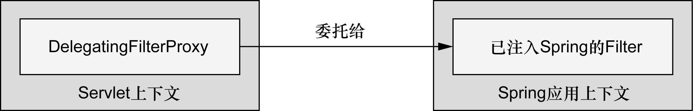
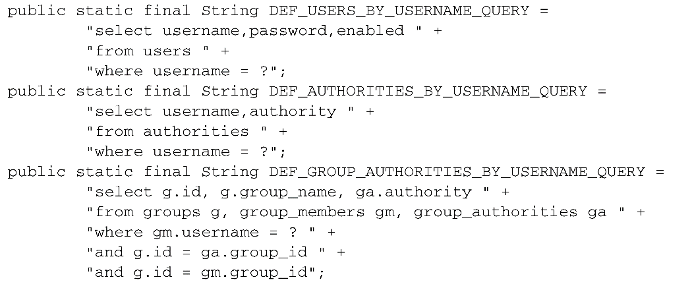
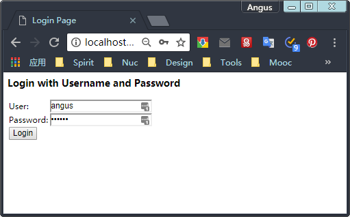

### 9.1 Spring Security简介

Spring Security是为基于Spring的应用程序提供声明式安全保护的安全性框架。Spring Security提供了完整的安全性解决方案，它能够在Web请求级别和方法调用级别处理身份认证和授权。因为基于Spring框架，所以Spring Security充分利用了依赖注入（dependency injection，DI）和面向切面的技术。

#### 9.1.1 理解Spring Security的模块

不管使用Spring Security保护哪种类型的应用程序，第一件需要做的事就是将Spring Security模块添加到应用程序的类路径下。Spring Security 3.2分为11个模块：

| 模块                    | 描述                                                         |
| ----------------------- | ------------------------------------------------------------ |
| ACL                     | 支持通过访问控制列表（access control list，ACL）为域对象提供安全性 |
| 切面（Aspects）         | 一个很小的模块，当使用Spring Security注解时，会使用基于AspectJ的切面，而不是使用标准的Spring AOP |
| CAS客户端（CAS Client） | 提供与Jasig的中心认证服务（Central Authentication Service，CAS）进行集成的功能 |
| 配置（Configuration）   | 包含通过XML和Java配置Spring Security的功能支持               |
| 核心（Core）            | 提供Spring Security基本库                                    |
| 加密（Cryptography）    | 提供了加密和密码编码的功能                                   |
| LDAP                    | 支持基于LDAP进行认证                                         |
| OpenID                  | 支持使用OpenID进行集中式认证                                 |
| Remoting                | 提供了对Spring Remoting的支持                                |
| 标签库（Tag Library）   | Spring Security的JSP标签库                                   |
| Web                     | 提供了Spring Security基于Filter的Web安全性支持               |

应用程序的类路径下至少要包含Core和Configuration这两个模块。Spring Security经常被用于保护Web应用，这显然也是Spittr应用的场景，所以还需要添加Web模块。同时还会用到Spring Security的JSP标签库，所以需要将这个模块也添加进来。

#### 9.1.2 过滤Web请求

Spring Security借助一系列Servlet Filter来提供各种安全性功能，但是不需要在web.xml或WebApplicationInitializer中配置多个Filter，只需配置一个特殊的Filter就可以了。

DelegatingFilterProxy是一个特殊的Servlet Filter，它本身所做的工作并不多。只是将工作委托给一个javax.servlet.Filter实现类，这个实现类作为一个\<bean>注册在Spring应用的上下文中。



如果在web.xml中配置Servlet和Filter的话，可以使用\<filter>元素：

```xml
<filter>
    <!-- 最重要的是<filter-name>设置成了springSecurityFilterChain，
         这是因为马上就会将Spring Security配置在Web安全性之中，
         这里会有一个名为springSecurityFilterChain的Filter bean，
         DelegatingFilterProxy会将过滤逻辑委托给它 -->
    <filter-name>springSecurityFilterChain</filter-name>
    <filter-class>org.springframework.web.filter.DelegatingFilterProxy</filter-class>
</filter>

<filter-mapping>
    <filter-name>springSecurityFilterChain</filter-name>
    <url-pattern>/*</url-pattern>
</filter-mapping>
```

若希望借助WebApplicationInitializer以Java的方式来配置DelegatingFilterProxy的话，那么所需要做的就是创建一个扩展的新类：

```java
package spittr.config;
import org.springframework.security.web.context.AbstractSecurityWebApplicationInitializer;

// AbstractSecurityWebApplicationInitializer实现了WebApplicationInitializer，
// 因此Spring会发现它，并用它在Web容器中注册DelegatingFilterProxy
public class SecurityWebInitializer extends AbstractSecurityWebApplicationInitializer {

}
```

不管通过web.xml还是通过AbstractSecurityWebApplicationInitializer的子类来配置DelegatingFilterProxy，它都会拦截发往应用中的请求，并将请求委托给ID为springSecurityFilterChain bean。

springSecurityFilterChain本身是另一个特殊的Filter，它也被称为FilterChainProxy。它可以链接任意一个或多个其他的Filter。Spring Security依赖一系列Servlet Filter来提供不同的安全特性。当启用Web安全性的时候，会自动创建这些Filter。

#### 9.1.3 编写简单的安全性配置

启用Web安全性功能的最简单配置：

```java
package spittr.config;

import org.springframework.context.annotation.Configuration;
import org.springframework.security.config.annotation.web.configuration.EnableWebSecurity;
import org.springframework.security.config.annotation.web.configuration.WebSecurityConfigurerAdapter;

@Configuration
// @EnableWebSecurity注解将会启用Web安全功能
@EnableWebSecurity
// Spring Security必须配置在一个实现了WebSecurityConfigurer的bean中，或者（简单起见）扩展WebSecurityConfigurerAdapter
public class SecurityConfig extends WebSecurityConfigurerAdapter {
}
```

@EnableWebSecurity可以启用任意Web应用的安全性功能，不过，如果应用碰巧是使用Spring MVC开发的，那么就应该考虑使用@EnableWebMvcSecurity替代它：

```java
@Configuration
// 除了其他的内容以外，@EnableWebMvcSecurity注解还配置了一个Spring MVC参数解析解析器（argument resolver），
// 这样的话处理器方法就能够通过带有@AuthenticationPrincipal注解的参数获得认证用户的principal（或username），
// 它同时还配置了一个bean，在使用Spring表单绑定标签库来定义表单时，
// 这个bean会自动添加一个隐藏的跨站请求伪造（cross-site request forgery，CSRF）token输入域。
@EnableWebMvcSecurity
public class SecurityConfig extends WebSecurityConfigurerAdapter {
}
```

尽管不是严格要求的，但可能希望指定Web安全的细节，这要通过重载WebSecurityConfigurerAdapter中的一个或多个方法来实现。

通过重载WebSecurityConfigurerAdapter的三个configure()方法来配置Web安全性，这个过程中会使用传递进来的参数设置行为：

| 方法                                    | 描述                                    |
| --------------------------------------- | --------------------------------------- |
| configure(WebSecurity)                  | 通过重载，配置Spring Security的Filter链 |
| configure(HttpSecurity)                 | 通过重载，配置如何通过拦截器保护请求    |
| configure(AuthenticationManagerBuilder) | 通过重载，配置user-detail服务           |

默认的configure(HttpSecurity)如下所示：

```java
// 这个简单的默认配置指定了该如何保护HTTP请求，以及客户端认证用户的方案
protected void configure(HttpSecurity http) throws Exception {
    logger.debug("Using default configure(HttpSecurity). If subclassed this will potentially override subclass configure(HttpSecurity).");
    // 通过调用authorizeRequests()和anyRequest().authenticated()
    // 就会要求所有进入应用的HTTP请求都要进行认证
    http
        .authorizeRequests()
        .anyRequest().authenticated()
        .and()
        .formLogin().and()
        .httpBasic();
}
```

为了让Spring Security满足应用的需求，还需要再添加一点配置：

+ 配置用户存储；
+ 指定哪些请求需要认证，哪些请求不需要认证，以及所需要的权限；
+ 提供一个自定义的登录页面，替代原来简单的默认登录页。

### 9.2 选择查询用户详细信息的服务

#### 9.2.1 使用基于内存的用户存储

因为应用中自定义的SecurityConfig安全配置类扩展了WebSecurityConfigurerAdapter，因此配置用户存储的最简单方式就是重载configure()方法，并以AuthenticationManagerBuilder作为传入参数。AuthenticationManagerBuilder有多个方法可以用来配置Spring Security对认证的支持。通过inMemoryAuthentication()方法，可以启用、配置并任意填充基于内存的用户存储。

如下，SecurityConfig重载了configure()方法，并使用两个用户来配置内存用户存储：

```java
package spittr.config;
import org.springframework.context.annotation.Configuration;
import org.springframework.security.config.annotation.authentication.builders.AuthenticationManagerBuilder;
import org.springframework.security.config.annotation.web.configuration.WebSecurityConfigurerAdapter;
import org.springframework.security.config.annotation.web.servlet.configuration.EnableWebMvcSecurity;

@Configuration
@EnableWebMvcSecurity
public class SecurityConfig extends WebSecurityConfigurerAdapter {
    @Override
    protected void configure(AuthenticationManagerBuilder auth) throws Exception {
        auth
            .inMemoryAuthentication() // 启用内存用户存储
            // 调用withUser()方法为内存用户存储添加新的用户，参数是username，
            // withUser()方法返回的是UserDetailsManagerConfigurer.UserDetailsBuilder，
            // 这个对象提供了多个进一步配置用户的方法，
            // 包括设置用户密码的password()方法以及为给定用户授予一个或多个角色权限的roles()方法
            // 
            // 这里添加了两个用户，"user"和"admin"，密码均为"password"，
            // "user"用户具有USER角色，而"admin"用户具有ADMIN和USER两个角色
            .withUser("user").password("password")
            // roles()方法是authorities()方法的简写形式
            // roles()方法所给定的值都会添加一个"ROLE_"前缀，并将其作为权限授予给用户
            .roles("USER") // 等价于.authorities(ROLE_USER)
            // and()方法能够将多个用户的配置连接起来
            .and()
            .withUser("admin").password("password").roles("USER", "ADMIN");
    }
}

```

配置用户详细信息的方法：

| 方法                                          | 描述                       |
| --------------------------------------------- | -------------------------- |
| accountExpired(boolean)                       | 定义账号是否已经过期       |
| accountLocked(boolean)                        | 定义账号是否已经锁定       |
| and()                                         | 用来连接配置               |
| authorities(GrantedAuthority...)              | 授予某个用户一项或多项权限 |
| authorities(List<? extends GrantedAuthority>) | 授予某个用户一项或多项权限 |
| authorities(String...)                        | 授予某个用户一项或多项权限 |
| credentialsExpired(boolean)                   | 定义凭证是否已经过期       |
| disabled(boolean)                             | 定义账号是否已被禁用       |
| password(String)                              | 定义用户的密码             |
| roles(String...)                              | 授予某个用户一项或多项角色 |

#### 9.2.2 基于数据库表进行认证

用户数据通常会存储在关系型数据库中，并通过JDBC进行访问。为了配置Spring Security使用以JDBC为支撑的用户存储，可以使用jdbcAuthentication()方法，所需的最少配置如下：

```java
// 必须要配置一个Datasource，这样才能访问关系型数据库
// dataSource通过自动装配得到
@Autowired
DataSource dataSource;

@Override
protected void configure(AuthenticationManagerBuilder auth) throws Exception {
    auth
        .jdbcAuthentication()
        .dataSource(dataSource);
}
```

**重写默认的用户查询功能**

尽管默认的最少配置能够让一切运转起来，但是它对我们的数据库模式有一些要求。它预期存在某些存储用户数据的表。下面的代码片段来源于Spring Security内部，展现了当查找用户信息时所执行的SQL查询语句：



在第一个查询中，获取了用户的用户名、密码以及是否启用的信息，这些信息会用来进行用户认证。接下来的查询查找了用户所授予的权限，用来进行鉴权，最后一个查询中，查找了用户作为群组的成员所授予的权限。

可能应用的数据库与上面所述并不一致，那么可能希望在查询上有更多的控制权。如果是这样的话，可以按照如下的方式配置自己的查询：

```java
@Override
protected void configure(AuthenticationManagerBuilder auth) throws Exception {
    auth
        .jdbcAuthentication()
        .dataSource(dataSource)
        // 重写了认证和基本权限的查询语句
        // 将默认的SQL查询替换为自定义的设计时，很重要的一点就是要遵循查询的基本协议
        // 所有查询都将用户名作为唯一的参数，
        // 认证查询会选取用户名、密码以及启用状态信息，
        // 权限查询会选取零行或多行包含该用户名及其权限信息的数据，
        // 群组权限查询会选取零行或多行数据，每行数据中都会包含群组ID、群组名称以及权限
        .usersByUsernameQuery(
            "select username, password, true " +
                "from Spitter where username=?")
        .authoritiesByUsernameQuery(
            "select username, 'ROLE_USER' " +
                "from Spitter where username=?")
        .passwordEncoder(new StandardPasswordEncoder("53cr3t"));

}
```

**使用转码后的密码**

如果数据库中的密码进行了转码的话，那么认证就会失败，因为它与用户提交的明文密码并不匹配。为了解决这个问题，需要借助passwordEncoder()方法指定一个密码转码器（encoder）：

```java
@Override
protected void configure(AuthenticationManagerBuilder auth) throws Exception {
    auth
        .jdbcAuthentication()
        .dataSource(dataSource)
        .usersByUsernameQuery(
            "select username, password, true " +
                "from Spitter where username=?")
        .authoritiesByUsernameQuery(
            "select username, 'ROLE_USER' " +
                "from Spitter where username=?")
        // passwordEncoder()方法可以接受Spring Security中PasswordEncoder接口的任意实现
        // Spring Security的加密模块包括了三个这样的实现：
        // BCryptPasswordEncoder、NoOpPasswordEncoder和StandardPasswordEncoder
        // 如果内置的实现无法满足需求时，可以提供自定义的实现
        // 用户在登录时输入的密码会按照相同的算法进行转码，
        // 然后再与数据库中已经转码过的密码进行对比，这个对比是在PasswordEncoder的matches()方法
        .passwordEncoder(new StandardPasswordEncoder("53cr3t"));
}
```

#### 9.2.3 基于LDAP进行认证

为了让Spring Security使用基于LDAP的认证，可以使用ldapAuthentication()方法。这个方法在功能上类似于jdbcAuthentication()，只不过是LDAP版本：

```java
@Override
protected void configure(AuthenticationManagerBuilder auth) throws Exception {
    auth
        .ldapAuthentication()
        // 方法userSearchFilter()和groupSearchFilter()用来为基础LDAP查询提供过滤条件，
        // 它们分别用于搜索用户和组
        .userSearchFilter("(uid={0})")
        .groupSearchFilter("member={0}");
}
```

默认情况下，对于用户和组的基础查询都是空的，也就是表明搜索会在LDAP层级结构的根开始。但是可以通过指定查询基础来改变这个默认行为：

```java
@Override
protected void configure(AuthenticationManagerBuilder auth) throws Exception {
    auth
        .ldapAuthentication()
        // 声明用户应该在名为people的组织单元下搜索而不是从根开始，
        // 而组应该在名为groups的组织单元下搜索
        // userSearchBase()属性为查找用户提供了基础查询
        .userSearchBase("ou=people")
        .userSearchFilter("(uid={0})")
        // groupSearchBase()为查找组指定了基础查询
        .groupSearchBase("ou=groups")
        .groupSearchFilter("member={0}");
}
```

**配置密码比对**

基于LDAP进行认证的默认策略是进行绑定操作，直接通过LDAP服务器认证用户。另一种可选的方式是进行比对操作。这涉及将输入的密码发送到LDAP目录上，并要求服务器将这个密码和用户的密码进行比对。因为比对是在LDAP服务器内完成的，实际的密码能保持私密。

如果希望通过密码比对进行认证，可以通过声明passwordCompare()方法来实现：

```java
@Override
protected void configure(AuthenticationManagerBuilder auth) throws Exception {
    auth
        .ldapAuthentication()
        .userSearchBase("ou=people")
        .userSearchFilter("(uid={0})")
        .groupSearchBase("ou=groups")
        .groupSearchFilter("member={0}")
        .passwordCompare();
}
```

默认情况下，在登录表单中提供的密码将会与用户的LDAP条目中的userPassword属性进行比对。如果密码被保存在不同的属性中，可以通过passwordAttribute()方法来声明密码属性的名称：

```java
@Override
protected void configure(AuthenticationManagerBuilder auth) throws Exception {
    auth
        .ldapAuthentication()
        .userSearchBase("ou=people")
        .userSearchFilter("(uid={0})")
        .groupSearchBase("ou=groups")
        .groupSearchFilter("member={0}")
        .passwordCompare()
        // 指定密码转码器
        // 密码需要通过线路传输到LDAP服务器上，这可能会被黑客所拦截，
        // 为了避免这一点，可以通过调用passwordEncoder()方法指定加密策略。
        .passwordEncoder(new Md5PasswordEncoder())
        // 指定了要与给定密码进行比对的是"passcode"属性
        .passwordAttribute("passcode");
}
```

**引用远程的LDAP服务器**

默认情况下，Spring Security的LDAP认证假设LDAP服务器监听本机的33389端口。但如果LDAP服务器在另一台机器上，那么可以使用contextSource()方法来配置这个地址：

```java
@Override
protected void configure(AuthenticationManagerBuilder auth) throws Exception {
    auth
        .ldapAuthentication()
        .userSearchBase("ou=people")
        .userSearchFilter("(uid={0})")
        .groupSearchBase("ou=groups")
        .groupSearchFilter("member={0}")
        .passwordCompare()
        .passwordEncoder(new Md5PasswordEncoder())
        .passwordAttribute("passcode")
        .and()
        // contextSource()方法会返回一个ContextSourceBuilder对象，
        // 这个对象提供了url()方法用来指定LDAP服务器的地址
        .contextSource().url("ldap://angus.com:389/dc=angus,dc=com")
}
```

**配置嵌入式的LDAP服务器**

Spring Security还为提供了嵌入式的LDAP服务器。不再需要设置远程LDAP服务器的URL，只需通过root()方法指定嵌入式服务器的根前缀就可以了：

```java
@Override
protected void configure(AuthenticationManagerBuilder auth) throws Exception {
    auth
        .ldapAuthentication()
        .userSearchBase("ou=people")
        .userSearchFilter("(uid={0})")
        .groupSearchBase("ou=groups")
        .groupSearchFilter("member={0}")
        // 当LDAP服务器启动时，它会尝试在类路径下寻找LDIF文件来加载数据
        .contextSource().root("dc=angus,dc=com")
        // 如果不想让Spring从整个根路径下搜索LDIF文件的话，
        // 可以通过调用ldif()方法来明确指定加载哪个LDIF文件
        .ldif("classpath:user.ldif");
}
```

#### 9.2.4 配置自定义的用户服务

假设需要认证的用户存储在非关系型数据库中，如Mongo或Neo4j，在这种情况下，需要提供一个自定义的UserDetailsService接口实现。

UserDetailsService接口非常简单：

```java
package spittr.security;
import org.springframework.security.core.GrantedAuthority;
import org.springframework.security.core.authority.SimpleGrantedAuthority;
import org.springframework.security.core.userdetails.User;
import org.springframework.security.core.userdetails.UserDetails;
import org.springframework.security.core.userdetails.UserDetailsService;
import org.springframework.security.core.userdetails.UsernameNotFoundException;
import spittr.Spitter;
import spittr.data.SpitterRepository;
import java.util.ArrayList;
import java.util.List;


public class SpitterUserService implements UserDetailsService {

    private final SpitterRepository spitterRepository;

    // 注入SpitterRepository
    // SpitterUserService有意思的地方在于它并不关心用户数据存储在什么地方
    // SpitterRepository能够从关系型数据库、文档数据库或图数据中查找Spitter对象
    public SpitterUserService(SpitterRepository spitterRepository) {
        this.spitterRepository = spitterRepository;
    }

    // 实现loadUserByUsername()方法，根据给定的用户名来查找用户，返回代表给定用户的UserDetails对象
    @Override
    public UserDetails loadUserByUsername(String username) throws UsernameNotFoundException {
        // 查找Spitter
        Spitter spitter = spitterRepository.findByUsername(username);
        if (spitter != null) {
            // 创建权限列表
            List<GrantedAuthority> authorities = new ArrayList<>();
            authorities.add(new SimpleGrantedAuthority("ROLE_SPITTER"));
            // 返回User
            // 获得Spitter对象，并使用它来创建User对象（User是UserDetails的具体实现。）
            // 还可以修改Spitter，让其实现UserDetails，这样loadUserByUsername()就能直接返回Spitter对象
            return new User(spitter.getUsername(), spitter.getPassword(), authorities);
        }
        throw new UsernameNotFoundException("User '" + username + "' not found.");
    }
}
```

为了使用SpitterUserService来认证用户，可以通过userDetailsService()方法将其设置到安全配置中：

```java
@Autowired
SpitterRepository spitterRepository;

@Override
protected void configure(AuthenticationManagerBuilder auth) throws Exception {
    auth
        // userDetailsService()方法（类似于jdbcAuthentication()、
        // ldapAuthentication以及inMemoryAuthentication()）会配置一个用户存储
        .userDetailsService(new SpitterUserService(spitterRepository));
}
```

### 9.3 拦截请求

在任何应用中，并不是所有的请求都需要同等程度地保护。有些请求需要认证，而另一些可能并不需要。有些请求可能只有具备特定权限的用户才能访问，没有这些权限的用户会无法访问。

对每个请求进行细粒度安全性控制的关键在于重载configure(HttpSecurity)方法，它为不同的URL路径有选择地应用安全性：

```java
@Override
protected void configure(HttpSecurity http) throws Exception {
    // configure()方法中得到的HttpSecurity对象可以在多个方面配置HTTP的安全性
    // 调用authorizeRequests()方法所返回的对象的方法来配置请求级别的安全性细节
    http.authorizeRequests()
        // 调用antMatchers()指定了对“/spitters/me”路径的请求需要进行认证
        .antMatchers("/spitters/me").authenticated()
        // 调用antMatchers()说明对“/spittles”路径的HTTP POST请求必须要经过认证
        // antMatchers()方法中设定的路径支持Ant风格的通配符
        .antMatchers(HttpMethod.POST, "/spittles/**")
        // 通过authenticated()和permitAll()来定义该如何保护路径
        // authenticated()要求在执行该请求时，必须已经登录了应用
        // 如果用户没有认证的话，Spring Security的Filter将会捕获该请求，
        // 并将用户重定向到应用的登录页面
        .authenticated()
        // permitAll()方法允许请求没有任何的安全限制
        .anyRequest().permitAll();
}
```

Ant通配符有三种： 

| 通配符 | 说明                  |
| ------ | --------------------- |
| ?      | 匹配任何单字符        |
| *      | 匹配0或任意数量的zifu |
| **     | 匹配0或更多的目录     |

除了authenticated()和permitAll()以外，还有其他的一些方法能够用来定义该如何保护请求：

| 方法                       | 作用                                                         |
| -------------------------- | ------------------------------------------------------------ |
| access(String)             | 如果给定的SpEL表达式计算结果为true，就允许访问               |
| anonymous()                | 允许匿名用户访问                                             |
| authenticated()            | 允许认证过的用户访问                                         |
| denyAll()                  | 无条件拒绝所有访问                                           |
| fullyAuthenticated()       | 如果用户是完整认证的话（不是通过Remember-me功能认证的），就允许访问 |
| hasAnyAuthority(String...) | 如果用户具备给定权限中的某一个的话，就允许访问               |
| hasAnyRole(String...)      | 如果用户具备给定角色中的某一个的话，就允许访问               |
| hasAuthority(String)       | 如果用户具备给定权限的话，就允许访问                         |
| hasIpAddress(String)       | 如果请求来自给定IP地址的话，就允许访问                       |
| hasRole(String)            | 如果用户具备给定角色的话，就允许访问                         |
| not()                      | 对其他访问方法的结果求反                                     |
| permitAll()                | 无条件允许访问                                               |
| rememberMe()               | 如果用户是通过Remember-me功能认证的，就允许访问              |

可以修改之前的configure()方法，要求用户不仅需要认证，还要具备ROLE_SPITTER权限：

```java
@Override
protected void configure(HttpSecurity http) throws Exception {
    http.authorizeRequests()
        // 很重要的一点就是将最为具体的请求路径放在前面，
        // 而最不具体的路径（如anyRequest()）放在最后面（方法覆盖）
        .antMatchers("/spitters/me").hasAnyAuthority("ROLE_SPITTER")
        .antMatchers(HttpMethod.POST, "/spittles").hasAnyAuthority("ROLE_SPITTER")
        .anyRequest().permitAll();
}

// 还可以使用hasRole()方法，它会自动使用“ROLE_”前缀
@Override
protected void configure(HttpSecurity http) throws Exception {
    http.authorizeRequests()
        .antMatchers("/spitters/me").hasRole("SPITTER")
        .antMatchers(HttpMethod.POST, "/spittles").hasRole("SPITTER")
        .anyRequest().permitAll();
}
```

#### 9.3.1 使用Spring表达式进行安全保护

借助access()方法，也可以将SpEL作为声明访问限制的一种方式。例如，如下就是使用SpEL表达式来声明具有“ROLE_SPITTER”角色才能访问“/spitter/me”URL：

```java
// 如果当前用户被授予了给定角色的话，那hasRole()表达式的计算结果就为true
.antMatchers("/spitters/me").access("hasRole('ROLE_SPITTER')")
```

Spring Security通过一些安全性相关的表达式扩展了Spring表达式语言：

| 安全表达式                | 计算结果                                                     |
| ------------------------- | ------------------------------------------------------------ |
| authentication            | 用户的认证对象                                               |
| denyAll                   | 结果始终为false                                              |
| hasAnyRole(list of roles) | 如果用户被授予了列表中任意的指定角色，结果为true             |
| hasRole(role)             | 如果用户被授予了指定的角色，结果为true                       |
| hasIpAddress(IP Address)  | 如果请求来自指定IP的话，结果为true                           |
| isAnonymous()             | 如果当前用户为匿名用户，结果为true                           |
| isAuthenticated()         | 如果当前用户进行了认证的话，结果为true                       |
| isFullyAuthenticated()    | 如果当前用户进行了完整认证的话（不是通过Remember-me功能进行的认证），结果为true |
| isRememberMe()            | 如果当前用户是通过Remember-me自动认证的，结果为true          |
| permitAll                 | 结果始终为true                                               |
| principal                 | 用户的principal对象                                          |

如果想限制“/spitter/me” URL的访问，不仅需要ROLE_SPITTER，还需要来自指定的IP地址，那么可以按照如下的方式调用access()方法：

```java
.antMatchers("/spitters/me").access("hasRole('ROLE_SPITTER') and hasIpAddress('192.168.1.2')")
```

#### 9.3.2 强制通道的安全性

为了保证注册表单的数据通过HTTPS传送，我们可以在配置中添加requiresChannel()方法：

```java
@Override
protected void configure(HttpSecurity http) throws Exception {
    http.authorizeRequests()
        .antMatchers("/spitters/me").hasRole("SPITTER")
        .antMatchers(HttpMethod.POST, "/spittles").hasRole("SPITTER")
        .anyRequest().permitAll()
        .and()
        // 不论何时，只要是对“/spitter/form”的请求，Spring Security都视为
        // 需要安全通道（通过调用requiresChannel()确定的）并自动将请求重定向到HTTPS上
        .requiresChannel()
        .antMatchers("/spitter/form").requiresSecure() // 需要HTTPS
        // 与之相反，有些页面（例如首页）并不需要通过HTTPS传送
        .antMatchers("/").requiresInsecure();
}
```

#### 9.3.3 防止跨站请求伪造

跨站请求伪造（cross-site request forgery，CSRF）：跨站请求攻击，简单地说，是攻击者通过一些技术手段欺骗用户的浏览器去访问一个自己曾经认证过的网站并执行一些操作（如发邮件，发消息，甚至财产操作如转账和购买商品）。由于浏览器曾经认证过，所以被访问的网站会认为是真正的用户操作而去执行。这利用了web中用户身份验证的一个漏洞：**简单的身份验证只能保证请求发自某个用户的浏览器，却不能保证请求本身是用户自愿发出的**。 

Spring Security通过一个同步token的方式来实现CSRF防护的功能。它将会拦截状态变化的请求（例如，非GET、HEAD、OPTIONS和TRACE的请求）并检查CSRF token。如果请求中不包含CSRF token的话，或者token不能与服务器端的token相匹配，请求将会失败，并抛出CsrfException异常。

这意味着在应用中，所有的表单必须在一个“_csrf”域中提交token，而且这个token必须要与服务器端计算并存储的token一致，这样的话当表单提交的时候，才能进行匹配。

好消息是Spring Security已经简化了将token放到请求的属性中这一任务。如果使用Thymeleaf作为页面模板的话，只要\<form>标签的action属性添加了Thymeleaf命名空间前缀，那么就会自动生成一个“_csrf”隐藏域：

```html
<form method="POST" th:object="${spitter}" th:action="@{/spitter/register}">
    ...
</form>
```

如果使用JSP作为页面模板的话，要做的事情非常类似：

```jsp
<input type="hidden" name="${_csrf.parameterName}" value="_csrf.token"/>
```

更好的功能是，如果使用Spring的表单绑定标签的话，\<sf:form>标签会自动为我们添加隐藏的CSRF token标签。

处理CSRF的另外一种方式就是根本不去处理它。可以在配置中通过调用csrf().disable()禁用Spring Security的CSRF防护功能，如下：

```java
@Override
protected void configure(HttpSecurity http) throws Exception {
    http
        ...
        .csrf()
        // 禁用CSRF防护功能
        // CSRF功能被禁用，应用会面临风险
        .disable(); 
}
```

### 9.4 认证用户

一旦重写了configure(HttpSecurity)方法，就失去了Spring Security默认的简单登录页面。需要找回该功能时，所需要做的就是在configure(HttpSecurity)方法中，调用formLogin()方法。

```java
@Override
protected void configure(HttpSecurity http) throws Exception {
    http
        .formLogin() // 启用默认的登录页
        .and()
        .authorizeRequests()
        .antMatchers("/spitters/me").hasRole("SPITTER")
        .antMatchers(HttpMethod.POST, "/spittles").hasRole("SPITTER")
        .anyRequest().permitAll()
        .and()
        .requiresChannel()
        .antMatchers("/spitter/form").requiresSecure();
}
```



#### 9.4.1 添加自定义的登录页

Spring Security默认登录页面的HTML源码：

```html
<html>
    <head>
        <title>Login Page</title>
    </head>
    <body onload='document.f.username.focus();'>
        <h3>Login with Username and Password</h3>
        <!-- <from>d的action属性是一个关键属性，指明了提交到的地方"/login"（相对于上下文地址） -->
        <form name='f' action='/login' method='POST'>
            <table>
                <!-- 在自定义的登陆页面中，也需要username和password输入域 -->
                <tr>
                    <td>User:</td><td><input type='text' name='username' value=''></td>
                </tr>
                <tr>
                    <td>Password:</td><td><input type='password' name='password'/></td>
                </tr>
                <tr>
                    <td colspan='2'><input name="submit" type="submit" value="Login"/></td>
                </tr>
                <!-- 假设没有禁用CSRF，还需要保证包含了CSRF token的"_csrf"输入域 -->
                <input name="_csrf" type="hidden" value="a8a8bf0b-443c-48d2-8bee-e72e57b50e53" />
            </table>
        </form>
    </body>
</html>
```

为Spittr应用编写的自定义登录页（以Thymeleaf模板的形式）：

```html
<html xmlns="http://www.w3.org/1999/xhtml"
      xmlns:th="http://www.thymeleaf.org">
    <head>
        <title>Spitter</title>
        <link rel="stylesheet" type="text/css" th:href="@{/resources/style.css}" />
    </head>
    <body onload='document.f.username.focus();'>
        <div id="header" th:include="page :: header"></div>
        <div id="content">
            <a th:href="@{/spitter/register}">Register</a>
            <!-- 提交到"/login" -->
            <!-- 因为这是一个Thymeleaf模板，因此隐藏的“_csrf”域将会自动添加到表单中 -->
            <form name='f' th:action='@{/login}' method='POST'>
                <table>
                    <!-- 包含了username和password输入域，就像默认的登录页一样 -->
                    <tr>
                        <td>User:</td><td><input type='text' name='username' value=''/></td>
                    </tr>
                    <tr>
                        <td>Password:</td><td><input type='password' name='password'/></td>
                    </tr>
                    <tr>
                        <td colspan='2'>
                            <input id="remember_me" name="remember-me" type="checkbox"/>
                            <label for="remember_me" class="inline">Remember me</label>
                        </td>
                    </tr>
                    <tr>
                        <td colspan='2'>
                            <input name="submit" type="submit" value="Login"/>
                        </td>
                    </tr>
                </table>
            </form>
        </div>
        <div id="footer" th:include="page :: copy"></div>
    </body>
</html>

```

#### 9.4.2 启用HTTP Basic认证

当应用程序的使用者是另外一个应用程序的话，使用表单来提示登录的方式就不太适合了。HTTP Basic认证（HTTP Basic Authentication）会直接通过HTTP请求本身，对要访问应用程序的用户进行认证。本质上，这是一个HTTP 401响应，表明必须要在请求中包含一个用户名和密码。在REST客户端向它使用的服务进行认证的场景中，这种方式比较适合。

如果要启用HTTP Basic认证的话，只需在configure()方法所传入的HttpSecurity对象上调用httpBasic()即可。另外，还可以通过调用realmName()方法指定域：

```java
@Override
protected void configure(HttpSecurity http) throws Exception {
    http
        .formLogin()
        .loginPage("/login")
        .and()
        .httpBasic()
        .realmName("Spitter")
        ...
}
```

#### 9.4.3 启用Remember-me功能

许多站点提供了Remember-me功能，只要登录过一次，应用就会记住，当再次回到应用的时候就不需要登录了。

Spring Security使得为应用添加Remember-me功能变得非常容易。为了启用这项功能，只需在configure()方法所传入的HttpSecurity对象上调用rememberMe()即可：

```java
@Override
protected void configure(HttpSecurity http) throws Exception {
    http
        .formLogin()
            .loginPage("/login")
        .and()
        // 启用Remember-me功能
        .rememberMe()
            // 默认情况下，这个功能是通过在cookie中存储一个token完成的，
            // 这个token最多两周内有效，可以通过tokenValiditySeconds()方法自定义
            .tokenValiditySeconds(2519200)
            // 存储在cookie中的token包含用户名、密码、过期时间和一个私钥，
            // 在写入cookie前都进行了MD5哈希；
            // 默认情况下，私钥的名为SpringSecured，
            // 但在这里将其设置为spitterKey，使它专门用于Spittr应用。
            .key("spitterKey")
        ...
}
```

Remember-me功能已经启用，需要有一种方式来让用户表明他们希望应用程序能够记住他们。为了实现这一点，登录请求必须包含一个名为remember-me的参数。在登录表单中，增加一个简单复选框就可以完成这件事情：

```html
<input id="remember_me" name="remember-me" type="checkbox"/>
<label for="remember_me" class="inline">Remember me</label></td></tr>
```

#### 9.4.4 退出

退出功能是通过Servlet容器中的Filter实现的（默认情况下），这个Filter会拦截针对“/logout”的请求。因此，为应用添加退出功能只需添加如下的链接即可（如下以Thymeleaf代码片段的形式进行了展现）：

```html
<!-- 当用户点击这个链接的时候，会发起对“/logout”的请求，
     这个请求会被Spring Security的LogoutFilter所处理 -->
<a th:href="@{/logout}">Logout</a>
```

用户会退出应用，所有的Remember-me token都会被清除掉。在退出完成后，用户浏览器将会重定向到“/login?logout”，从而允许用户进行再次登录。如果希望用户被重定向到其他的页面，那么可以在configure()中进行如下的配置：

```java
@Override
protected void configure(HttpSecurity http) throws Exception {
    http
        .formLogin()
        .loginPage("/login")
        .and()
        // logout()提供了配置退出行为的方法
        .logout()
        // 调用logoutSuccessUrl()表明在退出成功之后，浏览器需要重定向到"/"
        .logoutSuccessUrl("/")
        ...
}
```

### 9.5 保护视图

保护视图即是通过安全限制和相关的信息，根据用户的权限，有条件的渲染视图。

#### 9.5.1 使用Spring Security有的JSP标签库

Spring Security通过JSP标签库在视图层上支持安全性：

| JSP标签                       | 作用                                                         |
| ----------------------------- | ------------------------------------------------------------ |
| \<security:accesscontrollist> | 如果用户通过访问控制列表授予了指定的权限，那么渲染该标签体中的内容 |
| \<security:authentication>    | 渲染当前用户认证对象的详细信息                               |
| \<security:authorize>         | 如果用户被授予了特定的权限或者SpEL表达式的计算结果为true，那么渲染该标签体中的内容 |

为了使用JSP标签库，需要在对应的JSP中声明它：

```jsp
<%@ taglib uri="http://www.springframework.org/security/tags" prefix="security"%>
```

**访问认证信息的细节**

借助Spring Security JSP标签库，所能做到的最简单的一件事情就是便利地访问用户的认证信息。例如，对于Web站点来讲，在页面顶部以用户名标示显示“欢迎”或“您好”信息是很常见的。这恰恰是\<security:authentication>所做的事情：

```jsp
<%-- 渲染的是principal属性中嵌套的username属性 --%>
Hello <security:authentication property="principal.username" />!
```

property用来标示用户认证对象的一个属性。可用的属性取决于用户认证的方式。在不同的认证方式下，有几个通用的属性：

| 认证属性    | 描述                                             |
| ----------- | ------------------------------------------------ |
| authorities | 一组用于表示用户所授予权限的GrantedAuthority对象 |
| Credentials | 用于核实用户的凭证（通常，这会是用户的密码）     |
| details     | 认证的附加信息（IP地址、证件序列号、会话ID等）   |
| principal   | 用户的基本信息对象                               |

\<security:authentication>将在视图中渲染属性的值，也可以将其赋值给一个变量，只需要在var属性中指明变量的名字即可：

```jsp
<%-- 指明将属性设置给loginId的属性 --%>
<security:authentication property="principal.username" var="loginId"/>

<%-- 变量默认是定义在页面作用域内的，可以通过scope属性设置其作用域 --%>
<security:authentication property="principal.username" var="loginId" scope="request"/>
```

**条件性的渲染内容**

Spring Security的\<security:authorize>JSP标签能够根据用户被授予的权限有条件地渲染页面的部分内容。例如，在Spittr应用中，对于没有ROLE_SPITTER角色的用户，不会为其显示添加新Spittle记录的表单：

```jsp
<%-- 只有在具有ROLE_SPITTER权限时才会渲染表单 --%>
<%-- access属性被赋值为一个SpEL表达式，
     这个表达式的值将确定<security: authorize>标签主体内的内容是否渲染 --%>
<security:authorize access="hasRole('ROLE_SPITTER')">
    <s:url value="/spittles" var="spittlr_url"/>
    <sf:form modelAttribute="spittle" action="${spittlr_url}">
        <sf:label path="text">
            <s:message code="label.spittle" text="Enter spittle"/>
        </sf:label>
        <sf:textarea path="text" rows="2" clos="40"/>
        <sf:errors path="text"/>
        <br/>
        <div class="spitItSubmitIt">
            <input type="submit" value="Spit it!" class="status-btn round-btn disabled">
        </div>
    </sf:form>
</security:authorize>
```

借助Spring Security所提供的SpEL表达式，可以构造出非常有意思的安全性约束。假设应用中有一些管理功能只能对用户名为Angus的用户可用，那可以这样使用isAuthenticated()和principal表达式：

```jsp
<security:authorize access="isAuthenticated() and principal.username='Angus'">
    <a href="/admin">Administration</a>
</security:authorize>
```

当然虽然视图不会渲染这个链接，但是还要防止用户手动输入，所以需要在安全配置中，添加限制：

```java
.authorizeRequests()
    .antMatchers("/admin")
    .access("isAuthenticated() and principal.username='Angus'")
```

不过以上两个地方的配置可以简化（去掉重复配置），这是\<security:authorize>的url属性所要做的事情。它不像access属性那样明确声明安全性限制，url属性对一个给定的URL模式会间接引用其安全性约束。假设已经在Spring Security配置中为“/admin”声明了安全性约束，所以可以这样使用url属性：

```jsp
<%-- 只在一个地方配置了表达式（安全配置中），但是在两个地方进行了应用 --%>
<%-- 只有基本信息中用户名为"Angus"的已认证用户才能访问"/admin" URL，
     所以只有满足以上条件，<security:authorize>标签主体中的内容才会被渲染 --%>
<security:authorize url="/admin">
    <s:url value="/admin" var="admin_url" />
    <a href="${admin_url}"/>
</security:authorize>
```

#### 9.5.2 使用Thymeleaf的Spring Security方言

与Spring Security的JSP标签库类似，Thymeleaf的安全方言提供了条件化渲染和显示认证细节的能力：

| 属性               | 作用                                                         |
| ------------------ | ------------------------------------------------------------ |
| sec:authentication | 渲染认证对象的属性。类似于Spring Security的\<sec:authentication/>JSP标签 |
| sec:authorize      | 基于表达式的计算结果，条件性的渲染内容。类似于Spring Security的\<sec:authorize/>JSP标签 |
| sec:authorize-acl  | 基于表达式的计算结果，条件性的渲染内容。类似于Spring Security的\<sec:accesscontrollist/> JSP标签 |
| sec:authorize-expr | sec:authorize属性的别名                                      |
| sec:authorize-url  | 基于给定URL路径相关的安全规则，条件性的渲染内容。类似于Spring Security的\<sec:authorize/> JSP标签使用url属性时的场景 |

为了使用安全方言，需要确保Thymeleaf Extras Spring Security已经位于应用的类路径下。然后，还需要在配置中使用SpringTemplateEngine来注册SpringSecurity Dialect。一下程序所展现的@Bean方法声明了SpringTemplateEngine bean，其中就包含了SpringSecurityDialect：

```java
@Bean
public SpringTemplateEngine templateEngine(TemplateResolver templateResolver){
    SpringTemplateEngine templateEngine = new SpringTemplateEngine();
    templateEngine.setTemplateResolver(templateResolver);
    templateEngine.addDialect(new SpringSecurityDialect());
    return templateEngine;
}
```

安全方言注册完成之后，就可以在Thymeleaf模板中使用它的属性了。首先，需要在使用这些属性的模板中声明安全命名空间：

```html
<!-- 安全方言则设置为使用sec前缀 -->
<html xmlns="http://www.w3.org/1999/xhtml"
      xmlns:th="http://www.thymeleaf.org"
      xmlns:sec="http://www.thymeleaf.org/thymeleaf-extras-springsecurity3">
    ...
</html>
```

假设我要为认证用户渲染"Hello"文本。如下的Thymeleaf模板代码片段就能完成这项任务：

```html
<!-- sec:authorize属性会接受一个SpEL表达式，
     如果表达式的计算结果为true，那么元素的主体内容就会渲染 -->
<div sec:authorize="isAuthenticated()">
    Hello <span sec:authentication="name">someone</span>
</div>

<!-- 类似JSP中一样，可以通过sec:authorize-url属性
     基于给定URL的权限（结合安全配置）有条件地渲染内容 -->
<!-- 如果用户有权限访问"/admin"的话，那么到管理页面的链接就会渲染，
     否则的话，这个链接将不会渲染 -->
<span sec:authorize-url="/admin">
    <a th:href="@{/admin}">Admin</a>
</span>
```

### 9.6 小结

Spring Security提供了一种简单、灵活且强大的机制来保护用户的应用程序。

借助于一系列Servlet Filter，Spring Security能够控制对Web资源的访问，包括Spring MVC控制器。借助于Spring Security的Java配置模型，不必直接处理Filter，能够非常简洁地声明Web安全性功能。

当认证用户时，Spring Security提供了多种选项。基于内存用户库、关系型数据库和LDAP目录服务器来配置认证功能或者创建和配置自定义的用户服务。


