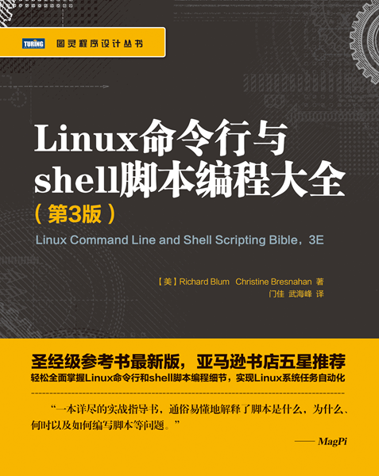

## Linux Command Line and Shell Scripting Bible

> 记录学习**Linux**的历程，参考自书籍[《Linux Command Line and Shell Scripting Bible, 3E》](https://book.douban.com/subject/26854226/)。
>
> 下载链接：<http://readfree.me/book/26854226/>

 

## 目录

- [第01章_初始Linux_shell](第01章_初始Linux_shell.md )
- [第02章_走进shell](第02章_走进shell.md)
- [第03章_基本的bash_shell命令](第03章_基本的bash_shell命令.md)
- [第04章_更多的bash_shell命令](第04章_更多的bash_shell命令.md)
- [第05章_理解shell](第05章_理解shell.md)
- [第06章_使用Linux环境变量](第06章_使用Linux环境变量.md)
- [第07章_理解Linux文件权限](第07章_理解Linux文件权限.md)
- [第08章_管理文件系统](第08章_管理文件系统.md)
- [第09章_安装软件程序](第09章_安装软件程序.md)
- [第10章_使用编辑器](第10章_使用编辑器.md)
- [第11章_构建基本脚本](第11章_构建基本脚本.md)
- [第12章_使用结构化命令](第12章_使用结构化命令.md)
- [第13章_更多的结构化命令](第13章_更多的结构化命令.md)
- [第14章_处理用户输入](第14章_处理用户输入.md)
- [第15章_呈现数据](第15章_呈现数据.md)
- [第16章_控制脚本](第16章_控制脚本.md)
- [第17章_创建函数](第17章_创建函数.md)

