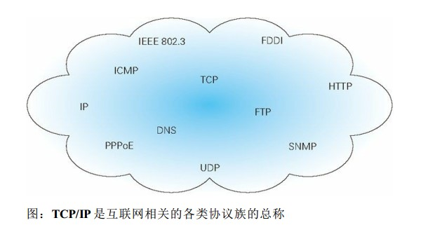
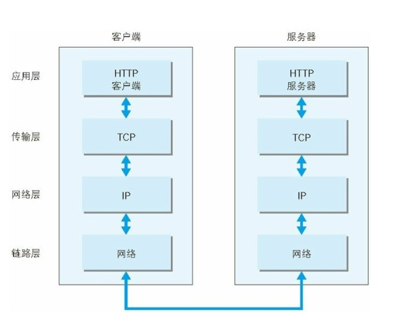
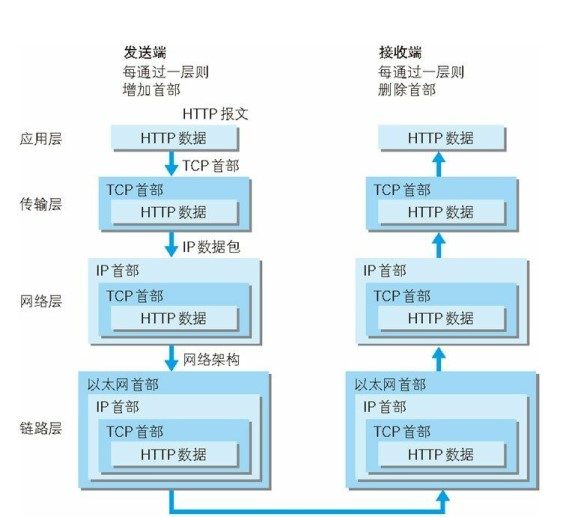
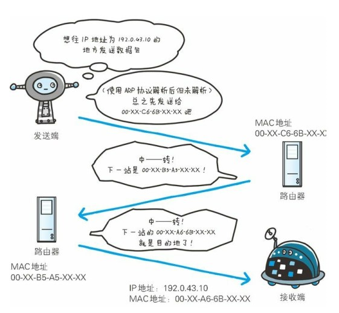
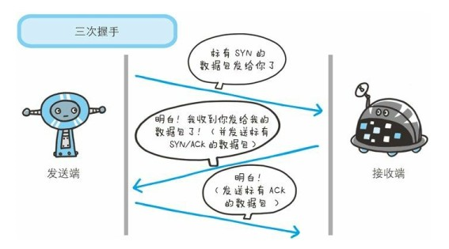
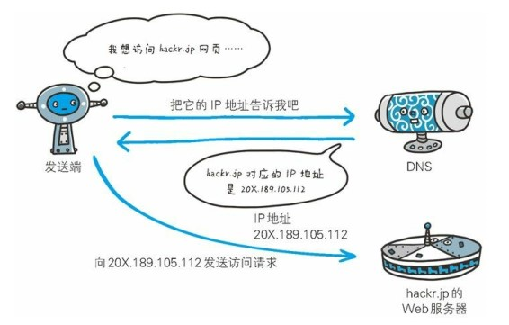
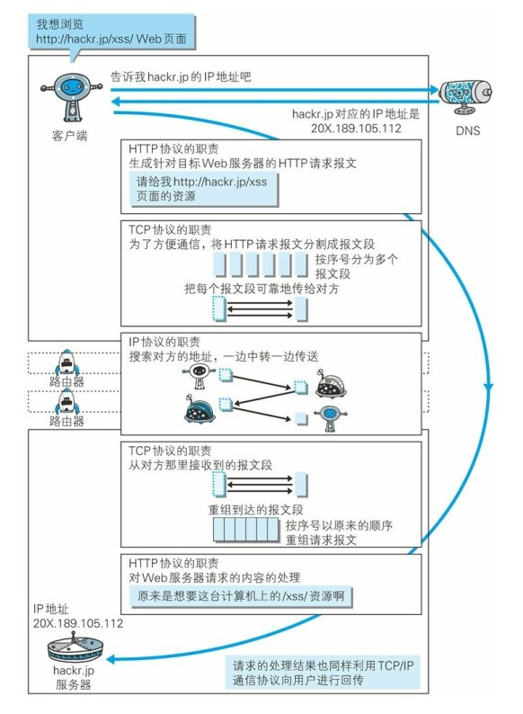
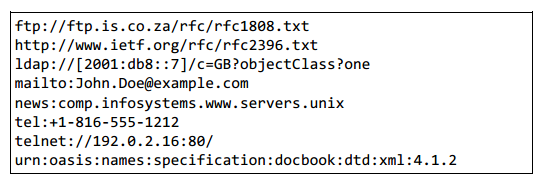
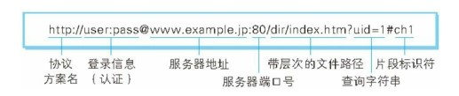

# 1.1 使用HTTP协议访问Web

Web使用的是一种名为HTTP（HyperText Transfer Protocol，超文本传输协议）的协议作为规范，完成从客户端到服务器端等一系列运作流程。而协议是指规则的约定。可以说，Web是建立在HTTP协议上通信的。

# 1.2 HTTP的诞生

## 1.2.1 为知识共享而规划Web

(1) 1989年3月，HTTP诞生。CERN（Conseil Europeen pour la Recherche Nucleaire，欧洲核子研究委员会）的蒂姆 • 伯纳斯 - 李（ Tim BernersLee）博士提出了一种能让远隔两地的研究者们共享知识的设想。

(2) 现在已提出了3项WWW构建技术，分别是：把SGML（Standard Generalized Markup Language，标准通用语言）作为页面的文本标记语言的HTML（HyperText Markup Language，超文本标记语言）；作为文档传递协议的HTTP；指定文档所在地址的URL（Uniform Resource Locator，统一资源定位符）。

(3) WWW这一名称，是Web浏览器当年用来浏览超文本的客户端应用程序时的名称。现在则用来表示这一系列的集合，也可简称为Web。

## 1.2.2 Web成长时代

1990年11月，CERN成功研发了世界第一台Web服务器和Web浏览器。

1993年1月，现代浏览器的祖先NCSA（National Center for Supercomputer Applications，美国国家超级计算机应用中心） 研发的Mosaic问世。

1992年12月，网景通信公司发布了Netscape Navigator 1.0。

1995年，微软公司发布Internet Explorer 1.0和2.0。

紧随其后的是现在已然成为Web服务器标准之一的Apache，当时它以Apache0.2的姿态出现在世人面前。HTML也发布了2.0版本。

从1995年左右起，微软公司与网景通信公司之间爆发的浏览器大战愈演愈烈。两家公司都对HTML做了扩展，于是导致今天在写HTML页面时，必须考虑兼容他们两家公司的浏览器。

2000年前后，这场浏览器大战随着网景公司的衰落而暂告一段落。

2004年，Mozilla基金会发布了Firefox浏览器，第二次浏览器大战随即爆发。

## 1.2.3 驻足不前的HTTP

(1) HTTP/0.9

HTTP于1990年问世，那时的HTTP并没有作为正式的标准被建立，此时的HTTP其实含有HTTP1.0之前版本的意思。

(2) HTTP/1.0

HTTP正式作为标准被公布是在1996年的5月，版本被命名为HTTP/1.0，并记载于RFC1945。虽说是初期标准，但该协议标准至今仍被广泛使用在服务器端。

(3) HTTP/1.1

1997年1月公布的HTTP/1.1是目前主流的HTTP协议版本。当初的标准是RFC2068，之后发布的修订版RFC2616就是当前的最新版本。

# 1.3 网络基础TCP/IP

通常使用的网络（包括互联网）是在TCP/IP协议族的基础上运作的。HTTP是它的一个子集。

## 1.3.1 TCP/IP协议族

(1) 计算机与网络设备之间要相互通信，双方就必须基于相同的方法。不同的硬件、操作系统之间的通信，所有的一切都需要一种规则。而我们就把这种规则称为协议（protocol）。

(2) 协议中存在各式各样的内容。从电缆的规格到IP地址的选定方法、寻找异地用户的方法、双方建立通信的顺序。以及Web页面显示需要处理的步骤，等等。

(3) 把与互联网相关联的协议集合起来总称为TCP/IP。（也有说TCP/IP是指TCP和IP这两种协议，或是在IP协议通信的过程中，用到的协议族的统称）。

## 1.3.2 TCP/IP的分层管理

(1) TCP/IP协议族里重要的一点就是分层。TCP/IP协议族按层次分别分为以下4层：应用层、传输层、网络层和数据链路层。

(2) TCP/IP协议族各层的作用如下：

① 应用层

应用层决定了向用户提供应用服务时的通信的活动。TCP/IP协议族内预存了各类通信的应用服务。比如，FTP（File Transfer Protocol，文件传输协议）和DNS（Domain Name System，域名系统）。HTTP协议也处于该层。

② 传输层

传输层对上层应用层，提供处于网络连接中的两台计算机之间的数据传输。在传输层有两个性质不同的协议：TCP（Transmission Control Protocol，传输控制协议）和UDP（User Data Protocol，用户数据报协议）。

③ 网络层（又名网络互连层）

网络层用来处理网络上流动的数据包。数据包是网络传输的最小数据单位。该层规定了通过怎样的路径（所谓的传输路线）达到对方计算机，并把数据包传送给对方。与对方计算机之间通过多台计算机或网络设备进行传输时，网络层所起的作用就是在众多的选项内选择一条传输路线。

④ 链路层（又名数据链路层，网路接口层）

用来处理链接网络的硬件部分。包括控制操作系统、硬件的设备驱动、NIC（Network Interface Card，网络适配器，既即网卡），及光纤等物理可见部分（还包括连接器等一切传输媒介）。硬件的范畴均在链路层的作用范围之内。

## 1.3.3 TCP/IP通信传输流

(1) 利用TCP/IP协议进行网络通信时，会通过分层顺序与对方进行通信，发送端从应用层往下走，接收端则从链路层往上走。

(2) 发送端在层与层之间传输数据时，每经过一层必定会打上一个该层所属的首部信息。反之，接收端在层与层之间传输数据时，每经过一层会把对应的首部去掉。

(3) 这种把数据信息包装起来的做法称为封装（encapsulate）。

# 1.4 与HTTP关系密切的协议：IP、TCP和DNS

## 1.4.1 负责传输的IP协议

(1) 按层次分,IP（Internet Protocol）网际协议位于网络层。几乎所有使用网络系统的协议都会用到IP协议，协议名称中占据了一半位置。

(2) IP协议的作用是把各种数据包传送给对方。要确实传送到对方，需要满足各类条件。其中两个重要的条件就是IP地址和MAC地址（Media Access Control Address 介质访问控制地址）。

(3) IP地址指明了节点被分配到的地址，MAC地址是指网卡所属的固定地址。IP地址可以和MAC地址进行配对。IP地址可以变换，但MAC地址基本不会更改。

(4) 使用ARP协议凭借MAC地址进行通信。IP间的通信依赖MAC地址。计算机之间通信时需要进行中转时，会利用下一站中转设备的MAC地址来搜索下一个中转目标。这时会采用ARP（Address Resolution Protocol）协议。ARP协议是一种用以解析地址的协议，根据通信双方的IP地址就可以反查出对应的MAC地址。

(5) 没有人能够全面掌握互联网中的传输状况。在到达通信目标前的中转过程中，那些计算机和路由器等网络设备只能获悉很粗略的传输路线。这种机制称为路由选择（routing）。

## 1.4.2 确保可靠性的TCP协议

(1) 按层次分，TCP处于传输层，提供可靠的字节流服务。

所谓的字节流服务（Byte Stream Service）是指，为了方便传输，将大块数据分割成以报文段（segment，段）为单位的数据包进行管理。而可靠的传输服务是指，能够准确可靠的传输给对方。

(2) 确认数据能到达目标

为了准确无误的将数据送达目标处，TCP协议采用了三次握手（three-way handshaking）策略。用TCP协议把数据包送出去后，TCP会向对方确认是否成功送达。握手过程中使用了TCP的标志（flag）——SYN（synchronize，同步）和ACK（acknowledge，应答）。

(3) 三次握手过程

发送端首先发送一个带有SYN标志的数据包给对方。接收端收到后，回传一个带有SYN/ACK标志的数据包以示传达确认消息。最后，发送端在回传一个带有ACK标志的数据包，代表“握手”结束。若握手过程中某个阶段中断，TCP协议会再次以相同的顺序发送相同的数据包。

(4) 其他手段

除了上述三次握手，TCP协议还有其他手段来保证通信的可靠性。

# 1.5 负责域名解析的DNS服务

(1) DNS（Domain Name System，域名系统）服务和HTTP协议一样位于应用层，提供域名到IP地址之间的解析服务。

(2) 计算机既可以被赋予IP地址，也可以被赋予主机名和域名。 用户通常使用主机名或域名来访问对方的计算机，而不是直接通过IP地址访问。

(3) 为了让计算机能理解用户输入的域名，DNS服务应运而生。DNS协议提供通过域名查找IP地址，或逆向从IP地址反查域名的服务。

# 1.6 各种协议与HTTP协议的关系

# 1.7 URI和URL

与URI（统一资源标识符）相比，我们更熟悉URL（Uniform Resource Locator，统一资源定位符）。URL正是使用Web浏览器等访问页面时需要输入的·网页地址。比如：http://www.baidu.com/就是URL。

## 1.7.1 统一资源标识符

(1) URI是Uniform Resource Identifier的缩写。RFC2396分别对这3个单词进行了如下的定义。

① Uniform

规定统一的格式可方便处理多种不同类型的资源，而不用根据上下文环境来识别资源指定的访问方式。另外，加入新增的协议方案（如http：或ftp：）也更加容易。

② Resource

资源的定义是“可标识的任何东西”。除了文档文件、图像或服务（例如当天的天气预报）等能够区别于其他类型的，全都可作为资源。另外，资源不仅是可单一的，也可以是多数的集合体。

③ Identifier

表示可标识的对象。也称为标识符。

(2) 综上所述，URI就是由某个协议方案表示的资源的定位标识符。协议方案是指访问资源所使用的协议类型名称。采用HTTP协议时，协议方案就是http。除此之外，还有ftp、mailto、telnet、file等。标准的URI协议方案有30种左右，由隶属于国际互联资源管理的非营利组织 ICANN（ Internet Corporation for Assigned Names and Numbers， 互联网名称与数字地址分配机构） 的IANA（ Internet Assigned Numbers Authority， 互联网号码分配局） 管理颁布。

(3) URI用字符串标识某一互联网资源，而URL表示资源的地点（互联网上所处的位置）。可见URL是URI的子集。以下是几种URI例子。

## 1.7.2 URI格式

(1) 表示指定的URI，要使用涵盖全部必要信息的绝对URI、绝对URL以及相对URL。相对URL，是指从浏览器中基本URI处指定的URL，形如/img/logo.png。

(2) 绝对URI的格式

① 协议方案名

使用http：或https：等协议方案名获取访问资源时要指定协议类型。不区分大小写，最后附上一个冒号（：）。也可使用data：或javascript：这类指定数据或脚本程序的方案名。

② 登录信息（认证）

指定用户名和密码作为从服务器获取资源时必要的登录信息（身份认证）。此项是可选项。

③ 服务器地址

使用绝对URI时必须指定待访问的服务器的地址。地址可以是域名或IP地址。

④ 服务器端口号

指定服务器连接的网络端口号。此项也是可选项，若用户省略则自动使用默认端口号。

⑤ 带层次的文件路径

指定服务器上的文件路径来定位特指的资源。这与UNIX系统的文件目录结构相似。

⑥ 查询字符串

针对已指定文件路径内的资源，可以使用查询字符串传入任意参数。此项可选。

⑦ 片段标识符

使用片段标识符可以标识出已获取资源中的子资源（文档内的某个位置）。但在RFC中没有明确规定其用法。该项也为可选项。
