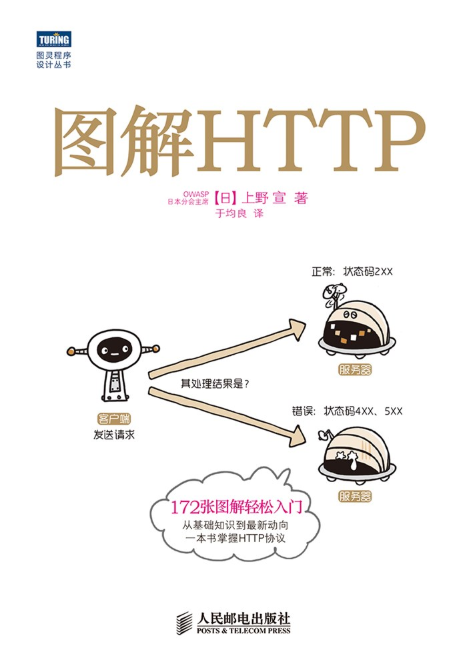

# 图解 HTTP

> 入门 **HTTP 基础知识**，参考自书籍[《图解 HTTP》](https://book.douban.com/subject/25863515/)

## 进度

- [x] 第 1 章 - 了解 Web 及网络基础知识
- [x] 第 2 章 - 简单的 HTTP 协议
- [x] 第 3 章 - HTTP 报文内的 HTTP 信息
- [x] 第 4 章 - 返回结果的 HTTP 状态码
- [x] 第 5 章 - 与 HTTP 协作的 Web 服务器
- [ ] 第 6 章 - HTTP 首部
- [ ] 第 7 章 - 确保 Web 安全的 HTTPS
- [ ] 第 8 章 - 确认访问用户身份的认证
- [ ] 第 9 章 - 基于 HTTP 的功能追加协议
- [ ] 第 10 章 - 构建 Web 内容的技术
- [ ] 第 11 章 - Web 的攻击技术