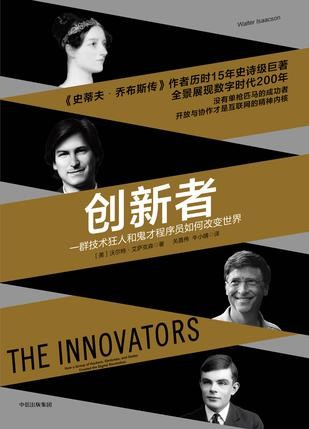
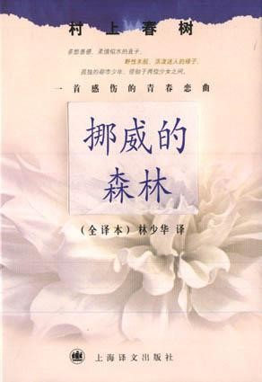

Week01《创新者》

回家的火车上，把之前翻了几页的《创新者》一口气读完了。“醍醐灌顶、神清气爽”，读完的感觉真如这八个字形容。作者是沃尔特·艾萨克森，也就是《史蒂夫·乔布斯传》的作者，非常有名的传记作家，写了诸如《爱因斯坦传》、《富兰克林传》等优秀的传记作品。英语不是很好（这个情况在慢慢改善），所以我看的是译文版，但仍然被他笔下所描绘的关于计算机和互联网的发展历程所深深折服。书从埃达夫人开始——第一个程序的缔造者，到埃达夫人（或者说她的精神）结束。中间讲述了差分机、第一台通用计算机、晶体管、微芯片等重要发明，也讲了互联网、TCP\IP协议是怎样一步步出现，这些与战争又有什么联系。当然更讲了一群20多岁甚至14、15岁的青年是如何凭借敏锐的思维与超人的洞察力创办了现今领航全球的互联网企业，这其中就有乔布斯、比尔盖茨、拉里·佩奇等。200年的数字化进程，给我的感悟是在太多，不过后来结合自身，总结了一句话：你对现在的生活不满意，说明你还没有尽力，时代给你提供了最好的东西，要学会去利用。有点遗憾的是，书缺少了某些部分，这对计算机发展史同样重要，例如某些著名的编程语言的发明，不过在第三章作者有详细地描绘了ENIAC的女程序员是如何说服男程序员们，软件编程同硬件一样重要，到今天来看，这一共识显得尤为重要。如果你是计算机专业或者对计算机感兴趣，那么我非常推荐你阅读这本书。

下载链接（我的百度网盘）：https://pan.baidu.com/s/1htqmoAS 密码：yo0r

Week01《挪威的森林》

回学校的路上，同样是一口气读完了一本书。这本书我在高一时就翻过，但是只看了个开头后就合上了。因为那时让自己感兴趣的书是像《斗罗大陆》这种网文（现在是看不下去了）。这一次在火车上百无聊赖，无所事事，遂即翻开了它。这之前也跟自己的选修课日语老师聊过这本书，她说这是一本爱情悲剧，可以去看看。《挪威的森林》原来跟森林和挪威没什么关系，以前看了书名，我以为这是发生在挪威的森林里的故事，现在才知道原来这是一首歌的名字。原名是Norwegian Wood，如果你感兴趣，可以搜来听听。回归正题，刚读第一页，村上春树笔下的文字就给我一种似曾相识的感觉，想了很久后我想到了一个人——新海诚。为此我还专门找了新海诚与村上春树的联系，在一篇报道中，新海诚表明“自己是村上的读者，《挪威的森林》里的直子更接近于明理，而绿子则相当于花苗”。因为先看的《秒五》后读的《挪威》，所以在阅读时会有种奇妙的感觉。总的来说，这是一部即会让你兴奋，也会让你阴郁的小说。对我个人而言，我其实不大喜欢渡边同直子的恋情，反而替绿子感到惋惜。当知道直子逝去之后，渡边没能立马释怀，而是在直子同房病友玲子的胸怀中，妄图埋葬这一思念。之后才想到了绿子，这个一直在精神上支持他的存在，如果没有遇到绿子，我想不到渡边会成为什么样。也许这不是一部关于爱情的小说，他探讨的是恋人或朋友抑或亲人死去之后，活着的人该怎么继续，怎么面对活着的痛苦。一口气读完这本书虽然快意，现在想想着实该慢慢读，但我想我是不会再次读这本书了。

下载链接（我的百度网盘）：https://pan.baidu.com/s/1htqmoAS 密码：yo0r

 