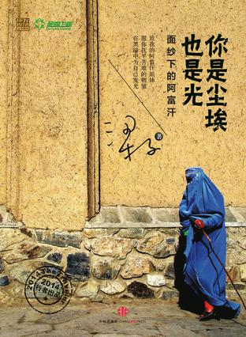

Week02《你是尘埃也是光》

如果说想了解一个与中国截然不同，堪称为世界上最贫穷的国家之一是什么样子的，那么这本书你可以试着读一读。作者梁子以一名自由女摄影师的身份，独自一人多次进入战火纷飞，千疮百孔的阿富汗，用她那朴实的语言和手中的相机一步步揭开其神秘而又令人心痛的面纱。生逢乱世，阿富汗人民是以何种心情与信念去面对的？被封建思想与残垣断壁所包围，被波尔卡包裹着的阿富汗女人又是如何活出自己的人生的？这些都是本书一直在探讨的问题。“人体炸弹”、饥饿、疾病……而这些，都是阿富汗人民每天要面对的问题。永远有人比我们过得更悲惨，却过得更乐观。正如本书书名讲的一样，你是尘埃也是光。

下载链接（我的百度网盘）：https://pan.baidu.com/s/1DfExlRgAFMrKFPMC3atyUw 密码：cmz6

