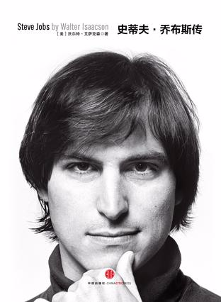

Week03《乔布斯传》

非得用什么来形容我看完这本书后对乔布斯的认知的话，还真得要借用Apple公司的广告词——Think Different：Here’s to the crazy ones. The misfits. The rebels. The troublemakers. The round pegs in the square holes. The ones who see things differently. They’re not fond of rules. And they have no respect for the status quo. You can quote them, disagree with them, glorify or vilify them. About the only thing you can’t do is ignore them. Because they change things. They push the human race forward. And while some may see them as the crazy ones, we see genius. Because the people who are crazy enough to think they can change the world are the ones who do.

译文：致疯狂的家伙们。他们不合时宜，我行我素。他们桀敖不驯，反叛忤逆。他们麻烦不断，惹是生非。他们像方孔中的圆桩。他们用与众不同的角度看待事情。他们既不墨守成规，也不安于现状。你尽可以认同他们，反对他们，赞美或者鄙视他们。不过你唯独不能漠视他们，因为他们改变着寻常事情。他们推动人类向前。也许有些人认为他们是疯子，在我们眼中他们却是天才。因为只有那些疯狂到认为自己可以改变世界的人，才能真正改变世界。

下载链接（我的百度网盘）：https://pan.baidu.com/s/1S4QxPVDbGrmKeBETQtKAOg 密码：l1bz

