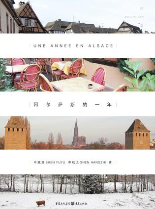

Week04《阿尔萨斯的一年》

第一次阅读这种父女双视角，两人共同协作完成的书，既觉得奇特也觉愉快，但是篇幅着实太短，有种意犹未尽的感觉。这本书主要记述了作为记者的作者，以及他12岁的女儿和妻子在法国南部阿尔萨斯旅居一年的生活故事，十分的简单朴实。和大多数人一样，我更喜欢的书中作者女儿杭之笔下所描述的法国生活，因为更真实确切。不过杭之描述的大多是她在学校的云云，对于法国的风土人情刻画较少，少年老成的口吻则为这本书平添了几分趣味。关于法国电影曾看了不少，《这个杀手不太冷》、《两小无猜》、《普罗旺斯的夏天》、《初吻》、《放牛班的春天》、《小王子》……电影中每一处情节抑或风景都让我深深折服，法国这个空气中都透露着自然温暖与浪漫的国度，值得我们每一个人去了解。总之，这本书不同于普通的游记或是哲思随笔，而是一本满含温情，能让你静下心来阅读的书。如果你最近有点小焦虑，拥抱这本书吧。

下载链接（我的百度网盘）：https://pan.baidu.com/s/1sFBM-0YMA7WInzJCuUOZKg 密码：oxxv

