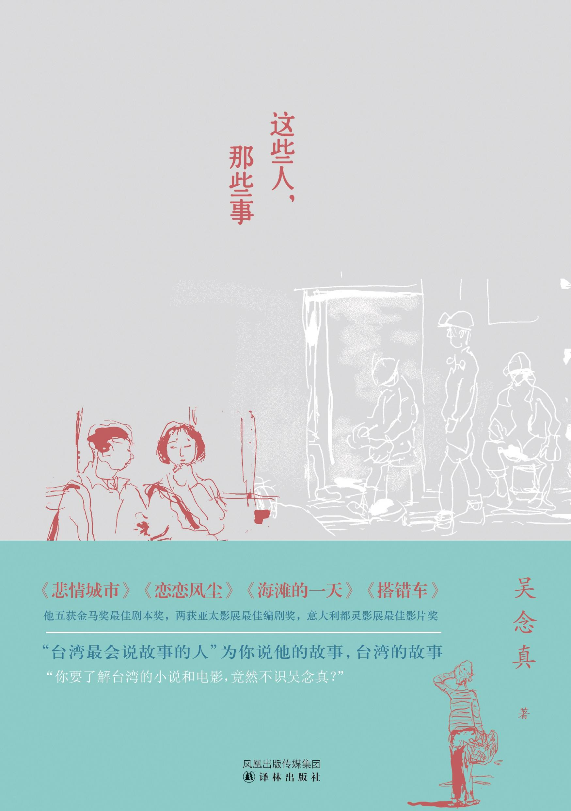

Week05《这些人，那些事》

已经不知道是第几遍读这本书了，不过每次一翻开，就又觉得，这是第一次。

喜欢上吴念真的文字，始于一场语文考试。至今我还清晰记得那篇文章的名字——“春天”，文末的那句“其实她是笑着的，在灿烂的阳光下...”也不知被我改版用在了多少篇作文里。

这本书，或许就是吴念真对于其人生历程的诠释。出生在矿区家庭，丰富的人生经历造就了他独特的文字魅力。说他是“台湾最会将故事”的人，一点假意都不带。在这本书里，大概三篇中，就会有一篇让人热泪盈眶。

文中的主角有少年，有军人，有杂货铺小妹，有站街大姐，有壮硕的矿工汉子，有年迈的父亲，有寡妇，有孤儿，有”你“，有”我“......人世间的冷暖深浅在这本书里被翻来覆去供人挑了个遍，还贴心的找了个最安静的角落等你慢慢揭开。

世间的故事大多是这样，未曾经历时觉得稀奇，等来临时，好事总觉得理所当然，坏事必然要怨天尤人，等经历过了，才明白，这就是人生，缺了一环都不算完。人唯一属于自己的东西，大抵是脑中的那些回忆，构成人身体的原子，分子什么的，宇宙爆发那会儿就出现了，带不来的必然也带不去。

一直以为“吴念真”是他的真名，后来才晓得人家本名是“吴文钦”，“念真”是她妹妹帮他投第一篇稿时给他取的笔名。再到后来看了侯孝贤导演的《恋恋风尘》，看到编剧是吴念真时，才又知道原来吴念真的初恋叫“阿真”，而这部电影也多少影射了他的初恋故事。吾念真，勿念真。

下载链接（我的百度网盘）：https://pan.baidu.com/s/1P8nSwOeaQn0ZInltTcoB8w 密码：u9yn

如果你还记得《春天》和《寂寞》的情节（包含在本书中），那么你一定要看看这本书。

> 《春天》
> 阿圆是金门金沙市场一家杂货店里打杂的小妹，长得不是很好看
> ...
> 老板先是愣了一下，然后忽然快步走向阿圆，随手就是一个耳光
> ...
> 车子里小包沉默着，好久之后才哽咽地说：“刚刚，我好想去抱她一下……”
> ...
> 当小包抓着扩音器朝公路那边喊着：“阿圆，你今天好漂亮！真的好漂亮呢，阿圆！”的时候，整条公路的人都慢慢停下脚步听
> ...
> 从望远镜里我们看到阿圆流泪了，她遮着嘴，看着我们碉堡的方向。
> 其实她是笑着的，在灿烂的阳光下。
> ...
>
> 《寂寞》
> 阿照跟她的爸爸一点都不亲，就连「爸爸」似乎也没叫过几次。
> 这个爸爸其实是她的继父。
> ...
> 不过，不知道是不是亲生的儿子太不成材还是怎样，那男人对待两个孩子有很明显的差别待遇。比如跟儿子讲话总是粗声粗气，对阿照则和颜悦色
> ...
> 他说：「女儿哪天拿到美国学位，至少我脸上也有光。」
>
> 阿照记得那天她跟他说：「爸爸……谢谢！」不过，才一说出口就觉得自己可耻
> ...
> 去年冬天他过世了。阿照去整理他的遗物，东西不多，其中有一个大纸盒
> ...
> 照片好像是用自动模式拍的。他把妈妈、弟弟、还有阿照留在家里的照片，都拿去翻照、放大、加框，摆在一张桌子上，而他就坐在那三张照片的后面朝着镜头笑。
> 照片下方一如早年那些老照片的形式印上了一行字，写着：『魏家阖府团圆，民国九十八年秋』。
> ...

