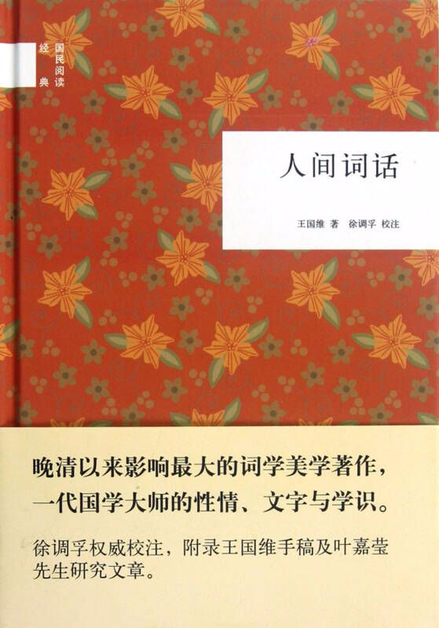

Week06《人间词话》

高中时有一段时间喜欢上了现代诗，就尝试写了些，然辞藻实在匮乏，文笔过于拙劣，终究不了了之。后来迷上看一些江湖武侠之类的小说，里面常常会穿插一句诗词来引导文意，才发觉古诗词原来比现代诗更有韵味，至此便喜欢上了古诗词（不过还达不到痴迷的地步）。

关于王国维先生，我对他知之甚少，一开始不知从何处听得他的名言（成事业者，必经三境界...），细细分析，愈觉有道理，遂即找到了这本书。实话说，《人间词话》这本书的很多地方，我是看不明白的。必然是因为我阅历太浅，境界太小，又加上最近有要事要做，没有心思慢慢品读。不过王国维先生关于诗词的美学思想仍旧令我折服，何若“有我无我”，何若“意境风骨”，何若“音律曲调”...他都如抽丝剥茧之行对其细细分析。中学时期曾学过的一些诗词也出现在这本书中，虽然读过，背过，默写过，但是这其中的意境在当时的我却未能领会多少，而现在来看，古人一首词中的浪漫足以胜过当今的一部诺贝尔小说。

王国维：古今之成大事业、大学问者，必经过三种之境界：“昨夜西风凋碧树，独上高楼，望尽天涯路。”此第一境也。“衣带渐宽终不悔，为伊消得人憔悴。”此第二境也。“众里寻他千百度，回头蓦见，那人正在，灯火阑珊处。”此第三境也。未有不越第一境第二境而能邃跻第三境者。

下载链接（我的百度网盘）：https://pan.baidu.com/s/1WVAefdGMB-LoTQ5RsOFtVQ 密码：403d

