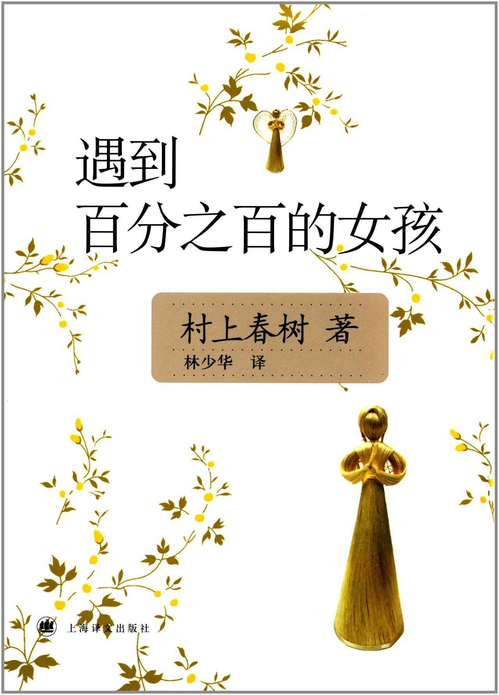

Week07《遇到百分之百的女孩（袋鼠佳日）》

承认是被其名字所吸引，才想到要去翻开这本小说的。文中的故事大多荒诞离奇，在这本书中，村上的文字也较为随性❶，大概是因为这些作品反应的都是他的精神之旅吧。

十八篇短文中，比较喜欢的有两篇，分别是《四月一个晴朗的早晨，遇到百分之百的女孩》和《图书馆奇谈》。

第一篇光看名字的话大概也能猜出来说的是什么，文章是这样开头的：

“四月一个晴朗的早晨，我在原宿后街同一个百分之百的女孩擦肩而过。

女孩算不得怎么漂亮，衣着也不出众，脑后的头发执著地带有睡觉挤压的痕迹。年龄也恐怕快三十了。严格说来，恐怕难以称之为女孩。然而，相距五十米开外我便一眼看出：对我来说，她是个百分之百的女孩。从看见她的身姿的那一瞬间，我的胸口便如发生地鸣一般地震颤，口中如沙漠一般干得沙沙作响。”

喜欢这篇文章没有太多具体的缘由，只因对我来说，中学时期也曾有一个百分之百的女孩。

第二篇则实在有趣，文中的主人公因为误入图书馆地下室，结果被一个奇怪的老人关押在地牢里，要求他把借的书都背完才肯放他走。在地牢里，他遇到了因为害怕老人而被老人一直奴役鞭笞的“羊男”和有着自我世界且形影无踪的“不能开口的美少女”。最后因为不想被吸脑浆，不愿意同美少女分手，也不想让羊男受罪，他在美少女的驱使及帮助下，和羊男在新月之夜逃出了这座神秘而诡异的图书馆。这次经历，对他来说是一场噩梦，但于我而言，这篇短文所讲述的故事像极了我接纳新事物时脑中的倒影。

下载链接（我的百度网盘）：https://pan.baidu.com/s/1988FX2KUwppKTa0P8kX9yw 密码：zwoc

> ❶ 相较于《挪威的森林》而言，村上春树的书，我完整看完的书目前就这两本。关于日本文学，我接触的比较有限，从高中开始陆陆续续读过的有夏目漱石的《我是猫》，东野圭吾的《放学后》、《解忧杂货铺》，朱川凑人的《樱花秘密基地》（也许还有其他的，不过一时是想不起来了）。这些作品给我的感觉同日影给我的感觉如出一辙，日本的作家和导演似乎都有这个特长，那就是特别注重细节，以及不经意的温情或是残酷，哪怕是平淡的家庭往事，也能叙述出其潜在的生命力。

