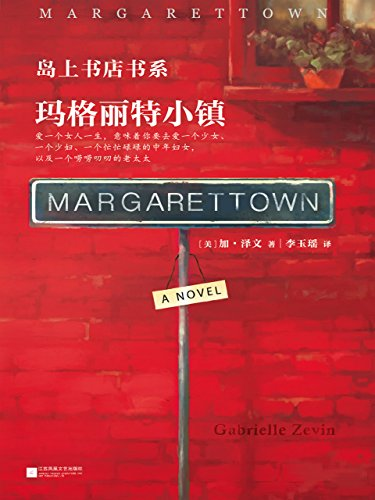

Week08《玛格丽特小镇》

电纸书更新系统后，自动推荐了这本书。看了名字感觉还不错，想着暂时没有其他的选择，看看也无妨。小说描写的是一个再现实不过的爱情故事，只是某些情节会让人觉得比较荒诞甚至烧脑。

书中描写的故事里，在一个叫玛格丽特的小镇上生活着5个不同年龄段的玛格丽特·汤（或者说6个，有一个已经自杀），她们彼此不大相同却属于一体。在大学担任助理的N无意间和她们中最美丽的一个相遇，相爱。在他们决定结婚的时候，其他的玛格丽特以各种方式悄然离去，没有了踪影。往后的日子里，他们的生活经历了温暖、争吵、理解、背叛，分别与怀念。N倾尽了一生，试图去读懂这个睡在他枕边的女人的心。然而一切都是徒劳的，到最后他甚至对于自己的认识也变得模糊起来。讽刺的是，N和玛格丽特最后的爱情结局以一个自杀，一个罹患重病而死收场。反倒是他们的女儿简，收获了美好的爱情，也明白了爱情的真谛（这一点也许得益于N将他和玛格丽特的爱情经历告诉了简）。

故事也许有更深沉次的意义，不过我不打算深究下去了，目前也做不到。书中很多描写爱情的情节，我不能理解，无法去刻意解读，也不完全赞同。我甚至觉得这本书就封面这句话就够了，其他的文字都是多余的，只留下这句箴言就好：

> “爱一个女人一生，意味着你要去爱一个少女、
>
> 一个少妇、一个忙忙碌碌的中年妇女，
>
> 以及一个唠唠叨叨的老太太”。

下载链接（我的百度网盘）：https://pan.baidu.com/s/1PgjDhgyJ77KxR7fXPU-ipw 密码：px44

后来饶有兴致地查了查作者加布瑞埃拉·泽文的资料，看到她本人相片的时候，心里惊了一下，她和我想象中的玛格丽特·汤实在太像。

 