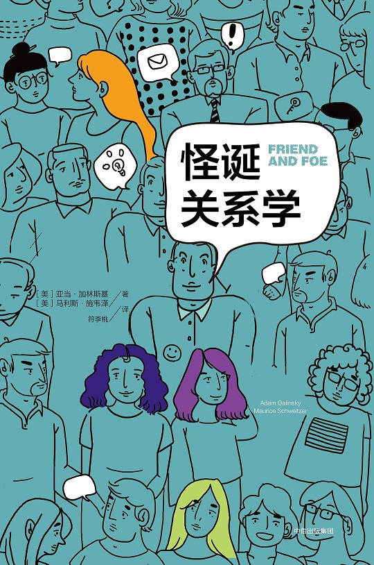

Week10《怪诞关系学》

没有对号入座，但书中说的很多例子都亲生经历过，所带来的影响有的还一直持续到现在。

人类真的挺复杂的，每个人的心里都竖着一堵墙，墙上都有一个站岗的卫士；

人类真的挺单纯的，离开了社会和他人，心里的那堵墙反倒成了自身的囚笼。

书中的建议，有些具有很强的实践性，对于社会性（群体性）方面的研究值得一读。

关系学这门课，至少在中学时，我们就应该接触（想起以前上过的心理课，老师大多是照本宣科）。不过还好，为时不晚，慢慢改善。

人的一生，在我看来就是与周边环境建立关系的一生。有人出世，有人入世，归根结底就是其自身与社会之间的关系演变所引起。

亚里士多德曾说过，“人类是天生社会性动物 ”。在现代社会，我们越来越注重个人给社会带来的价值，以及其在社会中扮演的角色。

你愿意在膀子上纹一个小猪佩奇，我也敢在膀子上贴一张Hello Kitty，你说我幼稚，我笑你傻逼。彼此之间有太多的不同，但是我们都在一条流水线上。

社会需要这种多样性，也需要建立在你我互相尊重的基石上的平等性。少数人拥有较高的权利，不过这种权利也带代表着“协调”、“倾听”、“责任”与“明辨”。

下载链接（我的百度网盘）：链接：https://pan.baidu.com/s/1KoVBheLTsDQtcZGJ0yLQwQ 密码：7lx2

