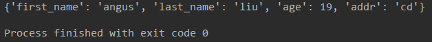
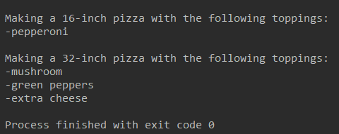

### 8.1 定义函数

```python
def greet_user(username):
    # print(id(username))
    # 显示简单的问候语
    print("Hello! " + username)
    username = ""
    print(username)

username = input("请输入你的名字:")
# print(id(username))
greet_user(username)

print(username)
```

### 8.2 传递实参

```python
def descibe_pet(animal_type, pet_name):
    # 显示宠物信息
    print("动物类型：" + animal_type)
    print("名字是：" + pet_name)


# 关键字形参
descibe_pet(pet_name="苟仁浦", animal_type="人")
```

```python
# 默认值
def descibe_pet(pet_name, animal_type='dog'):
    # 显示宠物信息
    print("动物类型：" + animal_type)
    print("名字是：" + pet_name)

descibe_pet('while')
```

### 8.3 返回值 

#### 8.3.1 返回简单值

```python
''' 返回整洁的姓名 '''
def get_formatted_name(first_name, last_name):
    full_name = first_name + '·' + last_name
    return full_name.title()

my_name = get_formatted_name('angus','liu')
print(my_name)
```

#### 8.3.2 让实参变成可选的

```python
def get_formatted_name(first_name, last_name, middle_name=''):
    if middle_name:
        full_name = first_name + '·' + middle_name + '·' + last_name
    else:
        full_name = first_name + '·' + last_name
    return full_name.title()
my_name = get_formatted_name('angus', 'liu')
print(my_name)
my_name = get_formatted_name('angus', 'liu', 'f')
print(my_name)
```

#### 8.3.3 返回字典

```python
def build_person(first_name, last_name):
    """ 返回一个字典，其中包含有关一个人的信息 """
    person = {'firstname':first_name, 'lastname':last_name}
    return person

my_name = build_person('angus', 'liu')
print(my_name)
```

#### 8.3.4 结合使用函数和while循环

```python
while True:
    print("(enter 'q' at any time to quit)")
    f_name = input('Fist name:')
    if f_name == 'q':
        break
    l_name = input('Last name:')
    if l_name == 'q':
        break
    print(get_formatted_name(f_name,l_name))
```

### 8.4 传递列表

```python
def greet_users(names):
    """ 向列表中每位用户都发出简单的问候 """
    for name in names:
        msg = "Hello, " + name.title() + "!"
        print(msg)

usernames = ['Angus', 'Tom', 'Anliy']
greet_users(usernames)
```

#### 8.4.1 在函数中修改列表

将列表传递给函数后，函数就可对齐进行修改。在函数中对这个列表所做的修改都是永久性的。

```python
def print_models(unprinted_designs, completed_models):
    """
    模板打印每个设计，直到没有未打印的设计为止
    打印每个设计后，都将其移到列表completed_models中
    """
    while unprinted_designs:
        current_design = unprinted_designs.pop()
        # 模拟根据设计制作3D模型的过程
        print("Printing model:" + current_design)
        completed_models.append(current_design)


def show_completed_models(completed_models):
    """ 显示所有打印好的模型 """
    print("\nThe following models have been printed:")
    for completed_model in completed_models:
        print(completed_model)


unprinted_designs = ['iphone case', 'robot pendant', 'dodecahedron']
completed_models = []

print_models(unprinted_designs, completed_models)
show_completed_models(completed_models)
```

#### 8.4.2 禁止函数修改列表

向函数传递列表的副本可以防止修改影响原列表，当然为了效率，应尽量避免传递副本。

```python
function_name(list_name[:]) 
print_models(unprinted_designs[:], completed_models)
```

### 8.5 传递任意数量的实参

形参的星号“*”，让python创建一个名为toppings的空元组，并将收到的所有值都封装到这个元组中。

```python
def make_pizza(*toppings):
    """ 打印顾客点的所有配料 """
    print(toppings)

make_pizza('pepperoni')
make_pizza('mushroom','green peppers', 'extra cheese')
```

#### 8.5.1 结合使用位置实参和任意数量实参

任意数量实参必须放在最后。

```python
def make_pizza(size, *toppings):
    """ 打印顾客点的所有配料 """
    print(size)
    print(toppings)

make_pizza(16,'pepperoni')
make_pizza(32,'mushroom','green peppers', 'extra cheese')
```

#### 8.5.2 使用任意数量的关键字实参

预先不知道传递给函数的会是什么信息时，可以将函数编写成能够接受任意数量的键值对。形参中的两个星号让python创建了一个空字典，并将所有的键值对都封装到这个字典中。

```python
def build_profile(first, last, **user_info):
    """ 创建一个字典，其中包含用户的一切信息 """
    profile = {}
    profile['first_name'] = first
    profile['last_name'] = last
    for key, value in user_info.items():
        profile[key] = value
    return profile


my_info = build_profile('angus', 'liu', age=19, addr='cd')
print(my_info)
```



### 8.6 将函数存储在模块中

#### 8.6.1 导入整个模块

模块是扩展名为.py的违建，包含要导入到程序中的代码。

```python
# pizza.py
def make_pizza(size, *toppings):
    """ 概述要制作的pizza """
    print("\nMaking a " + str(size) + "-inch pizza with the following toppings:")
    for topping in toppings:
        print("-" + topping)
```

接下来，在making_pizzas.py文件中导入上模块 

```python
import pizza

pizza.make_pizza(16,'pepperoni')
pizza.make_pizza(32,'mushroom','green peppers', 'extra cheese')
```



#### 8.6.2 导入特定函数

导入模块中特定函数的语法为：

```python
from module_name import function_name 
from module_name import function_0, function_1, function_2
```

若这样使用，使用函数时就无需使用句点，即调用时不用指明其属于哪个模块。 

```python
from pizza import make_pizza

make_pizza(16,'pepperoni')
make_pizza(32,'mushroom','green peppers', 'extra cheese')
```

#### 8.6.3 使用as给函数指定别名

要导入的函数的名称可能和程序中已有的名称冲突，或函数的名称太长，可指定简短而独一无二的别名。

```python
from pizza import make_pizza as mp

mp(16,'pepperoni')
mp(32,'mushroom','green peppers', 'extra cheese')
```

#### 8.6.4 使用as给模块指定别名

同样，也可以给模块指定别名。

```python
import pizza as p

p.make_pizza(16,'pepperoni')
p.make_pizza(32,'mushroom','green peppers', 'extra cheese')
```

#### 8.6.5 导入模块中的所有函数

借助（*）可以导入模块中的所有函数

```python
from module_name import *
```


