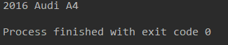
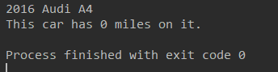
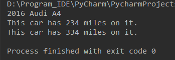
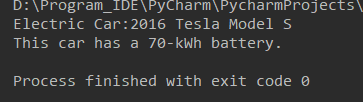
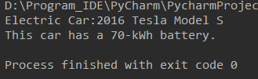
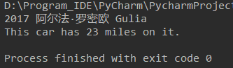
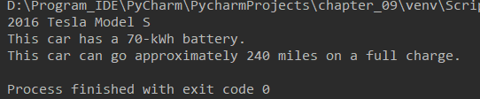
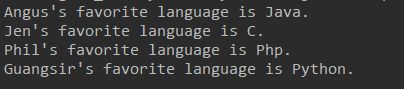

### 9.1 创建和使用类

#### 9.1.1 创建Dog类

```python
class Dog():
    """模拟小狗的类"""

    def __init__(self, name, age):
        """初始化属性name和age"""
        self.name = name
        self.age = age

    def sit(self):
        """模拟小狗被命令时蹲下"""
        print(self.name.title() + " is now sitting.")

    def roll_over(self):
        """模拟小狗被命令时打滚"""
        print(self.name.title + " rolled over.")
```

#### 9.1.2 根据类创建实例

```python
class Dog():
    """模拟小狗的类"""

    def __init__(self, name, age):
        """初始化属性name和age"""
        self.name = name
        self.age = age

    def sit(self):
        """模拟小狗被命令时蹲下"""
        print(self.name.title() + " is now sitting.")

    def roll_over(self):
        """模拟小狗被命令时打滚"""
        print(self.name.title + " rolled over.")


my_dog = Dog('white',12)
print(my_dog.name)
my_dog.sit()
```

### 9.2 使用类和实例

#### 9.2.1 Car类

```python
class Car():
    """模拟汽车的简单类"""

    def __init__(self, make, model, year):
        """初始化描述汽车的属性"""
        self.make = make
        self.model = model
        self.year = year

    def get_descriptive_name(self):
        """返回整洁的描述性信息"""
        long_name = str(self.year) + ' ' + self.make + ' ' + self.model
        return long_name.title()

my_new_car = Car('audi', 'a4', 2016)
print(my_new_car.get_descriptive_name())
```



#### 9.2.2 给属性指定默认值

可以在_init_()方法中为属性指定默认值。

```python
class Car():
    def __init__(self, make, model, year):
        self.make = make
        self.model = model
        self.year = year
        self.odometer_reading = 0

    def get_descriptive_name(self):
        """返回整洁的描述性信息"""
        long_name = str(self.year) + ' ' + self.make + ' ' + self.model
        return long_name.title()

    def read_odometer(self):
        print("This car has " + str(self.odometer_reading) + " miles on it.")

my_new_car = Car('audi', 'a4', 2016)
print(my_new_car.get_descriptive_name())
my_new_car.read_odometer()
```



#### 9.2.3 修改属性的值

可以通过三种不同方式修改属性的值：直接通过实例进行修改、通过方法进行设置、通过方法进行递增。

**1.直接修改属性的值**

```python
my_new_car = Car('audi', 'a4', 2016)
print(my_new_car.get_descriptive_name())
# 直接进行修改
my_new_car.odometer_reading = 23
my_new_car.read_odometer()
```

**2.通过方法修改属性的值** 

```python
class Car():
    def __init__(self, make, model, year):
        self.make = make
        self.model = model
        self.year = year
        self.odometer_reading = 0

    def get_descriptive_name(self):
        """返回整洁的描述性信息"""
        long_name = str(self.year) + ' ' + self.make + ' ' + self.model
        return long_name.title()

    def read_odometer(self):
        print("This car has " + str(self.odometer_reading) + " miles on it.")

    def update_odometer(self, mileage):
        """将里程表读数设置为指定的值"""
        self.odometer_reading = mileage

my_new_car = Car('audi', 'a4', 2016)
print(my_new_car.get_descriptive_name())
my_new_car.update_odometer(234)
my_new_car.read_odometer()
```

**3.通过方法对属性的值进行递增** 

```python
class Car():
    def __init__(self, make, model, year):
        self.make = make
        self.model = model
        self.year = year
        self.odometer_reading = 0

    def get_descriptive_name(self):
        """返回整洁的描述性信息"""
        long_name = str(self.year) + ' ' + self.make + ' ' + self.model
        return long_name.title()

    def read_odometer(self):
        print("This car has " + str(self.odometer_reading) + " miles on it.")

    def update_odometer(self, mileage):
        """将里程表读数设置为指定的值"""
        self.odometer_reading = mileage

    def increment_odometer(self, miles):
        """将里程表读数增加指定的量"""
        self.odometer_reading += miles


my_new_car = Car('audi', 'a4', 2016)
print(my_new_car.get_descriptive_name())

my_new_car.update_odometer(234)
my_new_car.read_odometer()

my_new_car.increment_odometer(100)
my_new_car.read_odometer()
```



### 9.3 继承

#### 9.3.1 子类的方法__init__()

```python
class ElectricCar(Car):
    """补充电动汽车的特殊之处"""
    def __init__(self, make, model, year):
        super().__init__(make, model, year)


my_tesla = ElectricCar('tesla', 'model s', 2016)
print(my_tesla.get_descriptive_name())
```

#### 9.3.2 给子类定义属性和方法

```python
class ElectricCar(Car):
    """补充电动汽车的特殊之处"""
    def __init__(self, make, model, year):
        """
        初始化父类的属性，在初始化电动汽车特有的属性
        """
        super().__init__(make, model, year)
        self.battery_size = 70

    def describe_battery(self):
        """打印一条描述电瓶容量的消息"""
        print("This car has a " + str(self.battery_size) + "-kWh battery.")


my_tesla = ElectricCar('tesla', 'model s', 2016)
print(my_tesla.get_descriptive_name())
my_tesla.describe_battery()
```

#### 9.3.3 重写父类的方法

```python
class ElectricCar(Car):
    """补充电动汽车的特殊之处"""

    def __init__(self, make, model, year):
        """
        初始化父类的属性，在初始化电动汽车特有的属性
        """
        super().__init__(make, model, year)
        self.battery_size = 70

    def get_descriptive_name(self):
        """返回属于电动车特有的描述性信息"""
        long_name = 'Electric car:' + str(self.year) + ' ' + self.make + ' ' + self.model
        return long_name.title()

    def describe_battery(self):
        """打印一条描述电瓶容量的消息"""
        print("This car has a " + str(self.battery_size) + "-kWh battery.")


my_tesla = ElectricCar('tesla', 'model s', 2016)
print(my_tesla.get_descriptive_name())
my_tesla.describe_battery()
```



#### 9.3.4 将实例用作属性

```python
class Battery():
    """模拟电动汽车的电瓶的简单类"""

    def __init__(self, battery_size=70):
        """初始化电瓶的属性"""
        self.battery_size = battery_size

    def describe_battery(self):
        """打印一条描述电瓶容量的消息"""
        print("This car has a " + str(self.battery_size) + "-kWh battery.")


class ElectricCar(Car):
    """补充电动汽车的特殊之处"""

    def __init__(self, make, model, year):
        """
        初始化父类的属性，在初始化电动汽车特有的属性
        """
        super().__init__(make, model, year)
        self.battery = Battery()

    def get_descriptive_name(self):
        """返回属于电动车特有的描述性信息"""
        long_name = 'Electric car:' + str(self.year) + ' ' + self.make + ' ' + self.model
        return long_name.title()


my_tesla = ElectricCar('tesla', 'model s', 2016)
print(my_tesla.get_descriptive_name())
my_tesla.battery.describe_battery()
```



### 9.4 导入类

#### 9.4.1 导入单个类

```python
# car.py
"""一个可用于表示汽车的类"""


class Car():
    """简单模拟汽车的类"""

    def __init__(self, make, model, year):
        """初始化描述汽车的属性"""
        self.make = make
        self.model = model
        self.year = year
        self.odometer_reading = 0

    def get_deacriptive_name(self):
        """返回整洁的描述性名称"""
        long_name = str(self.year) + ' ' + self.make + ' ' + self.model
        return long_name.title()

    def read_odometer(self):
        """打印一条消息，指出汽车的里程"""
        print("This car has " + str(self.odometer_reading) + " miles on it.")

    def update_odometer(self, mileage):
        """将里程数设置为指定值，拒绝将里程表回拨"""
        if mileage >= self.odometer_reading:
            self.odometer_reading = mileage
        else:
            print("You can't roll back an odometer!")

    def increment_odometer(self, miles):
        """将里程表读数增加指定的量"""
        self.odometer_reading += miles

```

```python
# my_car.py
from car import Car

my_new_car = Car('阿尔法·罗密欧', 'gulia', 2017)
print(my_new_car.get_deacriptive_name())

my_new_car.odometer_reading = 23
my_new_car.read_odometer()
```



#### 9.4.2 在一个模块中存储多个类

```python
# car.py
"""一个可用于表示汽车的类"""


class Car():
    """简单模拟汽车的类"""

    def __init__(self, make, model, year):
        """初始化描述汽车的属性"""
        self.make = make
        self.model = model
        self.year = year
        self.odometer_reading = 0

    def get_deacriptive_name(self):
        """返回整洁的描述性名称"""
        long_name = str(self.year) + ' ' + self.make + ' ' + self.model
        return long_name.title()

    def read_odometer(self):
        """打印一条消息，指出汽车的里程"""
        print("This car has " + str(self.odometer_reading) + " miles on it.")

    def update_odometer(self, mileage):
        """将里程数设置为指定值，拒绝将里程表回拨"""
        if mileage >= self.odometer_reading:
            self.odometer_reading = mileage
        else:
            print("You can't roll back an odometer!")

    def increment_odometer(self, miles):
        """将里程表读数增加指定的量"""
        self.odometer_reading += miles


class Battery():
    """模拟电动汽车的电瓶的简单类"""

    def __init__(self, battery_size=70):
        """初始化电瓶的属性"""
        self.battery_size = battery_size

    def describe_battery(self):
        """打印一条描述电瓶容量的消息"""
        print("This car has a " + str(self.battery_size) + "-kWh battery.")

    def get_range(self):
        """打印一条消息描述电瓶续航里程的消息"""
        if self.battery_size == 70:
            range = 240
        elif self.battery_size == 85:
            range = 270
        message = "This car can go approximately " + str(range)
        message += " miles on a full charge."
        print(message)


class ElectricCar(Car):
    """模拟电动车的独特之处"""
    def __init__(self, make, model, year):
        super().__init__(make, model, year)
        self.battery = Battery()

```

```python
#my_electric_car.py
from car import ElectricCar

my_tesla = ElectricCar('tesla', 'model s', 2016)

print(my_tesla.get_deacriptive_name())
my_tesla.battery.describe_battery()
my_tesla.battery.get_range()
```



#### 9.4.3 从一个模块中导入多个类

```python
from car import Car, ElectricCar

my_new_car = Car('阿尔法·罗密欧', 'gulia', 2017)

print(my_new_car.get_deacriptive_name())
my_new_car.odometer_reading = 23
my_new_car.read_odometer()

my_tesla = ElectricCar('tesla', 'model s', 2016)

print(my_tesla.get_deacriptive_name())
my_tesla.battery.describe_battery()
my_tesla.battery.get_range()
```

#### 9.4.4 导入整个模块

可以导入整个模块，然后使用语法module_name.class_name访问需要的类。

#### 9.4.5 导入模块中的所有类

使用语法from module_name import *可以导入模块中的所有类，不过不推荐。

#### 9.4.6 在一个模块中导入另一个模块

```python
# electric_car.py
from car import Car


class Battery():
    """模拟电动汽车的电瓶的简单类"""

    def __init__(self, battery_size=70):
        """初始化电瓶的属性"""
        self.battery_size = battery_size

    def describe_battery(self):
        """打印一条描述电瓶容量的消息"""
        print("This car has a " + str(self.battery_size) + "-kWh battery.")

    def get_range(self):
        """打印一条消息描述电瓶续航里程的消息"""
        if self.battery_size == 70:
            range = 240
        elif self.battery_size == 85:
            range = 270
        message = "This car can go approximately " + str(range)
        message += " miles on a full charge."
        print(message)


class ElectricCar(Car):
    """模拟电动车的独特之处"""

    def __init__(self, make, model, year):
        super().__init__(make, model, year)
        self.battery = Battery()
```

### 9.5 Python标准库

Python标准库是一组模块，安装的Python都包含。可使用标准库中任何函数和类，只需在程序开头添加import语句。

下面以模块collections中的一个类——OrderedDict（有序字典）为例。

```python
from collections import OrderedDict

favorite_languages = OrderedDict()

favorite_languages['angus'] = 'java'
favorite_languages['jen'] = 'c'
favorite_languages['phil'] = 'php'
favorite_languages['guangsir'] = 'python'

for name, language in favorite_languages.items():
    print(name.title() + "'s favorite language is " + language.title() + ".")
```




