### 10.1 从文件中读取数据

#### 10.1.1 读取整个文件

```
# pi_digits.txt
3.1415926535
8979323846
2643383279
```

函数open()接收一个参数，要打开的文件的名称，返回一个表示文件的对象。关键字with在不需要访问文件后将其关闭。当然可以调用close()函数关闭文件。

```python
# file_reader.py
with open('pi_digits.txt') as file_object:
    contents = file_object.read()
    print(contents)
```

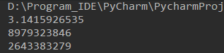

#### 10.1.2 文件路径

在Linux和OS X系统中，可以这样编写代码：

```python
with open('text_files/filename.txt') as file_object:
    
file_path = '/home/ehmatthes/other_files/text_files/filename.txt'
with open(file_path) as file_object: 
```

在Windows系统中，则是这样： 

```python
with open('text_files\filename.txt') as file_object:
    
file_path = 'C:\Users\ehmatthes\other_files\text_files\filename.txt'
with open(file_path) as file_object:
```

#### 10.1.3 逐行读取

要以每次一行的方式检查文件，可对文件对象使用for循环。

```python
file_name = 'pi_digits.txt'
with open(file_name) as file_object:
    for line in file_object:
        print(line)
```

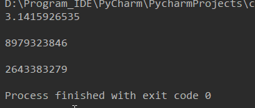

#### 10.1.4 创建一个包含文件内容的列表

使用关键字with时，open()返回的文件对象只能在with代码块中使用。如果要在with代码块外访问文件的内容，可在with代码块内将文件的各行内容存储在一个列表中，并在with代码块外使用该列表。

```python
file_name = 'pi_digits.txt'
with open(file_name) as file_object:
    lines = file_object.readlines()

for line in lines:
    print(line)
```

#### 10.1.5 使用文件的内容

```python
file_name = 'pi_digits.txt'
with open(file_name) as file_object:
    lines = file_object.readlines()

pi_string = ''
for line in lines:
    pi_string += line.rstrip()

print(pi_string)
print(len(pi_string))
```

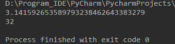

#### 10.1.6 包含一百万位的大型文件

```python
file_name = 'pi_million_digits.txt'
with open(file_name) as file_object:
    lines = file_object.readlines()

pi_string = ''
for line in lines:
    pi_string += line.strip()

print(pi_string[0:52] + "...")
print(len(pi_string))
```

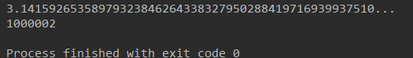

#### 10.1.7 圆周率值中包含你的生日吗

```python
file_name = 'pi_million_digits.txt'
with open(file_name) as file_object:
    lines = file_object.readlines()

pi_string = ''
for line in lines:
    pi_string += line.strip()

birthday = input("Enter your birthday, in the form mmddyy:")
if birthday in pi_string:
    print("Your birthday appears in the first million digits of pi!")
else:
    print("Your birthday does not appear in the first million digits of pi.")
```

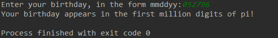

### 10.2 写入文件

#### 10.2.1 写入空文件

要在文本写入文件，在调用open()函数时需要提供另一个实参，告诉Python要写入打开的文件。

```python
file_name = 'programming.txt'

with open(file_name, 'w') as file_object:
    file_object.write("I love programming.")
```


open()函数第二个实参（'w'）表示要以写入模式打开这个文件。打开文件时，可指定读取模式（'r'）、写入模式（'w'）、附加模式（'a'）或读取写入模式（'r+'）。若省略模式实参，Python将以默认的只读模式打开文件。

注意：写入模式会覆盖掉原有内容

#### 10.2.2 写入多行

写入多行时，注意在文本末尾添加换行符。

```python
file_name = 'programming.txt'

with open(file_name, 'w') as file_object:
    file_object.write("I love programming.\n")
    file_object.write("I love Python and Java.")
```


#### 10.2.3 附加到文件

```python
file_name = 'programming.txt'

with open(file_name, 'a') as file_object:
    file_object.write("I also love in finding meaning in large datasets.\n")
    file_object.write("I love creating apps that can run in a browser.\n")
```

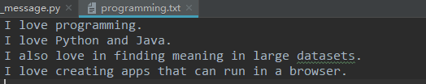

### 10.3 异常

#### 10.3.1 处理ZeroDivisionError异常

```python
print(5/0)
```

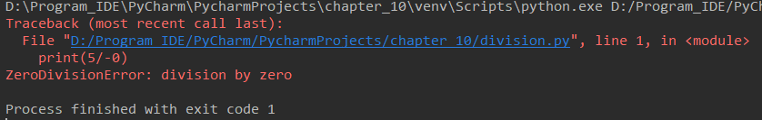

#### 10.3.2 使用try-except

当可能发生错误时，可编写一个try-except代码块来处理可能引发的异常。

```python
try:
    print(5/0)
except ZeroDivisionError:
    print("You can't divided by zero!")
```

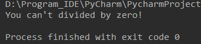

#### 10.3.3 使用异常避免崩溃

发生错误时，如果程序还有工作没有完成，妥善处理错误显得尤为重要。这种情况经常出现在需要用户输入的程序中。如果程序能够妥善处理无效输入，就能避免程序崩溃。

#### 10.3.4 else代码块

```python
print("Give me two numbers, aand I'll divide them.")
print("Enter 'q' to quit.")

while True:
    first_number = input("\nFirst number:")
    if first_number == 'q':
        break
    second_numbe = input("Second number:")
    if second_numbe == 'q':
        break
    try:
        anwser = int(first_number) / int(second_numbe)
    except ZeroDivisionError:
        print("You can't divided by zero!")
    else:
        print(anwser)
```

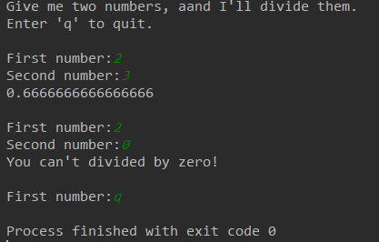

#### 10.3.5 处理FileNotFoundError异常

```python
file_name = 'alien.txt'

with open(file_name) as f_obj:
    contents = f_obj.read()
```

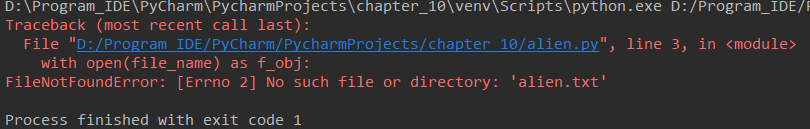

```python
file_name = 'alien.txt'

try:
    with open(file_name) as f_obj:
        contents = f_obj.read()
except FileNotFoundError:
    print("找不到该文件！")
```


#### 10.3.6 分析文本

```python
title = 'Alice in Wonderland'
ts = title.split()
print(ts)
```

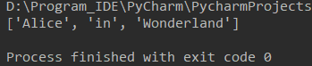

```python
file_name = 'alice.txt'

try:
    with open(file_name) as f_obj:
        contents = f_obj.read()
except FileNotFoundError:
    msg = "Sorry, the file " + file_name + " dos not exist."
    print(msg)
else:
    # 计算文件中大致包含多少个单词
    words = contents.split()
    num_words = len(words)
    print("The file " + file_name + " has about " + str(num_words) + " words.")
```

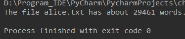

#### 10.3.7 使用多个文件

```python
def count_words(filename):
    """计算一个文件大致包含多少个单词"""
    try:
        with open(filename) as f_obj:
            contents = f_obj.read()
    except FileNotFoundError:
        msg = "Sorry, the file " + filename + " dos not exist."
        print(msg)
    else:
        # 计算文件中大致包含多少个单词
        words = contents.split()
        num_words = len(words)
        print("The file " + filename + " has about " + str(num_words) + " words.")


filename = 'alice.txt'
count_words(filename)
```

```python
def count_words(filename):
    """计算一个文件大致包含多少个单词"""
    try:
        with open(filename) as f_obj:
            contents = f_obj.read()
    except FileNotFoundError:
        msg = "Sorry, the file " + filename + " dos not exist."
        print(msg)
    else:
        # 计算文件中大致包含多少个单词
        words = contents.split()
        num_words = len(words)
        print("The file " + filename + " has about " + str(num_words) + " words.")


filenames = ['alice.txt', 'siddhartha.txt', 'angus.txt', 'moby_dick.txt', 'little_women.txt']
for filename in filenames:
    count_words(filename)
```

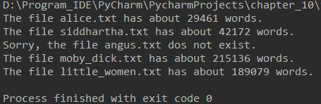

#### 10.3.8 失败时一声不吭

Python中有一个pass语句，可以使用它来让Python什么都不要做。

```python
def count_words(filename):
    """计算一个文件大致包含多少个单词"""
    try:
        with open(filename) as f_obj:
            contents = f_obj.read()
    except FileNotFoundError:
        pass
    else:
        # 计算文件中大致包含多少个单词
        words = contents.split()
        num_words = len(words)
        print("The file " + filename + " has about " + str(num_words) + " words.")


filenames = ['alice.txt', 'siddhartha.txt', 'angus.txt', 'moby_dick.txt', 'little_women.txt']
for filename in filenames:
    count_words(filename)
```

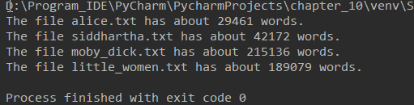

### 10.4 存储数据

#### 10.4.1 使用json.dump()和json.load()

```python
# number_write.py

import json

numbers = [2, 3, 4, 5, 6]

filename = 'number.json'
with open(filename, 'w') as f_obj:
    json.dump(numbers, f_obj)
```


```python
# number_reader.py

import json

filename = 'number.json'
with open(filename) as f_obj:
    numbers = json.load(f_obj)

print(numbers)
```


#### 10.4.2 保存和读取用户生成的数据

```python
import json

# 如果以前存储了用户名，就加载
# 否者，就提示用户输入用户名并存储它
filename = 'username.json'
try:
    with open(filename) as f_obj:
        username = json.load(f_obj)
except FileNotFoundError:
    username = input("What is your name? ")
    with open(filename, 'w') as f_obj:
        json.dump(username, f_obj)
        print("We'll remember you when you come back, " + username + "!")
else:
    print("Welcome back, " + username + "!")
```

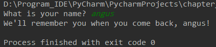

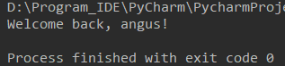

#### 10.4.3 重构

重构——将代码划分为一系列完成具体工作的函数，使其更清晰、更易于理解，更容易扩展。

```python
import json


def get_stored_username():
    """如果存储了用户名，就获取它"""
    filename = 'username.json'
    try:
        with open(filename) as f_obj:
            username = json.load(f_obj)
    except FileNotFoundError:
        username = None
    return username


def get_new_username():
    """提示用户输入新的用户名"""
    filename = 'username.json'
    username = input("What is your name? ")
    with open(filename, 'w') as f_obj:
        json.dump(username, f_obj)
    return username


def greet_user():
    """问候用户，并指出其名字"""
    username = get_stored_username()
    if username:
        print("Welcome back, " + username + "!")
    else:
        username = get_new_username()
        print("We'll remember you when you come back, " + username + "!")


greet_user()
```


