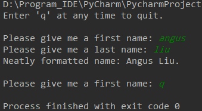
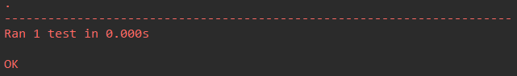
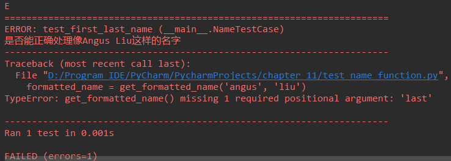
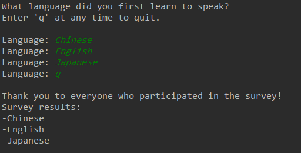
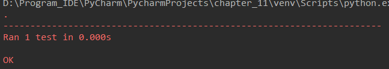

### 11.1 测试函数

```python
# name_function.py

def get_formatted_name(first, last):
    """Generate a neatly formatted full name"""
    full_name = first + ' ' + last
    return full_name.title()
```

```python
# names.py

from name_function import get_formatted_name

print("Enter 'q' at any time to quit.")
while True:
    first = input("\nPlease give me a first name: ")
    if first == 'q':
        break
    last = input("Please give me a last name: ")
    if last == 'q':
        break

    formatted_name = get_formatted_name(first, last)
    print("Neatly formatted name: " + formatted_name + ".")
```



#### 11.1.1 单元测试和测试用例

Python标准库中的模块unittest提供了代码测试工具。单元测试用于核实函数的某个方面没有问题；测试用例是一组单元测试，这些单元测试一起核实函数在各种情形下的行为都符合要求。全覆盖测试包含一整套单元测试，涵盖了各种可能的函数使用方式。

#### 11.1.2 可通过的测试

要为函数编写测试用例，可先导入模块unittest以及要测试的函数，再创建一个继承unittest.TestCase的类，并编写一系列方法对函数行为的不同方面进行测试。

```python
import unittest

from name_function import get_formatted_name


class NameTestCase(unittest.TestCase):
    """测试name_function.py"""

    def test_first_last_name(self):
        """是否能正确处理像Angus Liu这样的名字"""
        formatted_name = get_formatted_name('angus', 'liu')
        self.assertEqual(formatted_name, 'Angus Liu')


unittest.main()
```



#### 11.1.3 不能通过的测试

```python
def get_formatted_name(first, middle, last):
    """Generate a neatly formatted full name"""
    full_name = first + ' ' + middle + ' ' + last
    return full_name.title()
```

```python
import unittest

from name_function import get_formatted_name


class NameTestCase(unittest.TestCase):
    """测试name_function.py"""

    def test_first_last_name(self):
        """是否能正确处理像Angus Liu这样的名字"""
        formatted_name = get_formatted_name('angus', 'liu')
        self.assertEqual(formatted_name, 'Angus Liu')


unittest.main()
```



#### 11.1.4 添加新测试

```python
import unittest

from name_function import get_formatted_name


class NameTestCase(unittest.TestCase):
    """测试name_function.py"""

    def test_first_last_name(self):
        """是否能正确处理像Angus Liu这样的名字"""
        formatted_name = get_formatted_name('angus', 'liu')
        self.assertEqual(formatted_name, 'Angus Liu')

    def test_first_middle_last(self):
        """是否能够处理An Guang Liu这样的名字"""
        formatted_name = get_formatted_name('an', 'liu', 'guang')
        self.assertEqual(formatted_name, 'An Guang Liu')


unittest.main()
```

### 11.2 测试类

简而言之，即编写针对类的测试。

#### 11.2.1 各种断言方法

下表描述了常用的6个断言方法。使用这些方法可核实返回的值等于或不等于预期的值、返回值为True或False、返回的值在列表或不在列表中。只能在继承unittest.TestCase的类中使用这些方法。

| 方法                    | 用途               |
| ----------------------- | ------------------ |
| assertEqual(a, b)       | 核实a==b           |
| assertNotEqual(a, b)    | 核实a!=b           |
| assertTrue(x)           | 核实x为True        |
| assertFalse(x)          | 核实x为False       |
| assertIn(item, list)    | 核实item在list中   |
| assertNotIn(item, list) | 核实item不在list中 |

#### 11.2.2 一个要测试的类

```python
# survey.py

class AnonymousSurvey:
    """搜集匿名调查问卷的答案"""

    def __init__(self, question):
        """存储一个问题，并为存储答案做准备"""
        self.question = question
        self.responses = []

    def show_question(self):
        """显示调查问卷"""
        print(self.question)

    def stroe_response(self, new_response):
        """存储单份答案"""
        self.responses.append(new_response)

    def show_results(self):
        """显示所有搜集到的答案"""
        print("Survey results:")
        for response in self.responses:
            print("-" + response)
```



#### 11.2.3 测试AnonymousSurvey类

```python
import unittest
from survey import AnonymousSurvey


class TestAnonymousSurver(unittest.TestCase):
    """针对AnonymousSurvey的测试类"""

    def test_store_single_response(self):
        """测试单个答案会被妥善的存储"""
        question = "What language did you first learn to speak?"
        my_survey = AnonymousSurvey(question)
        my_survey.store_response("Chinese")

        self.assertIn('Chinese', my_survey.responses)


unittest.main()
```



```python
import unittest

from survey import AnonymousSurvey


class TestAnonymousSurver(unittest.TestCase):
    """针对AnonymousSurvey的测试类"""

    def test_store_single_response(self):
        """测试单个答案会被妥善的存储"""
        question = "What language did you first learn to speak?"
        my_survey = AnonymousSurvey(question)
        my_survey.store_response("Chinese")

        self.assertIn('Chinese', my_survey.responses)

    def test_store_three_responses(self):
        """测试3个答案会被妥善存储"""
        question = "What language did you first learn to speak?"
        my_survey = AnonymousSurvey(question)
        responses = ['Chinese', 'English', 'Japanese']
        for response in responses:
            my_survey.store_response(response)

        for response in responses:
            self.assertIn(response, my_survey.responses)

unittest.main()

```

#### 11.2.4 方法setUp()

unittest.TestCase类包含方法setUp()，可以让我们创建对象一次，并在每个测试方法中使用它们。如果在TestCase类中包含了方法setUp()，Python将先运行它，在运行各个以test_打头的方法。

```python
import unittest

from survey import AnonymousSurvey


class TestAnonymousSurver(unittest.TestCase):
    """针对AnonymousSurvey的测试类"""

    def setUp(self):
        """创建一个调查对象和一组答案，供使用的测试方法用"""
        question = "What language did you first learn to speak?"
        self.my_survey = AnonymousSurvey(question)
        self.responses = ['Chinese', 'Spanish', 'Mandarin']

    def test_store_single_response(self):
        """测试单个答案会被妥善的存储"""
        self.my_survey.store_response(self.responses[0])

        self.assertIn('Chinese', self.my_survey.responses)

    def test_store_three_responses(self):
        """测试3个答案会被妥善存储"""
        for response in self.responses:
            self.my_survey.store_response(response)

        for response in self.responses:
            self.assertIn(response, self.my_survey.responses)


unittest.main()
```


