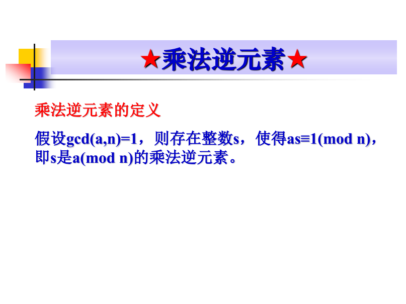

考查课

基本概念、算法、思路

1.密码、分组密码、流密码、公钥密码体系、DES（加密过程思路、分组）、长度、密文长度、密钥长度、过程步骤、高级加密

2.什么是消息认证码、产生过程、MD5、文本长度、密钥长度

3.书本例题、讲过的例题

+ RSA（小素数，21位内）、常见的例题，计算上
+ 随机序列

4.作业、同余、剩余定理、欧拉数、欧拉函数值

5.题型：填空 简答 名词解释 和大题

## 第 1 章 引言

### 密码学的作用

### 单表代换密码（循环移位变换）

#### 凯撒密码

#### 移位变换

#### 仿射变换

#### 多表代换密码

## 第 2 章 流密码

### 流密码的基本概念

### 有限状态自动机

## 第 3 章 分组密码体制

### 分组密码概述

### 代换盒

## 第 4 章 公钥密码

### 素数

### 欧几里得算法

### 乘法逆元素

### 扩展的欧几里得算法

#### 求乘法逆元

### 中国剩余定理

### 费尔玛定理

### 欧拉定理

#### 欧拉函数

#### 欧拉函数的性质

#### 欧拉定理

#### 欧拉定理的应用

### 模n逆矩阵

#### 乘法逆元素法

### 有限域的概念

#### 群的概念

#### 交换群的概念

#### 域的概念

#### 有限域的概念

### 米勒-拉宾素数判定

### RSA算法

#### 密钥产生

#### 加密和解密

## 第 5 章 密钥分配与密钥管理

### 秘密分割

## 第 6 章 消息认证和杂凑算法

### 消息认证和杂凑算法

### MD5 杂凑算法

## 第 7 章 数字签字和密码协议

### 数字签名

#### 数字签名应具有的性质

#### 数字签名应满足的要求

### 认证协议

#### 相互认证

