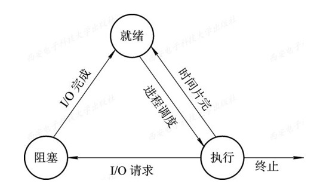
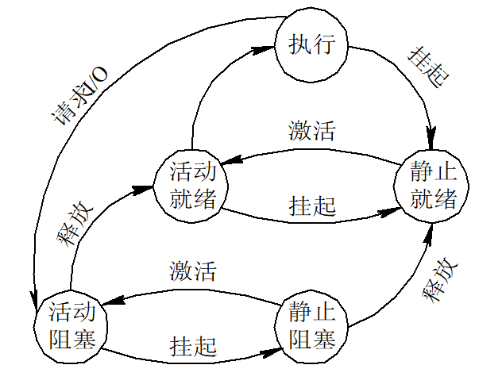

### 第一章 操作系统引论

#### 1.设计操作系统的目标是什么？

其主要目标是：方便性、有效性、可扩充性和开放性。

#### 2.操作系统的作用是什么？简述在操作系统和用户之间提供哪几种类型的接口？

(1) 作用：

① OS作为用户与计算机硬件系统之间的接口；

② OS作为计算机资源的管理者；

③ OS实现了对计算机资源的抽象。

(2) 接口：命令方式、系统调用方式和图标-窗口方式。

#### 3.操作系统发展的主要动力是什么？

(1) 不断提高计算机资源的利用率；

(2) 方便用户；

(3) 器件的不断更新换代；

(4) 计算机体系结构的不断发展；

(5) 不断提出新的应用需求。

#### 4.什么是多道批处理系统？为什么要引入多道批处理系统？

(1) 在多道批处理系统中，用户所提交的作业先存放在外存上，并排成一个队列，称为“后备队列”。然后由作业调度程序按照一定的算法，从后备队列中选择若干个作业调入内存，使它们共享CPU和系统中的各种资源。

(2) 为了进一步提高资源的利用率和系统吞吐量。

#### 5.什么是分时系统？为什么要引入分时系统？

(1) 分时系统是指，在一台主机上连接了多个配有显示器和键盘的终端并由此所组成的系统，该系统允许多个用户通过自己的终端，以交互的方式使用计算机，共享主机中的资源。

(2) 为了满足用户对人-机交互的需求，即人机-交互、共享主机，便于用户上机。

#### 6.实时操作系统有哪些方面的应用需求并举例。

(1) 工业（武器）控制系统：如火炮的自动控制系统、飞机的自动驾驶系统，以及导弹的制导系统等；

(2) 信息查询系统：如飞机或火车的订票系统等；

(3) 多媒体系统：如播放音频和视频的多媒体系统等；

(4) 嵌入式系统：如智能仪器和设备中的嵌入式系统等；

#### 7.操作系统有哪些基本特征？并发性和并行性的概念分别是什么？

(1) 操作系统基本特征：并发、共享、虚拟和异步。

(2) 并行性：指两个或多个事件在同一时刻发生。

​     并发性：指两个或多个事件在同一时间间隔内发生。

#### 8.简述操作系统的主要功能。

处理机管理功能、存储器管理功能、设备管理功能、文件管理功能，操作系统与用户之间的接口。

### 第二章 进程的描述与控制

#### 1.简述程序并发执行的特征。

(1) 间断性：程序在并发执行时，由于它们共享系统资源，以及为完成同一项任务而相互合作，致使这些并发执行的程序之间形成了相互制约的关系。相互制约将导致并发程序具有“执行-暂停-执行”这种间断性的活动规律；

(2) 失去封闭性：当系统中存着多个可以并发执行的程序时，系统中的各种资源将为它们共享，而这些资源的状态也由这些程序来改变，致使其中任一程序在运行时，其环境必然会受到其他程序的影响；

(3) 不可再现性：程序在并发执行时，由于失去了封闭性，也将导致其又失去可再现性。

#### 2.简述进程的特征。

(1) 结构特征：由程序段、相关的数据段和PCB三部份构成进程实体（又称进程映像）；

(2) 动态性：进程的实质是进程实体的执行过程，因此，动态性是进程的最基本特征；

(3) 并发性：是指多个进程实体可以同存于内存内，且能在一段时间内同时运行；

(4) 独立性：在传统OS中，独立性是指进程实体是一个能独立运行、独立获得资源和独立接收调度的基本单位；

(5) 异步性：是指进程是按异步方式运行的，即按各自独立的、不可预知的速度向前推进。

#### 3.比较进程和程序的主要区别。

(1) 程序是有序代码的集合，是一个静态的概念。进程是程序的一次执行过程，是一个动态的概念。进程不可以在计算机之间迁移，而程序通常对应着文件，可以复制；

(2) 进程是一个状态变化的过程，是有生命期的，而程序是永久的，可以永久保存；

(3) 进程和程序的组成不同。进程有程序段、数据段和进程控制块组成，而程序仅是代码的有序集合；

(4) 进程和程序是密切相关的。通过多次执行，一个程序可对应多个进程。但进程与它本身所运行的程序只能是一对一的关系；

(5) 进程更能真实的描述并发，而程序不能；

(6) 进程可创建其他进程，而程序并不能形成新的程序。

#### 4.说明进程的三个基本状态及相应的状态转换图。

(1) 就绪（Ready）状态：指进程已处于准备好运行的状态，已分配到除CPU以外的所有必要资源。

(2) 执行（Running）状态：进程已获得CPU，其程序正在执行的状态。

(3) 阻塞（Block）状态：指正在执行的进程由于发生某事件暂时无法运行的状态，亦即进程的执行受到阻塞。

#### 5.引入挂起状态的原因是什么，描述引入挂起状态后的状态装换图。

引入挂起操作的原因，是基于系统和用户的如下需要：终端用户的需要、父进程请求、负荷调节的需要、操作系统的需要。

#### 6.引起进程创建和撤销的事件以及步骤分别是什么？

(1) 引起进程创建的事件：用户登录、作业调度、提供服务，应用请求。

进程创建的步骤为：

① 申请空白PCB：申请唯一的数字标识符；

② 为新进程分配资源：主要是内存空间；

③ 初始化进程控制块：包含标识、处理机状态、处理机控制信息；

④ 如果进程就绪队列能够接纳新进程，便将新进程插入就绪队列。

(2) 引起进程撤销的事件：正常结束、异常结束，外界干预。

进程撤销（终止）的步骤为：

① 根据被终止进程的标识符，从PCB集合中检索出该进程的PCB，从中读出该进程的状态；

② 若该进程正处于执行状态，应立即终止该进程的执行，并置调度标志位真，用于指示该进程被终止后应重新进行调度；

③ 若该进程还有子孙进程，还应将其所有的子孙进程予以终止，以防它们称为不可控的进程。

④ 将被终止进程所拥有的全部资源或者归还给其父进程，或者归还给系统；

⑤ 将被终止的进程（它的PCB）从所在的队列（或链表）中移除，等待其他程序来搜集信息。

#### 7.进程同步机制遵循的准则是什么？

空闲让进、忙则等待、有限等待，让权等待。

#### 8.简述进程同步解决方式中信号量所表示的意义。

整型信号量S的意义：

S>0 表示系统中空闲的该类临界资源的个数。

S=0 表示系统中该类临界资源刚好被全部占用，而且没有进程在等待该临界资源。

记录型信号量S.value的意义：

S.value的初值表示系统中某类资源的数目，称为资源信号量。

S.value<0时，表示该类资源已分配完毕，此时S.value的绝对值表示系统中等待该临界资源的进程的个数。

#### 9.进程的高级通信分类有哪几种？有哪几种实现方式？

(1) 共享存储器系统：① 基于共享数据结构的通信方式    ② 基于共享存储区的通信方式

(2) 管道通信系统

(3) 消息传递系统：① 直接通信方式    ② 间接通信方式

(4) 客户机-服务器系统：① 套接字    ② 远程过程调用    ③ 远程方法调用

#### 10.为什么要引入线程，简述线程的分类。

(1) 在操作系统中引入线程，是为了减少程序在并发执行时所付出的时空开销，使OS具有更好的并发性。

(2) 线程分为：内核支持线程KST（Kernel Supported Threads）和用户级线程ULT（User Level Threads）。

### 第三章 处理机调度与死锁

#### 1.名词解释：死锁，作业调度，进程调度，中级调度，周转时间，响应时间。

(1) 死锁：死锁是指两个或两个以上的进程在执行过程中，由于竞争资源或者由于彼此通信而造成的一种阻塞的现象，若无外力作用，它们都将无法推进下去。

(2) 作业调度：高级调度又称长程调度或作业调度，它的调度对象是作业。其主要功能是根据某种算法，决定将外存上处于后备队列中的哪几个作业调入内存，为它们创建进程、分配必要的资源，并将它们放入就绪队列。高级调度主要用于多道批处理系统中，而在分时和实时系统中不设置高级调度。

(3) 进程调度：低级调度又称为进程调度或短程调度，其所调度的对象是进程（或内核级线程）。其主要功能是，根据某种算法，决定就绪队列中哪个进程应获得处理机，并由分派程序将处理机分配给被选中的进程。进程调度是最基本的一种调度，在多道批处理，在多道批处理、分时和实时三种类型的OS中，都必须配置这级调度。

(4) 中级调度：中级调度又称为内存调度。引入中级调度的主要目的是，提高内存利用率和系统吞吐量。为此，应把那些暂时不能运行的进程，调至外存等待，此时进程的状态称为就绪驻外存（挂起）状态。当它们已具备运行条件而内存又稍有空闲时，由中级调度来决定，把外存上的那些已具备运行条件的就绪进程再重新调入内存，并修改其状态为就绪状态，挂在就绪队列上等待。中级调度实际上就是存储器管理中的对换功能。

(5) 周转时间：指从作业被提交给系统开始，到作业完成为止的这段时间间隔（称为作业周转时间）。它包括四部分时间：作业在外存后备队列上等待（作业）调度的时间，进程在就绪队列上等待进程调度的时间，进程在CPU上执行的时间，以及进程等待I/O操作完成的时间。

(6) 响应时间：所谓响应时间，是从用户通过键盘提交一个请求开始，直到屏幕上显示出处理结果为止的一段时间间隔。它包括三部分的时间：一是请求信息从键盘输入开始，直至将其传送到处理机的时间；二是处理机对请求信息进行处理的时间；三是将所形成的响应信息回送到终端显示器的时间。

#### 2.高级调度和低级调度的主要任务是什么？为什么要引入中级调度？

参考上一题。

#### 3.处理机调度算法的共同目标是什么？批处理系统、分时系统、实时系统的调度目标各是什么？

(1) 共同目标：① 资源利用率     ② 公平性    ③ 平衡性    ④ 策略强制执行

(2) 批处理系统的目标：① 平均周转时间短    ② 系统吞吐率高    ③ 处理机利用率高

(3) 分时系统的目标：① 响应时间快    ② 均衡性

(4) 实时系统的目标：① 截止时间的保证    ② 可预测性

#### 4.在选择调度方式和调度算法时，常用的评价准则有哪些？或应遵循的准则是什么？（从系统和用户的角度分析）

(1) 面向用户的准则：周转时间短、响应时间快、截止时间的保证、优先权准则。

(2) 面向系统的准则：系统吞吐量高、处理机利用率好、各类资源的平衡利用。

#### 5.何为作业、作业步和作业流？

(1) 作业：包含通常的程序和数据，还配有作业说明书。系统根据该说明书对程序的运行进行控制。批处理系统中是以作业为基本单位从外存调入内存。

(2) 作业步：指每个作业运行期间都必须经过若干个相对独立相互关联的顺序加工的步骤。

(3) 作业流：指若干个作业进入系统后依次存放在外存上形成的输入作业流；在操作系统的控制下，逐个作业进程处理，于是形成了处理作业流。

#### 6.什么情况下需要使用作业控制块JCB，其中包含了哪些内容？

(1) 每当一个作业进入系统时，便由“作业注册”程序为该作业建立一个作业控制块JCB。再根据作业类型，将它放到相应的作业后备队列中等待调度。

(2) 通常在JCB中包含的内容有：作业标识、用户名称、用户账号、作业类型、作业状态、调度信息、资源需求、资源使用情况等。

#### 7.在作业调度中如何确定接纳多少个作业和接纳哪些作业？

(1) 在每一次进行作业调度时，应当从后备队列中选取多少作业调入内存，取决于多道程序度，即允许多少个作业同时在内存中运行。

(2) 应选择后备队列中的哪些作业调入内存，取决于所采用的调度算法。最简单的是先来先服务算法，较常用的是短作业优先算法。

#### 8.为什么要引入高响应比优先调度算法？它有何优点？

高响应比优先调度算法的基本思想是把CPU分配给就绪队列中响应比最高的进程。 既考虑作业的执行时间也考虑作业的等待时间，综合了先来先服务和最短作业优先两种算法的特点。该算法中的响应比是指作业等待时间与运行比值，响应比公式定义如下： 响应比 =（等待时间+要求服务时间）/ 要求服务时间，因此响应比一定是大于1的。短作业与先后次序的兼顾，且不会使长作业长期得不到服务 响应比计算系统开销，增加系统开销适用于批处理系统

#### 9.试说明低级调度的主要功能。

参考1。

#### 10.在抢占调度方式中，抢占的原则是什么？

抢占的原则有：时间片原则、优先权原则、短作业优先权原则等。

#### 11.在批处理系统、分时系统和实时系统中，各采用哪几种进程（作业）调度算法？ 

(1) 批处理系统的调度算法：短作业优先、优先权、高响应比优先、多级反馈队列调度算法。

(2) 分时系统的调度算法：时间片轮转法。

(3) 实时系统的调度算法：最早截止时间优先即EDF、最低松弛度优先即LLF算法。

#### 12.何谓静态和动态优先级? 确定静态优先级的依据是什么?

(1) 静态优先级是指在创建进程时确定，在进程的整个运行期间不变的优先级。

动态优先级是指在创建进程之初，先赋予其一个优先级，然后其值随进程的推进或等待时间的增加而改变的优先级，可以获得更好的调度性能。

(2) 确定静态优先级的依据是：进程类型、进程对资源的需求和用户需求。

#### 13.试比较FCFS和SJF两种进程调度算法。

相同点：两种调度算法都可以用于作业调度和进程调度。

不同点：FCFS调度算法每次都从后备队列中选择一个或多个最先进入该队列的作业，将它们调入内存、分配资源、创建进程、插入到就绪队列。该算法有利于长作业/进程，不利于短作业/进程。SPF算法每次调度都从后备队列中选择一个或若干个估计运行时间最短的作业，调入内存中运行。该算法有利于短作业/进程，不利于长作业/进程。

#### 14.在时间片轮转中，应如何确定时间片的大小？

时间片应略大于一次典型的交互需要的时间。一般考虑的因素有：系统对相应时间的要求、就绪队列中进程的数目和系统的处理能力。

#### 15.通过一个例子来说明通常的优先级调度算法为什么不能适用于实时系统？

实时系统的调度算法很多，主要是基于任务的开始截止时间和任务紧急/松弛程度的任务优先级调度算法，通常的优先级调度算法不能满足实时系统的调度实时性要求而不适用。

#### 16.为什么说传统的几种调度算法都不能算是公平调度算法？

传统的几种调度算法所保证的只是优先运行，如优先级算法是优先级最高的作业优先运行，但并不保证作业占用了多少处理机时间。另外也未考虑到调度的公平性。

#### 17.为什么实时系统中，要求系统（尤其是CPU）具有较强的处理能力？

实时系统中通常有着多个实时任务。若处理机的处理能力不够强，有可能因为处理机忙不过来而使某些实时任务得不到及时处理，导致发生难以预料的后果。

#### 18.按调度方式可将实时算法分为哪几种？

可分为非抢占式调度算法和抢占式调度算法。而非抢占式调度算法又分为非抢占式轮转调度算法和非抢占式优先调度算法。抢占式调度算法又分为基于时钟中断的抢占式优先级调度算法和立即抢占的优先级调度算法。

#### 19.什么是最早截止时间优先调度算法？举例说明之。

根据任务的开始截止时间确定的任务优先级调度算法。截止时间越早则优先级越高。该算法要求在系统中保持一个实时任务就绪队列，该队列按各任务截止时间的先后排序。

举例：该例中具有四个非周期任务，它们先后到达。系统首先调度任务1执行，在任务1执行期间，任务2、3又先后到达。由于任务3的开始截止时间早于任务2，故系统在任务1后将调度任务3执行。在此期间又到达作业4，其开始截止时间仍是早于任务2的，故在任务3执行完后，系统又调度任务4执行，最后才调度任务2执行。

#### 20.什么是最低松弛度优先调度算法？举例说明之。

该算法是根据任务紧急(或松弛)的程度，来确定任务的优先级。任务的紧急程度愈高，为该任务所赋予的优先级就愈高，以使之优先执行。

例如，一个任务在200 ms 时必须完成，而它本身所需的运行时间就有100 ms，因此，调度程序必须在100 ms 之前调度执行，该任务的紧急程度(松弛程度)为100 ms。又如，另一任务在400 ms 时必须完成，它本身需要运行 150 ms，则其松弛程度为 250 ms。

#### 21.死锁产生的原因和必要条件是什么？

(1) 原因：① 竞争不可抢占性资源引起死锁    ② 竞争可消耗资源引起死锁    ③ 进程推进顺序不当引起死锁

(2) 必要条件：① 互斥条件    ② 请求和保持条件    ③ 不可抢占条件    ④ 循环等待条件

#### 22.在解决死锁问题的几个方法中，哪种方法最易于实现？哪种方法使资源利用率最高？

解决死锁的方法有四种即预防、避免、检测和解除死锁。预防死锁最容易实现；避免死锁使资源的利用率最高。

#### 23.死锁预防的的方法是什么？

(1) 破坏“请求和保持”条件，就是如果系统有足够资源，便一次性把进程需要的所有资源分配给它；

(2) 破坏“不可抢占”条件，就是已经拥有资源的进程，当它提出新资源请求而不能立即满足时，必须释放它已保持的所有资源，待以后需要时再重新申请；

(3) 破坏“循环等待”条件，就是将所有资源按类型排序标号，所有进程对资源的请求必须严格按序号递增的次序提出。

#### 24.死锁解除的方法是什么？

(1) 抢占资源。从一个或多个进程中抢占足够数量的资源，分配给死锁进程，以解除死锁状态。

(2) 终止（或撤销）进程。终止（或撤销）系统中一个或多个死锁进程，直至打破循环环路，使系统从死锁状态解脱出来。

#### 25.为了破坏“请求和保持”条件而提出了两种协议，试比较这两种协议？

第一种协议规定，所有进程在开始运行之前，必须一次性地申请其在整个运行过程中所需的全部资源。 这种协议的优点是简单、易行且安全。缺点是资源严重浪费且进程经常会发生饥饿现象。

第二种协议是对第一种协议的改进，它允许一个进程只获得运行初期所需的资源后，便开始运行。 进程在运行过程中再逐步释放已分配给自己的、且已经用毕的全部资源，然后再申请新的所需资源。如此便可提高设备的利用率，还可减少进程发生饥饿的概率。

### 第四章 存储器管理

#### 1.高速缓存和磁盘缓存的作用是什么？

(1) 高速缓存：介于寄存器和主存储器之间的存储器，主要用于备份主存中较常用的数据，以减少处理机对主存储器的访问次数，这样可大幅度提高程序执行速度，缓和内存和处理机之间的矛盾。

(2) 磁盘缓存：由于磁盘的I/O速度远低于主存的访问速度，为了缓和两者在速度上的不匹配而设置了磁盘缓存。主要用于暂时存放频繁使用的一部分磁盘数据和信息，以减少访问磁盘的次数。

#### 2.内存的连续分配方式有哪些？离散分配方式有哪些？

(1) 单一连续分配、固定分区分配、动态分区分配和可重定位分区分配。

(2) 分页存储管理方式、分段存储管理方式和段页式存储管理方式。

#### 3.分页存储管理和分段存储管理的主要区别是什么？提出分页管理和分段管理的目的分别是什么？

(1) 主要区别：

① 页是信息的物理单位，段是信息的逻辑单位；

② 页的大小固定，段的大小动态变化。

③ 分页系统中的逻辑地址空间是一维的，分段系统中的是二维的。

④ 分页系统中不易实现“共享”和“动态链接”，分段则很容易。

(2) ① 分页管理的目的：提高内存空间利用率。

​     ② 分段管理的目的：提高内存空间利用率、方便编程、信息共享、信息保护、动态增长、动态链接。

#### 4.为什么在分页和分段管理下取一条指令或一个操作数通常需两次访存？如何解决这一问题？

(1) 因为用于地址变换的页表或段表也是存放在内存的，为了将CPU给出的逻辑地址变换为物理地址，首先要访问内存中的页表或段表，然后根据形成额物理地址再取指令和取数据，故而需要两次访存。

(2) 提供一个称之为“快表”的硬件，用以存放当前运行的进程的页表或段表的部分内容。

### 第五章 虚拟存储器

#### 1.什么是虚拟存储器，其特点是什么？为什么从逻辑上说采用虚拟存储器能扩大内存存储空间？

(1) 虚拟存储器是指具有请求调入和置换功能，能从逻辑上对内存容量加以扩充的一种存储器系统。其逻辑容量由内存容量和外存容量之和所决定，其运行速度接近内存速度，而每位的成本却又接近于外存。虚拟存储器具有三个重要特征：多次性、对换性和虚拟性。

(2) 采用虚拟存储器技术时，操作系统根据程序执行的情况，随机对每个程序进行换入、换出，用户却没有察觉，得到了一个比真实内存空间大得多的内存地址，所以从逻辑上扩大了内存空间。

#### 2.试描述缺页中断和一般中断的主要区别。

(1) 缺页中断在指令执行期间产生和处理中断信号。

(2) 一条指令在执行期间可能产生多次缺页中断。

### 第六章 输入输出系统

#### 1.设备管理的主要功能是什么？

设备管理的主要任务如下：

(1) 完成用户进程提出的I/O请求，为用户进程分配所需的I/O设备，并完成指定的I/O操作。

(2) 提高CPU和I/O设备的利用率，提高I/O速度，方便用户使用I/O设备。

#### 2.有哪几种I/O控制方式？

(1) 使用轮询的可编程I/O方式；

(2) 使用中断的可编程I/O方式；

(3) 直接存储器访问方式（DMA）；

(4) I/O通道控制方式。

#### 3.为什么引入缓冲?有几种缓冲类型？

(1) 引入缓冲的原因：

① 缓和CPU和I/O设备间速度不匹配的矛盾；

② 减少对CPU的中断频率，放宽对CPU中断时间的响应；

③ 解决数据粒度不匹配的问题；

④ 提高CPU和I/O设备之间的并行性。

(2) 单缓冲、双缓冲、环形缓冲，缓冲池。

#### 4. 什么是设备独立性？设备独立性有哪些优点？

(1) 设备独立性是指应用程序独立于具体使用的物理设备，应用程序以逻辑设备名请求使用某类设备。

(2) 设备分配时的灵活性、易于实现I/O重定向。

#### 5.引入虚拟设备的原因是什么？什么是SPOOLing技术？并介绍其系统组成，以及共享打印机中SPOOLing系统是如何工作的？

(1) 引入虚拟设备的原因是变独占设备为共享设备，以提高并发，提升系统效率。

(2) 在联机情况下实现的同时外围操作称为SPOOLing技术。

(3) SPOOLing系统由四部分组成：输入井和输出井、输入缓冲区和输出缓冲区、输入进程和输出进程以及井管理程序。

(4) ① 由输出进程在输出井中申请一空闲盘块区，并将要打印的数据送入其中；

​     ② 输出进程为用户进程申请空白用户打印表，填入打印要求，将该表挂到请求打印队列。

​     ③ 一旦打印机空闲，输出进程便从请求打印队列的队首取出一张请求打印表，根据表中要求将要打印的数据从输出井传送到内存缓冲区，再由打印机进行打印。

#### 6.磁盘访问时间包括什么？并简要介绍。

(1) 寻道时间Ts。是指把磁臂（磁头）移动到指定磁道上所经历的时间。该时间是启动磁臂的时间s与磁头移动n条磁道所花费的时间之和，即Ts=m×n+s。

(2) 旋转延迟时间Tr。是指定扇区移动到磁头下面所经历的时间。如硬盘15000r/min时Tr为2ms;软盘300或600r/min时Tr为50~100ms。

(3) 传输时间Tt。是指把数据从磁盘读出或向磁盘写入数据所经历的时间。Tt的大小与每次读/写的字节数b和旋转速度有关：Tt = b/rN。

### 第七章 输入输出系统

#### 1.文件的逻辑结构和物理结构(主要分类)分类如何？

(1) 文件的逻辑结构从是否有结构来分：① 有结构文件（又称记录式文件）    ② 无结构文件（又称流式文件）

​    从文件的组织方式来分：① 顺序文件    ② 索引文件    ③ 索引顺序文件

(2) 文件的物理结构分为：① 连续文件结构    ② 链接文件结构    ③ 索引文件结构

#### 2.目录管理应具有的功能包括什么？简要介绍目录结构的分类。

(1) 应具有的功能包括：① 实现“按名存取”    ② 提高对目录的检索速度    ③ 文件共享    ④ 允许文件重名

(2) 单级文件目录、两级文件目录，树形结构目录

#### 3. 当前常用文件共享的方法有哪几种？

基于有向无循环图实现文件共享、利用符号链接实现文件共享。

### 第八章 磁盘存储器的管理

#### 1.对文件存储空间的管理常采用哪几种分配方式？在UNIX系统中采用何种分配方式？

(1) 空闲表法、空闲链表法、位示图法及成组链接法。

(2) UNIX系统采用的是成组链接法。

 