> 更新日志：
>
> 2018年06月17日 20:30 —— 照片去重取优，按知识点及其名称粗略排序分类。
>
> 2018年06月18日 12:00 —— 根据书籍顺序编排知识点
>
> 2018年06月18日 16:30 —— 参考学习委员总结知识点补漏

**感谢：** 本次贡献资源的同学（排名按拼音首字母顺序）：陈乾、邓晨、付文静、刘娜、刘星锋、邱李云、任嘉辉、王泽、杨谨瑗。

**备注：** 本总结可能不包含第一、第二讲以及网络攻击技术，一群有对应PPT。

**考试题型：** 简答题、应用题、开放性试题（可能）。

## 第1章 概览

### 1.1 计算机完全概览

#### 1.1.1 计算机安全的定义

### 1.2 OSI安全框架

### 1.3 安全攻击

#### 1.3.1 被动攻击

#### 1.3.2 主动攻击

**总结：** 主动攻击（易监测，难预防）、被动攻击（易预防、难监测）。

### 1.4 安全服务

**总结：** 认证（同等实体认证、数据源认证）、访问控制、数据保密性、数据完整性、不可否认性。

### 1.5 安全机制

**总结：** 加密、数字签名、访问控制、数据完整性、认证交换、流量填充、路由控制、公证。

**问：** 为什么数字签名可以实现同等实体认证？ 

答：数字签名技术是将摘要信息用发送者的私钥加密，与原文一起传送给接收者。数字签名使用的是己方的私钥进行签名，再加上有第三方对签名进行仲裁，因而能验证签名者、签名日期以及被签的消息内容。所以，数字签名可以实现同等实体认证。

**问：** 对称密码模型有什么应用？（从保密性、认证性、完整性等上来说）    

答：发送方和接收方用共享密钥对消息进行加密，此时若没有第三方知道该密钥，那么对称密码模型可提供保密性。

此外，因为只有发送方和接收方共享该密钥，故而接收方可以确信该消息由发送发产生，此时对称密码模型实现了认证性。

对称密码模型辅以Hash函数可以实现完整性。

### 1.6 网络安全模型

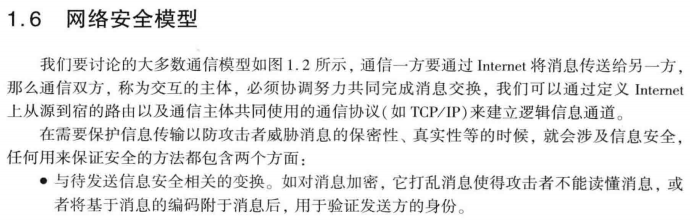

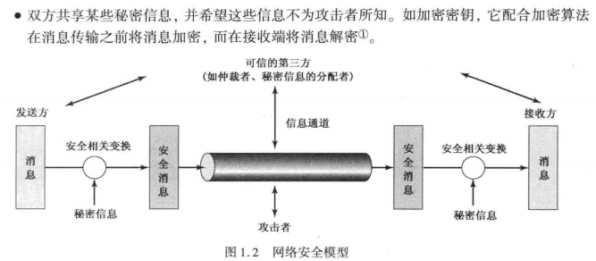

## 第2章 传统加密技术

### 2.1 对称密码模型

**对称加密方案5个基本成分：** 明文、加密算法、密钥、密文、解密算法。

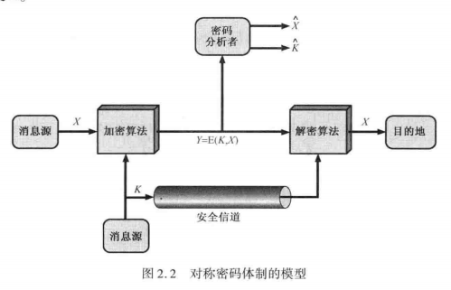

#### 2.1.1 密码编码学

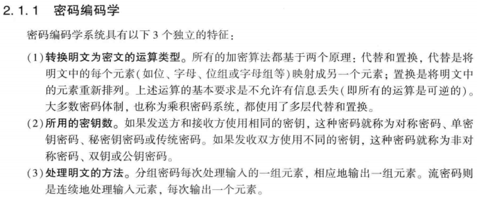

#### 2.1.2 密码分析学和穷举攻击

**对加密信息的攻击类型**

### 2.2 代替技术

**代替技术：** Caesar密码（用字母表后第三个字母表示，利用穷举攻击可破解）、单表代替密码（利用字母使用的相对频率可破解）、多字母代替密码、多表代替密码。

#### 2.2.3 Playfair密码

### 2.3 置换技术

**置换密码：** 对明文按照某种规则进行置换。

**栅栏技术：** 按照对角线的顺序写出明文，而按行读出作为密文。

置换技术保留了字母的统计信息（频率信息），栅栏技术置换结构太简单，容易攻破。

## 第9章 公钥密码学与RSA

### 9.1 公钥密码体制的基本原理

**提出背景，**对称/传统密码存在两大问题：

+ 共享密钥的**分配问题**（保密问题）；
+ 对称密码学无法解决**数字签名**的问题。

**公钥密码的几个认识误区：**

+ 公钥密码比传统密码更安全 —— 取决于密钥长度和破译密文所需计算量；
+ 公钥更通用，传统密码已过时 —— 公钥基于数学函数，计算更复杂，仅仅适用于**密钥管理**和**签名**等**加密文件短**的场景；
+ 公钥密码的密钥分配简单 —— 一样需要某种协议。

#### 9.1.1 公钥密码体制

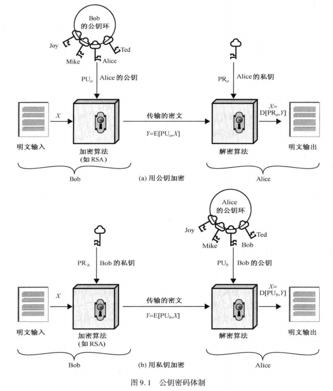

**传统密码和公钥密码：**

1.传统密码

+ 一般要求
  + 加密和解密使用相同的密钥和相同的算法
  + 收发双方必须共享密钥
+ 安全性要求
  + 密钥必须是保密的
  + 若没有其他信息，则解密消息是不可能或至少是不可行的
  + 知道算法和若干密文不足以确定密钥

2.公钥密码

+ 一般要求
  + 同一算法用于加密和解密，但加密和解密使用不同密钥
  + 发送方拥有加密或解密密钥，而接收方拥有另一密钥
+ 安全性要求
  + 两个密钥之一必须是保密的
  + 若没有其他信息，则解密消息是不可能或至少是不可行的
  + 知道算法和其中一个密钥以及若干密文不足以确定另一密钥

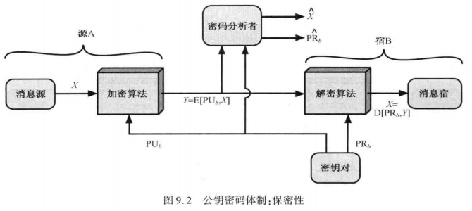

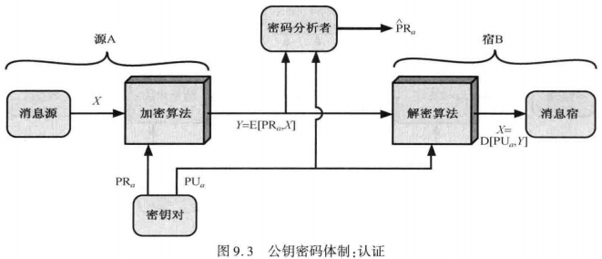

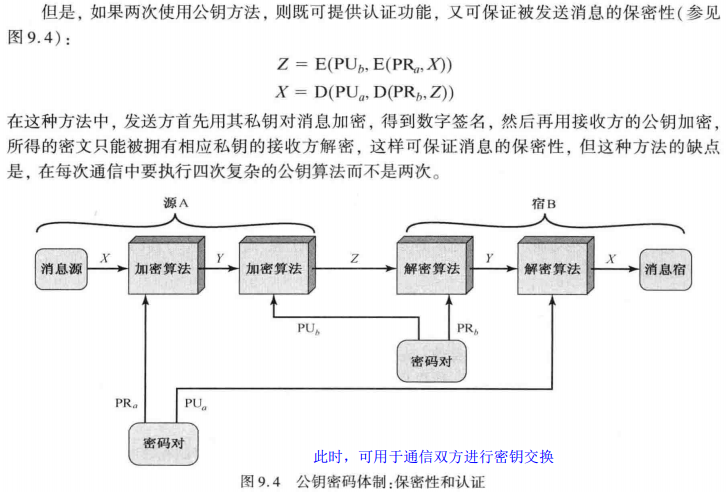

#### 9.1.2 公钥密码体制的应用

## 第11章 密码学Hash函数

### 11.1 密码学Hash函数的应用

**问：** 为了实现消息认证，通信双方**共享哪些东西**？**保护哪些东西**？（保证没有**修改**、**插入**、**删除**和**重放**）

保护：生成的Hash值。

#### 11.1.1 消息认证

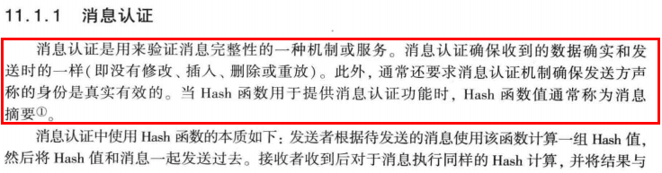

Hash消息认证方案1：（消息+Hash 码）对称加密。 使用对称密码算法加密消息和Hash码（认证+保密）    

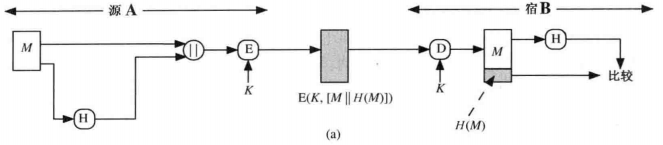

Hash消息认证方案2：消息+Hash 码对称加密。使用对称密码只对Hash 码进行加密，不具有保密性

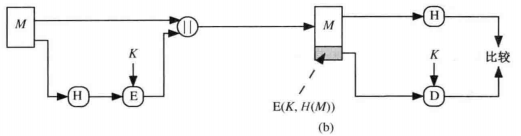

Hash消息认证方案3：M+（M+S）HASH函数，借助通信双方共享相同的秘密值S，不使用加密算法，仅使用Hash也能实现消息认证

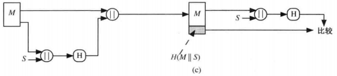

Hash消息认证方案4：(M+（M+S）HASH)对称加密。将整个消息和 Hash值对称加密，在方案3上提供保密性

   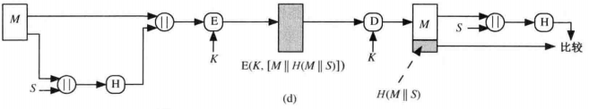

#### 11.1.2 数字签名

**问：** Hash+数字签名和公钥密码学的数字签名有何区别？对数据完整性有何影响？    

+ 公钥密码和Hash都可以保证数据的完整性 
+ Hash后的值长度很短，对Hash后的值进行加密效率高 
+ Hash使得数据的完整性更强，Hash值破解更难，即使知道了密钥，但也不知道Hash函数的值 
+ 单独使用Hash函数主要用于完整性和防伪造。    

### 11.3 需求和安全性

#### 11.3.1 密码学Hash函数的安全性需求

**原像攻击（单向性）：** 反向破解Hash码，得到消息。 Hash值知道， 由Hash值得到消息x。 y=Hash(x)知道y然后破解得到x。 

**第二原像攻击（弱碰撞性）：** 找到与给定消息具有相同Hash码的另一消息。 任意给定消息x找到 Hash(x) =Hash(y)的消息 y 。

**碰撞攻击（强碰撞性）：** 找到任何满足Hash码相同的两条不同的消息，H(x)=H(y) 的偶对（x,y）。    

**问：** 原像攻击（单向性）、第二原像攻击（弱碰撞性）、 碰撞攻击（强碰撞性） 它们之间的关系？不满足时会怎样？不满足，发生攻击时，要求攻击者具备什么？    

**答：**  一个函数如果是抗强碰撞的，那么也是同时抗弱碰撞的，但反之则不一定成立。一个函数可以是抗强碰撞的，但不一定是抗原像攻击的，反之亦然。 

一个函数可以是抗弱碰撞的，但不一定是抗原像攻击的，反之亦然。 

不满足抗原像攻击（单向性）出现的安全问题： （没有用公钥加密）S需要保密性； M和S叠加被算出，M已知，即S被知道，保密性被破坏。

不满足抗弱碰撞攻击（第二原像攻击）出现的问题：可实现消息伪造（突破消息认证）。

不满足抗碰撞攻击（强碰撞性）出现的问题： 可实现数字签名的伪造（突破数字签名）。

#### 11.3.2 穷举攻击

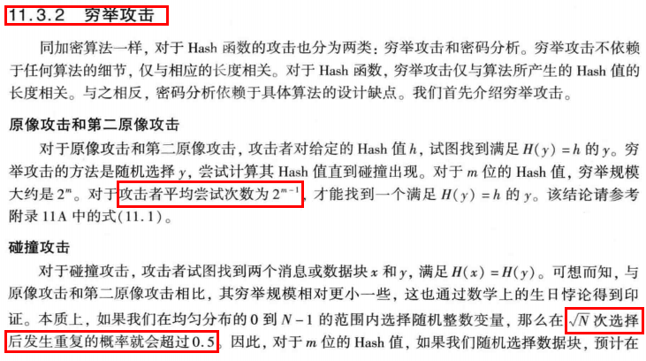

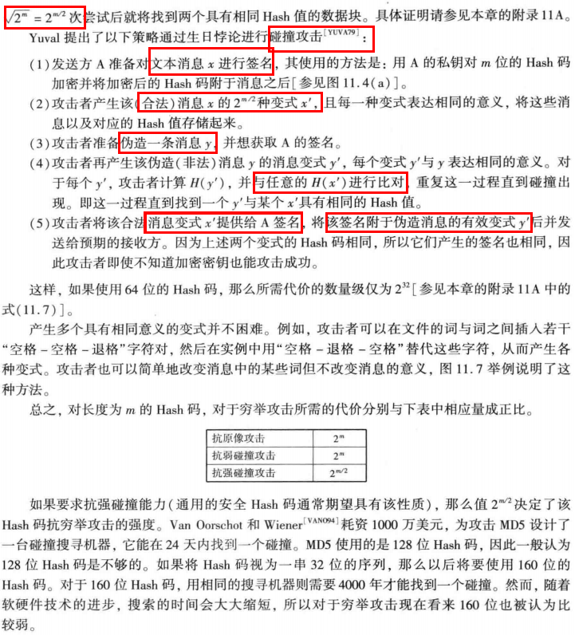

**问：** 在强碰撞时， 要求攻击者需要有什么东西及能力？    

① 发送者准备签名的明文消息x

② 攻击者准备伪造签名的消息y

③ 对消息产生2的 m/2 种变式的能力    

## 第12章 消息认证码

**消息认证码**（MAC）借助消息认证函数，实现对**消息发送者**、**消息本身**、消息的**顺序和及时性**的认证。

### 12.1 对消息认证码的要求

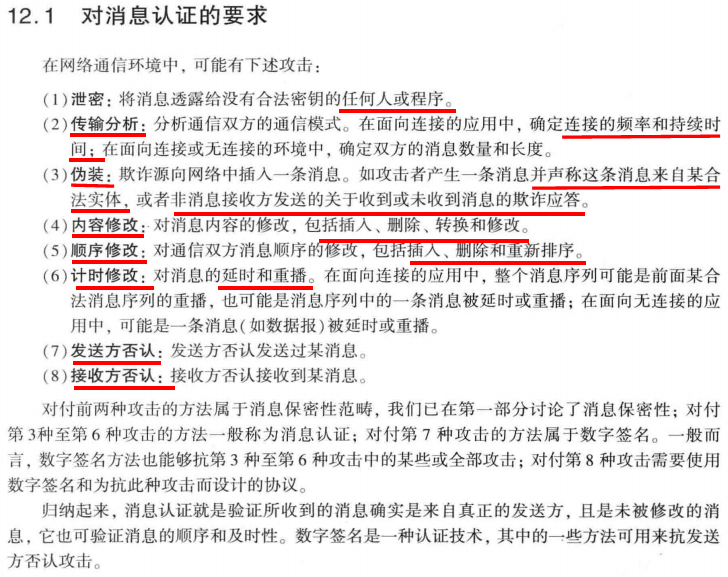

### 12.2 消息认证函数

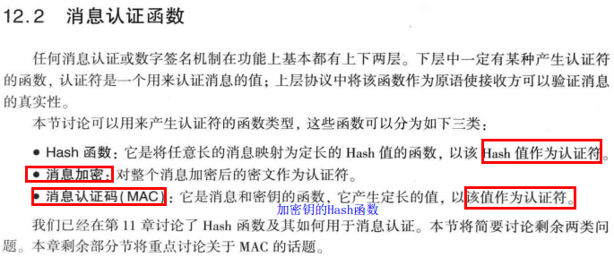

#### 12.2.1 消息加密

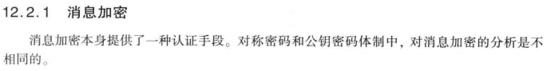

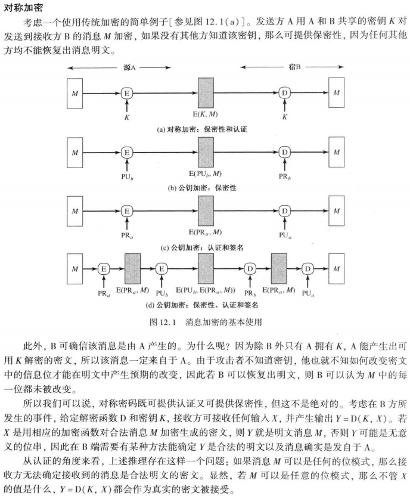

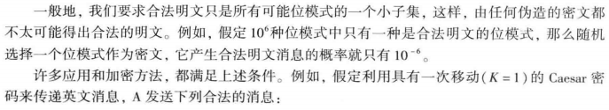

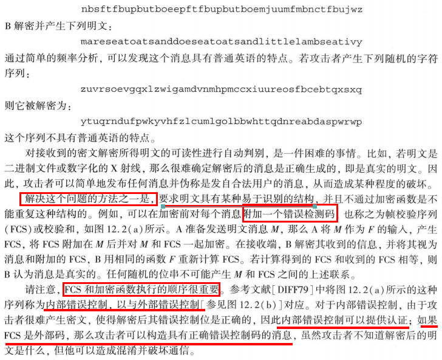

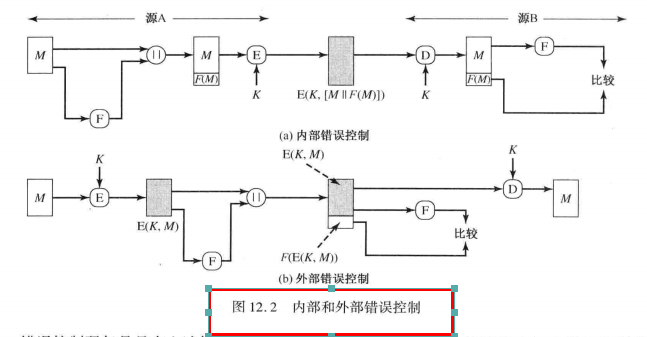

**问：** FCS和Hash函数的区别？ 

Hash函数复杂度更高，难易程度和准确度不同。 有些消息要求并不是那么高，只需粗略检验消息是否被伪造， 即可使用简单的FCS来验证， 不需要Hash，其更复杂，准确度更高。    

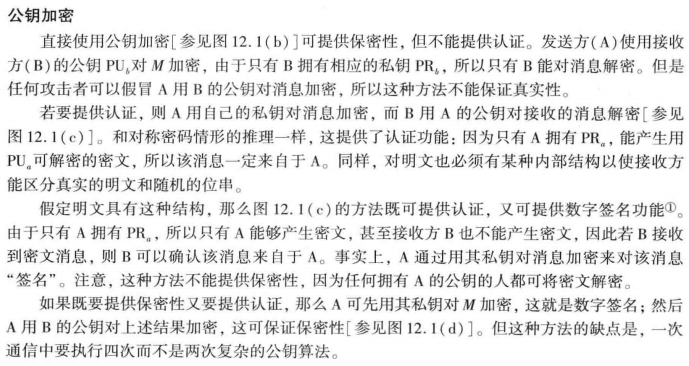

#### 12.2.2 消息认证码

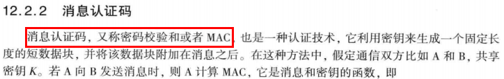

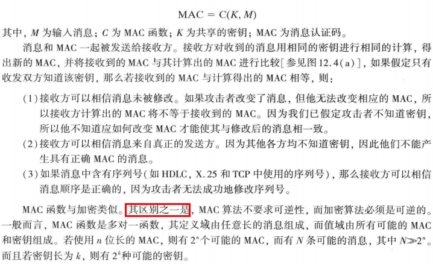

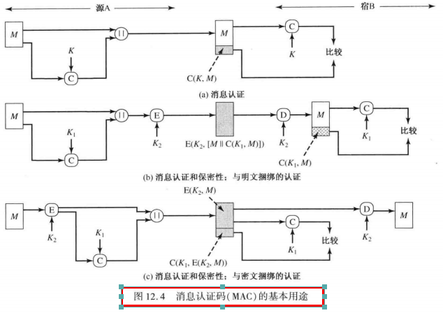

**问：** 对称加密可以提供认证，为何还要引入消息认证码？

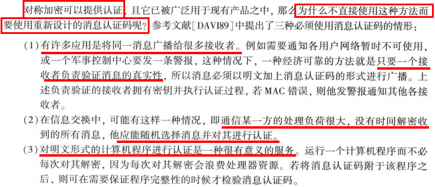

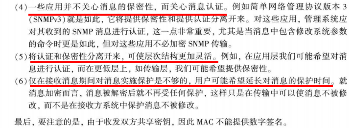

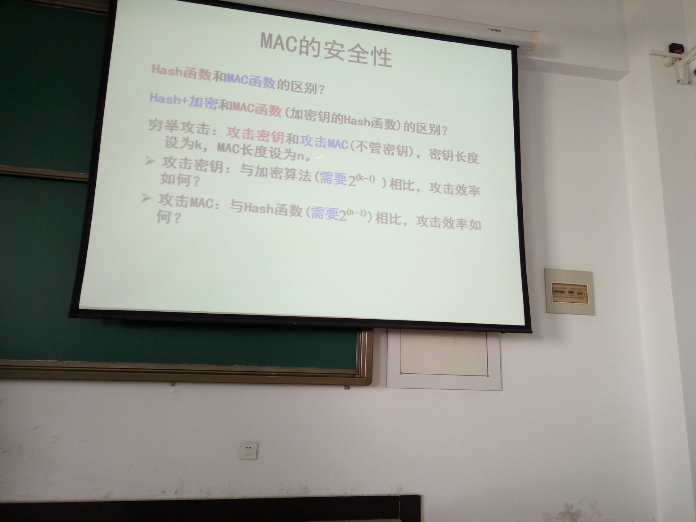

### 12.3 对消息认证码的要求

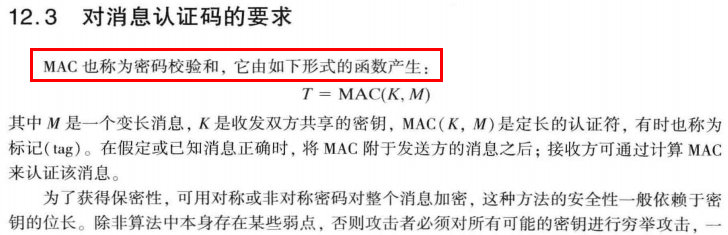

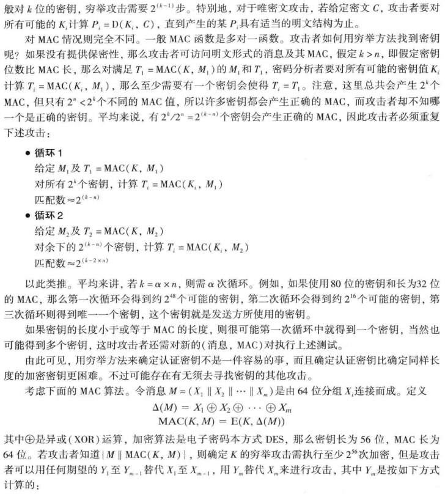

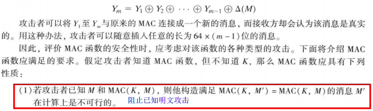

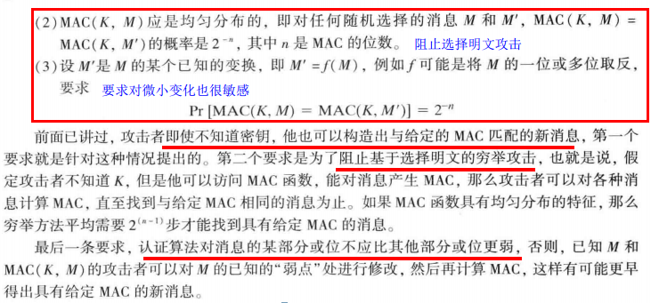

**问：** 密钥未知时，知道MAC函数和可访问MAC函数的区别是？

知道 MAC 函数是： MAC(K,M)知道， 但 K 不知道，不能得到 MAC 值 

可访问 MAC 函数是： MAC(K,M)知道， K 也知道，可以得到 MAC 值    

**问：** 攻击的三种类型？①那个攻击性最强②攻击者分别需要什么东西和能力？③hash 攻击对应那一个？④其攻击者攻击难易程度、信息拥有量和防御者防御难易程度、危害的 趋势？ 

唯密文攻击（算法+密文） 

已知明文攻击（算法+一个或多个明密文对） 

选择明文攻击（算法+一个或多个特定明密文对）    

 

## 第13章 数字签名

### 13.1 数字签名简介

#### 13.1.1 特征

#### 13.1.2 攻击和伪造

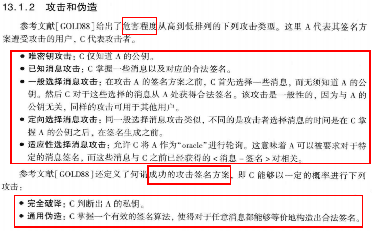

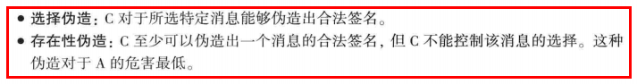

#### 13.1.3 数字签名需求

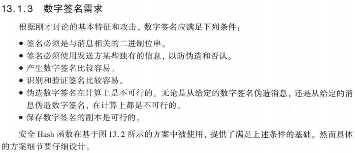

## 基本安全设计——XX大学大数据与网络安全实验室

网络通信涉及的安全问题？网络内部的解决方案？安全体制机制保证安全性的设计？安全标准、技术手段？保密性、可靠性、安全性    

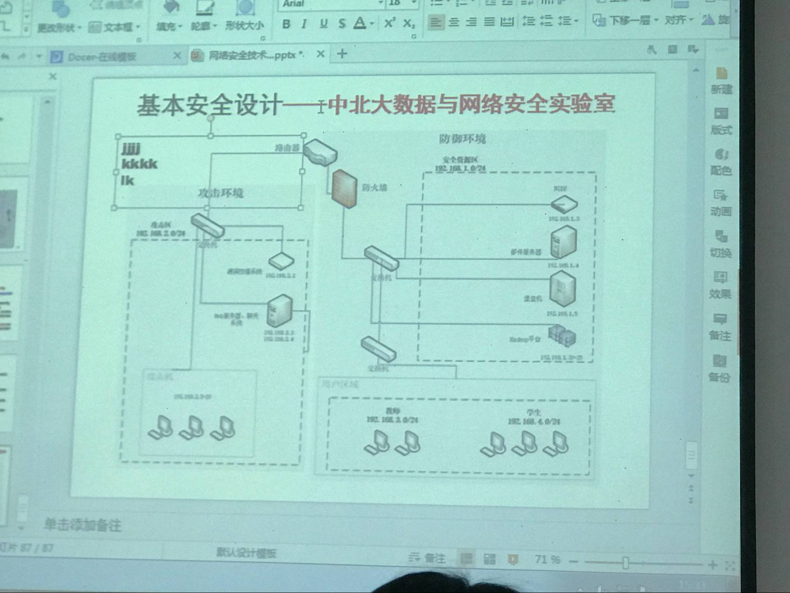

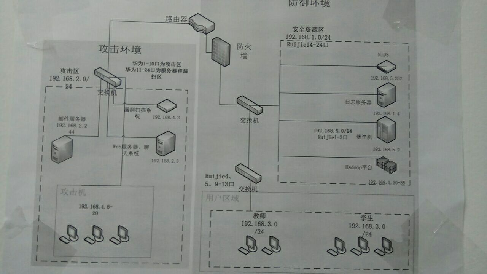

