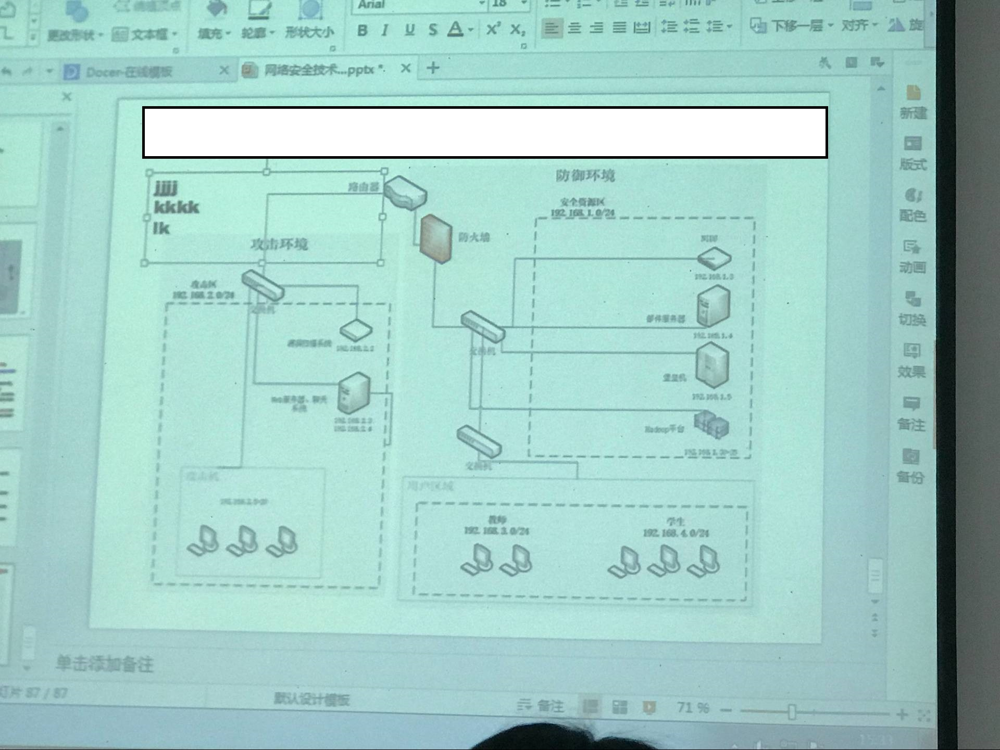
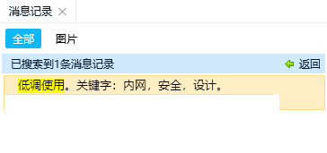

> 更新日志：
>
> 2018年06月17日 20:30 —— 照片去重取优，按知识点及其名称粗略排序分类。

感谢本次贡献资源的同学（排名按拼音首字母顺序）：陈乾、邓晨、付文静、刘娜、刘星锋、邱李云、任嘉辉、王泽、杨谨瑗。

如果还有同学拍了照片的，欢迎分享出来。本网址不再变更，定期会发布更新信息，请持续关注。

**考试题型：** 简答题、应用题、开放性试题（可能）。

### 板书

### 对消息认证码的要求

### 对称密码模型

### 代替技术

### 攻击类型：唯密文、已知明文、选择明文

 

### 公钥密码体制的基本原理

### 基本安全设计——XX大学大数据与网络安全实验室

### 密码学Hash函数的安全性

### 密码学Hash函数的应用

**可参考网址：** [密码学Hash函数](https://www.cnblogs.com/block2016/p/5623902.html) 

### MAC的安全性

### 数字签名

### 网络安全模型

### 网络安全服务

### 网络安全机制

### 网络安全服务与机制的关系

### 消息认证码

### 消息认证函数

### 置换技术

