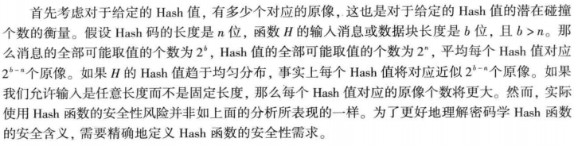
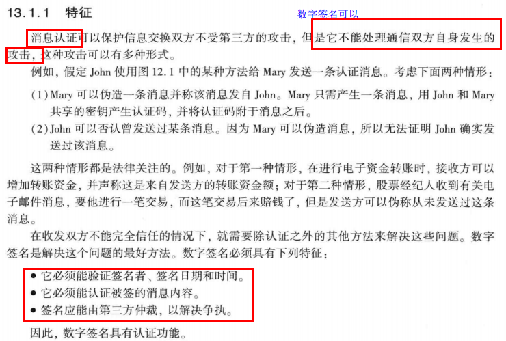

> 更新日志：
>
> 2018年06月17日 20:30 —— 照片去重取优，按知识点及其名称粗略排序分类。
>
> 2018年06月18日 12:00 —— 根据书籍顺序编排知识点
>
> 2018年06月18日 16:30 —— 参考学习委员总结知识点补漏

**感谢：** 本次贡献资源的同学（排名按拼音首字母顺序）：陈乾、邓晨、付文静、刘娜、刘星锋、邱李云、任嘉辉、王泽、杨谨瑗。

**备注：** 本总结可能不包含第一、第二讲以及网络攻击技术，一群有对应PPT。

**考试题型：** 简答题、应用题、开放性试题（可能）。

## 第1章 概览

### 1.1 计算机完全概览

#### 1.1.1 计算机安全的定义

### 1.2 OSI安全框架

### 1.3 安全攻击

#### 1.3.1 被动攻击

#### 1.3.2 主动攻击

**总结：** 主动攻击（易监测，难预防）、被动攻击（易预防、难监测）。

### 1.4 安全服务

**总结：** 认证（同等实体认证、数据源认证）、访问控制、数据保密性、数据完整性、不可否认性。

### 1.5 安全机制

**总结：** 加密、数字签名、访问控制、数据完整性、认证交换、流量填充、路由控制、公证。

**问 1：** 为什么数字签名可以实现同等实体认证？ 

答：数字签名技术是将摘要信息用发送者的私钥加密，与原文一起传送给接收者。数字签名使用的是己方的私钥进行签名，再加上有第三方对签名进行仲裁，因而能验证签名者、签名日期以及被签的消息内容。所以，数字签名可以实现同等实体认证。

**问 2：** 对称密码模型有什么应用？（从保密性、认证性、完整性等上来说）    

发送方和接收方用共享密钥对消息进行加密，此时若没有第三方知道该密钥，那么对称密码模型可提供保密性。

此外，因为只有发送方和接收方共享该密钥，故而接收方可以确信该消息由发送发产生，此时对称密码模型实现了认证性。

对称密码模型辅以Hash函数可以实现完整性。

### 1.6 网络安全模型

## 第2章 传统加密技术

### 2.1 对称密码模型

**对称加密方案5个基本成分：** 明文、加密算法、密钥、密文、解密算法。

#### 2.1.1 密码编码学

#### 2.1.2 密码分析学和穷举攻击

**对加密信息的攻击类型**

 

### 2.2 代替技术

**代替技术：** Caesar密码（用字母表后第三个字母表示，利用穷举攻击可破解）、单表代替密码（利用字母使用的相对频率可破解）、多字母代替密码、多表代替密码。

#### 2.2.3 Playfair密码

### 2.3 置换技术

## 第9章 公钥密码学与RSA

### 9.1 公钥密码体制的基本原理

**提出背景，**对称/传统密码存在两大问题：

+ 共享密钥的**分配问题**（保密问题）；
+ 对称密码学无法解决**数字签名**的问题。

**公钥密码的几个认识误区：**

+ 公钥密码比传统密码更安全 —— 取决于密钥长度和破译密文所需计算量；
+ 公钥更通用，传统密码已过时 —— 公钥基于数学函数，计算更复杂，仅仅适用于**密钥管理**和**签名**等**加密文件短**的场景；
+ 公钥密码的密钥分配简单 —— 一样需要某种协议。

#### 9.1.1 公钥密码体制

**传统密码和公钥密码：**

1.传统密码

+ 一般要求
  + 加密和解密使用相同的密钥和相同的算法
  + 收发双方必须共享密钥
+ 安全性要求
  + 密钥必须是保密的
  + 若没有其他信息，则解密消息是不可能或至少是不可行的
  + 知道算法和若干密文不足以确定密钥

2.公钥密码

+ 一般要求
  + 同一算法用于加密和解密，但加密和解密使用不同密钥
  + 发送方拥有加密或解密密钥，而接收方拥有另一密钥
+ 安全性要求
  + 两个密钥之一必须是保密的
  + 若没有其他信息，则解密消息是不可能或至少是不可行的
  + 知道算法和其中一个密钥以及若干密文不足以确定另一密钥

#### 9.1.2 公钥密码体制的应用

## 第11章 密码学Hash函数

### 11.1 密码学Hash函数的应用

#### 11.1.1 消息认证

#### 11.1.2 数字签名

### 11.3 需求和安全性

#### 11.3.1 密码学Hash函数的安全性需求

**可参考网址：** [密码学Hash函数](https://www.cnblogs.com/block2016/p/5623902.html) 

#### 11.3.2 穷举攻击

## 第12章 消息认证码

### 12.1 对消息认证码的要求

### 12.2 消息认证函数

#### 12.2.1 消息加密

#### 12.2.2 消息认证码

### 12.3 对消息认证码的要求

## 第13章 数字签名

### 13.1 数字签名简介

#### 13.1.1 特征

#### 13.1.2 攻击和伪造

#### 13.1.3 数字签名需求

## 基本安全设计——XX大学大数据与网络安全实验室

