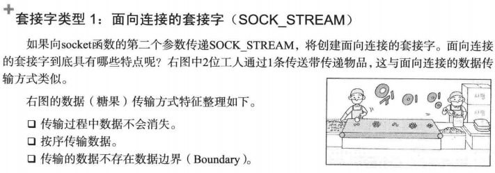

> 备注：有红色外框的为重点，其他为辅助知识点。

### 第1章 理解网络编程和套接字

#### 1.1 理解网络编程和套接字

**构建接电话套接字**


**编写"Hello world!"服务器端**

```c
// hello_server.c
#include <stdio.h>
#include <stdlib.h>
#include <string.h>
#include <unistd.h>
#include <arpa/inet.h>
#include <sys/socket.h>

void error_handling(char *message);

int main(int argc, char *argv[])
{
	int serv_sock;
	int clnt_sock;

	struct sockaddr_in serv_addr;
	struct sockaddr_in clnt_addr;
	socklen_t clnt_addr_size;

	char message[]="Hello World!";
	
	if(argc!=2){
		printf("Usage : %s <port>\n", argv[0]);
		exit(1);
	}
	// 调用socket函数创建套接字
	serv_sock=socket(PF_INET, SOCK_STREAM, 0);
	if(serv_sock == -1)
		error_handling("socket() error");
	
	memset(&serv_addr, 0, sizeof(serv_addr));
	serv_addr.sin_family=AF_INET;
	serv_addr.sin_addr.s_addr=htonl(INADDR_ANY);
	serv_addr.sin_port=htons(atoi(argv[1]));
	
    // 调用bind函数分配IP地址和端口号
	if(bind(serv_sock, (struct sockaddr*) &serv_addr, sizeof(serv_addr))==-1 )
		error_handling("bind() error"); 
	
    // 调用listen函数转为可接收请求状态
	if(listen(serv_sock, 5)==-1)
		error_handling("listen() error");
	
	clnt_addr_size=sizeof(clnt_addr);  
    // 调用accept函数转为可接收请求状态
	clnt_sock=accept(serv_sock, (struct sockaddr*)&clnt_addr,&clnt_addr_size);
	if(clnt_sock==-1)
		error_handling("accept() error");  
	
	write(clnt_sock, message, sizeof(message));
	close(clnt_sock);	
	close(serv_sock);
	return 0;
}

void error_handling(char *message)
{
	fputs(message, stderr);
	fputc('\n', stderr);
	exit(1);
}
```

**构建打电话套接字**


```c
// hello_client.c
#include <stdio.h>
#include <stdlib.h>
#include <string.h>
#include <unistd.h>
#include <arpa/inet.h>
#include <sys/socket.h>

void error_handling(char *message);

int main(int argc, char* argv[])
{
	int sock;
	struct sockaddr_in serv_addr;
	char message[200];
	int str_len;
	
	if(argc!=3){
		printf("Usage : %s <IP> <port>\n", argv[0]);
		exit(1);
	}
	
	sock=socket(PF_INET, SOCK_STREAM, 0);
	if(sock == -1)
		error_handling("socket() error");
	
	memset(&serv_addr, 0, sizeof(serv_addr));
	serv_addr.sin_family=AF_INET;
	serv_addr.sin_addr.s_addr=inet_addr(argv[1]);
	serv_addr.sin_port=htons(atoi(argv[2]));
		
	if(connect(sock, (struct sockaddr*)&serv_addr, sizeof(serv_addr))==-1) 
		error_handling("connect() error!");
	
	sleep(1);
	str_len=read(sock, message, sizeof(message)-1);
	if(str_len==-1)
		error_handling("read() error!");
	printf("%s", message);
	close(sock);
	return 0;
}

void error_handling(char *message)
{
	fputs(message, stderr);
	fputc('\n', stderr);
	exit(1);
}

```

#### 1.2 基于Linux的文件操作


### 第2章 套接字类型与协议设置

#### 2.1 套接字协议及其数据传输特性

**创建套接字**


**协议族（Protocol Family）**


**套接字类型（Type）**


**套接字类型1：面向连接的套接字（SOCK_STREAM）**




**套接字类型2：面向消息的套接字（SOCK_DGRAM）**


**协议的最终选择**


### 第3章 地址族与数据序列

#### 3.1 分配给套接字的IP地址和端口号

**网络地址分类与主机地址边界**


#### 3.2 地址信息的表示

**表示IPv4地址的结构体 sockaddr_in**


#### 3.4 网络地址的初始化与分配

**网络地址初始化**


**INADDR_ANY**


**向套接字分配网络地址**


### 第4章 基于TCP的服务器端/客户端（1）

#### 4.1 理解TCP和UDP


#### 4.2 实现基于TCP的服务器端/客户端

**TCP服务器端的默认函数调用顺序**


**进入等待连接请求状态**


**受理客户端连接请求**


**TCP客户端的默认函数调用顺序**


