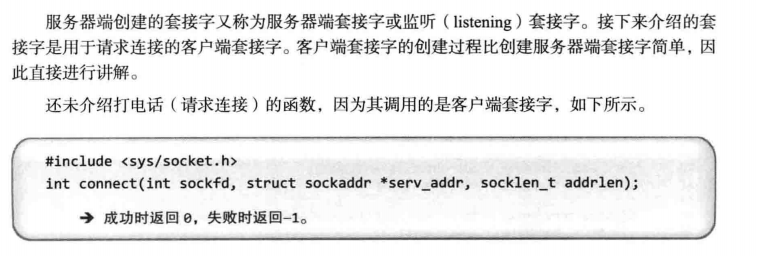
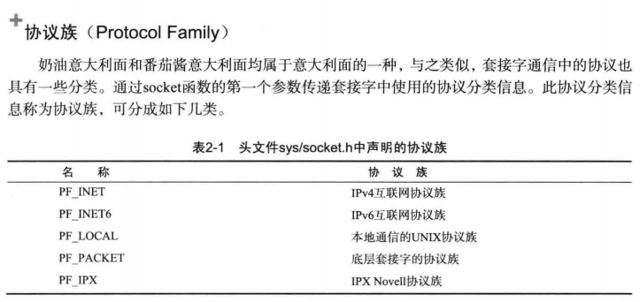
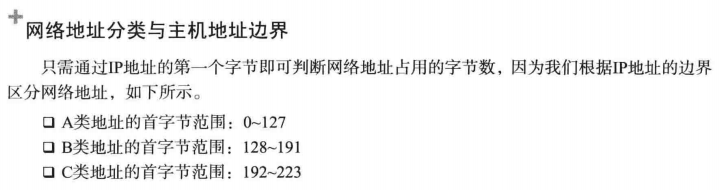
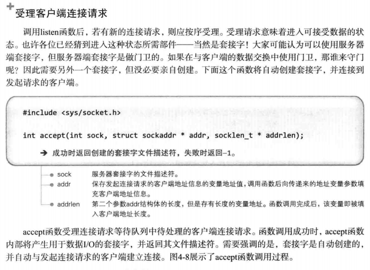
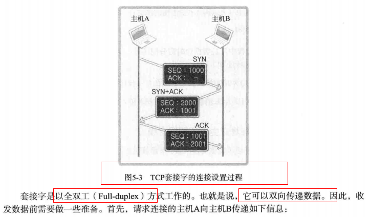
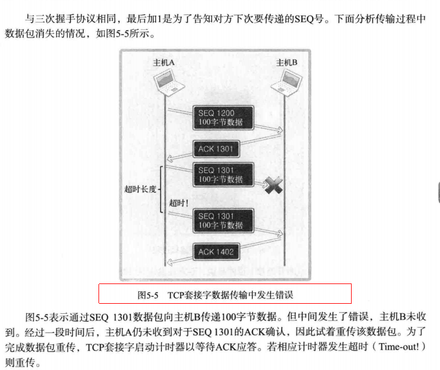
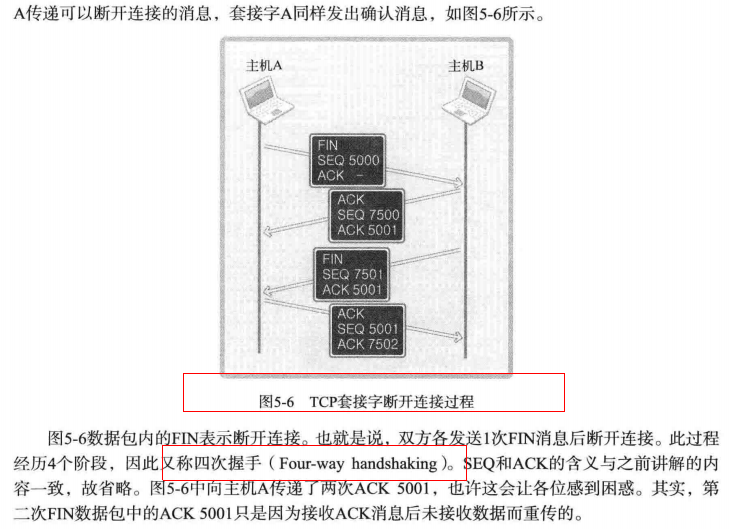
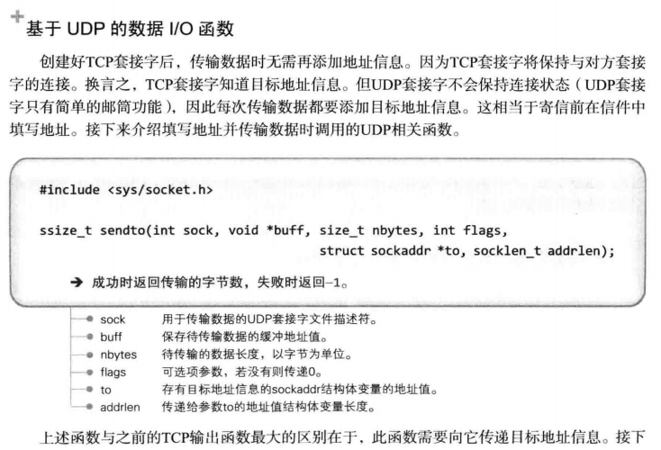
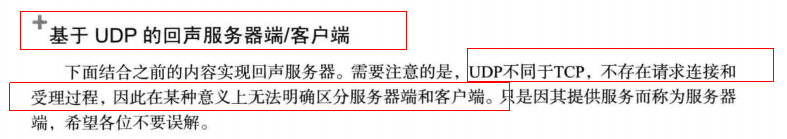
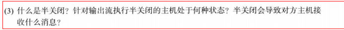

> 备注：有红色外框的为重点，其他为辅助知识点。

### 第1章 理解网络编程和套接字

#### 1.1 理解网络编程和套接字

**构建接电话套接字**


**编写"Hello world!"服务器端**

```c
// hello_server.c
#include <stdio.h>
#include <stdlib.h>
#include <string.h>
#include <unistd.h>
#include <arpa/inet.h>
#include <sys/socket.h>

void error_handling(char *message);

int main(int argc, char *argv[])
{
	int serv_sock;
	int clnt_sock;

	struct sockaddr_in serv_addr;
	struct sockaddr_in clnt_addr;
	socklen_t clnt_addr_size;

	char message[]="Hello World!";
	
	if(argc!=2){
		printf("Usage : %s <port>\n", argv[0]);
		exit(1);
	}
	// 调用socket函数创建套接字
	serv_sock=socket(PF_INET, SOCK_STREAM, 0);
	if(serv_sock == -1)
		error_handling("socket() error");
	
	memset(&serv_addr, 0, sizeof(serv_addr));
	serv_addr.sin_family=AF_INET;
	serv_addr.sin_addr.s_addr=htonl(INADDR_ANY);
	serv_addr.sin_port=htons(atoi(argv[1]));
	
    // 调用bind函数分配IP地址和端口号
	if(bind(serv_sock, (struct sockaddr*) &serv_addr, sizeof(serv_addr))==-1 )
		error_handling("bind() error"); 
	
    // 调用listen函数转为可接收请求状态
	if(listen(serv_sock, 5)==-1)
		error_handling("listen() error");
	
	clnt_addr_size=sizeof(clnt_addr);  
    // 调用accept函数转为可接收请求状态
	clnt_sock=accept(serv_sock, (struct sockaddr*)&clnt_addr,&clnt_addr_size);
	if(clnt_sock==-1)
		error_handling("accept() error");  
	
	write(clnt_sock, message, sizeof(message));
	close(clnt_sock);	
	close(serv_sock);
	return 0;
}

void error_handling(char *message)
{
	fputs(message, stderr);
	fputc('\n', stderr);
	exit(1);
}
```

**构建打电话套接字**




```c
// hello_client.c
#include <stdio.h>
#include <stdlib.h>
#include <string.h>
#include <unistd.h>
#include <arpa/inet.h>
#include <sys/socket.h>

void error_handling(char *message);

int main(int argc, char* argv[])
{
	int sock;
	struct sockaddr_in serv_addr;
	char message[200];
	int str_len;
	
	if(argc!=3){
		printf("Usage : %s <IP> <port>\n", argv[0]);
		exit(1);
	}
	
	sock=socket(PF_INET, SOCK_STREAM, 0);
	if(sock == -1)
		error_handling("socket() error");
	
	memset(&serv_addr, 0, sizeof(serv_addr));
	serv_addr.sin_family=AF_INET;
	serv_addr.sin_addr.s_addr=inet_addr(argv[1]);
	serv_addr.sin_port=htons(atoi(argv[2]));
		
	if(connect(sock, (struct sockaddr*)&serv_addr, sizeof(serv_addr))==-1) 
		error_handling("connect() error!");
	
	sleep(1);
	str_len=read(sock, message, sizeof(message)-1);
	if(str_len==-1)
		error_handling("read() error!");
	printf("%s", message);
	close(sock);
	return 0;
}

void error_handling(char *message)
{
	fputs(message, stderr);
	fputc('\n', stderr);
	exit(1);
}

```

#### 1.2 基于Linux的文件操作


### 第2章 套接字类型与协议设置

#### 2.1 套接字协议及其数据传输特性

**创建套接字**


**协议族（Protocol Family）**



**套接字类型（Type）**


**套接字类型1：面向连接的套接字（SOCK_STREAM）**


**套接字类型2：面向消息的套接字（SOCK_DGRAM）**


**协议的最终选择**


### 第3章 地址族与数据序列

#### 3.1 分配给套接字的IP地址和端口号

**网络地址分类与主机地址边界**




#### 3.2 地址信息的表示

**表示IPv4地址的结构体 sockaddr_in**


#### 3.4 网络地址的初始化与分配

**网络地址初始化**


**INADDR_ANY**


**向套接字分配网络地址**


### 第4章 基于TCP的服务器端/客户端（1）

#### 4.1 理解TCP和UDP


#### 4.2 实现基于TCP的服务器端/客户端

**TCP服务器端的默认函数调用顺序**


**进入等待连接请求状态**


**受理客户端连接请求**



**TCP客户端的默认函数调用顺序**


**基于TCP的服务器端/客户端函数调用关系**


#### 4.3 实现迭代服务器端/客户端


**迭代回声服务器端/客户端**

```c
// echo_server.c
#include <stdio.h>
#include <stdlib.h>
#include <string.h>
#include <unistd.h>
#include <arpa/inet.h>
#include <sys/socket.h>

#define BUF_SIZE 1024
void error_handling(char *message);

int main(int argc, char *argv[])
{
    int serv_sock, clnt_sock;
    char message[BUF_SIZE];
    int str_len, i;

    struct sockaddr_in serv_adr;
    struct sockaddr_in clnt_adr;
    socklen_t clnt_adr_sz;

    if(argc!=2) {
        printf("Usage : %s <port>\n", argv[0]);
        exit(1);
    }

    serv_sock=socket(PF_INET, SOCK_STREAM, 0);   
    if(serv_sock==-1)
        error_handling("socket() error");

    memset(&serv_adr, 0, sizeof(serv_adr));
    serv_adr.sin_family=AF_INET;
    serv_adr.sin_addr.s_addr=htonl(INADDR_ANY);
    serv_adr.sin_port=htons(atoi(argv[1]));

    if(bind(serv_sock, (struct sockaddr*)&serv_adr, sizeof(serv_adr))==-1)
        error_handling("bind() error");

    if(listen(serv_sock, 5)==-1)
        error_handling("listen() error");

    clnt_adr_sz=sizeof(clnt_adr);
    // 循环接收五个客户端
    for(i=0; i<5; i++)
    {
        clnt_sock=accept(serv_sock, (struct sockaddr*)&clnt_adr, &clnt_adr_sz);
        if(clnt_sock==-1)
            error_handling("accept() error");
        else
            printf("Connected client %d \n", i+1);
        // 将读到的内容原封不动地写回去
        while((str_len=read(clnt_sock, message, BUF_SIZE))!=0)
            write(clnt_sock, message, str_len);
        // 针对套接字调用close函数，向连接的相应套接字发送EOF
        close(clnt_sock);
    }

    close(serv_sock);
    return 0;
}

void error_handling(char *message)
{
    fputs(message, stderr);
    fputc('\n', stderr);
    exit(1);
}
```

```c
// echo_client.c
#include <stdio.h>
#include <stdlib.h>
#include <string.h>
#include <unistd.h>
#include <arpa/inet.h>
#include <sys/socket.h>

#define BUF_SIZE 1024
void error_handling(char *message);

int main(int argc, char *argv[])
{
    int sock;
    char message[BUF_SIZE];
    int str_len;
    struct sockaddr_in serv_adr;

    if(argc!=3) {
        printf("Usage : %s <IP> <port>\n", argv[0]);
        exit(1);
    }

    sock=socket(PF_INET, SOCK_STREAM, 0);   
    if(sock==-1)
        error_handling("socket() error");

    memset(&serv_adr, 0, sizeof(serv_adr));
    serv_adr.sin_family=AF_INET;
    serv_adr.sin_addr.s_addr=inet_addr(argv[1]);
    serv_adr.sin_port=htons(atoi(argv[2]));

    if(connect(sock, (struct sockaddr*)&serv_adr, sizeof(serv_adr))==-1)
        error_handling("connect() error!");
    else
        puts("Connected...........");

    while(1) 
    {
        fputs("Input message(Q to quit): ", stdout);
        fgets(message, BUF_SIZE, stdin);

        if(!strcmp(message,"q\n") || !strcmp(message,"Q\n"))
            break;

        write(sock, message, strlen(message));
        str_len=read(sock, message, BUF_SIZE-1);
        message[str_len]=0;
        printf("Message from server: %s", message);
    }

    close(sock);
    return 0;
}

void error_handling(char *message)
{
    fputs(message, stderr);
    fputc('\n', stderr);
    exit(1);
}
```

### 第5章 基于TCP的服务器端/客户端（2）

#### 5.2 TCP原理

**TCP内部工作原理1：与对方套接字的连接**




**TCP内部工作原理2：与对方主机的数据交换**




**TCP的内部工作原理3：断开与套接字的连接**




### 第6章 基于UDP的服务器端/客户端

#### 6.1 理解UDP

**UDP套接字的特点**


**UDP的高效使用**


#### 6.2 实现基于UDP的服务器端/客户端

**基于UDP的数据I/O函数**




**基于UDP的回声服务器端/客户端**



```c
// uecho_server.c
#include <stdio.h>
#include <stdlib.h>
#include <string.h>
#include <unistd.h>
#include <arpa/inet.h>
#include <sys/socket.h>

#define BUF_SIZE 30
void error_handling(char *message);

int main(int argc, char *argv[])
{
    int serv_sock;
    char message[BUF_SIZE];
    int str_len;
    socklen_t clnt_adr_sz;

    struct sockaddr_in serv_adr, clnt_adr;
    if(argc!=2){
        printf("Usage : %s <port>\n", argv[0]);
        exit(1);
    }
    // 向socket函数传递SOCK_DGRAM，创建UDP套接字
    serv_sock=socket(PF_INET, SOCK_DGRAM, 0);
    if(serv_sock==-1)
        error_handling("UDP socket creation error");

    memset(&serv_adr, 0, sizeof(serv_adr));
    serv_adr.sin_family=AF_INET;
    serv_adr.sin_addr.s_addr=htonl(INADDR_ANY);
    serv_adr.sin_port=htons(atoi(argv[1]));

    if(bind(serv_sock, (struct sockaddr*)&serv_adr, sizeof(serv_adr))==-1)
        error_handling("bind() error");

    while(1) 
    {
        clnt_adr_sz=sizeof(clnt_adr);
        // 利用bind函数分配的地址接收数据，不限制数据传输对象
        str_len=recvfrom(serv_sock, message, BUF_SIZE, 0, 
                         (struct sockaddr*)&clnt_adr, &clnt_adr_sz);
        // 通过recvfrom函数获取传输端地址，利用改地址，借助sendto函数逆向重传
        sendto(serv_sock, message, str_len, 0, 
               (struct sockaddr*)&clnt_adr, clnt_adr_sz);
    }	
    close(serv_sock);
    return 0;
}

void error_handling(char *message)
{
    fputs(message, stderr);
    fputc('\n', stderr);
    exit(1);
}
```

```c
// uecho_client.c
#include <stdio.h>
#include <stdlib.h>
#include <string.h>
#include <unistd.h>
#include <arpa/inet.h>
#include <sys/socket.h>

#define BUF_SIZE 30
void error_handling(char *message);

int main(int argc, char *argv[])
{
    int sock;
    char message[BUF_SIZE];
    int str_len;
    socklen_t adr_sz;

    struct sockaddr_in serv_adr, from_adr;
    if(argc!=3){
        printf("Usage : %s <IP> <port>\n", argv[0]);
        exit(1);
    }

    //  创建UDP套接字
    sock=socket(PF_INET, SOCK_DGRAM, 0);   
    if(sock==-1)
        error_handling("socket() error");

    memset(&serv_adr, 0, sizeof(serv_adr));
    serv_adr.sin_family=AF_INET;
    serv_adr.sin_addr.s_addr=inet_addr(argv[1]);
    serv_adr.sin_port=htons(atoi(argv[2]));

    while(1)
    {
        fputs("Insert message(q to quit): ", stdout);
        fgets(message, sizeof(message), stdin);     
        if(!strcmp(message,"q\n") || !strcmp(message,"Q\n"))	
            break;
        // 调用sento函数发送数据
        sendto(sock, message, strlen(message), 0, 
               (struct sockaddr*)&serv_adr, sizeof(serv_adr));
        adr_sz=sizeof(from_adr);
        // 接收数据
        str_len=recvfrom(sock, message, BUF_SIZE, 0, 
                         (struct sockaddr*)&from_adr, &adr_sz);

        message[str_len]=0;
        printf("Message from server: %s", message);
    }	
    close(sock);
    return 0;
}

void error_handling(char *message)
{
    fputs(message, stderr);
    fputc('\n', stderr);
    exit(1);
}
```

#### 6.3 UDP数据传输特性和调用connect函数

**已连接（connected）UDP套接字与未连接（unconnected）UDP套接字**


**创建已连接UDP套接字**


#### 6.5 习题


### 第7章 优雅地断开套接字连接

#### 7.1 基于TCP的半关闭

**单方面断开连接带来的问题**


**针对优雅断开的shutdown函数**


#### 7.3 习题



### 第8章 域名及网络地址

#### 8.1 域名系统


