> **备注：有红色外框的为老师勾画重点，其他为辅助知识点。（重要代码已标出）**

### 第1章 理解网络编程和套接字

#### 1.1 理解网络编程和套接字

**构建接电话套接字**

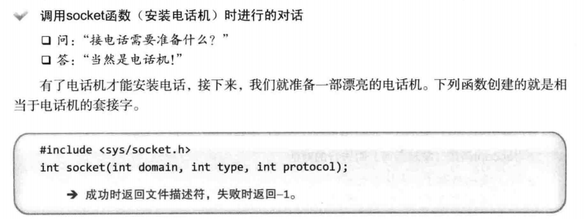

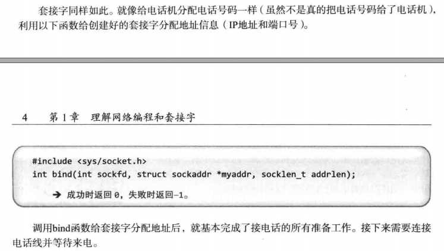


**编写"Hello world!"服务器端**

```c
// hello_server.c
#include <stdio.h>
#include <stdlib.h>
#include <string.h>
#include <unistd.h>
#include <arpa/inet.h>
#include <sys/socket.h>

void error_handling(char *message);

int main(int argc, char *argv[])
{
    int serv_sock;
    int clnt_sock;

    struct sockaddr_in serv_addr;
    struct sockaddr_in clnt_addr;
    socklen_t clnt_addr_size;

    char message[]="Hello World!";

    if(argc!=2){
        printf("Usage : %s <port>\n", argv[0]);
        exit(1);
    }
    // 调用socket函数创建套接字
    serv_sock=socket(PF_INET, SOCK_STREAM, 0);
    if(serv_sock == -1)
        error_handling("socket() error");

    memset(&serv_addr, 0, sizeof(serv_addr));
    serv_addr.sin_family=AF_INET;
    serv_addr.sin_addr.s_addr=htonl(INADDR_ANY);
    serv_addr.sin_port=htons(atoi(argv[1]));

    // 调用bind函数分配IP地址和端口号
    if(bind(serv_sock, (struct sockaddr*) &serv_addr, sizeof(serv_addr))==-1 )
        error_handling("bind() error"); 

    // 调用listen函数转为可接收请求状态
    if(listen(serv_sock, 5)==-1)
        error_handling("listen() error");

    clnt_addr_size=sizeof(clnt_addr);  
    // 调用accept函数转为可接收请求状态
    clnt_sock=accept(serv_sock, (struct sockaddr*)&clnt_addr,&clnt_addr_size);
    if(clnt_sock==-1)
        error_handling("accept() error");  

    write(clnt_sock, message, sizeof(message));
    close(clnt_sock);	
    close(serv_sock);
    return 0;
}

void error_handling(char *message)
{
    fputs(message, stderr);
    fputc('\n', stderr);
    exit(1);
}
```

**构建打电话套接字**


```c
// hello_client.c
#include <stdio.h>
#include <stdlib.h>
#include <string.h>
#include <unistd.h>
#include <arpa/inet.h>
#include <sys/socket.h>

void error_handling(char *message);

int main(int argc, char* argv[])
{
    int sock;
    struct sockaddr_in serv_addr;
    char message[200];
    int str_len;

    if(argc!=3){
        printf("Usage : %s <IP> <port>\n", argv[0]);
        exit(1);
    }
    // 创建TCP套接字
    sock=socket(PF_INET, SOCK_STREAM, 0);
    if(sock == -1)
        error_handling("socket() error");

    memset(&serv_addr, 0, sizeof(serv_addr));
    serv_addr.sin_family=AF_INET;
    serv_addr.sin_addr.s_addr=inet_addr(argv[1]);
    serv_addr.sin_port=htons(atoi(argv[2]));
    // 调用connect函数向服务器发送连接请求
    if(connect(sock, (struct sockaddr*)&serv_addr, sizeof(serv_addr))==-1) 
        error_handling("connect() error!");

    sleep(1);
    str_len=read(sock, message, sizeof(message)-1);
    if(str_len==-1)
        error_handling("read() error!");
    printf("%s", message);
    close(sock);
    return 0;
}

void error_handling(char *message)
{
    fputs(message, stderr);
    fputc('\n', stderr);
    exit(1);
}

```

#### 1.2 基于Linux的文件操作


### 第2章 套接字类型与协议设置

#### 2.1 套接字协议及其数据传输特性

**创建套接字**


**协议族（Protocol Family）**


**套接字类型（Type）**

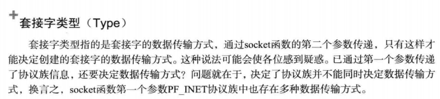

**套接字类型1：面向连接的套接字（SOCK_STREAM）**


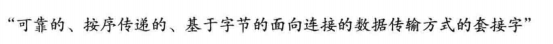

**套接字类型2：面向消息的套接字（SOCK_DGRAM）**


**协议的最终选择**


### 第3章 地址族与数据序列

#### 3.1 分配给套接字的IP地址和端口号

**网络地址分类与主机地址边界**


**用于区分套接字的端口号**


#### 3.2 地址信息的表示

**表示IPv4地址的结构体 sockaddr_in**


#### 3.4 网络地址的初始化与分配

**网络地址初始化**


**INADDR_ANY**


**向套接字分配网络地址**


### 第4章 基于TCP的服务器端/客户端（1）

#### 4.1 理解TCP和UDP


#### 4.2 实现基于TCP的服务器端/客户端

**TCP服务器端的默认函数调用顺序**


**进入等待连接请求状态**


**受理客户端连接请求**


**TCP客户端的默认函数调用顺序**


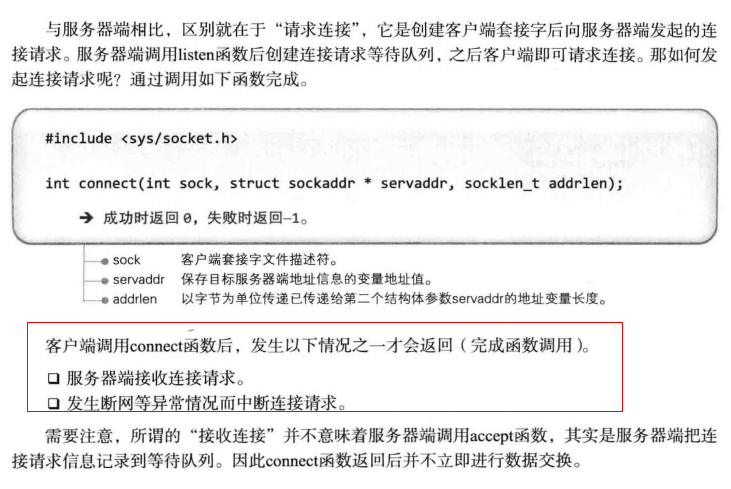

**基于TCP的服务器端/客户端函数调用关系**


#### 4.3 实现迭代服务器端/客户端


**迭代回声服务器端/客户端（代码重要）**

```c
// echo_server.c
#include <stdio.h>
#include <stdlib.h>
#include <string.h>
#include <unistd.h>
#include <arpa/inet.h>
#include <sys/socket.h>

#define BUF_SIZE 1024
void error_handling(char *message);

int main(int argc, char *argv[])
{
    int serv_sock, clnt_sock;
    char message[BUF_SIZE];
    int str_len, i;

    struct sockaddr_in serv_adr;
    struct sockaddr_in clnt_adr;
    socklen_t clnt_adr_sz;

    if(argc!=2) {
        printf("Usage : %s <port>\n", argv[0]);
        exit(1);
    }

    serv_sock=socket(PF_INET, SOCK_STREAM, 0);   
    if(serv_sock==-1)
        error_handling("socket() error");

    memset(&serv_adr, 0, sizeof(serv_adr));
    // 服务端地址的地址族为IPv4地址族
    serv_adr.sin_family=AF_INET;
    // 利用常数INADDR_ANY自动获取服务端IP地址
    // htonl函数用于将long类型的主机字节序转变为网络字节序（大端序）
    serv_adr.sin_addr.s_addr=htonl(INADDR_ANY);
    // 从命令行获取端口号
    // atoi函数用于把字符串转换成整型数
    // htons函数用于将short类型的主机字节序转变为网络字节序（大端序）
    serv_adr.sin_port=htons(atoi(argv[1]));

    if(bind(serv_sock, (struct sockaddr*)&serv_adr, sizeof(serv_adr))==-1)
        error_handling("bind() error");

    if(listen(serv_sock, 5)==-1)
        error_handling("listen() error");

    clnt_adr_sz=sizeof(clnt_adr);
    // 循环接收五个客户端
    for(i=0; i<5; i++)
    {
        clnt_sock=accept(serv_sock, (struct sockaddr*)&clnt_adr, &clnt_adr_sz);
        if(clnt_sock==-1)
            error_handling("accept() error");
        else
            printf("Connected client %d \n", i+1);
        // 将读到的内容原封不动地写回去
        while((str_len=read(clnt_sock, message, BUF_SIZE))!=0)
            write(clnt_sock, message, str_len);
        // 针对套接字调用close函数，向连接的相应套接字发送EOF
        close(clnt_sock);
    }

    close(serv_sock);
    return 0;
}

void error_handling(char *message)
{
    fputs(message, stderr);
    fputc('\n', stderr);
    exit(1);
}
```

```c
// echo_client.c
#include <stdio.h>
#include <stdlib.h>
#include <string.h>
#include <unistd.h>
#include <arpa/inet.h>
#include <sys/socket.h>

#define BUF_SIZE 1024
void error_handling(char *message);

int main(int argc, char *argv[])
{
    int sock;
    char message[BUF_SIZE];
    int str_len;
    struct sockaddr_in serv_adr;

    if(argc!=3) {
        printf("Usage : %s <IP> <port>\n", argv[0]);
        exit(1);
    }

    sock=socket(PF_INET, SOCK_STREAM, 0);   
    if(sock==-1)
        error_handling("socket() error");

    memset(&serv_adr, 0, sizeof(serv_adr));
    serv_adr.sin_family=AF_INET;
    serv_adr.sin_addr.s_addr=inet_addr(argv[1]);
    serv_adr.sin_port=htons(atoi(argv[2]));
    // 调用connect函数，请求连接
    if(connect(sock, (struct sockaddr*)&serv_adr, sizeof(serv_adr))==-1)
        error_handling("connect() error!");
    else
        puts("Connected...........");

    while(1) 
    {
        fputs("Input message(Q to quit): ", stdout);
        fgets(message, BUF_SIZE, stdin);

        if(!strcmp(message,"q\n") || !strcmp(message,"Q\n"))
            break;

        write(sock, message, strlen(message));
        str_len=read(sock, message, BUF_SIZE-1);
        message[str_len]=0;
        printf("Message from server: %s", message);
    }

    close(sock);
    return 0;
}

void error_handling(char *message)
{
    fputs(message, stderr);
    fputc('\n', stderr);
    exit(1);
}
```

### 第5章 基于TCP的服务器端/客户端（2）

#### 5.2 TCP原理

**TCP内部工作原理1：与对方套接字的连接**


**TCP内部工作原理2：与对方主机的数据交换**


**TCP的内部工作原理3：断开与套接字的连接**

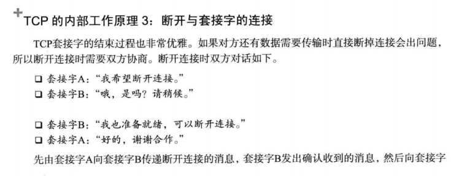


### 第6章 基于UDP的服务器端/客户端

#### 6.1 理解UDP

**UDP套接字的特点**


**UDP的高效使用**


#### 6.2 实现基于UDP的服务器端/客户端

**基于UDP的数据I/O函数**


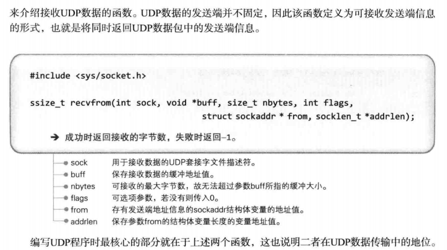

**基于UDP的回声服务器端/客户端（代码重要）**


```c
// uecho_server.c
#include <stdio.h>
#include <stdlib.h>
#include <string.h>
#include <unistd.h>
#include <arpa/inet.h>
#include <sys/socket.h>

#define BUF_SIZE 30
void error_handling(char *message);

int main(int argc, char *argv[])
{
    int serv_sock;
    char message[BUF_SIZE];
    int str_len;
    socklen_t clnt_adr_sz;

    struct sockaddr_in serv_adr, clnt_adr;
    if(argc!=2){
        printf("Usage : %s <port>\n", argv[0]);
        exit(1);
    }
    // 向socket函数传递SOCK_DGRAM，创建UDP套接字
    serv_sock=socket(PF_INET, SOCK_DGRAM, 0);
    if(serv_sock==-1)
        error_handling("UDP socket creation error");

    memset(&serv_adr, 0, sizeof(serv_adr));
    serv_adr.sin_family=AF_INET;
    serv_adr.sin_addr.s_addr=htonl(INADDR_ANY);
    serv_adr.sin_port=htons(atoi(argv[1]));

    if(bind(serv_sock, (struct sockaddr*)&serv_adr, sizeof(serv_adr))==-1)
        error_handling("bind() error");

    while(1) 
    {
        clnt_adr_sz=sizeof(clnt_adr);
        // 利用bind函数分配的地址接收数据，不限制数据传输对象
        str_len=recvfrom(serv_sock, message, BUF_SIZE, 0, 
                         (struct sockaddr*)&clnt_adr, &clnt_adr_sz);
        // 通过recvfrom函数获取传输端地址，利用该地址，借助sendto函数逆向重传
        sendto(serv_sock, message, str_len, 0, 
               (struct sockaddr*)&clnt_adr, clnt_adr_sz);
    }	
    close(serv_sock);
    return 0;
}

void error_handling(char *message)
{
    fputs(message, stderr);
    fputc('\n', stderr);
    exit(1);
}
```

```c
// uecho_client.c
#include <stdio.h>
#include <stdlib.h>
#include <string.h>
#include <unistd.h>
#include <arpa/inet.h>
#include <sys/socket.h>

#define BUF_SIZE 30
void error_handling(char *message);

int main(int argc, char *argv[])
{
    int sock;
    char message[BUF_SIZE];
    int str_len;
    socklen_t adr_sz;

    struct sockaddr_in serv_adr, from_adr;
    if(argc!=3){
        printf("Usage : %s <IP> <port>\n", argv[0]);
        exit(1);
    }

    //  创建UDP套接字
    sock=socket(PF_INET, SOCK_DGRAM, 0);   
    if(sock==-1)
        error_handling("socket() error");

    memset(&serv_adr, 0, sizeof(serv_adr));
    serv_adr.sin_family=AF_INET;
    serv_adr.sin_addr.s_addr=inet_addr(argv[1]);
    serv_adr.sin_port=htons(atoi(argv[2]));

    while(1)
    {
        fputs("Insert message(q to quit): ", stdout);
        fgets(message, sizeof(message), stdin);     
        if(!strcmp(message,"q\n") || !strcmp(message,"Q\n"))	
            break;
        // 调用sento函数发送数据
        sendto(sock, message, strlen(message), 0, 
               (struct sockaddr*)&serv_adr, sizeof(serv_adr));
        adr_sz=sizeof(from_adr);
        // 接收数据
        str_len=recvfrom(sock, message, BUF_SIZE, 0, 
                         (struct sockaddr*)&from_adr, &adr_sz);

        message[str_len]=0;
        printf("Message from server: %s", message);
    }	
    close(sock);
    return 0;
}

void error_handling(char *message)
{
    fputs(message, stderr);
    fputc('\n', stderr);
    exit(1);
}
```

#### 6.3 UDP数据传输特性和调用connect函数

**已连接（connected）UDP套接字与未连接（unconnected）UDP套接字**


**创建已连接UDP套接字**


#### 6.5 习题


### 第7章 优雅地断开套接字连接

#### 7.1 基于TCP的半关闭

**单方面断开连接带来的问题**

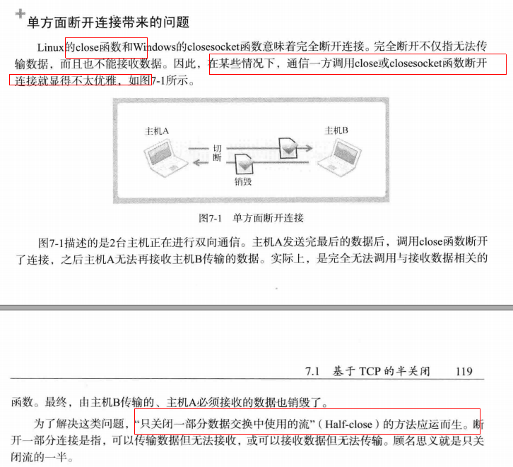

**针对优雅断开的shutdown函数**


#### 7.3 习题


### 第8章 域名及网络地址

#### 8.1 域名系统

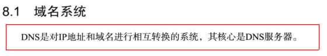

#### 8.2 IP地址和域名之间的转换

**利用域名获取IP地址**

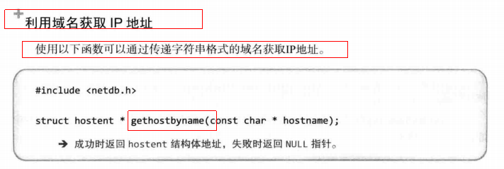

**利用IP地址获取域名**

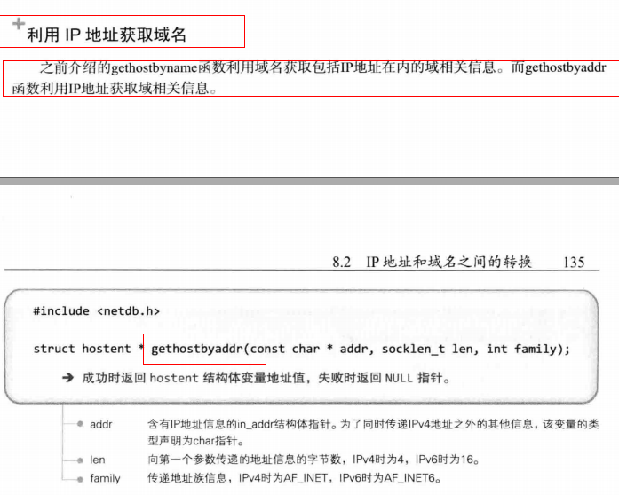

### 第9章 套接字的多种可选项

#### 9.1 套接字可选项和I/O缓冲大小

**getsockopt&setsockopt**

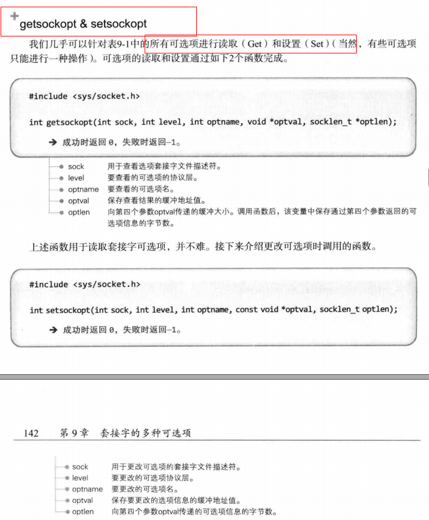

**SO_SNDBUF&SO_RCVBUF（代码重要）**

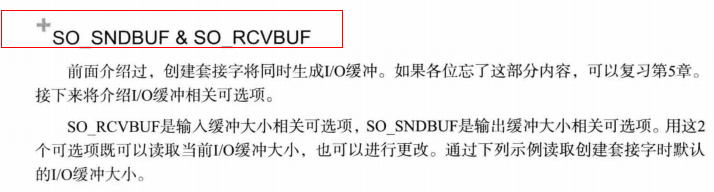

```c
#include <stdio.h>
#include <stdlib.h>
#include <unistd.h>
#include <sys/socket.h>
void error_handling(char *message);

int main(int argc, char *argv[])
{
    int sock;
    int snd_buf=1024*3, rcv_buf=1024*3;
    int state;
    socklen_t len;

    sock=socket(PF_INET, SOCK_STREAM, 0);
    // 输入缓冲大小更改为3M字节
    state=setsockopt(sock, SOL_SOCKET, SO_RCVBUF, (void*)&rcv_buf, sizeof(rcv_buf));
    if(state)
        error_handling("setsockopt() error!");
    // 输出缓冲大小更改为3M字节
    state=setsockopt(sock, SOL_SOCKET, SO_SNDBUF, (void*)&snd_buf, sizeof(snd_buf));
    if(state)
        error_handling("setsockopt() error!");

    len=sizeof(snd_buf);
    // 读取输出缓冲大小
    state=getsockopt(sock, SOL_SOCKET, SO_SNDBUF, (void*)&snd_buf, &len);
    if(state)
        error_handling("getsockopt() error!");

    len=sizeof(rcv_buf);
    // 读取输入缓冲大小
    state=getsockopt(sock, SOL_SOCKET, SO_RCVBUF, (void*)&rcv_buf, &len);
    if(state)
        error_handling("getsockopt() error!");

    printf("Input buffer size: %d \n", rcv_buf);
    printf("Output buffer size: %d \n", snd_buf);
    return 0;
}

void error_handling(char *message)
{
    fputs(message, stderr);
    fputc('\n', stderr);
    exit(1);
}
```

#### 9.2 SO_REUSEADDR

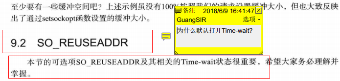

**Time-wait状态**

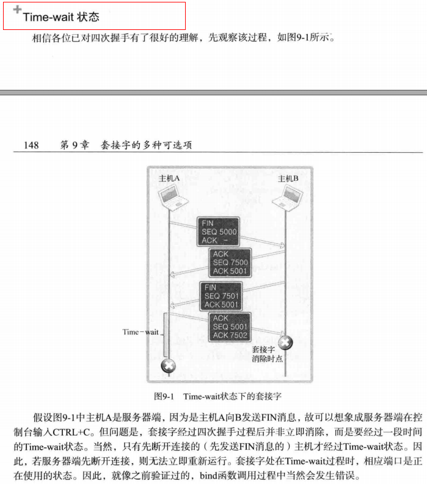

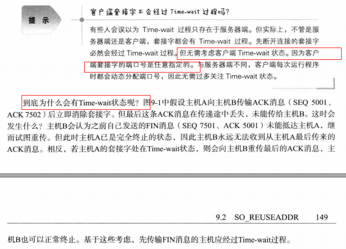

**地址再分配**

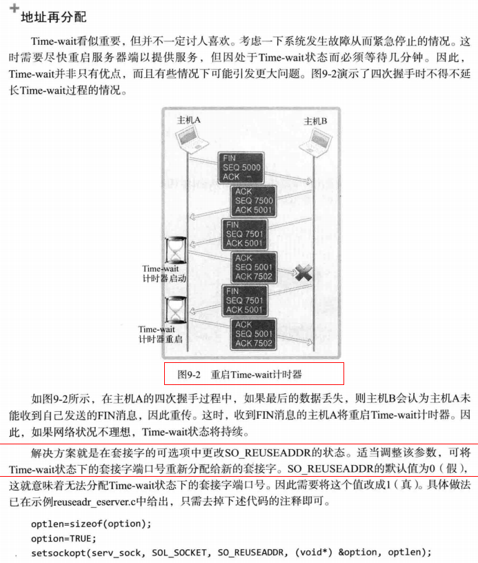

#### 9.3 TCP_NODELAY

**Nagle算法**

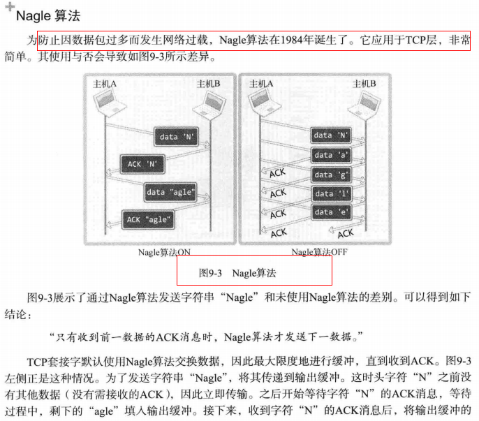

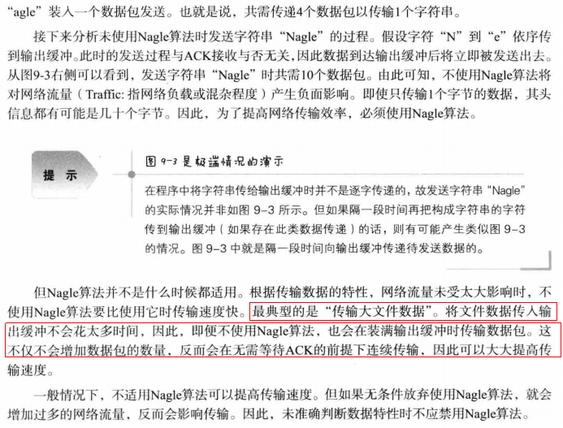

**禁用Nagle算法**


### 第10章 多进程服务器端

#### 10.1 进程概念及应用

**通过调用fork函数创建进程**

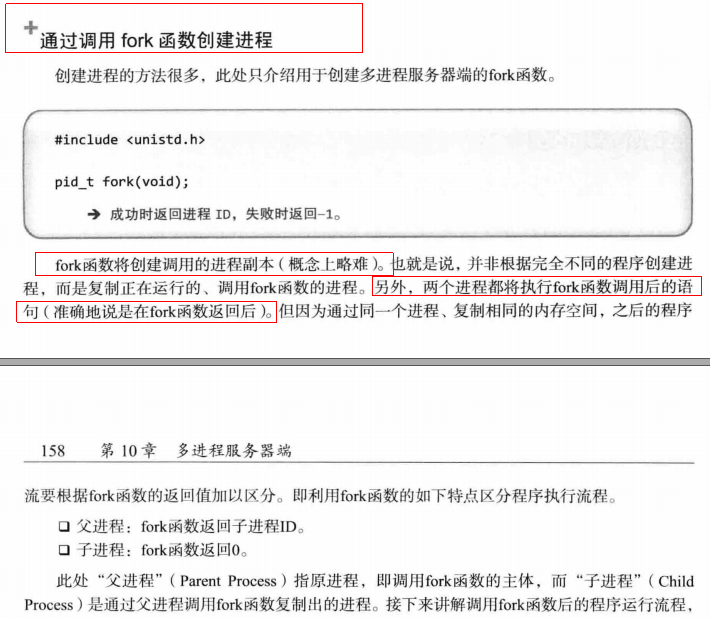

#### 10.2 进程和僵尸进程

**僵尸进程**

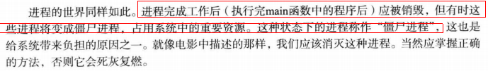

**产生僵尸进程的原因**

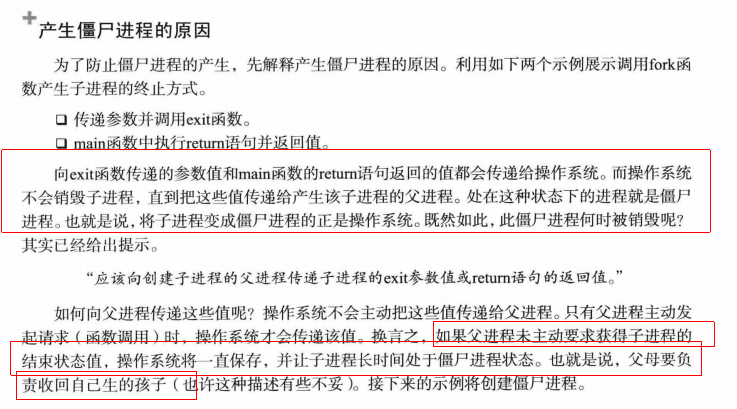

**销毁僵尸进程1：利用wait函数（代码重要）**

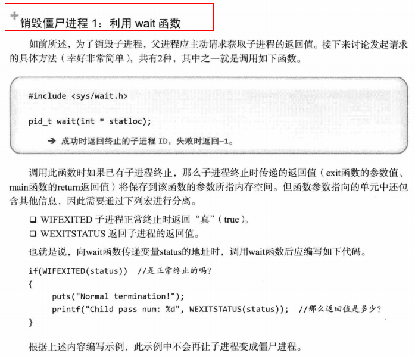

```c
// wait.c
#include <stdio.h>
#include <stdlib.h>
#include <unistd.h>
#include <sys/wait.h>

int main(int argc, char *argv[])
{
    int status;
    // 创建子进程
    pid_t pid=fork();
    // 通过return语句终止子进程
    if(pid==0)
    {
        return 3;   	
    }
    else
    {
        printf("Child PID: %d \n", pid);
        // 创建子进程
        pid=fork();
        // 通过exit函数终止子进程
        if(pid==0)
        {
            exit(7);
        }
        else
        {
            printf("Child PID: %d \n", pid);
            // 调用wait函数。之前终止的子进程相关信息保存到status变量，同时相关子进程完全销毁
            wait(&status);
            // 通过WIFEXITED宏验证子进程是否正常终止
            if(WIFEXITED(status))
                // 如果正常退出，调用WEXITSTATUS宏输出子进程的返回值
                printf("Child send one: %d \n", WEXITSTATUS(status));

            wait(&status);
            if(WIFEXITED(status))
                printf("Child send two: %d \n", WEXITSTATUS(status));
            sleep(30);     // Sleep 30 sec.
        }
    }
    return 0;
}
```

**销毁僵尸进程2：调用waitpid函数（代码重要）**

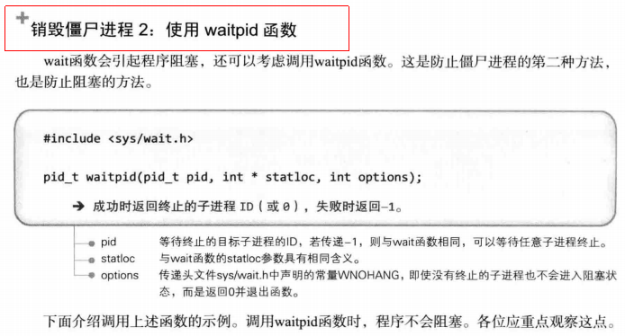

```c
#include <stdio.h>
#include <unistd.h>
#include <sys/wait.h>

int main(int argc, char *argv[])
{
    int status;
    pid_t pid=fork();

    if(pid==0)
    {
        sleep(15);
        return 24;   	
    }
    else
    {
        // while循环中调用waitpid函数。向第三个参数传递WNOHANG，
        // 因此，若之前没有终止的子进程将返回0
        while(!waitpid(-1, &status, WNOHANG))
        {
            sleep(3);
            puts("sleep 3sec.");
        }

        if(WIFEXITED(status))
            printf("Child send %d \n", WEXITSTATUS(status));
    }
    return 0;
}

/*
root@my_linux:/home/swyoon/tcpip# gcc waitpid.c -o waitpid
root@my_linux:/home/swyoon/tcpip# ./waitpid
sleep 3sec.
sleep 3sec.
sleep 3sec.
sleep 3sec.
sleep 3sec.
Child send 24 
*/
```

#### 10.3 信号处理

**向操作系统求助**

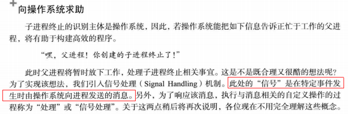

**信号与signal函数**

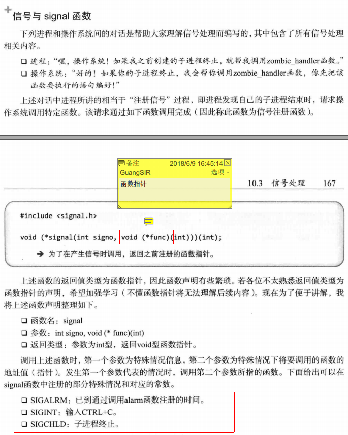

```c
// signal.c
#include <stdio.h>
#include <unistd.h>
#include <signal.h>

void timeout(int sig)
{
    if(sig==SIGALRM)
        puts("Time out!");

    alarm(2);	
}
void keycontrol(int sig)
{
    if(sig==SIGINT)
        puts("CTRL+C pressed");
}

int main(int argc, char *argv[])
{
    int i;
    signal(SIGALRM, timeout);
    signal(SIGINT, keycontrol);
    alarm(2);

    for(i=0; i<3; i++)
    {
        puts("wait...");
        sleep(100);
    }
    return 0;
}
```

**利用sigaction函数进行信号处理**

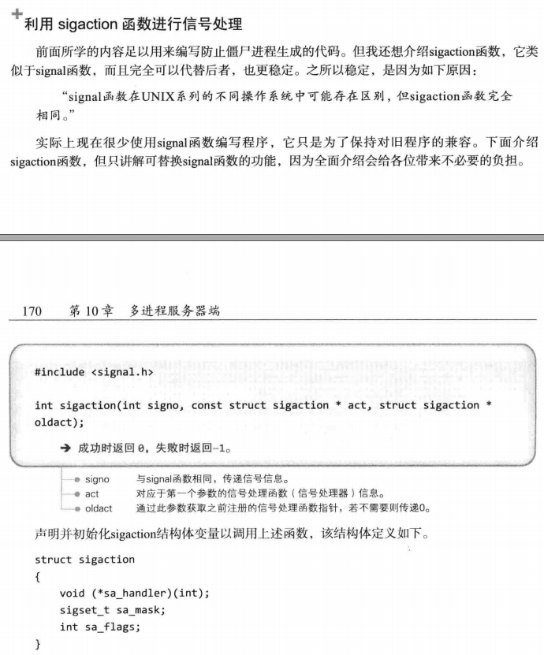

**利用信号处理技术消灭僵尸进程（代码重要）**


```c
// remove_zombie.c
#include <stdio.h>
#include <stdlib.h>
#include <unistd.h>
#include <signal.h>
#include <sys/wait.h>

// read_childproc函数中调用了waitpid函数，所有子进程会正常终止
void read_childproc(int sig)
{
    int status;
    pid_t id=waitpid(-1, &status, WNOHANG);
    if(WIFEXITED(status))
    {
        printf("Removed proc id: %d \n", id);
        printf("Child send: %d \n", WEXITSTATUS(status));
    }
}

int main(int argc, char *argv[])
{
    pid_t pid;
    // 注册SIGCHLD信号对应的的处理器。若子进程终止，则调用read_childproc函数。
    struct sigaction act;
    act.sa_handler=read_childproc;
    sigemptyset(&act.sa_mask);
    act.sa_flags=0;
    sigaction(SIGCHLD, &act, 0);

    pid=fork();
    if(pid==0)
    {
        puts("Hi! I'm child process");
        sleep(10);
        return 12;
    }
    else
    {
        printf("Child proc id: %d \n", pid);
        pid=fork();
        if(pid==0)
        {
            puts("Hi! I'm child process");
            sleep(10);
            exit(24);
        }
        else
        {
            int i;
            printf("Child proc id: %d \n", pid);
            for(i=0; i<5; i++)
            {
                puts("wait...");
                sleep(5);
            }
        }
    }
    return 0;
}
/*
root@my_linux:/home/swyoon/tcpip# gcc remove_zombie.c -o zombie
root@my_linux:/home/swyoon/tcpip# ./zombie
Hi! I'm child process
Child proc id: 9529 
Hi! I'm child process
Child proc id: 9530 
wait...
wait...
Removed proc id: 9530 
Child send: 24 
wait...
Removed proc id: 9529 
Child send: 12 
wait...
wait...

*/
```

#### 10.4 基于多任务的并发服务器

**实现并发服务器（代码重要）**

```c
#include <stdio.h>
#include <stdlib.h>
#include <string.h>
#include <unistd.h>
#include <signal.h>
#include <sys/wait.h>
#include <arpa/inet.h>
#include <sys/socket.h>

#define BUF_SIZE 30
void error_handling(char *message);
void read_childproc(int sig);

int main(int argc, char *argv[])
{
    int serv_sock, clnt_sock;
    struct sockaddr_in serv_adr, clnt_adr;

    pid_t pid;
    struct sigaction act;
    socklen_t adr_sz;
    int str_len, state;
    char buf[BUF_SIZE];
    if(argc!=2) {
        printf("Usage : %s <port>\n", argv[0]);
        exit(1);
    }

    // 为防止僵尸进程而编写的代码
    act.sa_handler=read_childproc;
    sigemptyset(&act.sa_mask);
    act.sa_flags=0;
    state=sigaction(SIGCHLD, &act, 0);
    serv_sock=socket(PF_INET, SOCK_STREAM, 0);
    memset(&serv_adr, 0, sizeof(serv_adr));
    serv_adr.sin_family=AF_INET;
    serv_adr.sin_addr.s_addr=htonl(INADDR_ANY);
    serv_adr.sin_port=htons(atoi(argv[1]));

    if(bind(serv_sock, (struct sockaddr*) &serv_adr, sizeof(serv_adr))==-1)
        error_handling("bind() error");
    if(listen(serv_sock, 5)==-1)
        error_handling("listen() error");

    while(1)
    {
        adr_sz=sizeof(clnt_adr);
        // 调用accept函数
        clnt_sock=accept(serv_sock, (struct sockaddr*)&clnt_adr, &adr_sz);
        if(clnt_sock==-1)
            continue;
        else
            puts("new client connected...");
        // 调用fork函数，此时父子进程都带有相同的套接字文件描述符
        pid=fork();
        if(pid==-1)
        {
            close(clnt_sock);
            continue;
        }
        // 子进程运行区域，此部分向客户端提供回声服务
        if(pid==0)
        {
            // 子进程关闭服务端套接字文件描述符
            close(serv_sock);
            while((str_len=read(clnt_sock, buf, BUF_SIZE))!=0)
                write(clnt_sock, buf, str_len);

            close(clnt_sock);
            puts("client disconnected...");
            return 0;
        }
        else
            // 父进程关闭客户端套接字文件描述符
            close(clnt_sock);
    }
    close(serv_sock);
    return 0;
}

void read_childproc(int sig)
{
    pid_t pid;
    int status;
    pid=waitpid(-1, &status, WNOHANG);
    printf("removed proc id: %d \n", pid);
}
void error_handling(char *message)
{
    fputs(message, stderr);
    fputc('\n', stderr);
    exit(1);
}
```

### 第12章 I/O复用

#### 12.2 理解select函数并实现服务端

**select函数的功能和调用顺序**

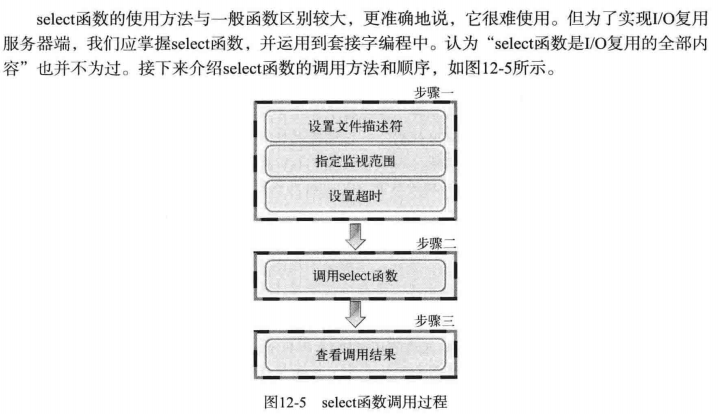

**设置文件描述符**

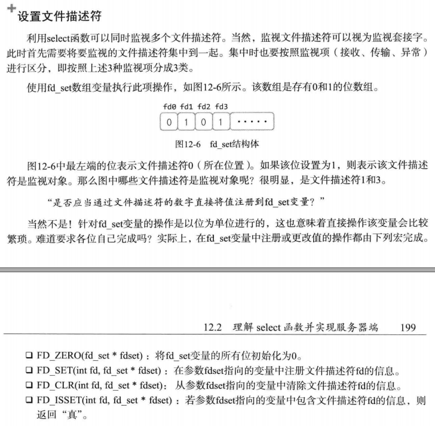

**设置检查（监视）范围及超时**

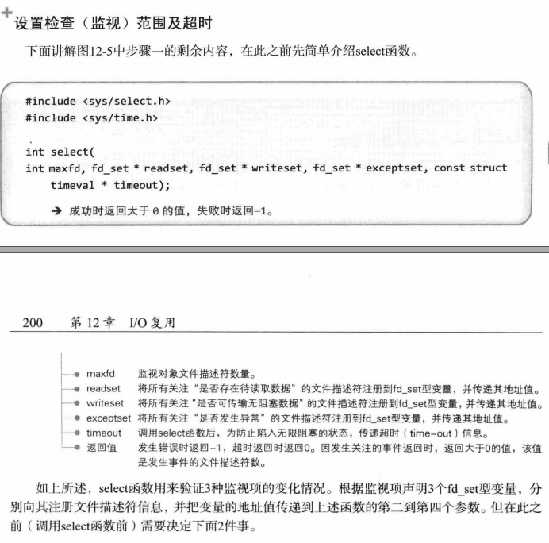

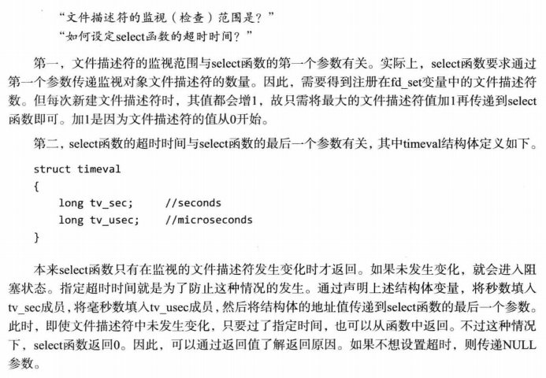

**实现I/O复用服务器端（代码重要）**

```c
#include <stdio.h>
#include <stdlib.h>
#include <string.h>
#include <unistd.h>
#include <arpa/inet.h>
#include <sys/socket.h>
#include <sys/time.h>
#include <sys/select.h>

#define BUF_SIZE 100
void error_handling(char *buf);

int main(int argc, char *argv[])
{
    int serv_sock, clnt_sock;
    struct sockaddr_in serv_adr, clnt_adr;
    struct timeval timeout;
    fd_set reads, cpy_reads;

    socklen_t adr_sz;
    int fd_max, str_len, fd_num, i;
    char buf[BUF_SIZE];
    if(argc!=2) {
        printf("Usage : %s <port>\n", argv[0]);
        exit(1);
    }

    serv_sock=socket(PF_INET, SOCK_STREAM, 0);
    memset(&serv_adr, 0, sizeof(serv_adr));
    serv_adr.sin_family=AF_INET;
    serv_adr.sin_addr.s_addr=htonl(INADDR_ANY);
    serv_adr.sin_port=htons(atoi(argv[1]));

    if(bind(serv_sock, (struct sockaddr*) &serv_adr, sizeof(serv_adr))==-1)
        error_handling("bind() error");
    if(listen(serv_sock, 5)==-1)
        error_handling("listen() error");

    FD_ZERO(&reads);
    // 向要传到select函数第二个参数的fd_set变量reads注册服务端套接字
    FD_SET(serv_sock, &reads);
    fd_max=serv_sock;

    while(1)
    {
        cpy_reads=reads;
        timeout.tv_sec=5;
        timeout.tv_usec=5000;
        // 在while无限循环中调用select函数
        if((fd_num=select(fd_max+1, &cpy_reads, 0, 0, &timeout))==-1)
            break;

        if(fd_num==0)
            continue;
        // fd_num>=1时执行的循环，这里表明有套接字文件描述符状态发生变化
        for(i=0; i<fd_max+1; i++)
        {
            // 调用FD_ISSET函数查找发生变化的文件描述符
            if(FD_ISSET(i, &cpy_reads))
            {
                // 服务器段套接字描述符发生变化，表明有连接请求
                if(i==serv_sock)     // connection request!
                {
                    adr_sz=sizeof(clnt_adr);
                    // 受理连接请求，获取与客户端连接的套接字文件描述符
                    clnt_sock=
                        accept(serv_sock, (struct sockaddr*)&clnt_adr, &adr_sz);
                    // 注册与客户端连接的套接字文件描述符
                    FD_SET(clnt_sock, &reads);
                    if(fd_max<clnt_sock)
                        fd_max=clnt_sock;
                    printf("connected client: %d \n", clnt_sock);
                }
                // 与客户端连接的套接字文件描述符状态发生变化，接收数据
                else    // read message!
                {
                    str_len=read(i, buf, BUF_SIZE);
                    // 如果发来的是"EOF"
                    if(str_len==0)    // close request!
                    {
                        FD_CLR(i, &reads);
                        close(i);
                        printf("closed client: %d \n", i);
                    }
                    // 不是断开，则将信息原样返回
                    else
                    {
                        write(i, buf, str_len);    // echo!
                    }
                }
            }
        }
    }
    close(serv_sock);
    return 0;
}

void error_handling(char *buf)
{
    fputs(buf, stderr);
    fputc('\n', stderr);
    exit(1);
}
```

### 第13章 多种I/O函数

#### 13.1 send和recv函数

**Linux中的send&recv**

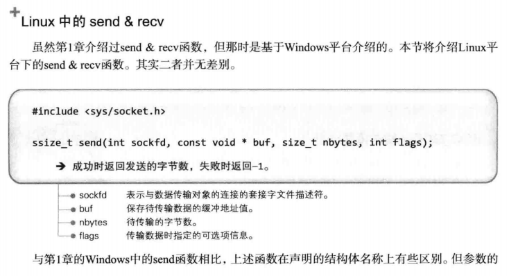

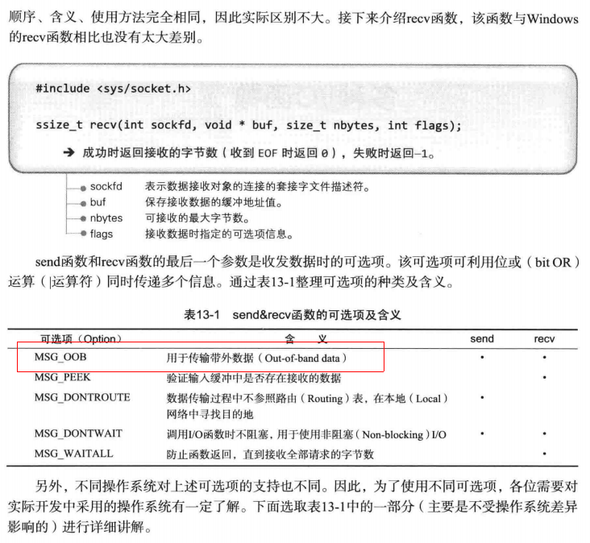

**MSG_OOB（Out-of-band data）：发送紧急消息**

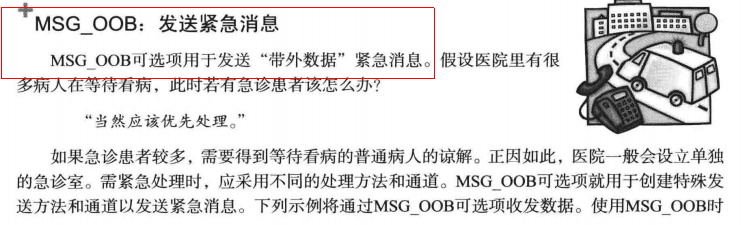

**检查输入缓冲**

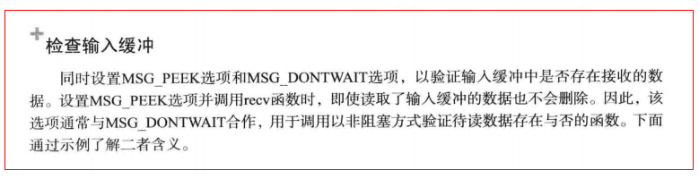

#### 13.2 readv&writev函数

**使用readv&writev函数**

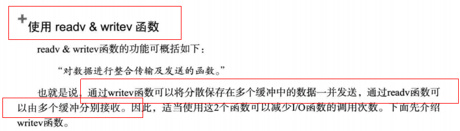

### 第14章 多播与广播

#### 14.1 多播

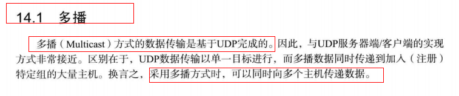

**多播的数据传输方式及流量方面的优点**

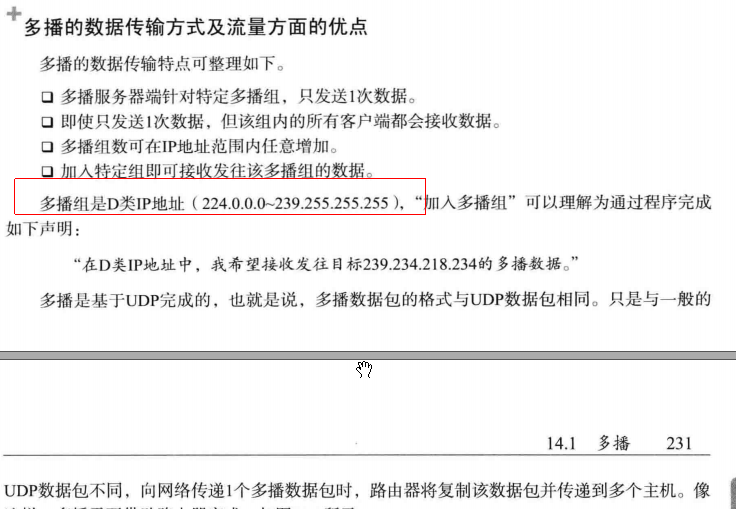

**路由（Routing）和TTL（Time to Live，生存时间），以及加入组的方法**


##### 14.2 广播

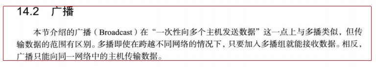

**广播的理解及实现方法**

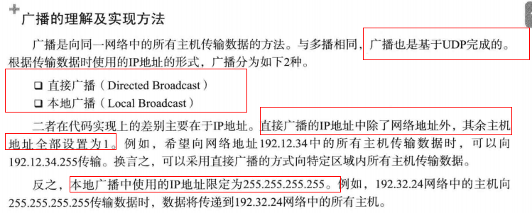

### 第24章 制作HTTP服务器端

#### 24.1 HTTP概要

**响应消息（Response Message）的结构**

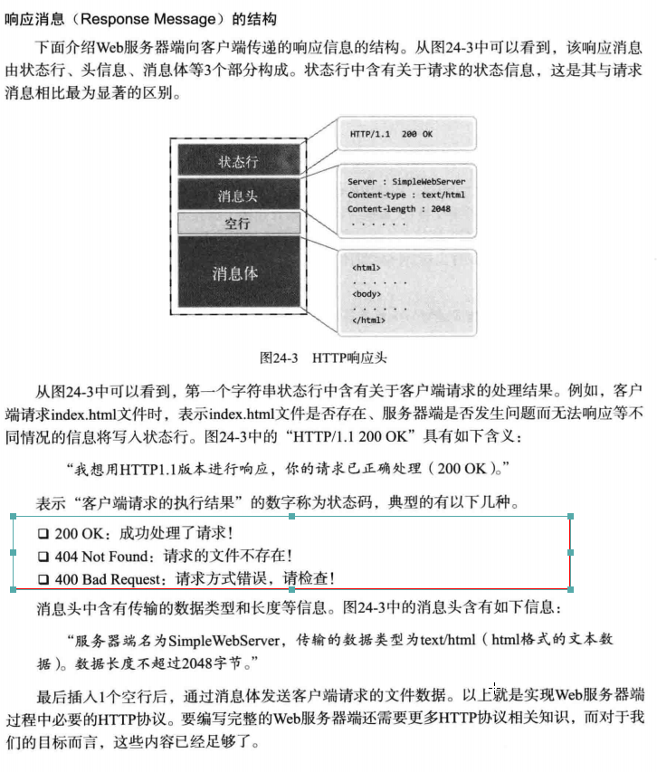

### 网络通信程序设计  习题1

1. close()和shutdown()的区别。
2. UDP与TCP哪个数据传输速度快？为什么？
3. 画出基于TCP的服务端和客户端的函数调用关系。
4. UDP中调用connect函数为了解决什么问题？有哪些好处？
5. Nagle算法为什么引入？何时应该考虑禁用Nagle算法？
6. 画出Nagle算法启用及禁用情况下的数据交换示意图。
7. 编写处理SIGCHLD信号的回调函数，并写出注册代码。
8. 编写基于多进程的并发echo服务端，要求：
   + 端口号用命令行参数给出；
   + 主进程监听接受客户端连接请求，为每个客户端请求创建一个子进程处理数据交换；
   + 处理子进程终止信号SIGCHLD，避免产生僵尸进程

### 网络通信程序设计  习题2

1. 什么是TCP 、UDP ？协议优缺点，应用场合？ 

   + 用户数据报协议UDP(User Datagram Protocol)   UDP协议是面向无连接的用户数据报协议，在传输数据之前不需要先建立连接。远地主机的运输层收到UDP报文后，不需要给出任何确认。 
   + 传输数据报协议TCP（Transmission Control Protocol）  TCP 则提供面向连接的服务。在传输数据前必须先建立连接，数据传输完毕后要释放连接。    
   + 区别：
     + 是否面向连接：TCP 向连接，UDP 是面向无连接 
     + 是否可靠：TCP 可靠，UDP 不可靠  
     + 应用场合：TCP 应用于传输大量数据，UDP 用于传输少量数据   
     + 速度：TCP 的速度慢，UDP 的速度快 
     + 是否能够广播：TCP 不能，UDP 能广播
     + TCP 是基于连接的，速度慢，有校验等，所以传送相同的数据,要比UDP发送的包多很多

2. 简述TCP/IP协议中三次握手的过程及涵义。

   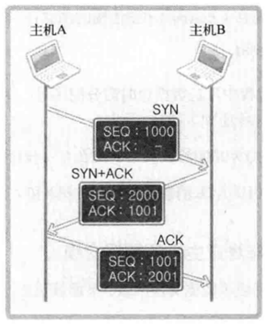

   + 第一次握手：建立连接时，客户端发送syn包(syn=j)到服务器，并进入SYN_SEND状态，等待服务器确认；   
   + 第二次握手：服务器收到syn包，必须确认客户的SYN（ack=j+1），同时自己也发送一个SYN包（syn=k），即SYN+ACK包，此时服务器进入SYN_RECV状态；   
   + 第三次握手：客户端收到服务器的SYN＋ACK包，向服务器发送确认包ACK(ack=k+1)，此包发送完毕，客户端和服务器进入ESTABLISHED状态，完成三次握手。

3. 简述TCP/IP模型中，利用传输控制协议发送数据，应用层数据从主机A发送到主机B的整个过程。

   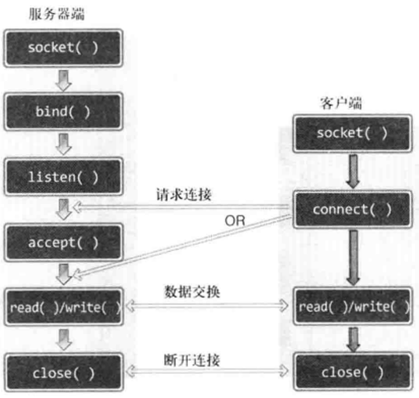

   + 首先是主机A通过connect()函数发送连接请求，主机B的accept()函数接受到请求。此时建立了连接。     
   + 主机A将数据写入套接口。
   + 主机B从套接口读取数据，并保存。
   + 数据发送完毕后，主机A关闭套接口。
   + 主机B关闭套接口。 

4. 如何在并发程序中避免僵尸进程？(父进程不阻塞，不轮询，描述思路或写出代码) ？

   在父进程中捕捉SIGCHLD信号，并在信号处理函数中用waitpid处理子进程返回值 。

   