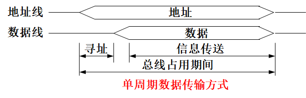
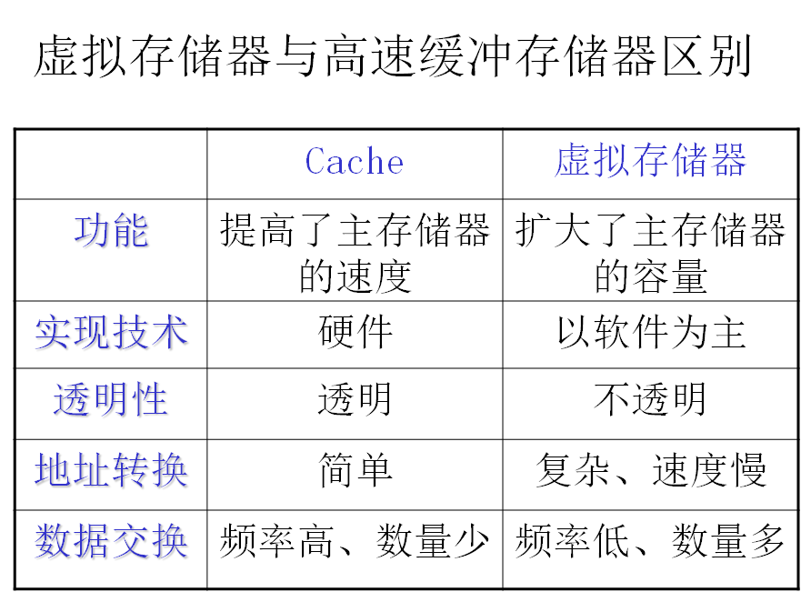
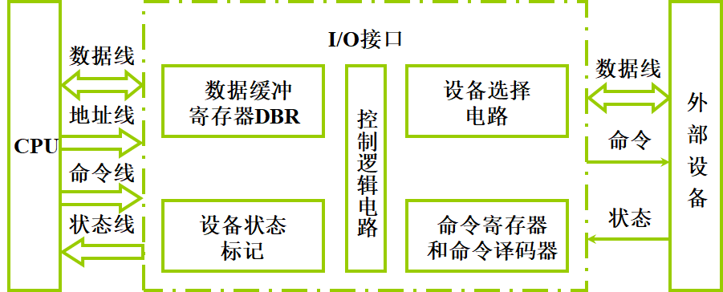
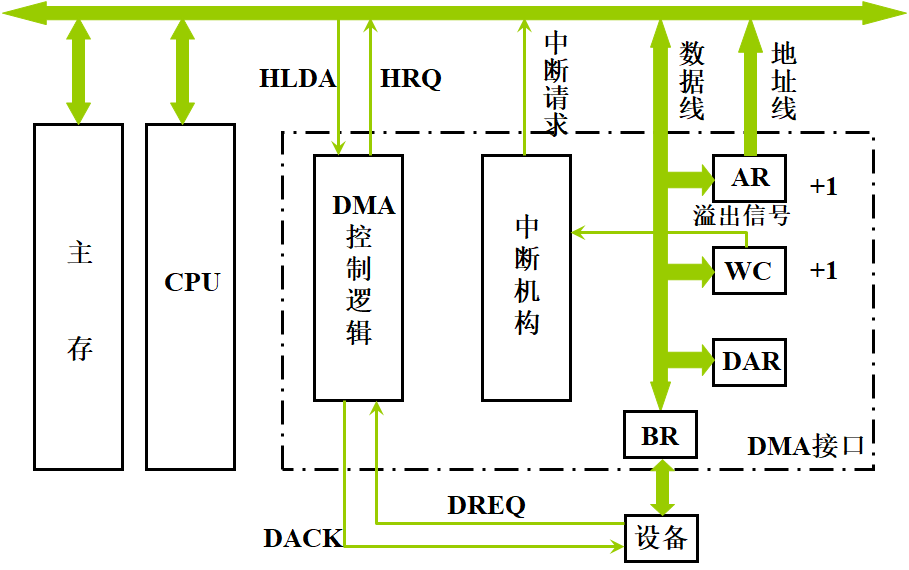
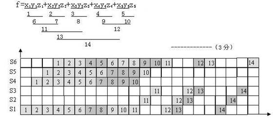
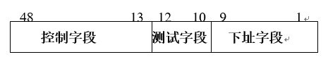

### 第1章 计算机系统概论

**# 什么是计算机系统、计算机硬件和计算机软件？硬件和软件哪个更重要？（P3）**

(1) 计算机系统：由计算机硬件系统和软件系统组成的综合体。

(2) 计算机硬件：指计算机中的电子线路和物理装置。

(3) 计算机软件：计算机运行所需的程序及相关资料。

(4) 硬件和软件在计算机系统中相互依存，缺一不可，因此同样重要。

**# 冯•诺依曼计算机的特点是什么？（P8）**

(1) 计算机由运算器、控制器、存储器、输入设备、输出设备五大部件组成；

(2) 指令和数据以同同等地位存放于存储器内，并可以按地址访问；

(3) 指令和数据均用二进制表示；

(4) 指令由操作码、地址码两大部分组成，操作码用来表示操作的性质，地址码用来表示操作数在存储器中的位置；

(5) 指令在存储器中顺序存放。通常，指令是顺序执行的，在特定条件下，可根据运算结果或根据设定的条件改变执行顺序；

(6) 机器以运算器为中心，输入输出设备与存储器间的数据传送通过运算器来完成。

**# 解释下列概念：主机、CPU、主存、存储单元、存储元件、存储基元、存储元、存储字、存储字长、存储容量、机器字长、指令字长**

(1) 主机：是计算机硬件的主体部分，由CPU和主存储器MM合成为主机。

(2) CPU：中央处理器，是计算机硬件的核心部件，由运算器和控制器组成；

(3) 主存：计算机中存放正在运行的程序和数据的存储器，为计算机的主要工作存储器，可随机存取；由存储体、各种逻辑部件及控制电路组成。

(4) 存储单元：可存放一个机器字并具有特定存储地址的存储单位。

(5) 存储元件：存储一位二进制信息的物理元件，是存储器中最小的存储单位，又叫存储基元或存储元，不能单独存取。

(6) 存储字：一个存储单元所存二进制代码的逻辑单位。

(7) 存储字长：一个存储单元所存二进制代码的位数。

(8) 存储容量：存储器中可存二进制代码的总量；（通常主、辅存容量分开描述）。

(9) 机器字长：指CPU一次能处理的二进制数据的位数，通常与CPU的寄存器位数有关。

(10) 指令字长：一条指令的二进制代码位数。

**# 解释下列英文缩写的中文含义：CPU、PC、IR、CU、ALU、ACC、MQ、X、MAR、MDR、I/O、MIPS、CPI、FLOPS**

全面的回答应分英文全称、中文名、功能三部分。

(1) CPU：Central Processing Unit，中央处理机（器），是计算机硬件的核心部件，主要由运算器和控制器组成。

(2) PC：Program Counter，程序计数器，其功能是存放当前欲执行指令的地址，并可自动计数形成下一条指令地址。

(3) IR：Instruction Register，指令寄存器，其功能是存放当前正在执行的指令。

(4) CU：Control Unit，控制单元（部件），为控制器的核心部件，其功能是产生微操作命令序列。

(5) ALU：Arithmetic Logic Unit，算术逻辑运算单元，为运算器的核心部件，其功能是进行算术、逻辑运算。

(6) ACC：Accumulator，累加器，是运算器中既能存放运算前的操作数，又能存放运算结果的寄存器。

(7) MQ：Multiplier-Quotient Register，乘商寄存器，乘法运算时存放乘数、除法时存放商的寄存器。

(8) X：此字母没有专指的缩写含义，可以用作任一部件名，在此表示操作数寄存器，即运算器中工作寄存器之一，用来存放操作数；

(9) MAR：Memory Address Register，存储器地址寄存器，在主存中用来存放欲访问的存储单元的地址。

(10) MDR：Memory Data Register，存储器数据缓冲寄存器，在主存中用来存放从某单元读出、或要写入某存储单元的数据。

(11) I/O：Input/Output equipment，输入/输出设备，为输入设备和输出设备的总称，用于计算机内部和外界信息的转换与传送。

(12) MIPS：Million Instruction Per Second，每秒执行百万条指令数，为计算机运算速度指标的一种计量单位。

(13) CPI：Cycles Per Instruction，执行一条指令所需时钟周期数，为计算机运算速度指标的一种计量单位。

(14) FLOPS：Floating-point Operations Per Second，每秒浮点运算次数，为计算机运算速度指标的一种计量单位。

**# 指令和数据都存于存储器中，计算机如何区分它们？**

计算机区分指令和数据有以下2种方法：

(1) 通过不同的时间段来区分指令和数据，即在取指令阶段（或取指微程序）取出的为指令，在执行指令阶段（或相应微程序）取出的即为数据。

(2) 通过地址来源区分，由PC提供存储单元地址的取出的是指令，由指令地址码部分提供存储单元地址取出的是操作数。

**# 当前的CPU由那几部分组成组成 ？**

控制器、运算器、寄存器、cache 

**# 一个完整的计算机系统应包括那些部分 ？**

配套的硬件设备和软件系统 

**# 什么是计算机硬件、计算机软件？各由哪几部分组成？它们之间有何联系？**

人们通常把构成计算机的物理装置称为计算机的硬件，其主要功能是：存放控制计算机运行的程序和数据，对信息进行加工处理，实现与外界的信息交换，主要包括运算器、控制器、存储器、输入设备和输出设备五大组成部分。软件是计算机程序及其相关文档的总称，主要包括系统软件、应用软件和一些工具软件。软件是对硬件功能的完善与扩充，一部分软件又是以另一部分软件为基础的再扩充。 

### 第2章 计算机的发展及应用

### 第3章 系统总线

**# 比较同步通信和异步通信**

(1) 同步通信：指由统一时钟控制的通信，控制方式简单，灵活性差，当系统中各部件工作速度差异较大时，总线工作效率明显下降。适合于速度差别不大的场合。

(2) 异步通信：指没有统  一时钟控制的通信，部件间采用应答方式进行联系，控制方式较同步复杂，灵活性高，当系统中各部件工作速度差异较大时，有利于提高总线工作效率。

**# 总线周期以及相关概念**

(1) 总线周期：通过总线完成一次内存读写操作或者完成一次I/O设备读写操作所需的时间，一般由地址时间和数据时间两个时间段组成

(2) 地址时间：CPU向内存或IO设备送出地址信息到地址总线 

(3) 数据时间：CPU完成数据读写 

(4) 周期类型：一般分为内存读周期、内存写周期、 I/O读周期、 I/O写周期四种类型

(5) 总线的等待状态：由于被读写的部件或设备速度慢，一次数据时间内不能完成读写操作，就要增加一个或多个数据时间继续完成读写操作，在这增加的数据时间里，称总线处于等待状态。它影响系统的运行效率，降低系统的性能。

(6) 正常总线周期：每次数据传输都由一次地址时间和一次数据时间组成。（单周期数据传输方式）

(7) Burst总线周期：数据传输由一次地址时间和多次数据时间组成，即给出一次地址信息，连续传送多个数据。（猝发数据传输方式）

**# 一个总线传输周期包括（申请分配阶段）、（寻址阶段）、（传输（数）阶段）、（结束阶段）**

**# 在DMA方式中，CPU和DMA控制器通常采用三种方法来分时使用主存，它们是（停止CPU访问主存）、（周期挪用）、（DMA和CPU交替访问主存）**

**# 多重中断的中断服务程序的执行顺序为（保护现场）、（开中断）、（中断（设备）服务）、（恢复现场）、（中断返回）**

### 第4章 存储器

**# 为什么在当前的计算机系统中，多选用DRAM芯片组成主存储器？你能解释为什么在我们的实验系统中要选用SRAM芯片组成主存储器吗？**

动态存储器DRAM芯片容易实现大的存储容量，低成本，耗电和发热量少，适合于用作要求存储容量特别大的主存储器。而实验系统并不要求太大的存储容量，又希望该存储器在实现和使用中尽可能的简单，小容量的静态存储器SRAM芯片正好满足这些使用要求，若换成DRAM芯片反而会带来诸多麻烦。

**# 静态存储器和动态存储器器件的特性有那些主要区别？各自主要应用在什么地方？**

由于动态存储器集成度高，生产成本低，被广泛地用于实现要求更大容量的主存储器。静态存储器读写速度快，生产成本高，通常多用其实现容量可以较小的高速缓冲存储器。 静态存储器和动态存储器的不同之处主要表现在：

　　　    　　　　　SRAM　　　DRAM
　      　需要刷新　　 非 　　　　需要
　      　运行速度　　 快 　　　　慢
　      　集成度 　　　低　　　　 高
　      　存储成本 　　高 　　　　低

**# 用户最关心的存储器的性能主要有哪几个？如何表示？**

用户最关心的存储器的性能主要有存储容量、工作速度和价格3个参数。 存储容量最常用的单位是字节（Byte），并且要用K、M、G、T等单位共同来表示，1T＝2^40，1G＝2^30，1M＝2^20，1K＝2^10。 工作速度用访问周期Tc表示，连续启动两次独立的访问存储器操作所需要的最小时间间隔。 价格通常用每个二进制位多少美分来表示，即$c/bit。

**# 为什么存储器要采用分层结构？**

在微计算机存储器系统的设计当中，需要考虑容量、存取时间和价格三个因素，但这三者之间的关系又是互相制约的。为了实现快的访问速度和大的存储容量，同时价格还要相对低廉，于是提出了分层的存储器结构。

**# 一个1K×8的存储芯片需要多少根地址线、数据输入线和输出线？**

1K×8的存储芯片共需地址线10根，数据输入/输出线8根。

**# 常用的只读存储器ROM有哪几种，他们的可编程如何？**

MROM(ROM)只能由生产厂家在生产芯片的过程中写入，用户无法改写。

PROM允许用户写入一次，以后只能读出，不能改写。

EPROM不仅可以由用户写入，而且允许用紫外线擦除已经写入的内容。

EPROM可以直接用电信号按字节改写。

闪速存储器（flash memory）能够以块为单位改写。

**# 多级结构的存储器是由哪3级存储器组成的？每一级存储器使用什么类型的存储介质，这些介质的主要特性是什么？** 

多级结构的存储器是由高速缓存、主存储器和虚拟存储器组成的。高速缓冲存储器使用静态存储器芯片实现，主存储器通常使用动态存储器芯片实现，而虚拟存储器则使用快速磁盘设备上的一片存储区。前两者是半导体电路器件，以数字逻辑电路方式进行读写，后者则是在磁性介质层中通过电磁转换过程完成信息读写。

**# 随堂测验**

1.主存储器的性能指标主要是_______________、_______________、存储周期和存储器带宽。

答案：存储容量，存取时间

2.半导体只读存储器(ROM)与半导体随机存储器(RAM)的主要区别在于______。A

A） ROM可永久保存信息,RAM在掉电后,原存信息会消失  

B） ROM在掉电后,原存信息会丢掉,RAM永久保存信息    

C） RAM是内存,ROM是外存    

D） ROM是内存,RAM是外存    

3.只读存储器简称为___________。B

​    A） RAM    B） ROM    C） PROM    D） EPROM    

4.计算机的内存储器比外存储器____。B

​    A） 更便易    B） 存取速度快    C） 存储容量更大    D） 虽贵但能存储更多的信息  

5.计算机的存储器系统是指______。D

​    A） RAM存储器      B） ROM存储器    

​    C） 主存储器          D） Cache，主存储器和外存储器    

6.EPROM是指______。D

​    A） 读写存储器                    B） 只读存储器    

​    C） 可编程的只读存储器      D） 紫外光擦除可编程的只读存储器    

7.SRAM存储器是______。D

​    A） 动态只读存储器      B） 动态随机存储器    

​    C） 静态只读存储器      D） 静态随机存储器    

8.计算机系统掉电后，哪些存储器丢失信息？哪些存储器不丢失信息？

答案：计算机系统掉电后，内存储器中的随机存储器RAM丢失信息，内存储器中的只读存  储器ROM不丢失信息，外存储器不丢失信息。

9.用16M字×8位的存储芯片构成一个64M字×16位的主存储器。要求既能够扩大存储器的容量，又能够缩短存储器的访问周期。

(1)计算需要多少个存储器芯片。

(2)存储器芯片和主存储器的地址长度各需要多少位？

(3)画出用存储器芯片构成主存储器的逻辑示意图。

(4)用16进制表示的地址1234567，其体内地址和体号是多少？

答案：(1)需要存储器芯片：（W/w）*（B/b）=（64M/16M）*（16/8）=8（片）

​           (2)存储器芯片的地址长度为24位；主存储器的地址长度为26位

​           (3)用存储器芯片构成主存储器的逻辑示意图如下：

**# 高速缓冲存储器在计算机系统中的主要作用是什么，用什么类型的存储器芯片实现，为什么？**

高速缓冲存储器，是一个相对于主存来说容量很小、速度特快、用静态存储器器件实现的存储器系统。它的作用在于缓解主存速度慢、跟不上CPU读写速度要求的矛盾。它的实现原理，是把CPU最近最可能用到的少量信息（数据或指令）从主存复制到CACHE中，当CPU下次再用这些信息时，它就不必访问慢速的主存，而直接从快速的CACHE中得到，从而提高了得到这些信息的速度，使CPU有更高的运行效率。

**# 对于一个采用组相联映象方式和FIFO替换算法的Cache，发现它的等效访问时间太长；为此，提出如下改进建议，请分析以下改进建议对等效访问时间有何影响，其影响的程度如何？** 

(1)增大主存的容量。

1）基本无关 

(2)提高主存的速度。 

2）能够减小等效访问时间，T = TC H+TM (1-H)，通过减小TM能够减小T。

(3)增大Cache的容量。 

3）当Cache比较小时，增大Cache对减小等效访问时间效果明显；当Cache容量达到一定程度时，效果逐渐不明显。

(4)提高Cache的速度。 

4）能够减小等效访问时间，T = TC H+TM (1-H)，效果明显。

(5)Cache的总容量和组大小不变，增大块的大小。 

5）有一个极大值，在这个极大值点，等效访问时间最小。

(6)Cache的总容量和块大小不变，增大组的大小。 

6）组数越多，越接近于全相联映射方式，极限为全相联映射方式。

(7)Cache的总容量和块大小不变，增加组数。 

7）当数增加时，组路数要相应减少，极限为直接映射方式。

(8)替换算法由FIFO改为LFU。 

8）能够提高命中率，因此，能够减小等效访问时间。

**# 磁介质存储器的技术指标**

(1) 记录密度

记录密度是指磁表面存储器单位长度或单位面积磁层表面所能存储的二进制信息量。通常以道密度和位密度表示，也可用两者的乘积面密度来表示。

① 道密度

道密度又叫横向密度，是指垂直于磁道方向上单位长度中的磁道数目，道密度的单位是道/英寸（TPI）或道/毫米（TPM）。磁道指的是磁头写入磁场在记录介质表面上形成的磁化轨迹。

② 位密度

位密度又叫纵向密度，是指沿磁道方向上单位长度中所能记录的二进制信息的位数，位密度的单位为位/英寸（bpi）或位/毫米（bpm）。

(2) 存储容量

存储容量是指整个磁表面存储器所能存储的二进制信息的总量，一般用位或字节为单位表示，它与存储介质尺寸和记录密度直接相关。

磁表面存储器的存储容量有非格式化容量和格式化容量两种指标。非格式化容量是指磁记录表面上可全部利用的磁化单元数；格式化容量是指用户实际可以使用的存储容量。格式化容量一般约为非格式化容量的60～70％左右。

(3) 平均存取时间

当磁头接到读/写命令，从原来的位置移动到指定位置，并完成读/写操作的时间叫存取时间。

对于磁盘存储器来说，存取时间主要包括两部分：一部分是指磁头从原先位置移动到目的磁道所需要的时间，称为定位时间或找（寻）道时间；另一部分是指在到达目的磁道以后，等待被访问的记录区旋转到磁头下方所需要的等待时间。    

平均存取时间还应当包括信息的读/写操作时间，但这一时间相对平均找道时间和平均等待时间来说可以忽略不计。

所以磁盘的平均存取时间Ta ，由平均找（寻）道时间Ts 和平均等待时间Tw 组成：

(4) 数据传送率

磁表面存储器在单位时间内向主机传送数据的位数或字节数，称为数据传送率Dr，单位为位/秒或字节/秒。

(5) 误码率

误码率是衡量磁表面存储器出错概率的参数，它等于读出的出错信息位数和读出总的信息位数之比。 

**# 虚拟存储器概述**

辅助存储器是主存的补充，用来存放暂时不用的程序和数据，当需要时，再调到主存中去。主－辅存层次通过附加的硬件及存储管理软件来控制，主－辅存形成一个整体，称之为虚拟存储器。 虚存=主存+辅存

虚拟存储器是指用磁盘的存储空间来弥补主存空间的不足，使得程序人员能够使用比主存实际空间更大的存储空间来编写和运行程序。

根据“程序运行的局部性原理”，只把一小段时间内用到的程序和数据装入主存；其他程序和数据在操作系统的支持下，在磁盘和主存之间按程序运行的需要自动成批量地完成交换。

虚拟存储器经常使用两种基本管理技术，核心问题都在于处理数据的存放与调度。

段式存储管理；页式存储管理；综合起来：段页式存储管理。

**# 在一个Cache存储系统中，主存储器的访问周期、存储容量和单位价格分别为60ns、64MB和10元/MB，Cache的访问周期、存储容量和单位价格分别为10ns、512KB和100元/MB，Cache的命中率为0.98。**

**(1)计算这个Cache存储系统的等效访问周期、存储容量和单位价格。**

**(2)计算这个Cache存储系统的访问效率。**

(1)这个Cache存储系统的等效访问周期：

T＝Tc\*H＋Tm（1－H）＝10ns×0.98＋60ns×（1－0.98）＝11ns 

等效存储容量： S＝64MB

等效单位价格： C＝（Cc*Sc ＋ Cm*Sm）/Sm ＝（100×0.5＋10×64）/64 ＝10.78(元/MB)

(2)这个Cache存储系统的访问效率：e＝Tc/T＝10/11＝0.91 

### 第5章 输入输出系统

**# I/O设备数据传输控制方式通常分为（程序查询方式）、（程序中断方式）、（DMA）、（I/O通道方式）、（I/O处理机方式）**

**# 为什么要设置接口？**

\1. 实现设备的选择

\2. 实现数据缓冲达到速度匹配

\3. 实现数据串    并格式转换

\4. 实现电平转换

\5. 传送控制命令

\6. 反映设备的状态（“忙”、“就绪”、“中断请求”）

**# 接口的功能和组成**

​    功能                                    组成

选址功能                            设备选择电路

传送命令的功能                 命令寄存器、命令译码器

传送数据的功能                 传送数据的功能

反映设备状态的功能          反映设备状态的功能

**# DMA 接口的功能和组成**

1.DMA 接口功能

(1) 向CPU申请DMA传送

(2) 处理总线控制权的转交

(3) 管理系统总线、控制数据传送

(4) 确定数据传送的首地址和长度，修正传送过程中的数据地址和长度

(5) DMA 传送结束时，给出操作完成信号

2.DMA 接口组成

**# DMA 方式与程序中断方式的比较**

​                                             中断方式               DMA 方式

(1) 数据传送                            程序                      硬件

(2) 响应时间                            指令执行结束       存取周期结束

(3) 处理异常情况                     能                         不能

(4) 中断请求                            传送数据               后处理 

(5) 优先级                                低                         高

### 第6章 计算机的运算方法

**# 运算器的两个主要功能（算数运算）、（逻辑运算）**

### 第7章 指令系统

**# 计算机指令中要用到的操作数一般可以来自哪些部件？如何在指令中表示这些操作数的地址？通常使用哪些寻址方式？** 

​    操作数的第一个来源、去处，可以是CPU 内部的通用寄存器，此时应在指令字中给出用到的寄存器编号（寄存器名），通用寄存器的数量一般为几个、十几个，故在指令字中须为其分配2、3、4、5或更多一点的位数来表示一个寄存器。 

​    操作数第二的来源、去处，可以是外围设备（接口）中的一个寄存器，通常用设备编号、或设备入出端口地址，所用位数不会太长，通常在指令的操作数地址字段直接给出。也可以使用设备映像地址（与内存储器地址统一编址的一个设备地址编号）来表示。 

​    操作数的第三个来源、去处，可以是内存储器的一个存储单元，此时应在指令字中给出该存储单元的地址。 

​    常用的基本寻址方式，包括寄存器寻址，寄存器间接寻址，立即数寻址，直接地址寻址，变址寻址，相对寻址，基地址寻址，间接寻址，堆栈寻址等。通常是把上述全部情况综合平衡考虑，在指令的操作数地址字段给出描述性信息，称为形式地址。 

**# 某机指令字长16位，每个操作数的地址码为6位，设操作码长度固定，指令分为零地址、一地址和二地址三种格式。若零地址指令有M条，一地址指令有N种，则二地址指令最多有几种？若操作码位数可变，则二地址指令最多允许有几种？** 

(1) 若采用定长操作码时，二地址指令格式如下：

​          OP（4位）    A1（6位）    A2（6位）

设二地址指令有K种，则：K=24-M-N

当M=1（最小值），N=1（最小值）时，二地址指令最多有：Kmax=16-1-1=14种

(2) 若采用变长操作码时，二地址指令格式如下：

​          OP（4位）    A1（6位）    A2（6位）

但操作码长度可随地址码的个数而变。此时，

​          K= 24 -（N/26 + M/212 ）；

当（N/26 + M/212 ） 1时（N/26 + M/212 向上取整），K最大，则二地址指令最多有：Kmax=16-1=15种（只留一种编码作扩展标志用。） 

**# 什么是寻址方式？写出6种寻址方式。**

**# 什么是RISC? 它有什么特点？**

答案：  RISC是精简指令系统计算机，它有以下特点：

（1） 选取使用频率最高的一些简单指令，以及很有用但不复杂的指令。

（2） 指令长度固定，指令格式种类少，寻址方式种类少。

（3） 只有取数/存数指令访问存储器，其余指令的操作都在寄存器之间进行。

（4） 大部分指令在一个机器周期内完成。其意是指在采用流水线组织时每个机器周期内能完成一条指令功能，而并不是说一条指令从取指到完成指定功能只要一个机器周期。

（5） CPU中通用寄存器数量相当多。

（6） 以硬布线控制为主，不用或少用微指令码控制。

### 第8章 CPU的结构和功能

**# 衡量流水线性能的主要指标有（吞吐率）、（加速比）、（效率）**

**# 解决数据相关的主要有（后推法）、（旁路选择法\设置专用路径）**

**# 影响流水线性能的因素主要反应在（硬件资源）冲突、（数据）相关和控制相关**

**# 流水线处理器可处理（指令流水）和（运算流水），其实质是并行处理，以提高机器速度**

**# 一个动态多功能流水线由6个功能段组成，其中，S1、S4、S5、S6组成乘法流水线，S1、S2、S3、S6组成加法流水线，每个功能段的执行时间均为50ns。假定该流水线的输出结果可以直接返回到流水线输入端，而且设置有足够的缓冲寄存器。若按最快的方式用该流水线计算**

​        **f=x1y1z1+x2y2z2+x3y3z3+x4y4z4+x5y5z5**

**(1) 请画出上述动态流水线计算f的示意图。**

**(2) 计算流水线的实际吞吐率、加速比和效率。**

**答案：  -------------（9分）**

**TP=14/(22×50ns)                                        -------------（11分）**

**S=(14×4×50ns)/(22×50ns)                              -------------（13分）**

**E=(14×4×50ns)/(22×50ns×6)                          -------------（15分）**

**#** **设有一个15000条指令的程序在一台时钟速率为25MHz的线性流水线处理机上执行。假设该指令流水线有5段，并且每个时钟周期发射一条指令。忽略由于转移指令和无序执行造成的损失。**

**(1) 用该流水线执行这一程序，并用流过延迟与其相等的一个等效非流水线处理机执行同一程序，将两者加以比较，并计算其加速比。**

**(2) 该流水线处理机的效率是多少？**

**(3) 计算该流水线的吞吐率。**

**答案：  (1) 等效的非流水处理机执行一条指令需要的时间是5个时钟周期。依照加速比定义，S=nk/(k+n-1)=15000\*5/(5+15000-1)=75000/15004=4.9986**

**(2) 效率E为    E=nk/(k\*(k+n-1))=15000/15004=0.9997**

**(3) 吞吐率TP为  TP=nf/(k+n-1)=15000\*25*10^6/15004=24.00MIPS**

### 第9章 控制单元的功能 

**# 控制单元的功能是什么？其输入受什么控制？**

答：控制单元的主要功能是发出各种不同的控制信号。其输入受时钟信号、指令寄存器的操作码字段、标志和来自系统总线的控制信号的控制。

**# 什么是指令周期、机器周期和时钟周期？三者有何关系？**

答：CPU每取出并执行一条指令所需的全部时间叫指令周期；

机器周期是在同步控制的机器中，执行指令周期中一步相对完整的操作（指令步）所需时间，通常安排机器周期长度等于主存周期；

时钟周期是指计算机主时钟的周期时间，它是计算机运行时最基本的时序单位，对应完成一个微操作所需时间，通常时钟周期等于计算机主频的倒数。

### 第10章 控制单元的设计

**# 设控制存储器的容量为512×48位，微程序可在整个控存空间实现转移，而控制微程序转移的条件共有4个（采用直接控制），微指令格式如下：****操作控制字段  测试字段  下址字段**

**请安排微指令中三个字段分别为多少位？**

解：因为控制存储器共有512*48=2^9*48

所以，下址字段应有9位，微指令字长48位

又因为控制微程序转移的条件有4个，4+1<=23

所以判断测试字段占3位

因此控制字段位数为：48-9-3=36

微指令格式为：

