#### 一、问题定义

图书馆的主要业务和工作流程描述如下：

1. 读者来图书馆借书，可以先通过系统查询图书信息。查询条件有书名、作者、类别、出版社、ISBN码。查询到图书可以记下图书编号或者通过图书类别定位到图书摆放位置，找到后可以到管理处办理借书登记。如果该书被全部借出，可以到管理员处进行预约登记。
2. 办理借书、预约及续借手续时需要读者出示借书证，没有则可以到管理员处进行办理，也可以进行挂失和注销处理。管理员需要核实读者信息，正确和才能办理相关手续。借书时，管理员需要记录借书证账号、图书编号、借阅时间，系统会自动计算出归还时间，并设置借阅编号和借阅状态。
3. 读者可以通过系统查询自己的借阅信息，及时归还书籍。还书时，管理员通过借书证账号找到读者的借阅记录。如果超期，则产生罚款，进行罚款处理。然后进行还书登记。之后系统查看该书是否已被人预约，如是，则发出到书通知。
4. 新书入库时，需要管理员录入书籍的各项信息，确保无误。还需要管理图书类别及已有图书的信息，及时更新系统中的错误条目。
5. 管理员登录系统后，可以备份或还原数据库，也可以修改管理员账号和密码等信息。

#### 二、需求分析报告

**1.数据流图**

+ 顶层图：

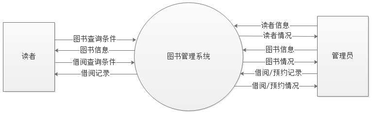

+ 0层图：

+ 1层图（读者管理）：

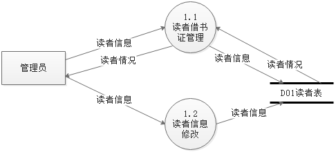

+ 1层图（信息查询）：

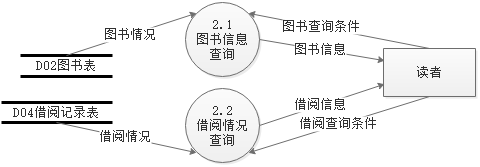

+ 1层图（图书管理）：

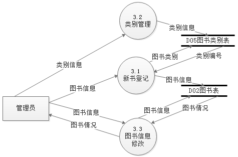

+ 1层图（借阅管理）：

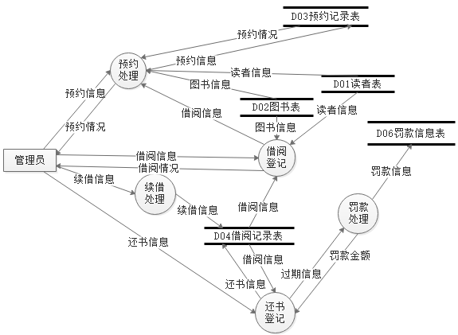

**2.数据字典**

1. 数据存储编号：D01

   数据存储名称：读者表

   简述：用于保存读者信息（包括借书证信息）

   存取说明：在读者管理和借阅管理模块会涉及到读者信息修改

   组成：{读者编号+姓名+电话+Email+身份证号+借书证号+借书证有效期+已借图书数量}

   说明：数据存储量在500万条以上

2. 数据存储编号：D02

   数据存储名称：图书表

   简述：用于保存图书信息

   存取说明：在图书管理和借阅管理模块会涉及到图书信息修改

   组成：{图书编号+书名+作者+出版社+类别+ISBN码+总量+库存量}

   说明：数据存储量在500万条以上

3. 数据存储编号：D03

   数据存储名称：预约表

   简述：用于保存读者的预约信息

   存取说明：在借阅管理模块会涉及到预约信息修改

   组成：{预约编号+借书证账号+图书编号+预约时间}

   说明：无

4. 数据存储编号：D04

   数据存储名称：借阅记录表

   简述：用于保存借阅信息

   存取说明：在借阅管理模块会涉及借阅信息修改

   组成：{借阅编号+借书证账号+图书编号+借阅时间+归还时间+借阅状态}

   说明：数据存储量在500万条以上，支持并发访问

5. 数据存储编号：D05

   数据存储名称：图书类别表

   简述：用于保存图书类别信息

   存取说明：在图书管理模块会涉及到图书类别信息修改

   组成：{类别编号+类别名称}

   说明：数据存储量在500万条以上

6. 数据存储编号：D06

   数据存储名称：罚款信息表

   简述：用于保存罚款信息

   存取说明：在借阅管理模块会涉及到罚款信息修改

   组成：{罚款编号+借阅编号+罚款日期+罚款金额+罚款原因}

   说明：数据存储量在500万条以上

**3.详细E-R图**

（1）系统基本 E-R 图

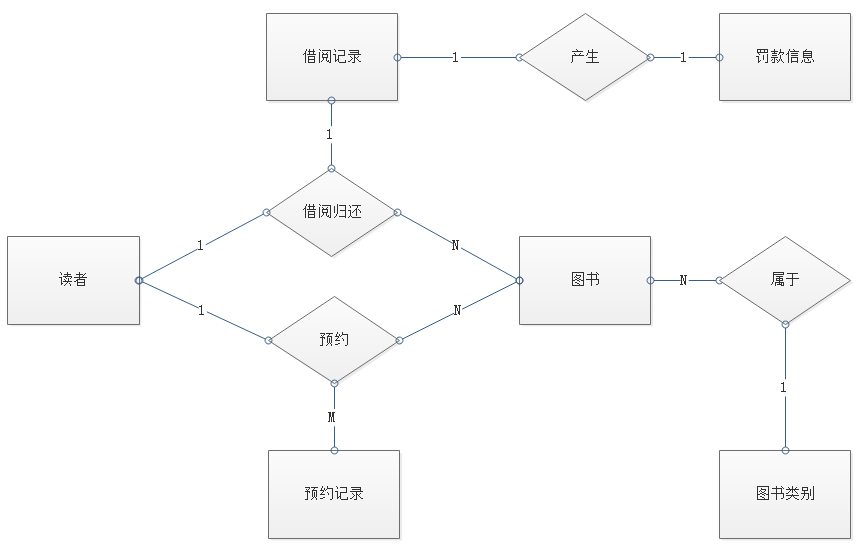

（2）实体属性

图书：

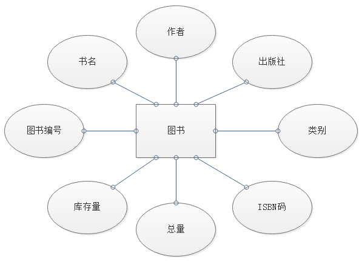

+ 图书类别：

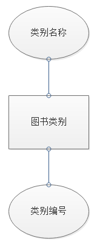

+ 读者：

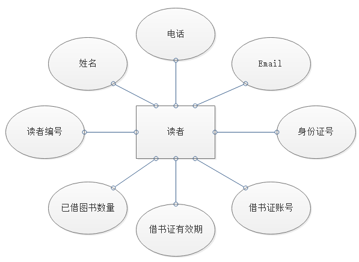

+ 管理员：

+ 借阅记录：

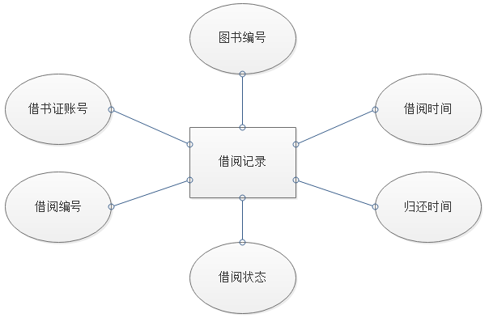

+ 罚款信息：

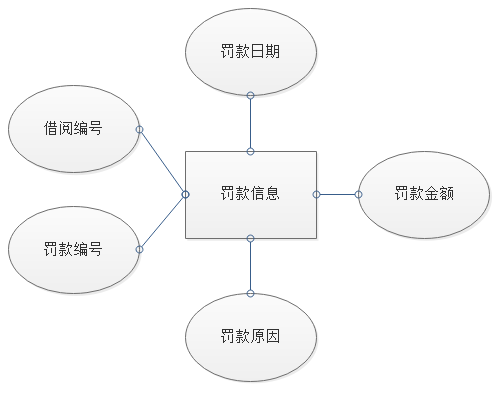

+ 预约记录：

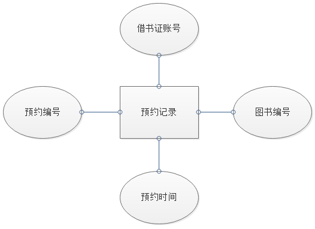

#### 三、系统设计

**1.系统功能结构图**

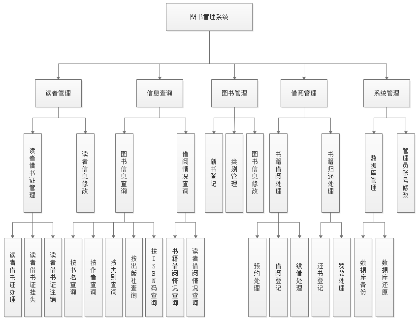

**2.各模块IPO图**

+ 读者管理模块：

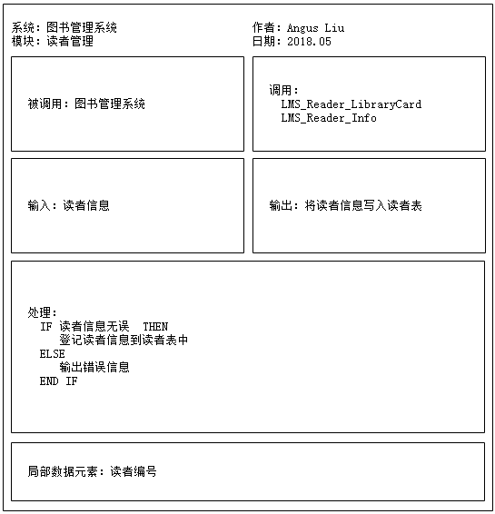

+ 信息查询模块：

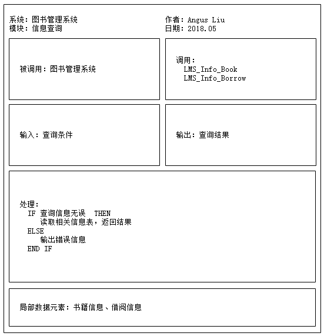

+ 图书管理模块：

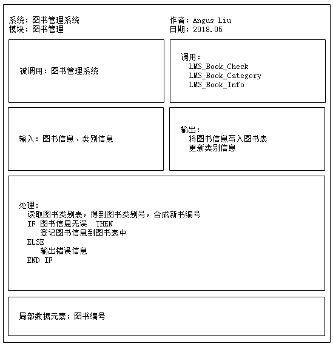

+ 借阅管理模块：

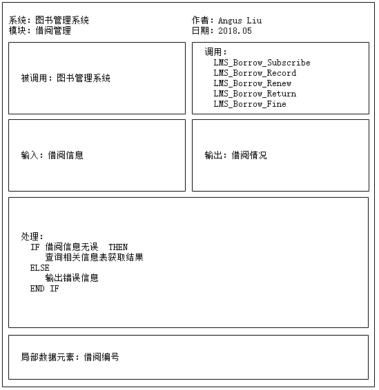

+ 系统管理模块：

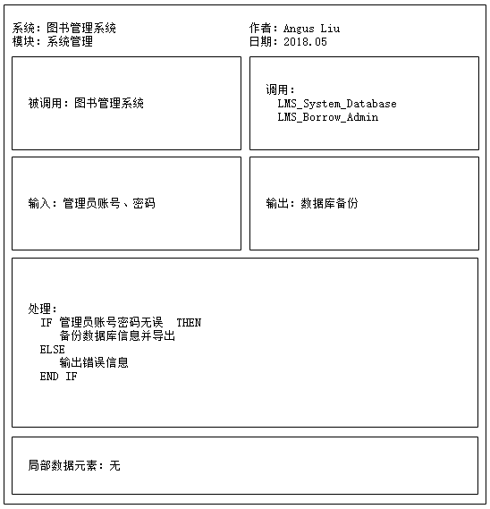

**3.详细设计**

+ 模块1：新书入库
  + 模块功能：将新书信息系添加到数据库中
  + 模块定义：
    + 返回值：int（0代表添加失败，1代表添加成功）
    + 函数名：int LMS_Book_CheckIn(struct Book bookInfo)
  + 算法描述：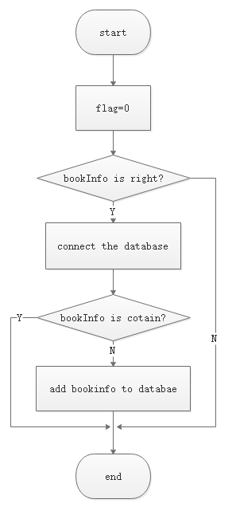
+ 模块1：罚款处理
  + 模块功能：根据借书超时天数，计算罚款金额
  + 模块定义：
    + 返回值：int（代表罚款金额数）
    + 函数名：int LMS_Borrow_Fine(int day)
  + 算法描述：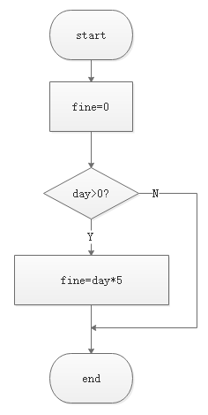

