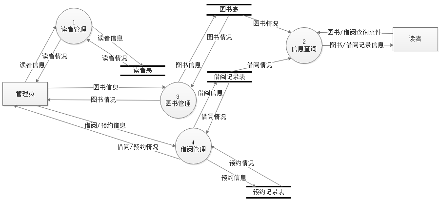
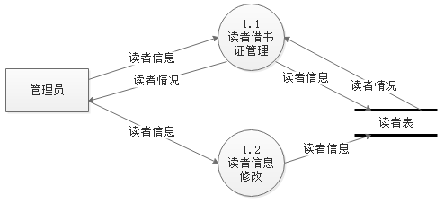
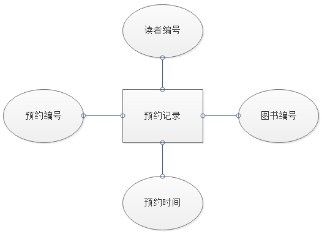
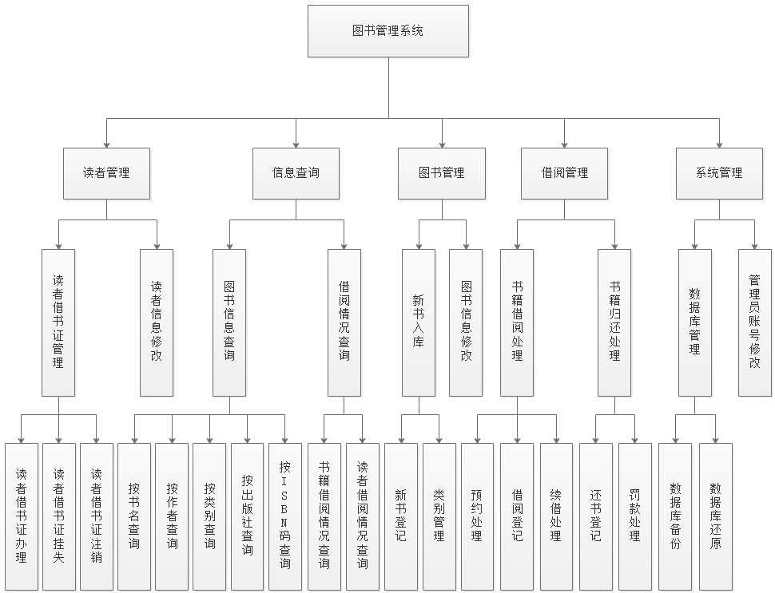

#### 一、问题定义

图书馆的主要业务和工作流程描述如下：

1. 读者来图书馆借书，可以先通过系统查询图书信息。查询条件有书名、作者、类别、出版社、ISBN码。查询到图书可以记下图书编号或者通过图书类别定位到图书摆放位置，找到后可以到管理处办理借书登记。如果该书被全部借出，可以到管理员处进行预约登记。
2. 办理借书、预约及续借手续时需要读者出示借书证，没有则可以到管理员处进行办理，也可以进行挂失和注销处理。管理员需要核实读者信息，正确和才能办理相关手续。借书时，管理员需要记录借书证账号、图书编号、借阅时间，系统会自动计算出归还时间，并设置借阅编号和借阅状态。
3. 读者可以通过系统查询自己的借阅信息，及时归还书籍。还书时，管理员通过借书证账号找到读者的借阅记录。如果超期，则产生罚款，进行罚款处理。然后进行还书登记。之后系统查看该书是否已被人预约，如是，则发出到书通知。
4. 新书入库时，需要管理员录入书籍的各项信息，确保无误。还需要管理图书类别及已有图书的信息，及时更新系统中的错误条目。
5. 管理员登录系统后，可以备份或还原数据库，也可以修改管理员账号和密码等信息。

#### 二、需求分析报告

**1.数据流图**

顶层图：

0层图：

1层图（读者管理）：

1层图（）

**2.数据字典**

**3.详细E-R图**

（1）系统基本 E-R 图

（2）实体属性

图书：

图书类别：

读者：

管理员：

借阅记录：

罚款信息：

预约记录：

#### 三、系统设计

**1.系统功能结构图**

**2.各模块IPO图**

**3.详细设计**