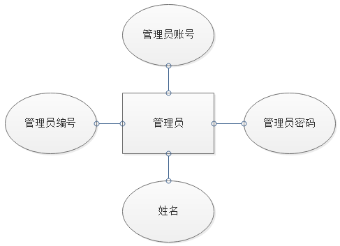

#### 一、问题定义

图书馆的主要业务和工作流程描述如下：

1. 图书信息查询：读者来图书馆借书，先通过系统查询图书信息。查询条件有书名、作者、类别、出版社、ISBN码。
2. 图书预约登记：如果读者在查询系统查到的数目已被全部解除，可以到管理员处进行预约登记。
3. 借书超时管理：根据借阅记录，超时借阅系统会通知相关读者，并产生罚款。
4. 读者信息管理：系统管理员可以
5. 

> 其工作流程为：用户选择登录用户类型 ，普通读者只有浏览、阅读和查询信息，图书借阅管理员可以操作，可以进行信息录入、修改和删除的操作。统管理员有注册用户管理，修改信息，维护管理。
>
> 添加操作：在执行操作时首先都要先检查是否已经输入以及数据库中是否已经存在输入的数据，如果存在会报错，程序返回上个页面，不执行添加操作。
>
> 删除操作：考虑到了字段在不同表中可能会同时存在的情况，比如：删除图书分类时候该分类下有书或者删除用户时该用户有借书记录，这样的情况下程序会给出提醒并跳转到该分类下的所有图书查看或者是该用户的全部借书查看。直到这种关联取消掉之后才允许进行删除这样的危险操作。
>
> 为了保证系统可以安全、长期、可靠、稳定、高效的运行，图书管理系统应有以下几点性能需求：

#### 二、需求分析报告

**1.数据流图**

**2.数据字典**

**3.详细E-R图**

（1）系统基本 E-R 图

（2）实体属性

#### 三、系统设计

**1.系统功能结构图**

**2.各模块IPO图**

**3.详细设计**