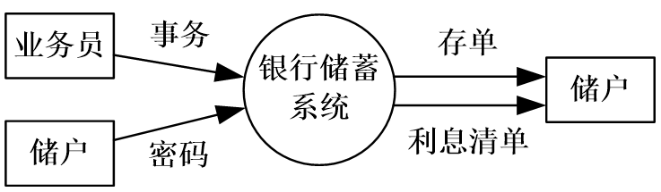

## 考试安排

### 考试题型

+ 选择题20分
+ 小的计算题40分（解答题、知识点应用题，与给的试题中的规模相同）
+ 大的计算题40分

### 考试大纲

1. 概述
   + 软件生命周期包含哪几个阶段，各用来做什么
   + 各种过程模型的基本思想

2. 可行性和需求分析
   + 数据流图和数字字典中数据的定义方法

3. 设计
   + 结构设计的模块独立化
   + 启发式原则
   + 数据流图映射到结构图的方法
   + PAD图的画法
4. 实现
   + 基本路径测试法
   + 等价类测试法
   + 边界值测试法
   + 渐增式集成测试方法
5. 软件维护分类
6. 面向对象需求分析
   + 用例图的画法
   + 类图的画法
   + 顺序图的画法
   + 类之间的关系

## 第1章 软件工程概述

### 1.2 软件工程

软件工程：是指导计算机软件开发和维护的一门工程学科。 

软件工程包括技术和管理两方面的内容。 

软件工程方法学3要素：方法、工具和过程。

### 1.3 软件生命周期

软件生命周期：软件产品从形成概念开始，经过开发、使用和维护，直到最后退役的全过程（记）。 

分为三个时期：软件定义、软件开发和运行维护(也称为软件维护）。每个时期又进一步划分成若干个阶段。 

### 1.4 软件过程

（重）软件过程：是为了获得高质量软件所需要完成的一系列任务的框架，它规定了完成各项任务的工作步骤。 

瀑布模型的缺点（重）：用户只能通过文档了解产品，不经过实践的需求是不切实际的。

瀑布模型适用于（重）：   

+ 需求是预知的； 
+ 软件实现方法是成熟的；   
+ 项目周期较短。   

快速原型模型适用于：需求不确切。

增量模型适用于：需求较为稳定的软件开发。

采用瀑布模型或快速原型模型开发软件时，目标都是一次就把一个满足所有需求的产品提交给用户。增量模型与之相反，它分批地逐步向用户提交产品，整个软件产品被分解成许多个增量构件，开发人员一个构件一个构件地向用户提交产品。

螺旋模型的基本思想：增加了风险分析过程的瀑布模型和快速原型模型混合。（使用原型及其他方法来尽量降低风险）

螺旋模型适用于：特别适用于庞大、复杂并具有高风险的系统。 

喷泉模型：主要用于支持面向对象开发过程体现了软件创建所固有的迭代和无缝隙的特征。适用于小型面向对象软件开发。

### 作业

1.简述软件生命周期分哪3个时期和8个阶段?

+ 时期：软件定义、软件开发、软件维护。
+ 阶段：软件定义（问题定义、可行性研究、需求分析）；软件开发（概要设计、详细设计、编码和单元测试、综合测试）；软件维护（运行维护）。

2.叙述瀑布模型、原型模型、增量模型和螺旋模型适用什么软件开发（几句话就可） 

+ 瀑布模型：需求易于完善定义且不易变更的软件系统（需求确切）。
+ 快速原型模型：需求复杂、难以确定、动态变化的软件系统（需求不确切）。
+ 增量模型：技术风险较大、用户需求较为稳定的软件系统。
+ 螺旋模型：需求难以获取和确定、软件开发风险较大的软件系统。

3.假设你要开发一个软件，它的功能是把73624.9385这个数开平方，所得到的结果应该精确到小数点后4位，一旦实现并测试完之后，该产品被抛弃，你打算选哪种软件过程模型？请说明你做出这样选择的理由。

解答：使用瀑布模型。原因：需求清晰、开发完就抛弃。

## 第2章 可行性研究

### 2.1 可行性研究的任务

从哪些方面考虑可行性？

主要方面：

+ 技术可行性，使用现有的技术能实现这个系统吗?
+ 经济可行性，这个系统的经济效益能超过它的开发成本吗?
+ 操作可行性，系统的操作方式在这个用户组织内行得通吗? 

其他方面：

+ 运行可行性，系统的运行方式是否可行？ 
+ 法律可行性，系统是否侵犯他人、集体或国家的利益，是否违反法律？  

### 2.4 数据流图（Data Flow Diagram）

数据流图：

+ 是一种图形化技术，它描绘信息流和数据在软件中从输入移动到输出的过程中所经受的变换。
+ 在数据流图中没有任何具体的物理部件，它只是描绘数据在软件中流动和被处理的逻辑过程。
+ 描述：系统中数据的形式和对数据的操作。

符号（重点）：

### 2.5 数据字典

数据字典的组成（掌握）：

+ 数据流 
+ 数据流分量
+ 数据存储
+ 处理

符号（理解）：

+ = 意思是等价于(或定义为)；
+ \+ 意思是和(即，连接两个分量)；
+ \[ ] 意思是或(即，从方括弧内列出的若干个分量中选择一个)，通常用“|”号隔开供选择的分量；
+ {  } 意思是重复(即，重复花括弧内的分量)；常常使用上限和下限进一步注释表示重复的花括弧。
+ (  ) 意思是可选(即，圆括弧里的分量可有可无)。 

### 作业

1.储蓄系统画数据流图（P73 3）

顶层数据流图

功能级数据流图

细化的数据流图

2.数据字典描述数据定义（P54 5）

+ 电话号码=[校内电话号码|校外电话号码] 
+ 校内电话号码=非零数字+ 3 位数字 
+ 校外电话号码=[本市号码|外地号码]
+ 本市号码=数字零+8位数字
+ 外地号码=数字零+3位数字+8位数字
+ 非零数字=[1|2|3|4|5|6|7|8|9]
+ 数字零＝0
+ 3位数字＝3{数字}3
+ 8位数字=非零数字+7位数字
+ 7位数字=7{数字}7
+ 数字＝[0|1|2|3|4|5|6|7|8|9]

## 第3章 需求分析

### 3.3 分析建模与规格说明

需求分析过程应该建立3种模型，分别是(重要)

+ 数据模型（例：实体-联系图）
+ 功能模型（例：数据流图）
+ 行为模型（例：状态转换图）

### 3.6 状态转换图

状态转换图：通过描绘系统的状态及引起系统状态转换的事件，来表示系统的行为。 

符号：

+ 初态：用实心圆表示；
+ 终态：用一对同心圆(内圆为实心圆)表示；
+ 中间状态：用圆角矩形表示，分成上、中、下3部分。
  + 上面部分-----为状态的名称；
  + 中间部分-----为状态下关键变量的名字和值；可无
  + 下面部分-----是活动表：当前状态下需要做的一些事情，不会改变状态。 可无
+ 带箭头的连线：称为状态转换，箭头指明了转换方向。 

### 作业

自动门 状态转换图

自动门：可以将人接近门的动作（或将某种入门授权）识别为开门信号的控制单元，通过驱动系统将门开启，在人离开后再将门自动关闭，并对开启和关闭的过程实现控制的系统。

## 第4章 结构化设计

