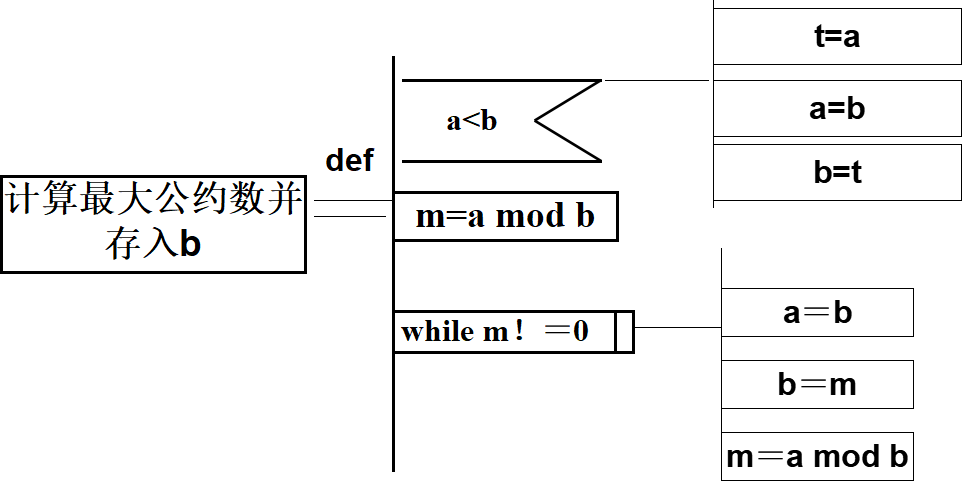

## 考试安排

### 考试题型

+ 选择题20分
+ 小的计算题40分（解答题、知识点应用题，与给的试题中的规模相同）
+ 大的计算题40分

### 考试大纲

1. 概述
   + 软件生命周期包含哪几个阶段，各用来做什么
   + 各种过程模型的基本思想

2. 可行性和需求分析
   + 数据流图和数字字典中数据的定义方法

3. 设计
   + 结构设计的模块独立化
   + 启发式原则
   + 数据流图映射到结构图的方法
   + PAD图的画法
4. 实现
   + 基本路径测试法
   + 等价类测试法
   + 边界值测试法
   + 渐增式集成测试方法
5. 软件维护分类
6. 面向对象需求分析
   + 用例图的画法
   + 类图的画法
   + 顺序图的画法
   + 类之间的关系

## 第1章 软件工程概述

### 1.2 软件工程

软件工程：是指导计算机软件开发和维护的一门工程学科。 

软件工程包括技术和管理两方面的内容。 

软件工程方法学3要素：方法、工具和过程。

### 1.3 软件生命周期

软件生命周期：软件产品从形成概念开始，经过开发、使用和维护，直到最后退役的全过程（记）。 

分为三个时期：软件定义、软件开发和运行维护(也称为软件维护）。每个时期又进一步划分成若干个阶段。 

### 1.4 软件过程

（重）软件过程：是为了获得高质量软件所需要完成的一系列任务的框架，它规定了完成各项任务的工作步骤。 

瀑布模型的缺点（重）：用户只能通过文档了解产品，不经过实践的需求是不切实际的。

瀑布模型适用于（重）：   

+ 需求是预知的； 
+ 软件实现方法是成熟的；   
+ 项目周期较短。   

快速原型模型适用于：需求不确切。

增量模型适用于：需求较为稳定的软件开发。

采用瀑布模型或快速原型模型开发软件时，目标都是一次就把一个满足所有需求的产品提交给用户。增量模型与之相反，它分批地逐步向用户提交产品，整个软件产品被分解成许多个增量构件，开发人员一个构件一个构件地向用户提交产品。

螺旋模型的基本思想：增加了风险分析过程的瀑布模型和快速原型模型混合。（使用原型及其他方法来尽量降低风险）

螺旋模型适用于：特别适用于庞大、复杂并具有高风险的系统。 

喷泉模型：主要用于支持面向对象开发过程体现了软件创建所固有的迭代和无缝隙的特征。适用于小型面向对象软件开发。

### 作业

1.简述软件生命周期分哪3个时期和8个阶段?

+ 时期：软件定义、软件开发、软件维护。
+ 阶段：软件定义（问题定义、可行性研究、需求分析）；软件开发（概要设计、详细设计、编码和单元测试、综合测试）；软件维护（运行维护）。

2.叙述瀑布模型、原型模型、增量模型和螺旋模型适用什么软件开发（几句话就可） 

+ 瀑布模型：需求易于完善定义且不易变更的软件系统（需求确切）。
+ 快速原型模型：需求复杂、难以确定、动态变化的软件系统（需求不确切）。
+ 增量模型：技术风险较大、用户需求较为稳定的软件系统。
+ 螺旋模型：需求难以获取和确定、软件开发风险较大的软件系统。

3.假设你要开发一个软件，它的功能是把73624.9385这个数开平方，所得到的结果应该精确到小数点后4位，一旦实现并测试完之后，该产品被抛弃，你打算选哪种软件过程模型？请说明你做出这样选择的理由。

解答：使用瀑布模型。原因：需求清晰、开发完就抛弃。

## 第2章 可行性研究

### 2.1 可行性研究的任务

从哪些方面考虑可行性？

主要方面：

+ 技术可行性，使用现有的技术能实现这个系统吗?
+ 经济可行性，这个系统的经济效益能超过它的开发成本吗?
+ 操作可行性，系统的操作方式在这个用户组织内行得通吗? 

其他方面：

+ 运行可行性，系统的运行方式是否可行？ 
+ 法律可行性，系统是否侵犯他人、集体或国家的利益，是否违反法律？  

### 2.4 数据流图（Data Flow Diagram）

数据流图：

+ 是一种图形化技术，它描绘信息流和数据在软件中从输入移动到输出的过程中所经受的变换。
+ 在数据流图中没有任何具体的物理部件，它只是描绘数据在软件中流动和被处理的逻辑过程。
+ 描述：系统中数据的形式和对数据的操作。

符号（重点）：

### 2.5 数据字典

数据字典的组成（掌握）：

+ 数据流 
+ 数据流分量
+ 数据存储
+ 处理

符号（理解）：

+ = 意思是等价于(或定义为)；
+ \+ 意思是和(即，连接两个分量)；
+ \[ ] 意思是或(即，从方括弧内列出的若干个分量中选择一个)，通常用“|”号隔开供选择的分量；
+ {  } 意思是重复(即，重复花括弧内的分量)；常常使用上限和下限进一步注释表示重复的花括弧。
+ (  ) 意思是可选(即，圆括弧里的分量可有可无)。 

### 作业

1.储蓄系统画数据流图（P73 3）

顶层数据流图

功能级数据流图

细化的数据流图

2.数据字典描述数据定义（P54 5）

+ 电话号码=[校内电话号码|校外电话号码] 
+ 校内电话号码=非零数字+ 3 位数字 
+ 校外电话号码=[本市号码|外地号码]
+ 本市号码=数字零+8位数字
+ 外地号码=数字零+3位数字+8位数字
+ 非零数字=[1|2|3|4|5|6|7|8|9]
+ 数字零＝0
+ 3位数字＝3{数字}3
+ 8位数字=非零数字+7位数字
+ 7位数字=7{数字}7
+ 数字＝[0|1|2|3|4|5|6|7|8|9]

## 第3章 需求分析

### 3.3 分析建模与规格说明

需求分析过程应该建立3种模型，分别是(重要)

+ 数据模型（例：实体-联系图）
+ 功能模型（例：数据流图）
+ 行为模型（例：状态转换图）

### 3.6 状态转换图

状态转换图：通过描绘系统的状态及引起系统状态转换的事件，来表示系统的行为。 

符号：

+ 初态：用实心圆表示；
+ 终态：用一对同心圆(内圆为实心圆)表示；
+ 中间状态：用圆角矩形表示，分成上、中、下3部分。
  + 上面部分-----为状态的名称；
  + 中间部分-----为状态下关键变量的名字和值；可无
  + 下面部分-----是活动表：当前状态下需要做的一些事情，不会改变状态。 可无
+ 带箭头的连线：称为状态转换，箭头指明了转换方向。 

### 作业

自动门 状态转换图

自动门：可以将人接近门的动作（或将某种入门授权）识别为开门信号的控制单元，通过驱动系统将门开启，在人离开后再将门自动关闭，并对开启和关闭的过程实现控制的系统。

## 第4章 结构化设计

### 4.1 总体设计过程

典型的总体设计过程包括下述9个步骤：

1. 设想供选择的方案

2. 选取合理的方案

   对每个合理的方案，分析员都应该准备下列四份资料：

   + 系统流程图；
   + 组成系统的物理元素清单；
   + 成本/效益分析；
   + 实现这个系统的进度计划。

3. 推荐最佳方案

4. 功能分解

   + 数据流图中每个处理继续进行细分，直到对大多数程序员容易理解及实现。（审核，细化） "

5. 设计软件结构

   + 通常程序中的一个模块完成一个适当的子功能。应该把模块组织成良好的层次系统。软件结构可以用层次图或结构图来描绘。 
   + 如果数据流图已经细化到适当的层次，则可以直接从数据流图映射出软件结构，这就是面向数据流的设计方法。（重点）

6. 设计数据库

7. 制定测试计划

8. 书写文档

9. 审查和复查

### 4.2 设计原理

模块：是由边界元素限定的相邻程序元素的序列，而且有一个总体标识符代表它。

模块化：就是把程序划分成独立命名且可独立访问的模块，每个模块完成一个子功能，把这些模块集成起来构成一个整体，可以完成指定的功能满足用户的需求。 

一般抽象过程：

+ 处理复杂系统的唯一有效的方法是用层次化的方式构造和分析它。
+ 一个复杂的动态系统首先可以用一些高级的抽象概念构造和理解，这些高级概念又可以用一些较低级的概念构造和理解，如此进行下去，直至最低层次的具体元素。

### 4.3 模块独立

数据耦合（data coupling）：如果两个模块彼此间通过参数交换信息，而且交换的信息仅仅是数据，那么这种耦合称为数据耦合。 

控制耦合（control coupling）：如果两个模块彼此间传递的信息中有控制信号，这种耦合称为控制耦合。

特征耦合（stamp coupling）：当把整个数据结构作为参数传递而被调用的模块只需要其中一部分数据元素时，就出现了特征耦合。

公共环境耦合（common coupling）：当两个或多个模块通过一个公共数据环境相互作用时，它们之间的耦合称为公共环境耦合。这种耦合有两种情况：

+ 一个模块往公共环境送数据，另一个模块从公共环境读数据。这是数据耦合的一种形式，是比较松散的耦合。
+ 两个模块既往公共环境送数据又从里面取数据，这种耦合比较紧密，介于数据耦合和控制耦合之间。

内容耦合（content coupling）：最高程度的耦合是内容耦合。如果出现下列情况之一，两个模块间就发生了内容耦合：

+ 一个模块访问另一个模块中的数据；
+ 一个模块不通过正常入口转到另一个模块的内部；
+ 两个模块有一部分程序代码重叠；
+ 一个模块有多个入口。

偶然内聚（coincidental cohesion）：如果一个模块的各成分之间毫无关系，则称为偶然内聚。 

逻辑内聚（logical cohesion）：如果一个模块完成的任务在逻辑上属于相同或相似的一类，则称为逻辑内聚。 

时间内聚（temporal cohesion）：n如果一个模块包含的任务必须在同一段时间内执行，就叫时间内聚。

过程内聚（procedural cohesion）：如果一个模块内的处理元素是相关的，而且必须以特定次序执行，则称为过程内聚。 

通信内聚（communicational cohesion）：如果模块中所有元素都使用同一个输入数据和(或)产生同一个输出数据，则称为通信内聚。即在同一个数据结构上操作。 

顺序内聚（sequential cohesion）：如果一个模块的各个成分和同一个功能密切相关，而且一个成分的输出作为另一个成分的输入，则称为顺序内聚 。

功能内聚（functional cohesion）：如果模块内所有处理元素属于一个整体(每个处理都是必不可少)，完成一个单一的功能，则称为功能内聚。功能内聚是最高程度的内聚。 

### 4.4 启发原则

深度、宽度、扇出和扇入都应适当（记） 

+ 深度：软件结构中控制的层数，它往往能粗略地标志一个系统的大小和复杂程度。应适当。否则可能是模块划分过细，未完成一个完整子功能。增加接口成本消耗。 

  解决办法：（1）将一些模块与其父模块合并，减少深度。（2）将子模块提升到父模块同一层次 

+ 宽度：软件结构内同一个层次上的模块总数的最大值。应适当，若多，模块间协调花费就大。可能抽象不够。（影响扇入扇出）

  解决办法：寻找同层模块之间关系，抽象出父模块，增加中间层次。 

+ 设计得很好的软件结构通常会顶层扇出比较高，中间层扇出少，底层扇入到公共的实用模块中去（底层模块有高扇入）。

模块的作用域应该在控制域之内（作用域为直连，控制域为级联）

+ 模块的作用域：定义为受该模块内一个判定影响的所有模块的集合。 
+ 模块的控制域：是这个模块本身以及所有直接或间接从属于它的模块的集合。 

### 4.5 描绘软件结构的图形工具（层次图、HIPO图、结构图）

1.层次图用来描绘软件的层次结构。很适于在自顶向下设计软件的过程中使用。

2.HIPO图是美国IBM公司发明的“层次图+输入/处理/输出图”的英文缩写。 

为了能使HIPO图具有可追踪性，在H图(层次图)里除了最顶层的方框之外，每个方框都加了编号。

3.结构图(带箭头指向)和层次图类似，也是描绘软件结构的图形工具。

基本符号：

+ 方框代表一个模块；
+ 方框之间的直线表示模块的调用关系；
+ 尾部是空心圆箭头表示传递的是数据；
+ 尾部是实心圆箭头表示传递的是控制信息。

### 作业

1.储蓄系统，画模块图。

### 4.8 过程设计的工具（PAD图）

PAD是问题分析图(problem analysis diagram)的英文缩写，它用二维树形结构的图来表示程序的控制流，将这种图翻译成程序代码比较容易。 

### 作业

1.某校的课酬计算机方案为： 基本课酬为每节课10元。 班级人数超过60人，增加基本课酬的10%。 班级人数超过80人，增加基本课酬的20%。 如果教师为副教授，增加基本课酬的10%。 如果教师为教授，增加基本课酬的20%。 如果教师为助教，不增加课酬。 如果教师为见习助教，减少基本课酬的10%。用判定表，表达上述计算方案 。

2.求两数最大公约数的算法的PAD图表述。

