## 考试安排

### 考试题型

+ 选择题20分
+ 小的计算题40分（解答题、知识点应用题，与给的试题中的规模相同）
+ 大的计算题40分

### 考试大纲

1. 概述
   + 软件生命周期包含哪几个阶段，各用来做什么
   + 各种过程模型的基本思想

2. 可行性和需求分析
   + 数据流图和数字字典中数据的定义方法

3. 设计
   + 结构设计的模块独立化
   + 启发式原则
   + 数据流图映射到结构图的方法
   + PAD图的画法
4. 实现
   + 基本路径测试法
   + 等价类测试法
   + 边界值测试法
   + 渐增式集成测试方法
5. 软件维护分类
6. 面向对象需求分析
   + 用例图的画法
   + 类图的画法
   + 顺序图的画法
   + 类之间的关系

## 第1章 软件工程概述

### 1.2 软件工程

软件：程序、数据即相关文档。

软件工程：是指导计算机软件开发和维护的一门工程学科。 

软件工程包括技术和管理两方面的内容。 

软件工程方法学3要素：方法、工具和过程。

### 1.3 软件生命周期

软件生命周期：软件产品从形成概念开始，经过开发、使用和维护，直到最后退役的全过程（记）。 

分为三个时期：软件定义、软件开发和运行维护(也称为软件维护）。每个时期又进一步划分成若干个阶段。 


### 1.4 软件过程

（重）软件过程：是为了获得高质量软件所需要完成的一系列任务的框架，它规定了完成各项任务的工作步骤。 

瀑布模型的缺点（重）：用户只能通过文档了解产品，不经过实践的需求是不切实际的。

瀑布模型适用于（重）：   

+ 需求是预知的； 
+ 软件实现方法是成熟的；   
+ 项目周期较短。   

快速原型模型适用于：需求不确切。

增量模型适用于：需求较为稳定的软件开发。

采用瀑布模型或快速原型模型开发软件时，目标都是一次就把一个满足所有需求的产品提交给用户。增量模型与之相反，它分批地逐步向用户提交产品，整个软件产品被分解成许多个增量构件，开发人员一个构件一个构件地向用户提交产品。

螺旋模型的基本思想：增加了风险分析过程的瀑布模型和快速原型模型混合。（使用原型及其他方法来尽量降低风险）

螺旋模型适用于：特别适用于庞大、复杂并具有高风险的系统。 

喷泉模型：主要用于支持面向对象开发过程体现了软件创建所固有的迭代和无缝隙的特征。适用于小型面向对象软件开发。

### 作业

1.简述软件生命周期分哪3个时期和8个阶段?

+ 时期：软件定义、软件开发、软件维护。
+ 阶段：软件定义（问题定义、可行性研究、需求分析）；软件开发（概要设计、详细设计、编码和单元测试、综合测试）；软件维护（运行维护）。

2.叙述瀑布模型、原型模型、增量模型和螺旋模型适用什么软件开发（几句话就可） 

+ 瀑布模型：需求易于完善定义且不易变更的软件系统（需求确切）。
+ 快速原型模型：需求复杂、难以确定、动态变化的软件系统（需求不确切）。
+ 增量模型：技术风险较大、用户需求较为稳定的软件系统。
+ 螺旋模型：需求难以获取和确定、软件开发风险较大的软件系统。


3.假设你要开发一个软件，它的功能是把73624.9385这个数开平方，所得到的结果应该精确到小数点后4位，一旦实现并测试完之后，该产品被抛弃，你打算选哪种软件过程模型？请说明你做出这样选择的理由。

解答：使用瀑布模型。原因：需求清晰、开发完就抛弃。

## 第2章 可行性研究

### 2.1 可行性研究的任务

软件开发的八个阶段中，可行性研究阶段的目的就是用最小的代价在尽可能短的时间内确定该软件项目是否能够开发，是否值得开发。

从哪些方面考虑可行性？

主要方面：

+ 技术可行性，使用现有的技术能实现这个系统吗?
+ 经济可行性，这个系统的经济效益能超过它的开发成本吗?
+ 操作可行性，系统的操作方式在这个用户组织内行得通吗? 

其他方面：

+ 运行可行性，系统的运行方式是否可行？ 
+ 法律可行性，系统是否侵犯他人、集体或国家的利益，是否违反法律？  

### 2.4 数据流图（Data Flow Diagram）

数据流图：

+ 是一种图形化技术，它描绘信息流和数据在软件中从输入移动到输出的过程中所经受的变换。
+ 在数据流图中没有任何具体的物理部件，它只是描绘数据在软件中流动和被处理的逻辑过程。
+ 描述：系统中数据的形式和对数据的操作。
+ 四种基本成分是数据的源点/终点、变换数据的处理、数据存储和数据流。

符号（重点）：


### 2.5 数据字典

数据字典是软件需求分析阶段的重要⼯具之⼀， 其基本功能是数据定义。

数据字典的组成（掌握）：

+ 数据流 
+ 数据流分量
+ 数据存储
+ 处理

符号（理解）：

+ = 意思是等价于(或定义为)；
+ \+ 意思是和(即，连接两个分量)；
+ \[ \] 意思是或(即，从方括弧内列出的若干个分量中选择一个)，通常用“|”号隔开供选择的分量；
+ {  } 意思是重复(即，重复花括弧内的分量)；常常使用上限和下限进一步注释表示重复的花括弧。
+ (  ) 意思是可选(即，圆括弧里的分量可有可无)。 

### 作业

1.储蓄系统画数据流图（P73 3）

顶层数据流图


功能级数据流图


细化的数据流图


2.数据字典描述数据定义（P54 5）

+ 电话号码=[校内电话号码|校外电话号码] 
+ 校内电话号码=非零数字+ 3 位数字 
+ 校外电话号码=[本市号码|外地号码]
+ 本市号码=数字零+8位数字
+ 外地号码=数字零+3位数字+8位数字
+ 非零数字=[1|2|3|4|5|6|7|8|9]
+ 数字零＝0
+ 3位数字＝3{数字}3
+ 8位数字=非零数字+7位数字
+ 7位数字=7{数字}7
+ 数字＝[0|1|2|3|4|5|6|7|8|9]

## 第3章 需求分析

### 3.3 分析建模与规格说明

需求分析过程应该建立3种模型，分别是(重要)

+ 数据模型（例：实体-联系图）
+ 功能模型（例：数据流图）
+ 行为模型（例：状态转换图）

### 3.6 状态转换图

状态转换图：通过描绘系统的状态及引起系统状态转换的事件，来表示系统的行为。 

符号：

+ 初态：用实心圆表示；
+ 终态：用一对同心圆(内圆为实心圆)表示；
+ 中间状态：用圆角矩形表示，分成上、中、下3部分。
  + 上面部分-----为状态的名称；
  + 中间部分-----为状态下关键变量的名字和值；可无
  + 下面部分-----是活动表：当前状态下需要做的一些事情，不会改变状态。 可无
+ 带箭头的连线：称为状态转换，箭头指明了转换方向。 


### 作业

自动门 状态转换图

自动门：可以将人接近门的动作（或将某种入门授权）识别为开门信号的控制单元，通过驱动系统将门开启，在人离开后再将门自动关闭，并对开启和关闭的过程实现控制的系统。


## 第4章 结构化设计

### 4.1 总体设计过程

典型的总体设计过程包括下述9个步骤：

1. 设想供选择的方案

2. 选取合理的方案

   对每个合理的方案，分析员都应该准备下列四份资料：

   + 系统流程图；
   + 组成系统的物理元素清单；
   + 成本/效益分析；
   + 实现这个系统的进度计划。

3. 推荐最佳方案

4. 功能分解

   + 数据流图中每个处理继续进行细分，直到对大多数程序员容易理解及实现。（审核，细化）

5. 设计软件结构

   + 通常程序中的一个模块完成一个适当的子功能。应该把模块组织成良好的层次系统。软件结构可以用层次图或结构图来描绘。 
   + 如果数据流图已经细化到适当的层次，则可以直接从数据流图映射出软件结构，这就是面向数据流的设计方法。（重点）

6. 设计数据库

7. 制定测试计划

8. 书写文档

9. 审查和复查

### 4.2 设计原理

模块：是由边界元素限定的相邻程序元素的序列，而且有一个总体标识符代表它。

模块化：就是把程序划分成独立命名且可独立访问的模块，每个模块完成一个子功能，把这些模块集成起来构成一个整体，可以完成指定的功能满足用户的需求。 

一般抽象过程：

+ 处理复杂系统的唯一有效的方法是用层次化的方式构造和分析它。
+ 一个复杂的动态系统首先可以用一些高级的抽象概念构造和理解，这些高级概念又可以用一些较低级的概念构造和理解，如此进行下去，直至最低层次的具体元素。

### 4.3 模块独立

数据耦合（data coupling）：如果两个模块彼此间通过参数交换信息，而且交换的信息仅仅是数据，那么这种耦合称为数据耦合。 

控制耦合（control coupling）：如果两个模块彼此间传递的信息中有控制信号，这种耦合称为控制耦合。

特征耦合（stamp coupling）：当把整个数据结构作为参数传递而被调用的模块只需要其中一部分数据元素时，就出现了特征耦合。

公共环境耦合（common coupling）：当两个或多个模块通过一个公共数据环境相互作用时，它们之间的耦合称为公共环境耦合。这种耦合有两种情况：

+ 一个模块往公共环境送数据，另一个模块从公共环境读数据。这是数据耦合的一种形式，是比较松散的耦合。
+ 两个模块既往公共环境送数据又从里面取数据，这种耦合比较紧密，介于数据耦合和控制耦合之间。

内容耦合（content coupling）：最高程度的耦合是内容耦合。如果出现下列情况之一，两个模块间就发生了内容耦合：

+ 一个模块访问另一个模块中的数据；
+ 一个模块不通过正常入口转到另一个模块的内部；
+ 两个模块有一部分程序代码重叠；
+ 一个模块有多个入口。


偶然内聚（coincidental cohesion）：如果一个模块的各成分之间毫无关系，则称为偶然内聚。 

逻辑内聚（logical cohesion）：如果一个模块完成的任务在逻辑上属于相同或相似的一类，则称为逻辑内聚。 

时间内聚（temporal cohesion）：如果一个模块包含的任务必须在同一段时间内执行，就叫时间内聚。


过程内聚（procedural cohesion）：如果一个模块内的处理元素是相关的，而且必须以特定次序执行，则称为过程内聚。 

通信内聚（communicational cohesion）：如果模块中所有元素都使用同一个输入数据和(或)产生同一个输出数据，则称为通信内聚。即在同一个数据结构上操作。 


顺序内聚（sequential cohesion）：如果一个模块的各个成分和同一个功能密切相关，而且一个成分的输出作为另一个成分的输入，则称为顺序内聚 。

功能内聚（functional cohesion）：如果模块内所有处理元素属于一个整体(每个处理都是必不可少)，完成一个单一的功能，则称为功能内聚。功能内聚是最高程度的内聚。 

### 4.4 启发原则

深度、宽度、扇出和扇入都应适当（记） 

+ 深度：软件结构中控制的层数，它往往能粗略地标志一个系统的大小和复杂程度。应适当。否则可能是模块划分过细，未完成一个完整子功能。增加接口成本消耗。 

  解决办法：（1）将一些模块与其父模块合并，减少深度。（2）将子模块提升到父模块同一层次 

+ 宽度：软件结构内同一个层次上的模块总数的最大值。应适当，若多，模块间协调花费就大。可能抽象不够。（影响扇入扇出）

  解决办法：寻找同层模块之间关系，抽象出父模块，增加中间层次。 


+ 设计得很好的软件结构通常会顶层扇出比较高，中间层扇出少，底层扇入到公共的实用模块中去（底层模块有高扇入）。

模块的作用域应该在控制域之内（作用域为直连，控制域为级联）

+ 模块的作用域：定义为受该模块内一个判定影响的所有模块的集合。 
+ 模块的控制域：是这个模块本身以及所有直接或间接从属于它的模块的集合。 

### 4.5 描绘软件结构的图形工具（层次图、HIPO图、结构图）

1.层次图用来描绘软件的层次结构。很适于在自顶向下设计软件的过程中使用。


2.HIPO图是美国IBM公司发明的“层次图+输入/处理/输出图”的英文缩写。 

为了能使HIPO图具有可追踪性，在H图(层次图)里除了最顶层的方框之外，每个方框都加了编号。


3.结构图(带箭头指向)和层次图类似，也是描绘软件结构的图形工具。

基本符号：

+ 方框代表一个模块；
+ 方框之间的直线表示模块的调用关系；
+ 尾部是空心圆箭头表示传递的是数据；
+ 尾部是实心圆箭头表示传递的是控制信息。


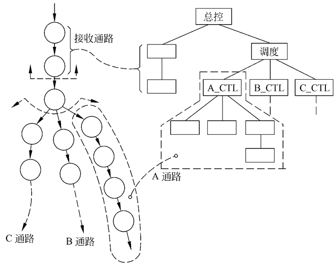

数据流图映射为模块结构图中，数据流图的类型不同，映射方法也不同。数据流图可分为变换流和事务流两种类型。

### 作业

1.储蓄系统，画模块图。


### 4.8 过程设计的工具（PAD图）

PAD是问题分析图(problem analysis diagram)的英文缩写，它用二维树形结构的图来表示程序的控制流，将这种图翻译成程序代码比较容易。 


### 作业

1.某校的课酬计算机方案为： 基本课酬为每节课10元。 班级人数超过60人，增加基本课酬的10%。 班级人数超过80人，增加基本课酬的20%。 如果教师为副教授，增加基本课酬的10%。 如果教师为教授，增加基本课酬的20%。 如果教师为助教，不增加课酬。 如果教师为见习助教，减少基本课酬的10%。用判定表，表达上述计算方案 。

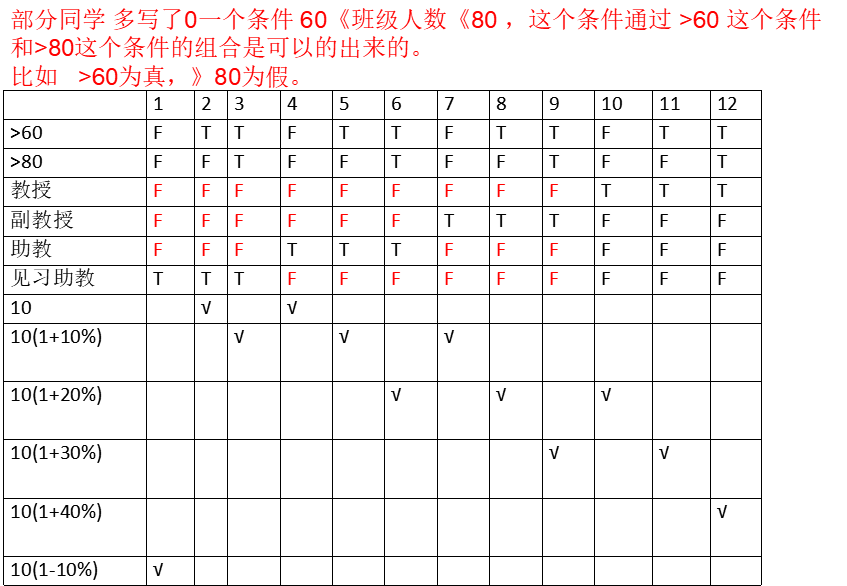

2.求两数最大公约数的算法的PAD图表述。


## 第5章 实现与维护

### 5.2 软件测试基础

测试方案（记忆）

所谓测试方案包括具体的测试目的（例如，预定要测试的具体功能），应该输入的测试数据和预期的结果。通常又把测试数据和预期的输出结果称为测试用例。（记忆）

### 5.3 白盒测试技术

语句覆盖：选择足够的测试数据，使被测程序中每个语句至少执行一次。

判定覆盖：判定覆盖的含义是，不仅每个语句必须至少执行一次，而且每个判定的每种可能的结果都应该至少执行一次。 

条件覆盖：条件覆盖的含义是，不仅每个语句至少执行一次，而且使判定表达式中的每个条件都取到各种可能的结果。

判定/条件覆盖：使得判定表达式中的每个条件都取到各种可能的值，每个判定表达式也都取到各种可能的结果。

条件组合覆盖：要求选取足够多的测试数据，使得每个判定表达式中条件的各种可能组合都至少出现一次。 

#### 5.3.2 控制结构测试

1.基本路径测试（根据控制结构设计测试数据）

基本路径测试是Tom McCabe提出的一种白盒测试技术。

思想：使用这种技术设计测试用例时，首先计算程序的环形复杂度，并用该复杂度为指南定义执行路径的基本集合，…….。

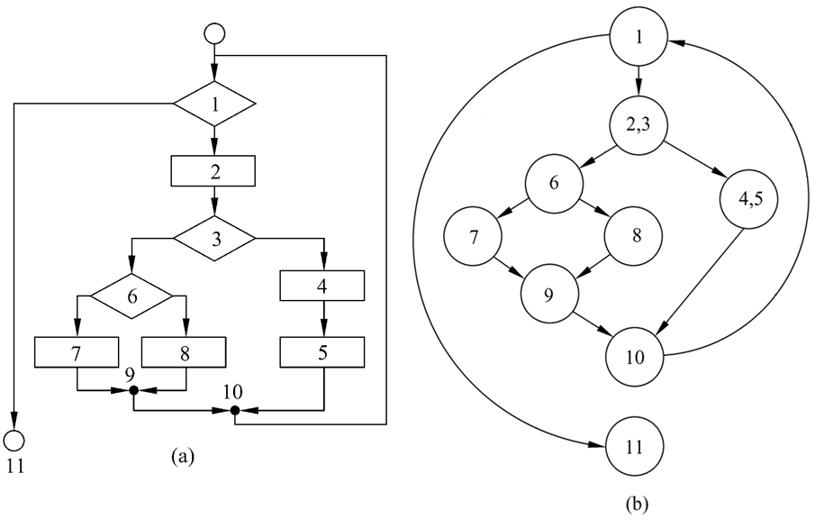

环形复杂度定量度量程序的逻辑复杂度。有了描绘程序控制流的流图之后，可以用下述3种方法中的任何一种来计算环形复杂度V(G)。

+ V(G)=流图中的区域数

  边和结点圈定的区域叫做区域，当对区域计数时，图形外的区域也应记为一个区域 

+ V(G)=E-N+2

  其中E是流图中的边数，N是结点数

+ V(G)=P+1

  其中P是流图中判定结点的数目 

基本路径测试举例   ：计算x的值 "

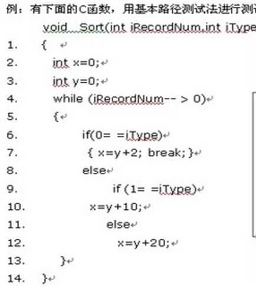

第一步：画出控制流图及基本路径

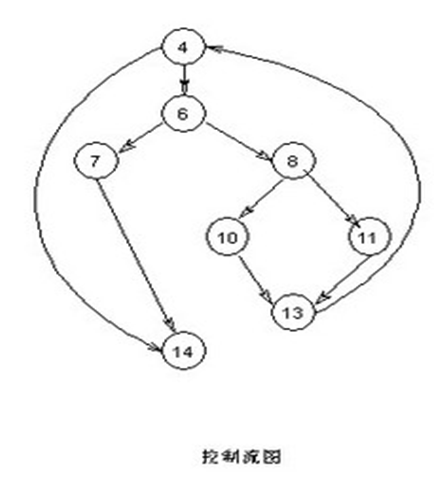

第二步：计算流图的环形复杂度。

根据环形复杂度计算方法，计算环形复杂度。 所示流图的环形复杂度为4。环形复杂度标识至少需要几条独立路径实现基本路径测试。

第三步：确定线性独立路径的基本集合。

所谓独立路径是指至少引入程序的一个新处理语句集合或一个新条件的路径，用流图术语描述，独立路径至少包含一条在定义该路径之前不曾用过的边。

基本路径：

+ 4 - 14
+ 4 - 6 - 7 - 14
+ 4 - 6 - 8 - 10 - 13 - 4 ….. - 14 
+ 4 - 6 - 8 - 11 - 13 - 4 ….. - 14 

第四步：设计可强制执行基本集合中每条路径的测试用例。

应该选取测试数据使得在测试每条路径时都适当地设置好了各个判定结点的条件。

### 5.4 黑盒测试技术

分类：等价类法、边界值分析法、因果图法、错误推测法。

#### 5.4.1 等价类法

等价划分：等价划分是一种黑盒测试技术，这种技术把程序的输入域划分为若干个数据类，据此导出测试用例。

等价划分 ：在输入数据中选择一些有代表性的数据进行测试。使其可能较多的发现错误。 

等价类：等价类就是功能相同或作用相同的一类数据。 

| 输入条件 | 有效等价类 | 无效等价类 |
| -------- | ---------- | ---------- |
|          |            | …          |
|          |            | …          |

**比如：招服务员 ，看是否给面试资格。**

要求：  女   20-50   大专以上毕业（0小学，1代表初中，2代表高中，3及以上代表大专以上）。

模块结构：

```c
int judge（sex，age，gradu）{

}
```

| 条件 | 有效等价类 | 无效等价类        |
| ---- | ---------- | ----------------- |
| 性别 | (1)女      | (2)男             |
| 年龄 | (3)[20,50] | (4)\<20  （7)\>50 |
| 毕业 | (5)>=3     | (6)[0,2]          |

合理的测试方案 

|                                   | 输入数据     | 预期结果 | 实际结果 |
| --------------------------------- | ------------ | -------- | -------- |
| \<1>覆盖所有有效等价类（1，3，5） | 女，25，3    | 1        |          |
| \<2>覆盖2                         | 男，25，3    | 0        |          |
| \<3>覆盖4                         | 女，18，3    | 0        |          |
| \<4> 覆盖7                        | 女，55   ，3 | 0        |          |
| \<5>覆盖6                         | 女， 25，1   | 0        |          |

有效等价类可以合并测试，无效等价类要分开测试（以防被覆盖）

**等价类划分实例：电话号码输入模块** 

某城市的电话号码由3部分组成，这3部分的名称和内容如下：

+ 地区码：空白或3位数字
+ 前缀：非0且非1开头的3位数字
+ 后缀：4位数字
+ 比如：（123）234-5678

现有被测程序：功能为能接收一切符合上述条件的电话号码，拒绝所有不符合规定的号码。用等价分类法，设计测试用例。

| 输入条件 | 有效等价类             | 无效等价类                                                   |
| -------- | ---------------------- | ------------------------------------------------------------ |
| 地区码   | 空白①，3位数字②        | 有非数字符号⑤，少于3位数字⑥多于3位数字⑦                      |
| 前缀     | 200—999之间的三位数字③ | 有非数字符号⑧，少于三位数字⑨，多于三位数字⑩，起始数字是0⑾，起始数字是1 ⑿ |
| 后缀     | 4位数字④               | 有非数字字符⒀   ，多于4位数字⒁   ，少于四位数字⒂             |

设计测试用例：

+ 表中的四个有效等价类可设计两个测试用例进行测试（空白①，3位数字②，200—999之间数字③，4位数字④）

  测试用例1：（ ）276-2345       结果：可接受

  测试用例2：（635）805-9321  结果：可接受

+ 表中有11个无效等价类，应选11个结果：可接受个测试用例

  对于地区码

  + A.有非数字符号⑤（20A）223-4562 结果：不可接受

  + B.少于3位数字⑥  （12）456-2789  结果：不可接受

  + C.多于3位数字⑦  （4576）435-7856 结果：不可接受

  对于前缀

  + A.有非数字符号⑧  （ ）1B2-7895   结果：不可接受
  + B.……

#### 5.4.2 边界值分析法

边界值：指输入等价类和输出等价类边界上的数据

思想：设计边界值测试方案进行分析 

边界法步骤：(1) 划分等价类  (2) 找等价类的边界 

### 5.6 集成测试

由模块组装成程序时有两种方法：

+ 非渐增式测试方法
+ 渐增式测试方法

渐增式测试方法：

+ 把下一个要测试的模块同已经测试好的那些模块结合起来进行测试；
+ 测试完以后再把下一个应该测试的模块结合进来测试，每次增加一个模块；
+ 把程序划分成小段来构造和测试，在这个过程中比较容易定位和改正错误；

渐增方式有两种集成策略：

+ 自顶向下
+ 自底向上

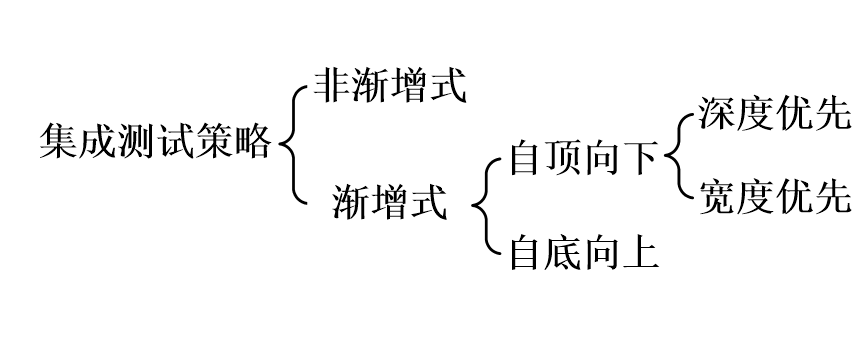

| 方法     | 优点                                                         | 缺点                                                         |
| -------- | ------------------------------------------------------------ | ------------------------------------------------------------ |
| 非渐增式 |                                                              | 没有错误隔离手段   主要设计错误发现迟   潜在可重用代码测试不充分   需要驱动程序和存根程序 |
| 自顶向下 | 具有错误隔离手段   主要设计错误发现早   不需要驱动程序       | 潜在可重用代码测试不充分   需要存根程序                      |
| 自底向上 | 具有错误隔离手段   潜在可重用代码能充分测试   不需要存根程序 | 主要设计错误发现迟   需要驱动程序                            |
| 混合     | 具有错误隔离手段   主要设计错误发现早   潜在可重用代码能充分测试 |                                                              |

### 5.6 维护

#### 5.6.1 软件维护的定义及种类

1.定义

所谓软件维护就是在软件已经交付使用之后，为了改正错误或满足新的需要而修改软件的过程。

2.可分为4项活动： 

+ 改正性维护 
  + 把诊断和改正错误的过程称为改正性维护。
  + 改正性维护占17%～21%。 
+ 适应性维护 
  + 为了和变化了的环境适当地配合而进行的修改软件的活动，是既必要又经常的维护活动。
  + 包括外部环境和数据环境的变化。
  + 适应性维护占18%～25%。
+ 完善性维护 
  + 为了满足在用户提出的增加新功能或修改已有功能的要求和一般性的改进要求，需要进行完善性维护。
  + 包括功能和性能的要求。
  + 完善性维护占50%～66%。
+ 预防性维护 
  + “把今天的方法学应用于昨天的系统以满足明天的需要。” 
  + 采用先进的软件工程方法对需要维护的软件或软件中的某一部分，主动地进行重新设计、编码和测试。
  + 预防性维护占4%左右。 
  + 只有预防性维护是主动的，其他维护都是被动的。

### 习题

1.设计测试用例，实现逻辑覆盖的三种覆盖（语句覆盖，判定覆盖，条件覆盖） 

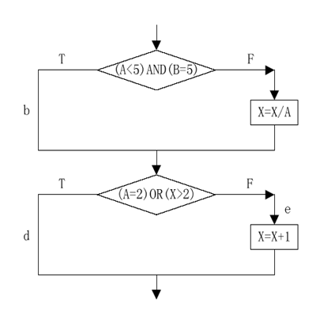

2.下面是一段求最大值的程序，其中datalist是数据表，n是datalist的长度。

（1） 画出该程序的控制流图，并计算其复杂度。

（2） 列出独立路径

（3） 为各测试路径设计测试用例。

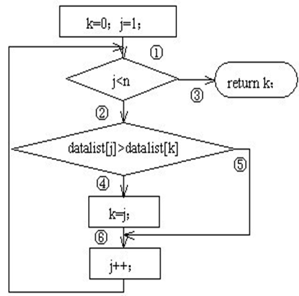

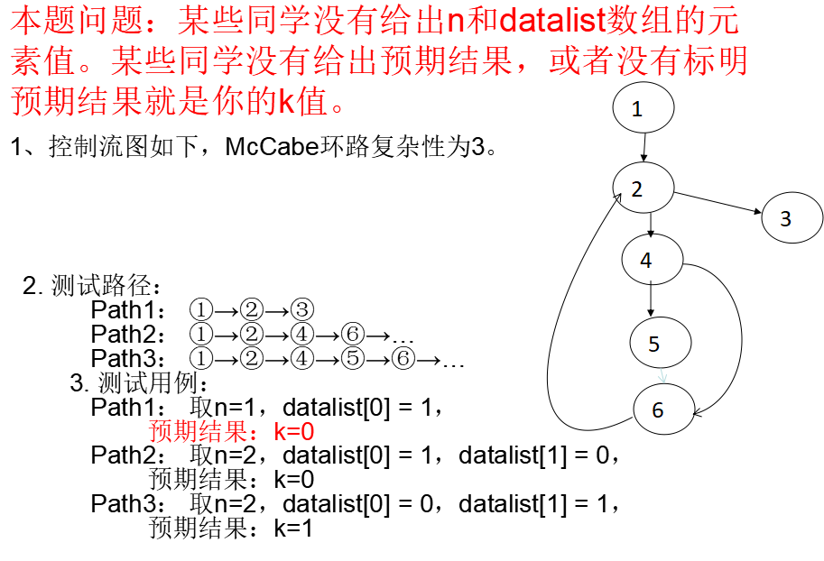

3.等价类法：注册邮箱时邮箱名要求6~18个字符，可使用字母、数字、下划线，需以字母开头。  

| 条件                   | 有效等价类                 | 无效等价类                                             |
| ---------------------- | -------------------------- | ------------------------------------------------------ |
| 用户名长度             | (1) [6 18]位               | (4)\<6 位    (5)\>18位                                 |
| 用户名开头             | (2) 字母                   | (6) 数字     (7)下划线      (8)其它非字母易常用符号如$ |
| 用户名是字母和数字混合 | (3) 字母和数字、下划线混合 | (9) 空格     (10)其它特殊字符易常用如&                 |

测试用例及预期结果

| 编号及覆盖度      | 用例                      | 预期结果 |
| ----------------- | ------------------------- | -------- |
| \<1>覆盖(1)(2)(3) | Abc1_2cd                  | 接受     |
| \<2>覆盖(4)       | dbc1                      | 不接受   |
| \<3>覆盖(5)       | Bcde123_85_cdeeerjekrwler | 不接受   |
| \<4>覆盖(6)       | 7bc12efd_                 | 不接受   |
| \<5>覆盖(7)       | _bc12efdab                | 不接受   |
| \<6>覆盖(8)       | $dbc16757_                | 不接受   |
| \<7>覆盖(9)       | Bcde 12 3_85_cd           | 不接受   |
| \<8>覆盖(10)      | 7bc12e&fd_                | 不接受   |

## 第6章 面向对象方法学引论

### 6.1 UML（统一建模语言）概述

UML (Unified Modeling Language)为面向对象软件设计提供统一的、标准的、可视化的建模语言。适用于描述以用例为驱动的软件设计的全过程。

## 第7章 面向对象分析（OOA）

### 7.1 需求获取

#### 7.1.1 用例图的画法

用例图的组成：

+ 参与者（活动者，Actor） 
+ 用例（Use Case）
+ 关系（Relationship）

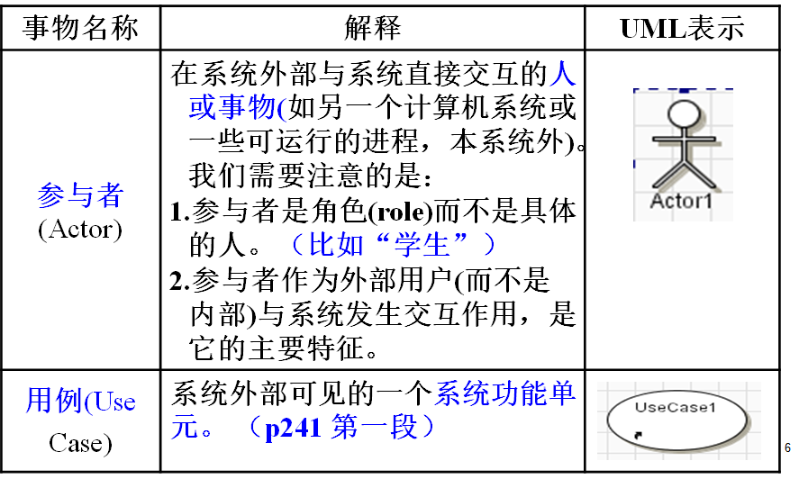

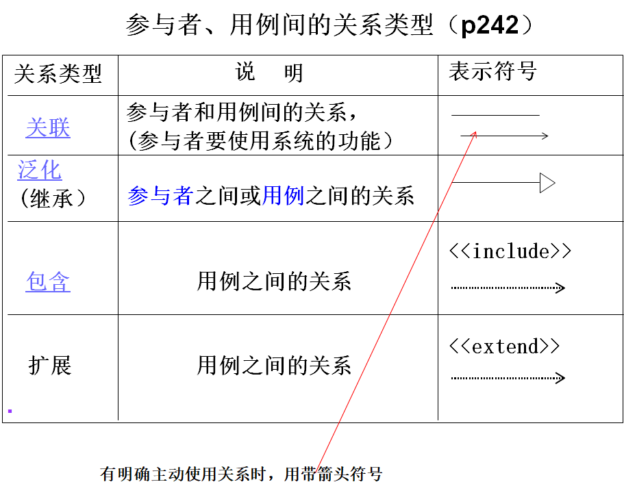

用例图示例：

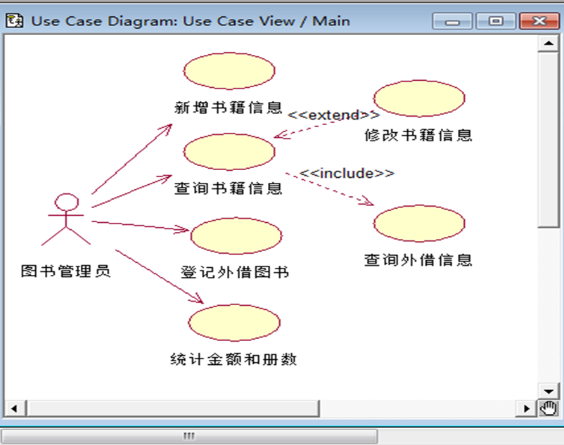

### 7.2 需求分析

概念模型：对象模型（类图，对象图）、动态模型（顺序图、状态图）

#### 7.2.3 类图

在用面向对象方法建立的模型中，对象模型时最基本、最重要、最核心的模型。

类与类之间的关系：

+ 关联（包含普通关联、组合、聚合）
+ 依赖
+ 泛化
+ 实现

关联

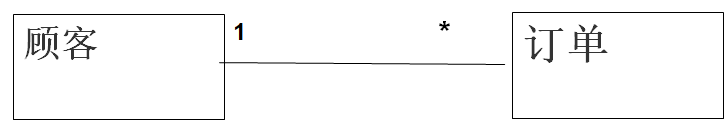

聚合

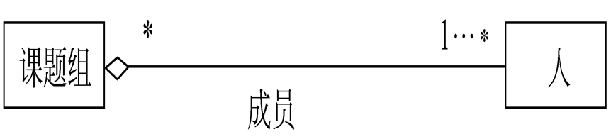

组合

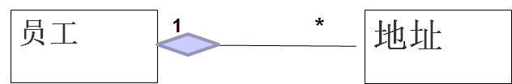

依赖


泛化

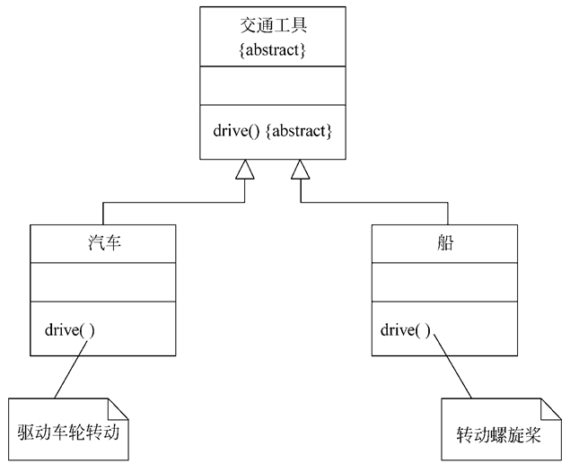

实现

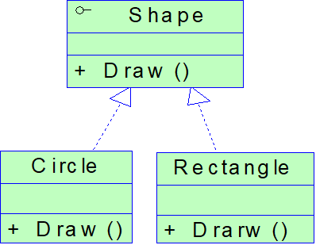

#### 7.2.4 顺序图含义及画法

顺序图：又称时序图，描述对象之间的动态交互关系，着重表现参与交互对象的生命线和它们交换的信息。 

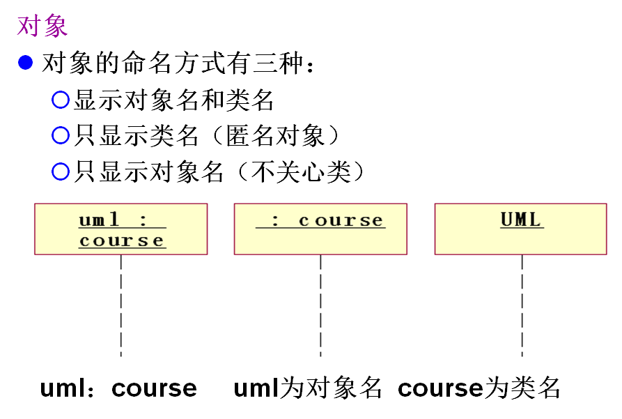

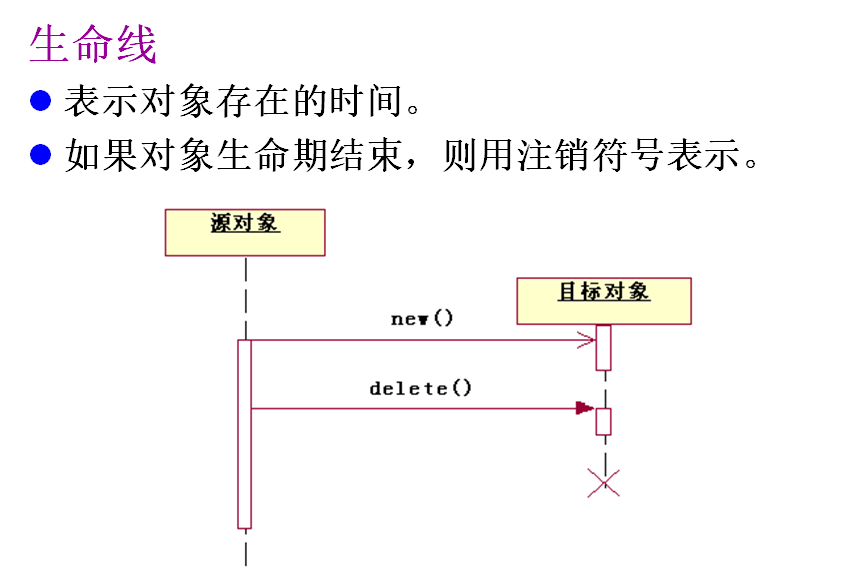

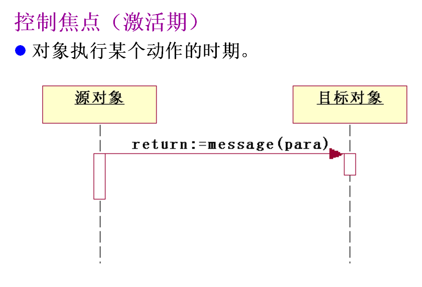

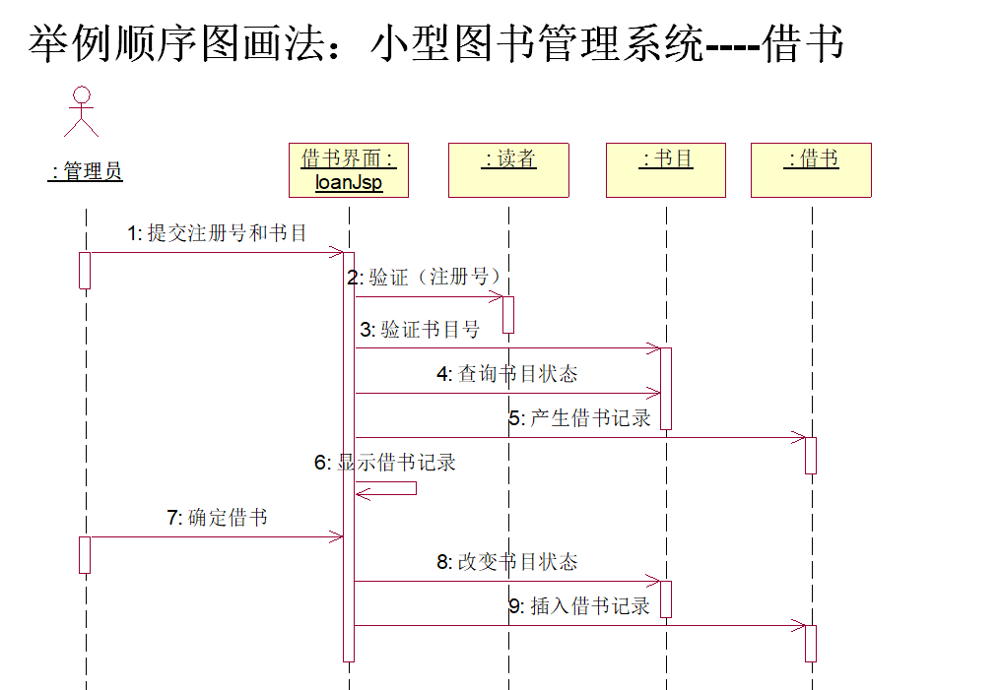

登录用例及顺序图： 

基本事件流：

(1) 系统提示请输入用户名以及用户密码；

(2) 用户输入用户名以及用户密码；点“登录”。

(3) 用户成功进入系统 ；

扩展事件流：

(1) 如果不匹配，系统提示用户名或密码错误；


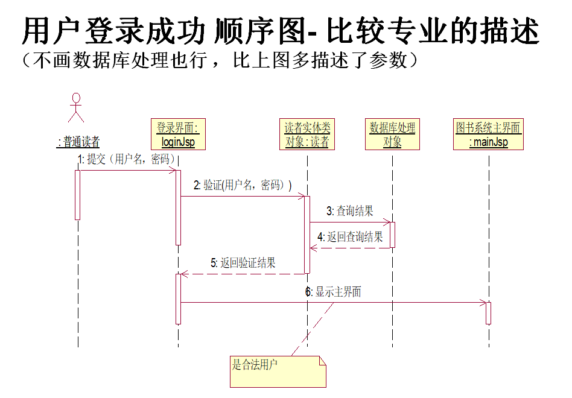

## 第8章 面向对象设计（OOD）

面向对象设计：

+ 人机交互部分
+ 问题域部分
+ 任务管理部分
+ 数据管理部分

### 8.1 定义交互行为——状态图

状态图可以用来描述一个特定对象的所有可能状态及其引起状态转移的事件。

只有那些具有重要交互行为的类，才会使用状态图来描述，一个状态图包括一系列对象的状态及状态之间的转换。

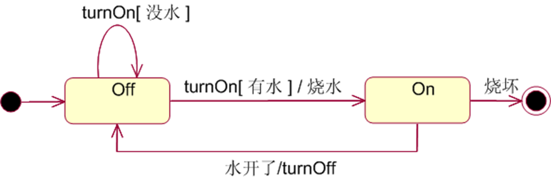

### 8.2 活动图

活动图是对系统的动态行为建模的图之一。

活动图是用于描述系统的工作流程和并发行为的技术。

活动图的作用：

(1) 活动图描述满足用例要求所要进行的活动以及活动间的约束关系，有利于识别并行活动对业务过程建模。

(2) 对复杂算法建模。

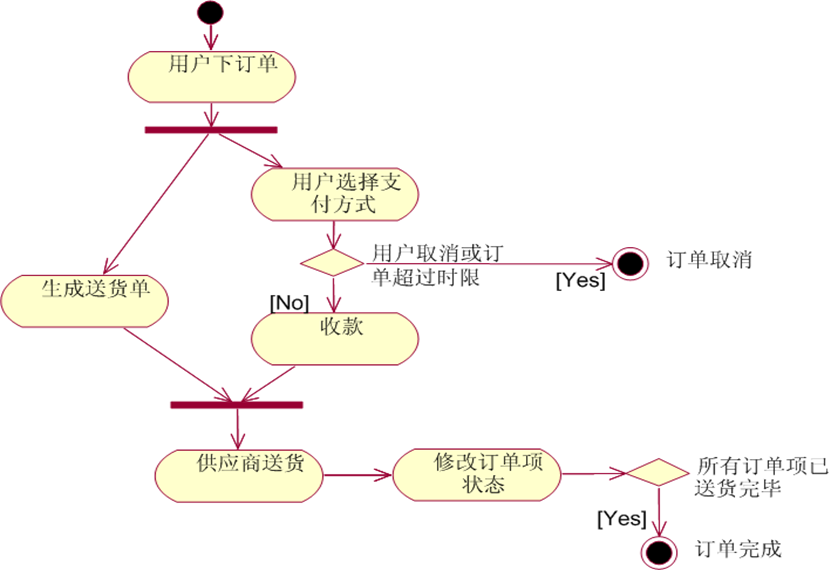

### 8.3 构件图

构件图：从软件架构的角度描述一个系统的主要功能，如系统分成几个子系统，每个子系统包含哪些类，包和构件，他们之间的关系等。

构件图目的：使系统人员和开发人员能够从整体上了解系统的所有物理部件。同时，构件图显示了被开发系统所包含的构件之间的关系。

构件是系统的可替代的物理部分,它表示的是实际的事物。

构件是定义了良好接口的物理实现单元，它是系统中可以替代的部分。每个构件体现了系统设计中的特定类的实现。良好定义的构件不直接依赖于其它构件而依赖于构件所支持的接口。

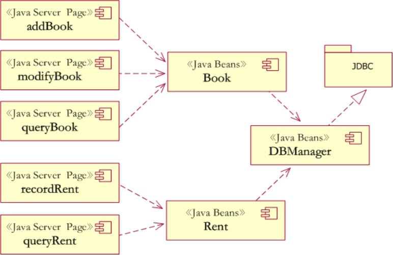

### 8.4 协作图

通信图也称协作图（collaboration diagram）；强调的是发送和接收消息的对象之间的组织结构。

一个协作图显示了一系列的对象和在这些对象之间的联系，以及对象间发送和接收的消息。 一般，顺序图和协作图之间可相互转换；

作用：描述用例或用例中特定部分的行为。

组成元素：对象、消息、链、监护条件。

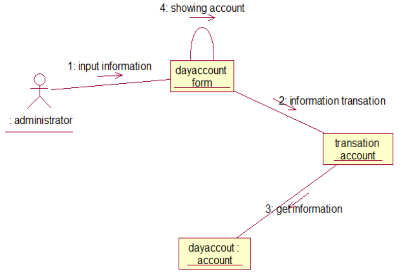

### 8.5 部署图

部署图（deployment diagram）也称配置图、实施图。

部署图模仿了一个系统在运行时间内的体系结构。它表示了硬件元素( 节点) 的构造和软件元素是如何被映射在那些节点之上。

由体系结构设计师、网络工程师、系统工程师等描述，是OO系统物理方面建模的两个图之一。一个系统模型只有一个部署图。

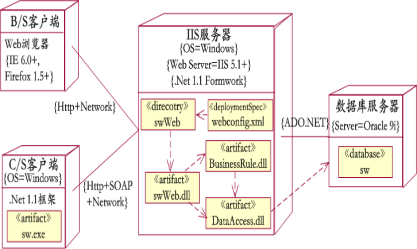