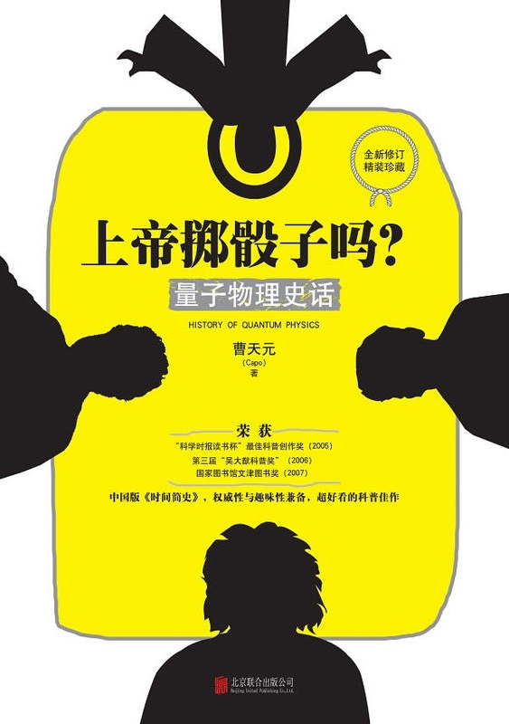
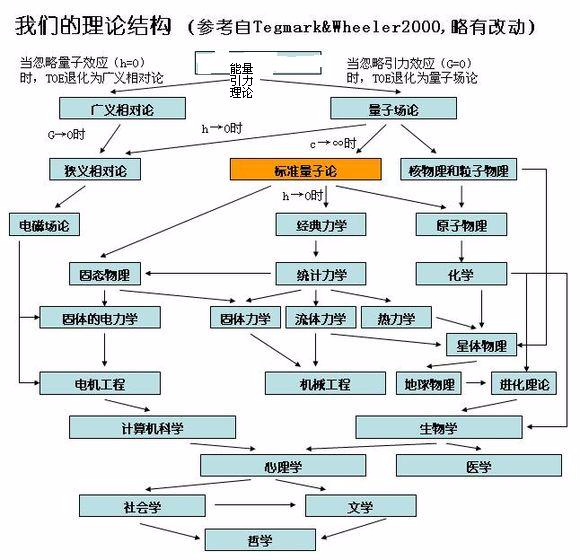

Week09《上帝掷骰子吗？（量子物理史话）》

这本书一开始是作为生日礼物送给上中学的表弟的（看豆瓣的评分9+，大家一致评价是本优秀的科普读物），本意是为了激发他对物理学的兴趣，不过他说看不懂。

阅读这本书的过程中，也让我看到了人类认识世界的局限性。就像一个天生只能看见黑白色的色盲一样，你永远无法告诉他真实的红色或是绿色是什么样子，只能通过他已知的的感官，借助一系列映射让他获得相应的信息。在探索量子的道路上，我们人类就像是那只能看见黑白色的色盲。不过这丝毫没有影响一百多年来像普朗克、薛定谔、波尔、德布罗意，海森堡等一众科学家的探索，正因为有他们的努力，崭新的世纪得以拉开帷幕。

个人比较支持书中休·埃弗莱特关于量子论提出的多世界解释（Many Worlds Interpretation，MWI），也就是为我们常人所津津乐道的“平行世界”（当然两者还是有差别，并非我们所想象的那样）。借助“薛定谔的猫”来描述这个理论的话，就是当处在打开盒子的临界时，当下的宇宙还未分裂（“分裂”这个词被认为是这个理论中一个不太恰当的措辞），盒子中的猫还处于一种“活”与“死”的叠加态，等到打开的一瞬间，宇宙便演化出两个不同的版本，一个版本中猫活着，另一个中猫已经死去。我现在能写下这篇读书笔记，也在于宇宙不断分化累积的结果。支持这个版本很大程度上并非出于理性的考量，而是罗曼提克式的幻想（所以电影导演也抓住了这一点）。

量子力学离我们的生活其实很近，我们所使用的电脑和手机中的CPU、存储体、显示屏等，医院检查中常常听说的核磁共振、激光手术等，就连我们学生常常用的激光打印机都与量子力学有着密不可分的联系。量子力学不仅致力于发展这个世界，更致力于解释这个世界。看完这本书，当你再次望着天空时，所思考着的东西也许会变得不一样。

下载链接（我的百度网盘）：https://pan.baidu.com/s/1nAL66sgRfipXj4Ud8dmYUQ 密码：6rlo

 

