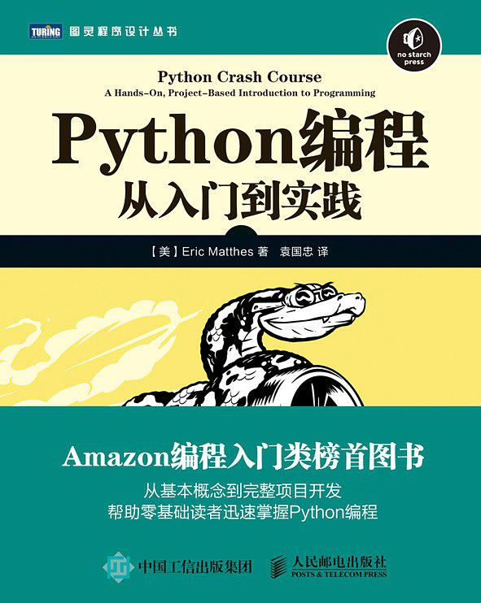

# Python编程：从入门到实践

> 因为好奇，也为了教表弟学**python**，参考自书籍[《Python编程：从入门到实践》](https://book.douban.com/subject/26829016/)。
>
> 下载链接：<http://readfree.me/book/26829016/>

## 目录 & 进度

- [x] 第01章 起步
- [x] 第02章 变量和简单数据类型
- [x] 第03章 列表简介
- [x] 第04章 操作列表
- [x] 第05章 if语句
- [x] 第06章 字典
- [x] 第07章 用户输入和while循环
- [x] 第08章 函数
- [x] 第09章 类
- [x] 第10章 文件和异常
- [x] 第11章 测试代码
- [x] 项目1 外星人入侵
- [ ] 项目2 数据可视化
- [ ] 项目3 Web 应用程序