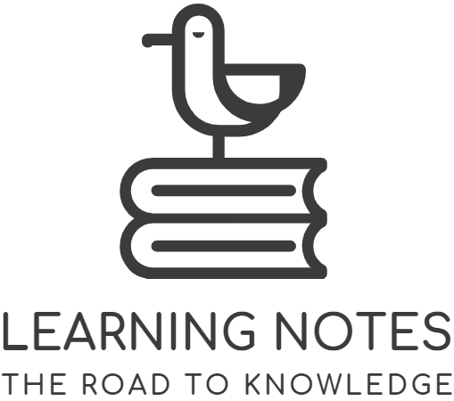

    

​    

# 在最有承受能力的时候冲出去！

>
> Fear can hold you prisoner, hope can set you free.
>
> A strong man can save himself, a great man can save another.

+ [**Algorithm**](Notes-Algorithm)
  + [Book-Algorithms](Notes-Algorithm/Book-Algorithms)
+ [**Assembly**](Notes-Assembly)
  + [Book-汇编语言](Notes-Assembly/Book-汇编语言)
+ [**Database**](Notes-Database)
  + [Book-High-Performance-MySQL](Notes-Database/Book-High-Performance-MySQL)
+ [**Design Patterns**](Notes-DesignPatterns)
  + [Book-设计模式的艺术](Notes-DesignPattern/Book-设计模式的艺术)
+ [**English**](Notes-English)
  + [Book-莱氏经典英语语法](Notes-English/Book-莱氏经典英语语法)
+ [**Java**](Notes-Java)
  + [Book-Java-8-In-Action](Notes-Java/Book-Java-8-In-Action)
  + [Book-Java-Network-Programming](Notes-Java/Book-Java-Network-Programming)
  + [Book-深入理解Java虚拟机](Notes-Java/Book-深入理解Java虚拟机)
+ [**JavaWeb**](Notes-JavaWeb)
  + [Book-Head-First-Servlets\-&\-JSP](Notes-JavaWeb/Book-Head-First-Servlets-&-JSP)
  + [Book-Maven实战](Notes-JavaWeb/Book-Maven实战)
  + [Book-Netty-In-Action](Notes-JavaWeb/Book-Netty-In-Action)
  + [Book-Spring-In-Action](Notes-JavaWeb/Book-Spring-In-Action)
+ [**Linux**](Notes-Linux)
  + [Book-Linux-Command-Line-and-Shell-Scripting-Bible](Notes-Linux/Book-Linux-Command-Line )
+ [**Network**](Notes-Network)
  + [Book-图解HTTP](Notes-Network/Book-图解HTTP)
  + [Book-图解TCP&IP](Notes-Network/Book-图解TCP&IP)
+ [**Plan**](Notes-Plan)
  + [Plan-Learning](Notes-Plan/Plan-Learning )
  + [Plan-Read](Notes-Plan/Plan-Read )
+ [**Subject**](Notes-Subject)
  + [Subject-企业级应用开发](Notes-Subject/Subject-企业级应用开发 )
  + [Subject-网络通信程序设计](Notes-Subject/Subject-网络通信程序设计)
  + [Subject-软件工程](Notes-Subject/Subject-软件工程 )