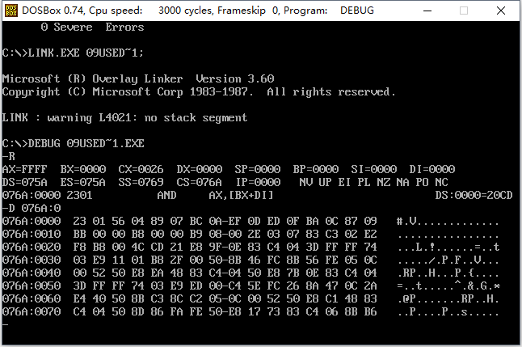
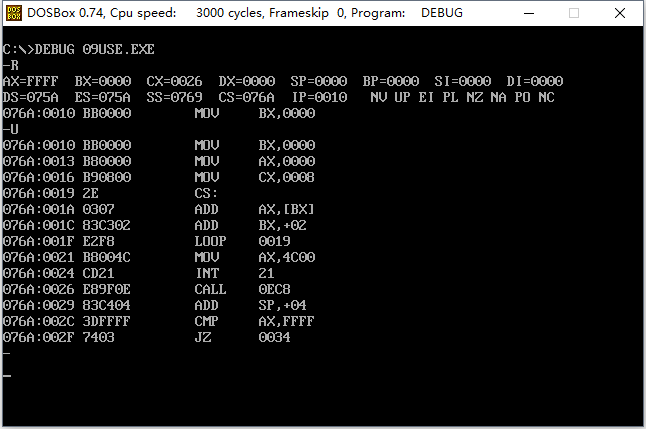
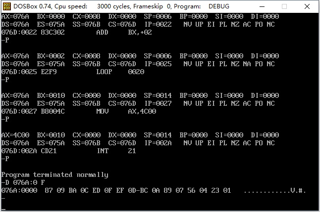

### # 在代码段中使用数据

从规范的角度来讲，我们是不能自己随便决定那段空间是可以使用的，应该让系统来为我们分配。我们可以在程序中，定义我们希望处理的数据，这些数据就会被编译、连接程序作为程序的一本写到可执行文件中。当可执行文件的程序被加载进内存时，这些数据也同时被加载入内存中。与此同时，我们要处理的数据也就自然地获得了存储空间。

具体的做法如下：

```assembly
; Date : 2017-11-11 15:30:49
; File Name : 09USEDATA.ASM
; Description : 在代码段中使用数据
; Author : Angus
; Version: V1.0

assume cs:code

code segment
	dw 0123h,0456h,0789h,0abch,0defh,0fedh,0cbah,0987h

	mov bx,0
	mov ax,0

	mov cx,8
s:	add ax,cs:[bx]
	add bx,2
	loop s

	mov ax,4c00h
	int 21h
code ends
end
```

程序的第一行“dw”的含义是定义字型数据。dw即“define word”。在这里，使用dw定义了8个字型数据（数据之间用逗号分隔），它们所占的空间为16个字节。

程序的指令就是对这8个数据进行累加，由于它们在代码段中，程序运行的时候可以从CS得到它们的段地址，又因为dw定义的数据处于代码段的最开始，所以偏移地址为0，这8个数据就在代码段偏移0,2,4,6,8,a,c,e处。



要正确执行指令，需要用Debug加载，将IP设置为10，从而使CS：IP指向程序中的第一条指令。然后用t命令、p命令，或者是g命令执行。

上诉程序编译连接后，在系统中直接运行可能会出现问题，因为程序的入口不是我们所希望的指令。如何让这个程序在编译后可以在系统中直接运行呢？我们可以指明程序的入口：

```assembly
; Date : 2017-11-11 15:30:49
; File Name : 09USEDATA.ASM
; Description : 在代码段中使用数据
; Author : Angus
; Version: V1.1

assume cs:code

code segment
	dw 0123h,0456h,0789h,0abch,0defh,0fedh,0cbah,0987h

start:	mov bx,0
		mov ax,0

		mov cx,8
	s:	add ax,cs:[bx]
		add bx,2
		loop s

		mov ax,4c00h
		int 21h
code ends
end start
```

注意：在程序的第一条指令的前面加了一个标号start，而这个标号还在伪指令end后面出现。这里，end除了通知编译器程序结束外，还可以告诉编译器程序的入口在什么地方。 



我们在源程序中，用伪指令end描述了程序的结束和程序的入口，在编译、连接后，由“end start”指明程序的入口，被转化为一个入口地址，存储在可执行文件的描述信息中。上诉程序生成的课执行文件中，这个入口地址的偏移地址为：10H，当程序被加载如内存后，加载者从程序的可执行文件的描述信息中读到程序的入口地址，设置CS：IP。这样CPU就从我们希望的地址出开始执行。

归根结底，我们若要CPU从何处开始执行程序，只要在源程序中用“end标号”指明就可以了。

有了这种方法，就可以这样来安排程序的框架：

```assembly
assume cs:code

code segment	
        数据
start:	
	    代码 
code ends
end start
```

### # 将数据、代码、栈放入不同的段

我们用和定义代码段一样的方法来定义多个段，然后在这些段里面定义需要的数据，或通过定义数据来取得栈空间。

```assembly
; Date : 2017-11-11 16:07:27
; File Name : 10MORESG.ASM
; Description : 用多个段来存放数据、代码和栈
; Author : Angus
; Version: V1.0

assume cs:code,ds:data,ss:stack

data segment
	dw 0123h,0456h,0789h,0abch,0defh,0fedh,0cbah,0987h
data ends

stack segment
	dw 0,0,0,0,0,0,0,0,0,0,0,0,0,0,0,0
stack ends

code segment
start:	mov ax,stack
		mov ss,ax
		mov sp,20	; 设置栈顶SS：SP指向stack：20

		mov ax,data
		mov ds,ax   ; ds指向data段

		mov bx,0	; ds：bx指向data段中的第一个单元

		mov cx,8
	s:	push [bx]
		add bx,2
		loop s 		; 以上将data段中的0-15个单元的8个字型数据依次入栈

		mov bx,0

		mov cx,8
	s0:	pop [bx]
		add bx,2
		loop s0 	; 以上依次出栈8个字型数据到data段的0-15个单元中

		mov ax,4c00h
		int 21h
code ends
end start
```



(1) 定义多个段的方法

定义一个段的方法和前面所讲的定义代码段的方法没有区别，只是对于不同的段，要有不同的段名。

(2) 对段地址的引用

在程序中，段名就相当于一个标号，它代表了段地址。所以指令“mov ax，data”的含义就是将名称为“data”的段的段名段地址送入ax。一个段中的数据的段地址可由段名代表，偏移地址就要看它在段中的位置了。程序中“data”段中的数据“0abch”的地址就是：data：6，要讲它送入bx中，就要用如下代码：

```assembly
mov ax，data
mov ds，ax
mov bx，ds：[6]
```

不能使用下面的指令： 

```assembly
mov ds，data
mov bx，ds：[6]
```

其中指令“mov ds，data”是错误的，因为8086CPU不允许将一个数值直接送入段寄存器中。程序对段名的引用，将被编译器处理为一个表示段地址的数值。

(3) “代码段”、“数据段”、“栈段”完全是我们的安排

① 我们在源程序中为这3个段起了具有含义的名字，仅仅是为了使程序便于阅读。这些名称同“start”、“s”等标号一样，仅在源程序中存在，CPU并不知道它们。

② 使用“assume cs:code,ds:data,ss:stack”这条指令后，CPU并不会将它们互相关联。因为assume是伪指令，是由编译器执行的，CPU并不知道。只是需要用assume将定义的具有一定用途的段和相关的寄存器联系起来。

③ CPU到底如何处理我们定义的段中的内容，是当做指令执行，当做数据访问，还是当做栈空间来用，完全是靠程序中具体的汇编指令、和汇编指令对CS：IP、SS：SP、DS等寄存器的设置来决定的。

### # 实验5 编写、调试具有多个段的程序

将下面的程序编译连接，用Debug加载、跟踪、然后回答问题。

```assembly
; Date : 2017-11-11 16:54:52
; File Name : 11TEST05.ASM
; Description : 实验5 编写、调试具有多个段的程序
; Author : Angus
; Version: V1.0

assume cs:code,ds:data,ss:stack

data segment
	dw 0123h,0456h,0789h,0abch,0defh,0fedh,0cbah,0987h
data ends

stack segment
	dw 0,0,0,0,0,0,0,0
stack ends

code segment
start:	mov ax,stack
		mov ss,ax
		mov sp,16

		mov ax,data
		mov ds,ax

		push ds:[0]
		push ds:[2]
		pop ds:[2]
		pop ds:[0]

		mov ax,4c00h
		int 21h
code ends
end start
```

