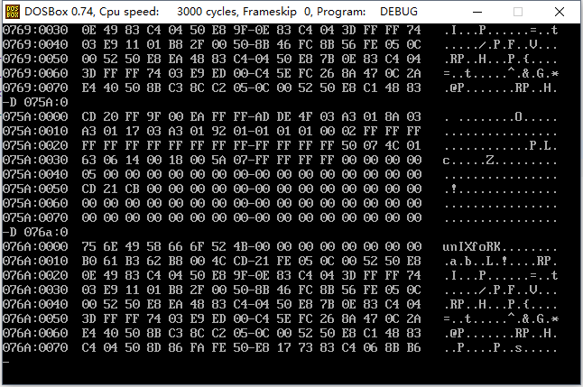
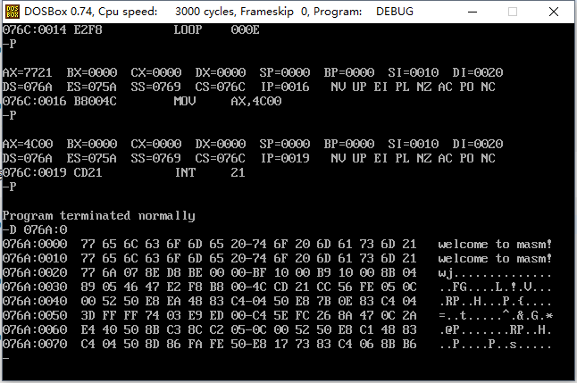
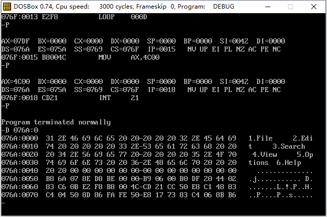
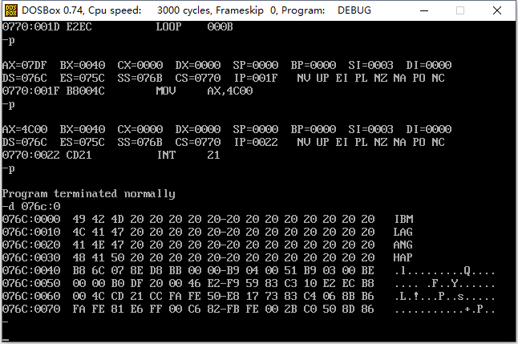

### # and和or指令

(1) and指令：逻辑与指令，按位进行与运算。例如：

```assembly
mov al,01100011B
add al,00111011B

执行后：al=00100011B
```

通过该指令可以将操作对象的相应位设为0，其他位不变。例如： 

```assembly
将al的第6位设为0的指令是：add al,10111111B
将al的第7位设为0的指令是：add al,01111111B
将al的第0位设为0的指令是：add al,11111110B
```

(2) or指令：逻辑或指令，按位进行或运算。例如： 

```assembly
mov al,01100011B
or al,00111011B

执行后：al=01111011B
```

通过该指令可将操作对象的相应位设为1，其他为不变。例如： 

```assembly
将al的第6位设为1的指令是：or al,01000000B
将al的第7位设为1的指令是：or al,10000000B
将al的第0位设为1的指令是：or al,00000001B
```

### # 以字符的形式给出的数据

我们可以在汇编程序中，用‘……’的方式指明数据是以字符的形式给出的，编译器将把它们转化为对应的ASCII码。

```assembly
; Date : 2017-11-11 18:58:28
; File Name : 12TEST.ASM
; Description : 以字符的形式给出数据
; Author : Angus
; Version: V1.0

assume cs:code,ds:data
data segment
	db 'unIX'
	db 'foRK'
data ends
code segment
start:	mov al,'a'
		mov bl,'b'
		mov ax,4c00h
		int 21h
code ends
end start
```



### # [bx+idata]

[bx+idata]表示一个内存单元，它的偏移地址表示为（bx）+idata（bx中的数值加上idata）。

指令mov ax,[bx+200]表示将一个内存单元的内容送入ax，这个内存单元的长度为2个字节（字单元），存放一个字，偏移地址为bx中的数值加上200，段地址在ds中。

数学化描述为：（ax）=（（ds）*16+（bx）+200）

该指令也可写成如下格式（常用）：

```assembly
mov ax,[200+bx]
mov ax,200[bx]
mov ax,[bx].200
```

### # SI和DI

SI(Source Index):源变址寄存器和DI(Destination Index):目的变址寄存器是8086CPU中和bx功能相近的寄存器，si和四不能分成两个8位寄存器来使用。下面的3组指令实现了相同的功能。

```assembly
(1) mov bx,0
    mov ax,[bx]
    
(2) mov si,0
    mov ax,[si]
    
(3) mov di,0
    mov ax,[di]
```

下面的3组指令也实现了相同的功能。 

```assembly
(1) mov bx,0
    mov ax,[bx+123]
    
(2) mov si,0
    mov ax,[si+123]
    
(3) mov di,0
    mov ax,[di+123]
```

问题：用si和di实现将字符串‘welcome to masm！’复制到它后面的数据区中。 

```assembly
; Date : 2017-11-11 19:30:14
; File Name : 13DATACOPY.ASM
; Description : 用si和di实现将字符串‘welcome to masm！’复制到它后面的数据区中
; Author : Angus
; Version: V1.0

assume cs:codesg,ds:datasg

datasg segment
	db 'welcome to masm!'
	db '................'
datasg ends

codesg segment
start:	mov ax,datasg
		mov ds,ax

		mov si,0
		mov di,16

		mov cx,8

	s:	mov ax,[si]
		mov [di],ax
		add si,2
		add di,2
		loop s

		mov ax,4c00h
		int 21h
codesg ends
end start
```



可以用更少的代码实现上述效果： 

```assembly
; Date : 2017-11-11 19:30:14
; File Name : 13DATACOPY.ASM
; Description : 用si和di实现将字符串‘welcome to masm！’复制到它后面的数据区中
; Author : Angus
; Version: V1.0

assume cs:codesg,ds:datasg

datasg segment
	db 'welcome to masm!'
	db '................'
datasg ends

codesg segment
start:	mov ax,datasg
		mov ds,ax
		mov si,0
		mov cx,8
	s:	mov ax,0[si]
		mov 16[si],ax
		add si,2
		loop s
		mov ax,4c00h
		int 21h
codesg ends
end start
```

### # [bx+si]和[bx+di]

在前面，我们用[bx(si或di)]和[bi(si或di)+idata]的方式来指明一个内存单元，我们还可以用更为灵活的方式：[bx+si]和[bx+di]。

[bx+si]和[bx+di]的含义相似。[bx+si]表示一个内存单元，它的偏移地址为(bx)+(si)（即bx中的数值加上si中的数值）。

指令mov ax,[bx+si]的含义如下：

将一个内存单元的内容送入ax，这个内存单元的长度为2字节（字单元），存放一个字，偏移地址为bx中的数值加上si中的数值，段地址在ds中。数学化描述为：（ax）=（（ds）*16+（bx）+（si））。

该指令也可以写为（常用）：

```assembly
mov ax,[bx][si]
```

### # [bx+si+idata]和[bx+di+idata]

同上。

指令 mov ax,[bx+si+idata]也可以写成如下格式：

```assembly
mov ax,[bx+200+si]
mov ax,[200+bx+si]
mov ax,200[bx][si]
mov ax,[bx].200[si]
mov ax,[bx][si].200
```

### # 不同的寻址方式的灵活运用

下面来比较一下前面用到几种定位内存地址的方式（可称为寻址方式）：

(1) [idata]用一个常量表示地址，可用于直接定位一个内存单元。

(2) [bx]用一个变量表示内存地址，可用于间接定位一个内存单元。

(3) [bx+idata]用一个变量和一个常量表示地址，可在一个起始地址的基础上用变量间接定位一个内存单元。

(4) [bx+si]用两个变量表示地址。

(5) [bx+si+idata]用两个变量和一个常量表示地址。

可以看到，从[idata]到[bx+si+idata]，我们可以用更灵活的方式来定位一个内存单元的地址。这使我们可以从更加结构化的角度看待所要处理的数据。

编程，将datasg段中每个单词的开头的头一个字母改为大写字母

```assembly
; Date : 2017-11-11 20:33:34
; File Name : 14TEST.ASM
; Description : 将datasg段中每个单词的开头的头一个字母改为大写字母
; Author : Angus
; Version: V1.0

assume cs:codesg,ds:datasg
datasg segment
	db '1.file     '
	db '2.edit     '
	db '3.search   '
	db '4.view     '
	db '5.options  '
	db '6.help     '
datasg ends

codesg segment
start:	mov ax,datasg
		mov ds,ax
		mov si,0

		mov cx,6
		mov al,11011111B
	s:	and [si+2],al
		add si,11
		loop s
		mov ax,4c00h
		int 21h
codesg ends
end start
```



编程：将datasg段中的每个单词改为大写字母。 

```assembly
; Date : 2017-11-11 21:39:36
; File Name : 15TEST.ASM
; Description : 将datasg段中的每个单词改为大写字母
; Author : Angus
; Version: V1.0

assume cs:codesg,ds:datasg

datasg segment
	db 'ibm             '
	db 'lag             '
	db 'ang             '
	db 'hap             '
datasg ends

codesg segment
start:	mov ax,datasg
		mov ds,ax
		mov bx,0

		mov cx,4
		
s0: 	push cx				; 保护外层循环cx的值
		mov cx,3
		mov si,0

s1:		mov al,11011111B
		and [bx+si],al
		inc si
		loop s1

		pop cx				; 恢复外层循环cx的值
		add bx,16
		loop s0

		mov ax,4c00h
		int 21h
codesg ends
end start
```

