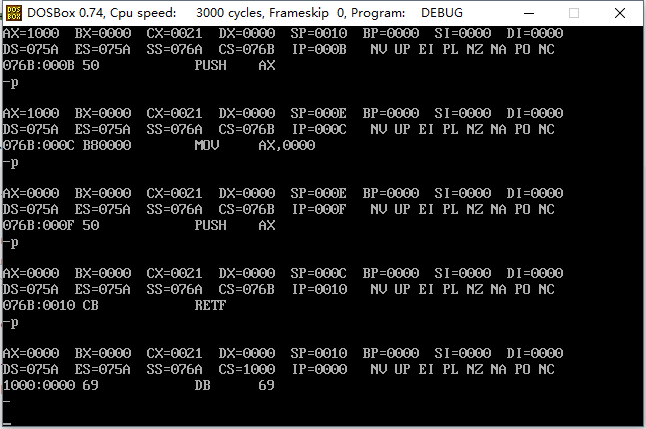
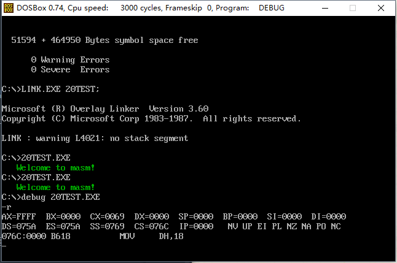

### # 简述

call和ret命令都是转移指令，它们都修改IP，或同时修改CS和IP。它们经常被共同用来实现子程序的设计。

### # ret和retf

ret指令用栈中的数据，修改IP的内容，从而实现近转移；

retf指令用栈中的数据，修改CS和IP的内容，从而实现远转移。

CPU执行ret指令时，进行下面两步操作：

(1) (IP)=((ss)*16+(sp))

(2) (sp)=(sp)+2

相当于 pop IP

CPU执行retf指令时，执行下面4步操作：

(1) (IP)=((ss)*16+(sp))

(2) (sp)=(sp)+2

(1) (CS)=((ss)*16+(sp))

(2) (sp)=(sp)+2

相当于 pop IP

​            pop CS

补全程序，实现从内存1000:0000处开始执行指令。

```assembly
; Date : 2017-11-12 13:10:47
; File Name : 19TEST.ASM
; Description : 补全程序，实现从内存1000:0000处开始执行指令
; Author : Angus
; Version: V1.0

assume cs:code,ss:stack

stack segment
	db 16 dup (0)
stack ends

code segment
start:	mov ax,stack
		mov ss,ax
		mov sp,16		; ss:sp指向栈底

		mov ax,1000H
		push ax

		mov ax,0
		push ax
		retf			;pop IP / pop CS
code ends
end start
```



### # call指令

CPU执行call指令时，进行两步操作：

(1) 将当前的IP或CS和IP压入栈中；

(2) 转移。

call指令不能实现短转移，除此之外，call指令实现转移的方法和jmp指令的原理相同。

### # 依据位移进行转移的call指令

call 标号（将当前的IP压入栈后，转到标号处执行指令）

CPU执行此种格式的call指令时，进行如下的操作：

(1) (sp)=(sp)-2

​     ((ss)*16+(sp))=(ip)

(2) (IP)=(IP)+16位位移

(3) 16位位移=标号处的位置-call指令后的第一个字节的地址；

(4) 16位位移的范围为-32768-32767，用补码表示；

(5) 16位位移由编译程序在编译时算出。

CPU执行“call 标号”时，相当于执行：

​    push IP

​    jmp near ptr 标号

### # 转移的目的地址在指令中的call指令

“call far ptr 标号”实现的是段间转移

CPU在执行这种格式的call指令时，进行如下的操作。

(1) (sp)=(sp)-2

​     ((ss)*16+(sp))=(CS)

​     (sp)=(sp)-2

​     ((ss)*16+(sp))=(IP)

​     (IP)=标号在段中的偏移地址

CPU执行“call far ptr 标号”时，相当于执行：

​    push CS

​    push IP

​    jmp far ptr 标号

### # 转移地址在寄存器中的call指令

指令格式：call 16位reg

功能：

​     (sp)=(sp)-2

​     ((ss)*16+(sp))=(CS)

​     (IP)=(16位reg)

CPU执行“call 16位reg”时，相当于执行：

​    push IP

​    jmp 16位reg

### # 转移地址在内存中的call指令

(1) call word ptr 内存单元地址

CPU执行“call word ptr 内存单元地址”时相当于进行：

​    push IP

​    jmp word ptr 内存单元地址

(2) call dword ptr 内存单元地址

CPU执行“call dword ptr 内存单元地址”时相当于进行：

​    push CS

​    push IP

​    jmp dword ptr 内存单元地址

### # call和ret的配合使用

可以利用call和ret实现子程序的机制。子程序的框架如下。

```assembly
标号：
    指令
    ret
```

具有子程序的源程序框架如下。 

```assembly
assume cs:code
code segment
     main:  :
            :
            call sub1        ; 调用子程序sub1
            :
            :
            mov ax 4c00h
            int 21h
            
   sub1:    :                ; 子程序sub1开始
            :
            call sub2        ; 调用子程序sub2
            :
            :
            ret              ; 子程序sub1返回
            
   sub2:    :
            :
            ret              ; 子程序sub2返回
code ends
end main
```

### # mul指令

mul是乘法指令，使用mul做乘法的时候要注意几点：

(1) 两个相乘的数：两个相乘的数要么都是8位，要么都是16位。如果是8位，一个默认放在AL中，另一个放在8位reg或内存字节单元中；如果是16位，一个默认在AX中，另一个放在16位reg或内存字单元中。

(2) 结果：如果是8位乘法，结果默认放在AX中；如果是16位乘法，结果高位默认放在DX中，低位放在AX中。

(3) 格式如下：

​    mul reg

​    mul 内存单元

内存单元可以用不同的寻址方式给出，比如：

​    mul byte ptr ds:[0]    含义：(ax)=(al)*((ds)*16+0)

​    mul word ptr [bx+si+8]    

​    含义：(ax)=(ax)*((ds)*16+(bx)+(si)+8)结果的低16位；(dx)=(ax)*((ds)*16+(bx)+(si)+8)结果的高16位

### # 寄存器冲突的问题

在子程序开始的时候将子程序中所有用到的寄存器都保存起来，在子程序返回前再恢复。可以用栈来保存寄存器中的内容。以后，我们编写子程序的标准框架如下：

子程序开始：子程序中使用的寄存器入栈

​                      子程序内容

​                      子程序中使用的寄存器出栈

​                       返回（ret、retf）

### # 实验10 编写子程序

(1) 显示字符串

问题：编写一个通用的子程序实现字符串显示，提供灵活的接口，使调用者可以决定显示的位置（行、列）、内容和颜色。

描述：

​    ① 名称：show_str

​    ② 功能：在指定的位置，用指定的颜色，显示一个用0结束的字符串。

​    ③ 参数：（dh）=行号（取值范围0-24），（dl）=列号（取值范围0-79），（cl）=颜色，di：si指向字符串的首地址。

​    ④ 返回：无

​    ⑥ 应用举例：在屏幕的8行3列，用绿色显示data段中的字符串。

```assembly
; Date : 2017-11-12 15:49:46
; File Name : 20TEST.ASM
; Description : 显示字符串
; Author : Angus
; Version: V1.0

; 子程序介绍
; 名称：show_str
; 功能：在指定的位置，用指定的颜色，显示一个用0结束的字符串。
; 参数：（dh）=行号（取值范围0-24），（dl）=列号（取值范围0-79），（cl）=颜色，di：si指向字符串的首地址。
; 返回：无
; 应用举例：在屏幕的8行3列，用绿色显示data段中的字符串。

assume cs:code,ds:data

data segment
	db 'Welcome to masm!',0
data ends

code segment
main:		mov dh,24
			mov dl,3
			mov cl,2		; 设置显示的位置，样式

			mov ax,data
			mov ds,ax
			mov si,0		; ds：si指向字符串的首地址

			call show_str	; 调用show_str子程序

			mov ax,4c00h
			int 21h

show_str:	push si
			push di			
			push ax
			push es			; 将子程序用到的寄存器入栈，保护现场

			mov ax,0b800h
			mov es,ax
			mov di,0		; 初始化es:di指向B800:0000h，相当于屏幕第0行，第0列

			mov al,160
			mul dh
			mov di,ax		; es:di指向指定行第0列
			mov al,2
			mul dl
			add di,ax		; es:di指向指定行指定列

s:			push cx			; 为了保护cl
			mov cl,ds:[si]
			mov ch,0
			jcxz show_end
			pop cx			; 为了弹出cl

			mov al,ds:[si]
			mov ah,cl
			mov es:[di],ax	; 写入内容

			inc si
			add di,2
			jmp s

show_end:	pop cx
			pop es
			pop ax
			pop di
			pop si
			ret
code ends
end  main

```

