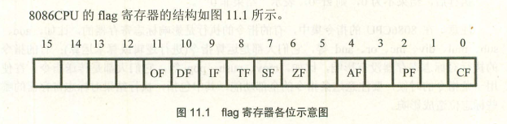
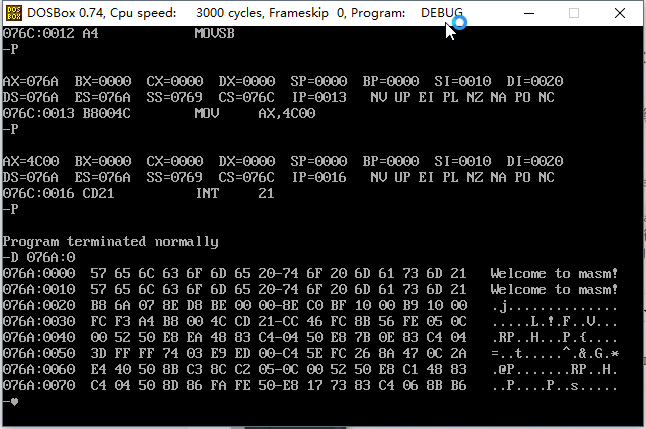
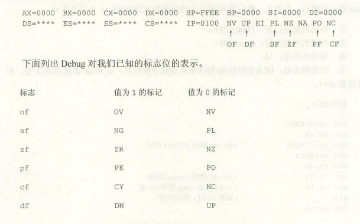
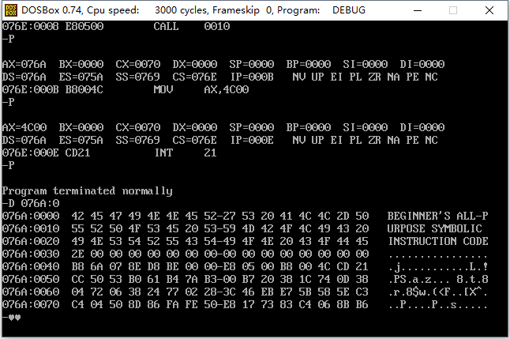

### # 简述

(1) CPU内部的寄存器中，有一种特殊的寄存器（对于不同的处理机，个数和结构都可能不同），具有以下3种作用。

① 用来存储相关指令的某些执行结果；

② 用来控制CPU执行相关指令提供行为依据；

③ 用来控制CPU的相关工作方式。

(2)这种特殊的寄存器在8086CPU中，被称为标志寄存器(flag)。8086CPU的标志寄存器有16位，其中存储的信息通常被称为程序状态字（PSW）。

(3) flag和其他寄存不一样，其他寄存器是用来存放数据的，都是整个寄存器具有一个含义，而flag寄存器是按位起作用的，它的每一位都有专门的含义，记录特定的信息。



### # ZF标志

flag的第6位是ZF，零标志位。它记录相关指令执行后，其结果是否为0。如果结果为0，那么ZF=1，反之，ZF=0。

注意，在8086CPU的指令集中，有的指令的执行是影响标志位寄存器的，比如add、sub、mul、div、inc、or、and等，它们大都是运算指令（进行逻辑或算数运算）；有的指令的执行对标志位寄存器没有影响，比如mov、push、pop等，它们大都是传送指令。

### # PF标志

flag的第2位是PF，奇偶标志位。它记录相关的指令执行后，其结果对的所有bit位中1的个数是否为偶数。如果1的个数为偶数，PF=1，否则PF=0。

### # SF标志

flag的第7位是SF，符号标志位。它记录相关指令执行后，其结果是否为负。如果结果为负，SF=1，否则SF=0。

### # CF标志（针对无符号数）

flag的第0位是CF，进位标志位。一般情况下，在进行无符号数运算时，它记录了运算结果的最高有效位向更高位的进位值，或从更高位的借位值。

### # OF标志（针对有符号数）

flag的第11位是OF，溢出标志位。一般情况下，OF记录了有符号数的运算结果是否发生了溢出。如果发生溢出，OF=1，如果没有OF=0。

### # adc指令

adc是带进位的加法指令，它利用了CF上记录的进位值。

(1) 指令格式：adc 操作对象1，操作对象2

(2) 功能：操作对象1=操作对象1+操作对象2+CF

(3) 比如指令 adc ax，bx实现的功能就是：（ax）=（ax）+（bx）+CF

(4) 备注：inc和loop指令不影响CF位。

### # sbb指令

sbb指令是带借位减法指令，它利用了CF上记录的借位值。

(1) 指令格式：sbb 操作对象1，操作对象2

(2) 功能：操作对象1=操作对象1-操作对象2-CF

(3) 比如指令 sbb ax，bx实现的功能就是：（ax）=（ax）-（bx）-CF

### # cmp指令

cmp指令是比较指令，cmp的功能相当于剪发指令，只是不保存结果。cmp指令执行后，将对标志寄存器产生影响。其他相关指令通过识别这些被影响的标志寄存器位来得知比较结果。

(1) cmp指令格式：cmp 操作对象1，操作对象2

(2) 功能：计算操作对象1-操作对象2，但不保存结果。仅仅根据计算结果对标志寄存器进行设置。

比如，指令 cmp ax，ax，做（ax）-（ax）的运算，结果为0，但不在ax中保存，仅影响flag的相关位。指令执行后：zf=1，pf=1，sf=0，cf=0，of=0。

(3) 通过cmp指令执行后，相关标志位的值就可以看出比较结果。（无符号数）

​     cmp ax，bx

① 如果（ax）=（bx），则（ax）-（bx）=0，所以zf=1；

② 如果（ax）≠（bx），则（ax）-（bx）≠0，所以zf=1；

③ 如果（ax）＜（bx），则（ax）-（bx）将产生借位，所以cf=1；

④ 如果（ax）≥（bx），则（ax）-（bx）不必借位，所以cf=0；

⑤ 如果（ax）＞（bx），则（ax）-（bx）既不必借位，结果又不为0，所以cf=0且zf=0；

⑥ 如果（ax）≤（bx），则（ax）-（bx）既可能借位，结果又可能为0，所以cf=1或zf=1；

(4) 下面以cmp ah，bh为例，总结一下CPU执行cmp指令后，sf和of是如何来说明比较结果的。（有符号数）

① 如果sf=1，而of=0

of=0，说明没有溢出，逻辑上真正结果的正负=实际结果的正负；

因sf=1，实际结果为负，所以逻辑上真正的结果为负，所以（ah）＜（bh）。

② 如果sf=1，而of=1

of=1，说明有溢出，逻辑上真正结果的正负≠实际结果的正负；

因sf=1，世界结果为负。

实际结果为负，而又有溢出，这说明是由溢出导致了实际结果为负。如果因为溢出导致了结果为负，那么逻辑上真正的结果必然是正。这样，sf=1，of=1说明了（ah）＞（bh）。

③ 如果sf=0，而of=1

of=1，说明有溢出，逻辑上真正结果的正负≠实际结果的正负；

因sf=0，实际结果非负。而of=1说明有溢出，则结果非0，所以实际结果为正。如果因为溢出导致了实际结果为正，那么逻辑上真正的结果必然为负。这样，sf=0，of=1，说明了（ah）＜（bh）。

④ 如果sf=0，而of=0

of=0，说明没有溢出，逻辑上真正结果的正负=实际结果的正负；

因sf=0，实际结果非负，所以逻辑上真正的结果非负，所以（ah）≥（bh）。

### # 检测比较结果的条件转移指令

(1) 所有条件转移的位移都是[-128,127]。

(2) 下面是常用的根据无符号数的比较结果进行转移的条件转移指令。

| 指令             | 含义         | 检测的相关标志位 |
| ---------------- | ------------ | ---------------- |
| je（equal）      | 等于则转移   | zf=1             |
| jne（not equal） | 不等于则转移 | zf=0             |
| jb（below）      | 低于则转移   | cf=1             |
| jnb（not below） | 不低于则转移 | cf=0             |
| ja（above）      | 高于则转移   | cf=0且zf=0       |
| jna（not above） | 不高于则转移 | cf=1或zf=1       |

编程，统计data段中数字为8的字节个数，用ax保存统计结果：

```assembly
; Date : 2017-11-13 14:50:28
; File Name : 21TEST.ASM
; Description : 统计data段中数字为8的字节个数，用ax保存统计结果
; Author : Angus
; Version: V1.0

assume cs:code,ds:data

data segment
	db 8,11,8,1,8,5,63,38
data ends

code segment
start:	mov ax,data
		mov ds,ax
		mov si,0			; ds:si指向第一个字节

		mov ax,0			; 初始化累加器

		mov cx,8

s:		cmp byte ptr [si],8	; 和8进行比较
		jne next
		inc ax

next:	inc si
		loop s

		mov ax,4c00h
		int 21h
code ends
end start
```

### # DF标志和串传送指令

flag的第10位是DF（direction），方向标志位。在串处理指令中，控制每次操作后si、di的增减。

​     df=0，每次操作后si、di递增。

​     df=1，每次操作后si、di递减。

串传送指令：

(1) 格式：movsb（每次传送一个字节）

功能：执行movsb指令相当于进行下面几步操作。

​    ① （（es）*16+（di））=（（ds）*16+（si））

​    ② 如果df=0，则（si）=（si）+1；（di）=（di）+1

​        如果df=1，则（si）=（si）-1；（di）=（di）-1

(2) 格式：movsw（每次传送一个字）

movsw的功能是将ds：si指向的内存单元中的字送入es：di中，然后根据标志寄存器df位的值，将si和di递增2或递减2。

(3) movsb和movsw进行的是串传送操作的一个步骤，一般来说，movsb和movsw都和rep配合使用，格式如下：

```assembly
rep movsb
用汇编语法来描述rep movsb的功能就是：
s: movsb
   loop s
   
rep movsw
用汇编语法来描述rep movsb的功能就是：
s: movsw
   loop s
```

可见，rep的作用是根据cx的值，重复执行后面的串操作指令。

(4) 8086CPU提供下面两条指令对df进行设置：

① cld指令：将标志寄存器的df位置置0

② std指令：将标志寄存器的df位置置1

编程，用串传送指令，将data段中的第一个字符串复制到它后面的空间中。

```assembly
; Date : 2017-11-13 15:23:44
; File Name : 22TEST.ASM
; Description : 用串传送指令，将data段中的第一个字符串复制到它后面的空间中
; Author : Angus
; Version: V1.0

assume cs:code,ds:data
data segment
	db 'Welcome to masm!'
	db 16 dup (0)
data ends
code segment
start:	mov ax,data
			mov ds,ax
			mov si,0		; ds:si指向data：0000

			mov es,ax
			mov di,16		; es:di指向data：0010

			mov cx,16		; 设置循环次数

			cld				; 设置df=0，正向传送

			rep movsb

			mov ax,4c00h
			int 21h
code ends
end start
```



### # pushf和popf

pushf的功能是将标志寄存器的值压入栈，而popf是从栈中弹出数据，送入标志寄存器中。pushf和popf，为直接访问标志寄存器提供了一种方法。

### # 标志寄存器在Debug中的表示

在Debug中，标志寄存器是按照有意义的各个标志位单独表示的。在Debug中，我们可以看到下面的信息。



### # 实验11 编写子程序

编写一个子程序，将包含任意字符，以0结尾的字符串中的小写字母转变为大写字母。

```assembly
; Date : 2017-11-13 15:46:25
; File Name : 23TEST.ASM
; Description : 编写一个子程序，将包含任意字符，以0结尾的字符串中的小写字母转变为大写字母
; Author : Angus
; Version: V1.0

; 名称：letterc
; 功能：将以0结尾的字符串中的小写字母转变为大写字母
; 参数：ds：si指向字符串首地址

assume cs:codesg,ds:datasg

datasg segment
		db "Beginner's All-purpose Symbolic Instruction Code.",0
datasg ends

codesg segment
	  main:	mov ax,datasg
				mov ds,ax
				mov si,0		; ds:si指向字符串首地址

				call letterc	; 调用子程序

				mov ax,4c00h
				int 21h

	letterc:	push si
				push ax
				push bx


		  s:	mov al,61h
			    mov ah,7ah
				mov bl,0
				mov bh,20h

				cmp [si],bl
				je return		; 是否等于0，是则返回

				cmp [si],al
				jb next			; 小于‘a’，移到下一个字符
				cmp [si],ah
				ja next			; 大于‘z’，移到下一个字符

				sub [si],bh		; ‘a’-‘z’的字符转为‘A’-‘Z’

		next:	inc si
				jmp s

	  return:   pop bx
	  			pop ax
	  			pop si
	  			ret
codesg ends
end main
```

