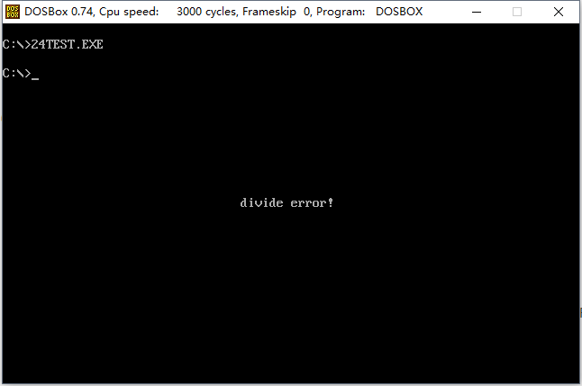

### # 内中断的产生

(1) 对于8086CPU，当CPU内部有下面的情况发生的时候，将产生相应的中断信息。

① 除法错误，比如，执行div指令产生的除法溢出。

② 单步执行。

③ 执行into指令。

④ 执行int指令。

(2) 8086CPU用称为中断类型码的数据来标识中断信息的来源，上述的4中中断源，在8086CPU中的中断类型码为：

① 除法错误：0

② 单步执行：1

③ 执行into指令：4

④ 执行int指令，该指格式为int n，指令中的n为字节立即数，是提供给CPU的中断类型码。

### # 中断过程

(1) 下面是8086CPU在收到信息后，所引发的中断过程。

① （从中断信息中）取得中断类型码；

② 标志寄存器的值入栈（因为中断过程中要改变标志寄存器的值，所以先将其保存在栈中）；

③ 设置标志寄存器的第8位和TF和第9位IF的值为0；

④ CS的内容入栈；

⑤ IP的内容入栈；

⑥ 从内存地址为中断类型码*4和中断类型码为*4+2的两个字单元读取中断处理程序的入口地址设置IP和CS。

(2) 更简洁的描述中断过程，如下：

① 取得中断类型码N；

② pushf

③ TF=0，IF=0

④ push CS

⑤ push IP

⑥ （IP）=（N\*4），（CS）=（N\*4+2）

在最后一步完成后，CPU开始执行由程序员编写的中断处理程序。

### # 中断处理程序和iret指令

(1) 中断处理程序的编写的方法和子程序比较相似，下面是常规的步骤：

① 保存用到的寄存器；

② 处理中断；

③ 恢复用到的寄存器；

④ 用iret指令返回。

(2) iret指令的功能用汇编语法描述为：

```assembly
pop IP
pop CS
popf
```

iret通常和硬件自动完成的中断过程配合使用。可以看到，在中断过程中，寄存器入栈的顺序是标志寄存器、CS、IP，而iret的出战顺序是IP、CS、标志寄存器，刚好和其相对应，实现了执行中断处理程序前的CPU现场恢复标志寄存器和CS、IP的工作。iret指令执行后，CPU回到执行中断处理程序前的执行点继续执行程序。

### # 编程处理0号中断

(1) 内存0000:0000-0000:03FF，大小为1KB的空间是系统存放中断处理程序入口地址的中断向量表。8086CPU支持256个中断。

(2) 一般情况下，从0000:0200至0000:02FF的256个字节的空间对应的中断向量表都是空的。

(3) 编程处理0号中断，需要做的事：

① 编写可以显示“overflow！”中断处理程序：do0；

② 将do0送入内存0000：0200处；

③ 将do0的入口地址0000:0200的存储在中断向量表项中。

④ 程序的框架如下。

```assembly
assume cs：code
code segment
start： do0安装程序
        设置中断向量表
        mov ax,4c00h
        int 21h
do0：   显示字符串“overflow!”
        mov ax,4c00h
        int 21h
code ends
end start
```

### # 安装

(1) 可以使用movsb指令，将do0的代码送入到0:200处。程序如下。

```assembly
assume cs：code
code segment
start： 设置es：di指向目的地址
        设置ds：si指向源地址
        设置cx为传输长度
        设置传输方向为正
        rep movsb
        
        设置中断向量表
        
        mov ax,4c00h
        int 21h
        
  do0： 显示字符串“overflow！”
        mov ax，4c00h
        int 21h
code ends
end start
```

(2) 用rep movsb指令的时候需要确定的信息。

① 传送的原始位置，段地址：code，偏移地址：offset do0

② 传送的目的位置：0:200；

③ 传送的长度：do0部分代码的长度；

④ 传送的方向：正向。

(3) 更明确的程序如下：

```assembly
assume cs:code
code segment

start:  mov ax,cs
        mov ds,ax
        mov si,offset do0                ; 设置ds：si指向源地址
        
        mov ax,0
        mov es,ax
        mov di,200h                      ; 设置es：di指向目的地址
        
        mov cx,do0部分代码长度            ; 设置cx为传输长度
        
        cld                              ; 设置传输方向为正
        
        rep movsb
        
        设置中断向量表
        
        mov ax，4c00h
        int 21h

do0:    显示字符串“overflow！”
        mov ax,4c00h
        int 21h
code ends
end start
```

可以利用编译器来计算do0的长度：

```assembly
assume cs:code
code segment

start:  mov ax,cs
        mov ds,ax
        mov si,offset do0                ; 设置ds：si指向源地址
        
        mov ax,0
        mov es,ax
        mov di,200h                      ; 设置es：di指向目的地址
        
        mov cx,offset do0end-offset do0  ; 设置cx为传输长度
        
        cld                              ; 设置传输方向为正
        
        rep movsb
        
        设置中断向量表
        
        mov ax，4c00h
        int 21h

do0:    显示字符串“overflow！”
        mov ax,4c00h
        int 21h
        
do0end: nop
        
code ends
end start
```

“-”是编译器识别的运算符号，编译器可以用它来进行两个常数的减法。

比如，指令：mov ax，8-4，被编译器处理为指令：mov ax，4.

汇编编译器可以处理表达式。

比如，指令：mov ax，（5+3）*5/10，被编译器处理为：mov ax，4.

### # do0

do0程序的主要任务是显示字符串，程序如下。

```assembly
do0：   设置ds：si指向字符串
        mov ax,0b800h
        mov es,ax
        mov di,12*160+36*2    ; 设置es：di指向显存空间的中间位置
      
        mov cx,9              ; 设置cx为字符串长度
s:      mov al,p[si]
        mov es:[di],al
        inc si
        add di,2
        loop s
      
        mov ax,4c00h
        int 21h
      
do0end: nop
```

完整的程序如下。 

```assembly
assume cd:code

code segment
start:    mov ax,cs
          mov ds,ax
          mov si,offset do0    ; 设置ds：si指向源地址
          
          mov ax,0
          mov es,ax
          mov di,200h          ; 设置es：di指向目的地址
          
          mov cx,offset do0end-offset do0    ; 设置cx为传输长度
          
          cld                  ; 设置传输方向为正
          
          rep movsb            ; 进行传输
          
          设置中断向量表
          
          mov ax,4c00h
          int 21h
          
do0:      jmp short do0start
          db "overflow!"

do0start: mov ax,cs
          mov ds,ax
          mov si,202h          ; 设置ds：si指向字符串(jmp short do0start占了两个字节)
          
          mov ax，0b800h
          mov es,ax
          mov di,12*160+36*2   ; 设置es：di指向显存空间的中间位置
          
          mov cx，9            ; 设置cx为字符串长度
      s:  mov al,[si]
          mov es:[di],al
          inc si
          add di,2
          loop s
          
          mov ax,4c00h
          int 21h
do0end:   nop
code ends
end start
```

### # 设置中断向量

下面，将do0的入口地址0:200，写入中断向量表的0号表项中，是do0成为0号中断的处理程序。

0号表项的地址为0:0，其中0:0字单元存放偏移地址，0:2单元存放段地址。程序如下。

```assembly
mov ax,0
mov es,ax
mov word ptr es:[0*4],200h
mov word ptr es:[0*4+2],0
```

### # 单步中断

基本上，CPU在执行完一条指令之后，如果检测到标志寄存器的TF位为1，则产生单步中断，引发中断过程。单步中断的中段类型码为1，则它所引发的中断过程如下。

① 取得中断类型码1；

② 标志寄存器入栈，TF、IF设置为0；

③ CS、IP入栈；

④ （IP）=（1*4），（CS）=（1*4+2）。

### # 编写0号中断处理程序

编写0号中断处理程序，使得在除法发生溢出时，再屏幕中间显示字符串“divide error！”，然后返回DOS。

```assembly
; Date : 2017-11-13 21:07:10
; File Name : 24TEST.ASM
; Description : 编写0号中断处理程序，使得在除法发生溢出时，再屏幕中间显示字符串“divide error！”，然后返回DOS
; Author : Angus
; Version: V1.0

assume cs:code

code segment
start:	mov ax,cs
		mov ds,ax
		mov si,offset do0		; 设置ds：si指向源地址

		mov ax,0
		mov es,ax
		mov di,200h				; 设置es：di指向目的地址

		mov cx,offset do0end-offset do0 ; 设置cx为传输长度

		cld  					; 设置传输方向为正
		rep movsb 				; 进行传输

		mov ax,0
		mov es,ax
		mov word ptr es:[0*4],200h
		mov word ptr es:[0*4+2],0		; 设置中断向量表

		mov ax,1000h			; 会造成除法溢出的代码
		mov bx,0
		div bx


		mov ax,4c00h
		int 21h

do0:		jmp short do0start
			db "divide error!"

do0start:	mov ax,cs
			mov ds,ax
			mov si,202h			 ; 设置ds：si指向字符串(jmp short do0start占了两个字节)

			mov ax,0b800h
			mov es,ax
			mov di,12*160+33*2	 ; 设置es：di指向显存空间的中间位置

			mov cx,13			 ; 设置cx为字符串长度

		s:	mov al,[si]
			mov es:[di],al
			inc si
			add di,2
			loop s				 ; 将字符串显示在屏幕上

			mov ax,4c00h
			int 21h

do0end:		nop
code ends
end start
```




